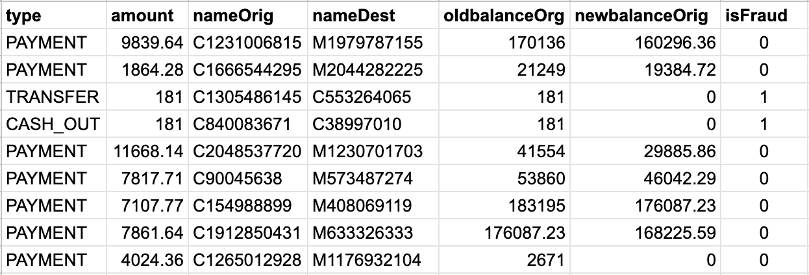
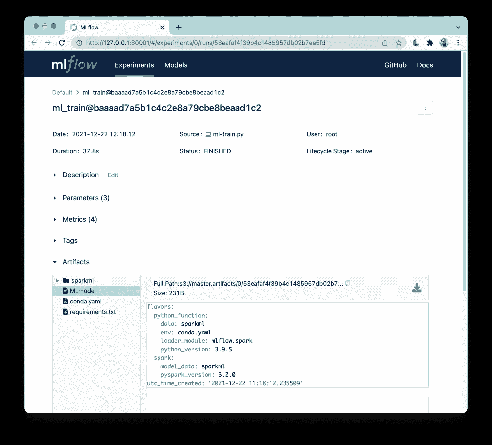

# 厚皮动物❤️火花❤️ MLFlow -可扩展的机器学习出处和跟踪

> 原文：<https://winder.ai/pachyderm-%EF%B8%8F-spark-%EF%B8%8F-mlflow-scalable-machine-learning-provenance-and-tracking/>

本文展示了如何使用三个框架来编排由提取、转换和加载步骤( [ETL](https://en.wikipedia.org/wiki/Extract,_transform,_load) )组成的机器学习管道，以及全面跟踪参数、结果和工件(如训练模型)的 ML 训练阶段。此外，它还展示了 Pachyderm 的血统如何与 MLflow 的跟踪服务器集成，以提供工件出处。

> 本文是一篇简短的博文，基于 GitHub 中的[代码库中提供的更全面、更具交互性的笔记本。请随意查看存储库，在您的机器上安装并运行演示设置。](https://github.com/winderai/pachyderm-mlflow-spark)

[Pachyderm](https://pachyderm.com) 是一个数据科学平台，它将[数据谱系](https://en.wikipedia.org/wiki/Data_lineage)与端到端管道相结合。

[Apache Spark](https://spark.apache.org/) 是一个多语言引擎，用于在大型集群和单节点机器上执行数据工程、数据科学和机器学习(ML)。

[MLflow](https://mlflow.org/) 是一个开源平台，用于管理机器学习生命周期和跟踪实验。

通过阅读这篇文章，你将学会如何:

*   使用 Pachyderm 的管道大规模设计和 ETL 您的数据。
*   与 MLflow 和 Spark 一起使用 Pachyderm 来训练 ML 模型并跟踪相关的工件。
*   在厚皮动物和 MLflow 之间建立双向谱系链接，以检索模型来源。

因此，我将展示一个基于合成金融数据集的洗钱欺诈检测示例，重点是端到端管道，而不是模型统计和性能。

## 向厚皮动物添加原始数据

让我们首先来看看下图中描述的原始数据的摘录。

这是一个来自 Kaggle 的金融欺诈数据集，其中每个记录代表客户之间的一次交易。

为了简洁起见，我省略了一些列，但这里重要的是最右边的一列，这将是我的基本事实，表明交易是否确实是欺诈性的。



Pachyderm 将数据存储在存储库中，这些位置的工作方式类似于 Git，事实上，您可以将数据提交到特定的分支。

下面我创建一个数据存储库，并用原始数据集填充它，因此我将数据文件推送到`master`分支上名为`raw_data`的位置。

```
!pachctl create repo raw_data
!pachctl put file -r raw_data@master -f PS_20174392719_1491204439457_log.csv 
```

上面的操作被快照到一个散列为`f18e3cb3496e4a1fa853f05cb357dc62`的提交中，如下面的代码片段所示。

在 Pachyderm 中，对存储库内容的每次更改都会生成一个新的提交，有效地为数据提供了**版本控制，我喜欢它的一点是，它是完全自动化的，对用户是透明的。**

```
!pachctl list commit raw_data@master 
```

```
REPO     BRANCH COMMIT                           FINISHED               SIZE     ORIGIN DESCRIPTION
raw_data master f18e3cb3496e4a1fa853f05cb357dc62 Less than a second ago 470.7MiB USER 
```

## 按客户拆分数据

设计一个有效的 ML 训练管道很可能需要将大量的原始数据点转化为一个数据集，该数据集代表处于危险中的商业目标。

在每个用户生成大量信号的情况下，将这些信息聚合成更小的片段通常是明智的。

话虽如此，我现在所处的阶段是，我的数据 blob 作为单个文件存储在集群上。

然而，一般来说，大多数分布式系统在处理分块文件时工作得更好，这样集群的主机可以将工作分成独立处理的数据。

考虑到这一点，我创建了一个 Pachyderm 管道来分割每个客户的数据，以便生成一组单独的文件，每个文件存储特定用户的交易。

这不仅有助于后续处理的分片，而且也是数据准备的第一步。

下面我使用一个在管道中运行的 python 脚本来输出一组分片文件。

如果您不熟悉这种格式，我建议您参考[官方文档](https://docs.pachyderm.com/latest/reference/pipeline-spec/)，无论如何，我将只提及管道从我事先准备好的 Docker 映像(参见`image`字段)中运行命令(参见`cmd`字段)。

输出数据最终保存在一个以管道本身命名的新存储库中(即`split_data`)。

```
%%writefile pipeline_split_data.json
{
  "pipeline": {
    "name": "split_data"
  },
  "description": "A pipeline splits raw datasets producing a chunk per customer.",
  "transform": {
  	"image": "winderresearch/pachyderm-split-csv:0.1.0",
    "cmd": [
      "python",
      "/split-dataset.py",
      "/pfs/raw_data/",
      "/pfs/out/",
      "--subsample",
    ]
  },
  "input": {
    "pfs": {
      "repo": "raw_data",
      "glob": "/*"
    }
  }
} 
```

```
!pachctl create pipeline -f pipeline_split_data.json 
```

下面显示的处理作业的状态确认它已成功终止！

```
!pachctl list job -p split_data 
```

```
PIPELINE   ID                               STARTED        DURATION   RESTART PROGRESS  DL       UL       STATE   
split_data da4117bc7de24fbea0d13dd947e29d6e 31 seconds ago 30 seconds 0       1 + 0 / 1 470.7MiB 9.897KiB success 
```

现在让我们检查输出存储库的内容。

正如所料，这里有一组单独的 CSV，注意文件名代表它们各自的*唯一的*客户 id。

```
!pachctl list file split_data@master 
```

```
NAME
/1055929140.csv
/1083110206.csv
/1141876486.csv
/1206877978.csv
/123757418.csv
/1248586428.csv
/1282235003.csv
/1359467526.csv
/1419296243.csv 
```

## 聚合客户数据点

此时的场景有两个维度，一个是潜在的大量客户(即许多 CSV)，另一个是每个客户的大量记录(即大型 CSV)。

幸运的是，Pachyderm 完全有能力通过在工人之间分配数据来处理前者。我通过创建一个由 8 名工作人员和`parallelism_spec`(在[官方文件](https://docs.pachyderm.com/latest/reference/pipeline_spec/#parallelism-spec-optional)中有更多相关信息)组成的人才库，在下面的管道中实现了这一点。

此外，为了控制 Pachyderm 如何在工人之间分配碎片，我将`input.pfs.glob`规范设置为`/*`，这是一个特定的 glob 模式，将每个 CSV 暴露给一个单独的工作单元。

关于 glob 模式如何工作的更多细节，我会向您推荐相关的[文档](https://docs.pachyderm.com/latest/concepts/pipeline-concepts/datum/glob-pattern/)。

后一个维度通过使用 Spark 分别处理每个客户的数据来解决。

Apache Spark 以其处理潜在海量数据集的能力而闻名，因此它非常适合这项任务。

具体来说，这个管道运行的 Spark 脚本通过对所有交易进行平均，将客户的数据压缩成一个聚合的形式。

```
%%writefile pipeline_etl.json
{
  "pipeline": {
    "name": "etl"
  },
  "description": "A pipeline maps a PySpark aggregation function over dataset shards.",
  "transform": {
    "image": "winderresearch/pachyderm-spark:0.1.0",
    "cmd": [
      "spark-submit",
      "/root/etl.py",
      "/pfs/split_data/",
      "/pfs/out/"
    ]
  },
  "parallelism_spec": {
    "constant": 8
  },
  "input": {
    "pfs": {
      "repo": "split_data",
      "glob": "/*"
    }
  }
} 
```

```
!pachctl create pipeline -f pipeline_etl.json
!pachctl wait commit etl@master 
```

```
!pachctl list job -p etl 
```

```
PIPELINE ID                               STARTED       DURATION  RESTART PROGRESS    DL       UL       STATE   
etl      d8a1fcf32c5c42b5a331ce442c474533 7 minutes ago 7 minutes 0       50 + 0 / 50 9.897KiB 10.01KiB success 
```

这个管道产生一组文件夹，以相关的客户 id 命名，每个文件夹包含一个带有聚合记录的 CSV 文件。

```
!pachctl list file etl@master 
```

```
NAME
/1055929140/
/1083110206/
/1141876486/
/1206877978/
/123757418/
/1248586428/
/1282235003/
/1359467526/
/1419296243/ 
```

## 训练欺诈检测模型

现在我已经准备好了我的数据集，是时候让 ML 发挥作用了。

我准备训练一个欺诈检测器，下面的管道使用 Spark 的 ML 库 [MLlib](https://spark.apache.org/mllib/) 来加载整个数据集，并拟合决策树来对欺诈进行分类。

注意，为了简洁起见，在这个演示中，我没有深入研究模型性能和调优。

决策树是一种简单但强大的 ML 模型类型，它支持扩展的可解释性，这也是它在金融领域流行的原因之一。

树状结构由代表类别标签的叶子和代表通向这些类别标签的特征的结合的分支组成，更多细节请查看本文。

在整个训练过程中，下面的管道使用 [MLflow](https://mlflow.org/) 进行**跟踪模型超参数、性能指标和工件(即序列化模型)**。

训练脚本使用 MLFlow python 客户端来收集这些项目并将其推送到 MLFlow 服务器。

### 重要的

一般来说，Spark-MLlib 适用于简单的 ML 模型，在本文的范围内，这就足够了。然而，当问题需要更复杂的建模技术(如深度学习)时，它就不够了。幸运的是， **Pachyderm 可以运行任何你喜欢的 ML 框架**，事实上，在下面的管道中，我可以只使用 Tensorflow、PyTorch、Scikit-learn 等。

```
%%writefile ml_train.json
{
  "pipeline": {
    "name": "ml_train"
  },
  "description": "A pipeline runs Spark-MLlib to train a machine learning fraud detector over the given dataset.",
  "transform": {
  	"image": "winderresearch/pachyderm-spark:0.1.0",
    "cmd": [
      "spark-submit",
      "/root/ml-train.py",
      "/pfs/etl/",
      "/pfs/out/"
    ]
  },
  "parallelism_spec": {
    "constant": 1
  },
  "input": {
    "pfs": {
      "repo": "etl",
      "glob": "/"
    }
  }
} 
```

```
!pachctl create pipeline -f ml_train.json 
```

```
!pachctl list job -p ml_train 
```

```
PIPELINE ID                               STARTED        DURATION   RESTART PROGRESS  DL       UL STATE   
ml_train baaaad7a5b1c4c2e8a79cbe8beaad1c2 57 seconds ago 56 seconds 0       1 + 0 / 1 10.01KiB 0B success 
```

## 检查出处

ML 训练已完成，并将工件推送到 MLflow。

下面的代码片段运行一个助手脚本，显示 Pachyderm 提交和相关的 MLflow 运行 id。

让我们花点时间来理解下面显示的内容。

为了保持完整的出处，训练流水线将 MLflow 运行 id(即`53eafaf4f39b4c1485957db02b7ee5fd`)写入输出储存库(即`/pfs/out/`)中的文件。

这导致厚皮提交(即`baaaad7a5b1c4c2e8a79cbe8beaad1c2`)被有效地链接到 MLflow 运行！

```
!./get_provenance.sh 
```

```
File generated by the training pipeline (represents an MLflow run id) at "ml_train@master":
NAME                              TYPE SIZE 
/53eafaf4f39b4c1485957db02b7ee5fd file 0B   

Pachyderm commit at "ml_train@master":
REPO     BRANCH COMMIT                           FINISHED       SIZE ORIGIN DESCRIPTION
ml_train master baaaad7a5b1c4c2e8a79cbe8beaad1c2 21 minutes ago 0B   AUTO 
```

参见下面的截图， **MLflow web UI 允许您检查参数、指标，并浏览序列化模型所在的工件文件夹**。

这里没有描述，但是它也在一个专门的页面上为您对实验运行进行了编目。

所有这些都是由 MLflow 自动跟踪的，您需要做的只是在您的培训脚本中添加几行代码，瞧！



我已经展示了人工制品是如何从厚皮动物链接到 MLflow 的。

由于出处是双向的，现在让我简单解释一下如何反过来。

假设给了我一个 MLflow 运行 id(例如`53eafaf4f39b4c1485957db02b7ee5fd`)，我想找到相应的厚皮动物提交。

有许多方法可以编写脚本，为了简洁起见，我简单地将文件倒排到我的存储库历史中。

```
!pachctl list file ml_train@master 
```

```
NAME                              TYPE SIZE 
/53eafaf4f39b4c1485957db02b7ee5fd file 0B 
```

在这种情况下，最近一次提交正是保存我正在寻找的运行 id 的提交。

因此，我只获取相关的厚皮提交(即`baaaad7a5b1c4c2e8a79cbe8beaad1c2`)。

```
!pachctl list commit ml_train@master 
```

```
REPO     BRANCH COMMIT                           FINISHED       SIZE ORIGIN DESCRIPTION
ml_train master baaaad7a5b1c4c2e8a79cbe8beaad1c2 23 minutes ago 0B   AUTO    
ml_train master a46164cacea4815a5608099ff17b49d2 42 minutes ago 0B   AUTO 
```

### 重要的

多亏了厚皮动物的起源模型，追踪世系上溯到最初的来源是可行的。

换句话说，您将能够辨别原始数据存储库中的哪个提交产生了特定版本的训练 ML 模型。

更强大的是，通过一个命令就可以回滚到 ML 模型的前一个版本，几乎不需要任何计算。

这个场景在我们之前发表的另一篇文章中有详细描述。

当您的组织希望控制其部署的模型，并能够快速响应数据中不可预见的变化时，所有这些都是非常有价值的。

## 摘要

在本文中，我介绍了如何:

*   使用 Pachyderm 的管道将您的数据从原始格式转换为可用的数据集。
*   与 MLflow 和 Spark 一起使用 Pachyderm 来训练 ML 模型并跟踪相关的工件。
*   在厚皮动物和 MLflow 之间建立双向谱系链接，以检索模型来源。

茯苓皮是主干存储和流水线组件，它用于工件谱系和管理处理作业。

Spark 用于预处理数据集以及训练 ML 模型。

MLflow 可以方便地跟踪和显示组成 ML 训练运行的各种方面，如参数、指标和工件，如序列化模型。

当然，温德。AI 已经准备好通过结合 [MLOps 咨询](https://winder.ai/services/mlops/mlops-consulting/)和 [ML 专业知识](https://winder.ai/services/machine-learning/)来帮助你改善你的 ML 工作流程。

## 参考

*   [GitHub 资源库中这篇文章的可复制和交互式版本](https://github.com/winderai/pachyderm-mlflow-spark)
*   [Pachyderm 对数据谱系的看法及其重要性](https://www.pachyderm.com/blog/what-exactly-is-data-lineage/)
*   [MLflow 介绍帖](https://databricks.com/blog/2018/06/05/introducing-mlflow-an-open-source-machine-learning-platform.html)

## 信用

这项工作是由厚皮动物公司资助的。