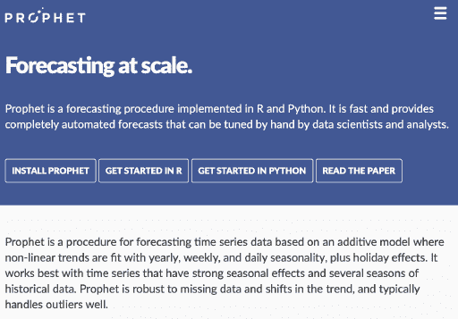

# 我们如何在 Grafana 中构建 MLOps 平台

> 原文：<https://winder.ai/how-we-built-an-mlops-platform-into-grafana/>

云德。人工智能与 Grafana 实验室合作，帮助他们在 Grafana Cloud 中建立机器学习(ML)能力。这项工作的总结包括:

*   产品咨询和定位-提供最佳产品和体验
*   MLOps 后端的设计和架构——高度可扩展——能够为数千名客户运行培训工作
*   与 Grafana 紧密集成-低集成成本-轻松实现产品

## Grafana 的需求-机器学习咨询和开发

Grafana Cloud 是由 [Grafana Labs](https://grafana.com) 开发的成功的云原生监控解决方案。

监控现代微服务或无服务器应用变得越来越复杂，因此用户正在寻找减少信息过载的方法。此外，分析用户正在寻找自动化预测等高级功能。

该项目的目的是:

*   与 Grafana 团队合作
*   设计一个服务来训练和服务基于机器学习的算法
*   开发 Kubernetes-native 应用程序来托管 MLOps API 和安排培训工作
*   构建强大的云原生软件、持续交付渠道
*   交付时间序列预测模型示例
*   提供增强功能，允许用户部署自己的预测和异常检测算法

## 云德。AI 的解决方案-高度可扩展的 Kubernetes-原生 ML 后端

这个项目包含了设计和实现的结合。云德。AI 的工程师与 Grafana Labs 工程团队通力合作，经过几个月的努力，能够交付一个完全可用的产品。这需要在云原生和 ML 技术方面的丰富经验。

我们一起提供了分层设计，包括:

*   Prometheus proxy——允许 ML 模型公开 prometheus API 以便于集成的 API
*   ML 管理-管理和安排 ML 训练运行的服务
*   模型训练-一种控制和衡量 ML 训练运行的服务

模特培训服务特别有趣。我们设计了一种方法，能够保持模型训练抽象足够通用，以与任何类型的模型(即任何 ML 库)一起工作，并以数据科学家期望的方式工作(即 Pandas)。这只是因为输入数据被限制为使用 Grafana/Prometheus/InfluxDB 接口，但允许我们快速开发和测试新模型，甚至启动相当复杂的超参数调整工作。所有这些都是由纯 Kubernetes 清单编排的，这使得在本地集群和生产集群之间移植变得很容易。

所有服务都利用 Kubernetes 进行编排，利用 Celery 进行排队和调度，利用 Redis 进行状态。Go 和 Python 都与脸书的 prophet 等库一起用于时间序列预测和异常检测。

[Facebook’s Prohet](https://facebook.github.io/prophet/) was one of the models that we implemented in our platform.

## Grafana 的结果机器学习

由于我们的共同努力，Grafana 现在能够在其企业云产品中提供 ML 功能，这为他们的产品增加了巨大的价值。这已经部署到生产中，现在正在为客户服务。[联系 Grafana 试试吧！](https://grafana.com/contact)

你可以在这里了解更多关于 MLOps 的信息。

[Talk to Sales](https://winder.ai/about/contact/)