# 基于 Pymc3 的新冠肺炎分层贝叶斯逻辑模型

> 原文：<https://winder.ai/covid-19-hierarchical-bayesian-logistic-model-with-pymc3/>

我有两个以前笔记本中未完成的任务。首先是我没有迭代过所有国家。

新冠肺炎研究

以下是本系列中其他新冠肺炎文章的链接列表。

*   [新冠肺炎回应:雅典娜项目和贝叶斯分析简介](https://winder.ai/covid-19-response-athena-project-and-an-introduction-bayesian-analysis/)
*   [新冠肺炎指数贝叶斯模型](https://winder.ai/covid-19-exponential-bayesian-model/)
*   [新冠肺炎指数贝叶斯模型回测](https://winder.ai/covid-19-exponential-bayesian-model-backtesting/)
*   [新冠肺炎逻辑斯谛贝叶斯模型](https://winder.ai/covid-19-logistic-bayesian-model/)
*   [用于部署机器学习模型的简单的基于 Docker 的工作流](https://winder.ai/a-simple-docker-based-workflow-for-deploying-a-machine-learning-model/)

这项任务关系到我们如何约束每个国家的参数。使用全球平均值来约束其他估计值是有意义的。例如，如果我们假设这是同一种病毒，并且无论它在哪里都具有相同的参数(例如，相同的传播速率)，那么我们应该能够估计高水平的参数并得出国家水平的细节(例如，它在温暖的国家传播得更好)。您可以通过分层模型在贝叶斯建模中实现这一点。

这个笔记本里有很多代码，这是故意的。我想尝试并演示改进一个模型所需的迭代次数。我甚至没有试图改进基础模型，只是改进逻辑拟合数据的方式。

如果你对最终结果感兴趣，那么[跳到底部](#hierarchical-bayesian-model)。

首先让我重新加载/导入以前笔记本中的所有内容。

```
!pip install arviz pymc3==3.8
import numpy as np
import pymc3 as pm
import pandas as pd
import matplotlib.pyplot as plt
import theano

def logistic(K, r, t, C_0):
  A = (K-C_0)/C_0
  return K / (1 + A * np.exp(-r * t))

# Load data
df = pd.read_csv("https://opendata.ecdc.europa.eu/covid19/casedistribution/csv/", parse_dates=["dateRep"], infer_datetime_format=True, dayfirst=True)
df = df.rename(columns={'dateRep': 'date', 'countriesAndTerritories': 'country'}) # Sane column names
df = df.drop(["day", "month", "year", "geoId"], axis=1) # Not required

# Create DF with sorted index
sorted_data = df.set_index(df["date"]).sort_index()
sorted_data["cumulative_cases"] = sorted_data.groupby(by="country")["cases"].cumsum()
sorted_data["cumulative_deaths"] = sorted_data.groupby(by="country")["cases"].cumsum()

# Filter out data with less than 500 cases, we probably can't get very good estimates from these.
sorted_data = sorted_data[sorted_data["cumulative_cases"] >= 500]

# Remove "Czechia" it has a population of NaN
sorted_data = sorted_data[sorted_data["country"] != "Czechia"]

# Get final list of countries
countries = sorted_data["country"].unique()
n_countries = len(countries)

# Pull out population size per country
populations = {country: df[df["country"] == country].iloc[0]["popData2018"] for country in countries}

# A map from country to integer index (for the model)
idx_country = pd.Index(countries).get_indexer(sorted_data.country)

# Create a new column with the number of days since first infection (the x-axis)
country_first_dates = {c: sorted_data[sorted_data["country"] == c].index.min() for c in countries}
sorted_data["100_cases"] = sorted_data.apply(lambda x: country_first_dates[x.country], axis=1)
sorted_data["days_since_100_cases"] = (sorted_data.index - sorted_data["100_cases"]).apply(lambda x: x.days) 
```

## 汇集模型

现在，我想重新构建模型来生成数据集中每个国家的估计值。

这一步看起来要复杂得多。首先，如果您不删除少量的情况，那么它会不断地产生 nan，因为最初估计值低于零，并且日志不喜欢它。所以这就是我们需要`days_since_100_cases`的原因。

接下来，将所有数据传递到模型中是很棘手的。你可以做一个大的 for 循环，但是它需要更多的时间。因此，相反，你必须向量化你的代码，这可能很难得到正确的。

还要记住，这是一个逻辑形状——一个 S 形——所以数据需要是一个累积和。我忘记了，也不知道为什么我会收到来自`pymc3`的`bad energy`消息。结果数据拟合得太差了。

另一个提示。当您基于具有多个来源的数据构建模型时，请分别为每个参数构建模型，以测试模型是否稳定。我发现好几次我的模型中的一个参数把其他的都炸了。把所有东西都拿回来，一次测试一件东西。

例如，从创建一个大型池模型开始。如果这不起作用，那么单个模型就不起作用。接下来，尝试构建单个模型，但只针对单个参数。逐一检查每一个。如果它们都有效，那就尝试组合使用。

但首先，我需要一个基线。基线是“集合”模型，换句话说，是对所有国家使用相同参数的模型。

```
pooled_model = pm.Model("Pooled")
with pooled_model:
    BoundedNormal = pm.Bound(pm.Normal, lower=0.0)
    t = pm.Data("x_data", sorted_data["days_since_100_cases"])
    confirmed_cases = pm.Data("y_data", sorted_data["cumulative_cases"])

    # Intercept - We fixed this at 100.
    C_0 = pm.Normal("C_0", mu=100, sigma=10)

    # Growth rate: 0.2 is approx value reported by others
    r = BoundedNormal("r", mu=0.2, sigma=0.1)

    # Total number of cases. Depends on the population, more people, more infections.
    proportion_infected = 5e-05 # This value comes from the rough projection that 80000 will be infected in China
    p = sorted_data.popData2018.mean() # Crude. Can have a mean per country. Not sure how to do this
    K = pm.Normal("K", mu=p * proportion_infected, sigma=p*0.1)#, shape=n_countries)

    # Logistic regression
    growth = logistic(K, r, t, C_0)

    # Likelihood error
    eps = pm.HalfNormal("eps")

    # Likelihood - Counts here, so poission or negative binomial. Causes issues. Lognormal tends to work better?
    pm.Lognormal("cases", mu=np.log(growth), sigma=eps, observed=confirmed_cases)

pm.model_to_graphviz(pooled_model) 
```


下面的代码是我在某处的`pymc3`论坛上找到的一个非常方便的函数。它会随机选取一个测试点，然后从后面取样。如果结果产生`nan`，那么你知道你有一个问题。如果是这种情况，采样将会失败。

```
# Test that the model does not produce NaNs. If it does, it can't converge.
for RV in pooled_model.basic_RVs:
    print(RV.name, RV.logp(pooled_model.test_point)) 
```

```
Pooled_C_0 -3.2215236261987186
Pooled_r_lowerbound__ -30.616353440210627
Pooled_K -17.26574353862072
Pooled_eps_log__ -0.7698925914732455
Pooled_cases -18218.268119660002 
```

```
with pooled_model:
  pooled_trace = pm.sample() 
```

```
Auto-assigning NUTS sampler...
Initializing NUTS using jitter+adapt_diag...
Sequential sampling (2 chains in 1 job)
NUTS: [Pooled_eps, Pooled_K, Pooled_r, Pooled_C_0]
Sampling chain 0, 0 divergences: 100%|██████████| 1000/1000 [00:05<00:00, 184.21it/s]
Sampling chain 1, 0 divergences: 100%|██████████| 1000/1000 [00:05<00:00, 197.76it/s]
The acceptance probability does not match the target. It is 0.8911189225404523, but should be close to 0.8\. Try to increase the number of tuning steps. 
```

```
pm.traceplot(pooled_trace); 
```

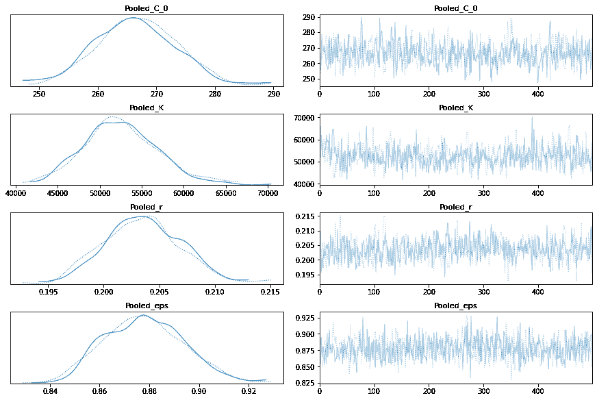

## 每个国家的案例总数模型

现在让我为`K`构建一个具有特定国家值的模型。

```
total_per_country_model = pm.Model("Total per country")
with total_per_country_model:
    BoundedNormal = pm.Bound(pm.Normal, lower=0.0)
    t = pm.Data("x_data", sorted_data["days_since_100_cases"])
    confirmed_cases = pm.Data("y_data", sorted_data["cumulative_cases"])

    # Intercept - We fixed this at 100.
    C_0 = pm.Normal("C_0", mu=100, sigma=10)

    # Growth rate: 0.2 is approx value reported by others
    r = BoundedNormal("r", mu=0.2, sigma=0.1)

    # Total number of cases. Depends on the population, more people, more infections.
    proportion_infected = 5e-05 # This value comes from the rough projection that 80000 will be infected in China
    p = sorted_data.popData2018.mean() # Crude. Can have a mean per country. Not sure how to do this
    K = pm.Normal("K", mu=p * proportion_infected, sigma=p*0.1, shape=n_countries)

    # Logistic regression
    growth = logistic(K[idx_country], r, t, C_0)

    # Likelihood error
    eps = pm.HalfNormal("eps")

    # Likelihood - Counts here, so poission or negative binomial. Causes issues. Lognormal tends to work better?
    pm.Lognormal("cases", mu=np.log(growth), sigma=eps, observed=confirmed_cases)

pm.model_to_graphviz(total_per_country_model) 
```


```
with total_per_country_model:
  total_per_country_trace = pm.sample() 
```

```
Auto-assigning NUTS sampler...
Initializing NUTS using jitter+adapt_diag...
Sequential sampling (2 chains in 1 job)
NUTS: [Total per country_eps, Total per country_K, Total per country_r, Total per country_C_0]
Sampling chain 0, 143 divergences: 100%|██████████| 1000/1000 [04:39<00:00,  3.58it/s]
Sampling chain 1, 126 divergences: 100%|██████████| 1000/1000 [05:40<00:00,  2.93it/s]
There were 143 divergences after tuning. Increase `target_accept` or reparameterize.
The chain reached the maximum tree depth. Increase max_treedepth, increase target_accept or reparameterize.
There were 269 divergences after tuning. Increase `target_accept` or reparameterize.
The chain reached the maximum tree depth. Increase max_treedepth, increase target_accept or reparameterize.
The rhat statistic is larger than 1.05 for some parameters. This indicates slight problems during sampling.
The estimated number of effective samples is smaller than 200 for some parameters. 
```

```
pm.traceplot(total_per_country_trace);
pm.forestplot(total_per_country_trace, var_names=['Total per country_K']); 
```

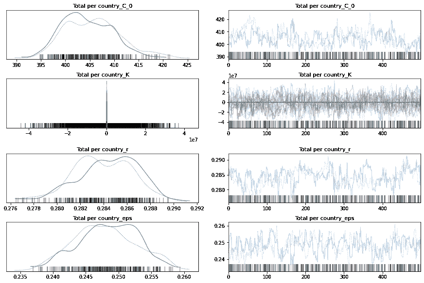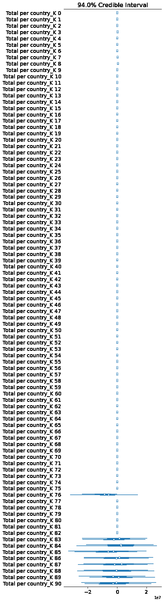

## 集合模型和每个国家 K 模型的比较

如果你看上面的轨迹，你可以看到一些国家(靠近底部)对 k 的估计非常不确定。由于数据排序的方式，较低的国家是没有很多病例的国家。

我们可以删除这些国家，但现在让他们留在这里。

下面我用 [*去掉一个*交叉验证](https://docs.pymc.io/api/stats.html)，其中算法迭代去除观察值并比较预测值。值越高越好。

你可以看到 K-per-country 模型明显更好。

```
comparison = pm.compare({pooled_model.name: pooled_trace, total_per_country_model.name: total_per_country_trace}, ic='LOO')
print(comparison)
pm.compareplot(comparison); 
```

```
 rank      loo    p_loo  ...     dse warning loo_scale
Total per country    0 -14416.5  52.1214  ...       0   False       log
Pooled               1 -16629.8  4.14689  ...  39.679   False       log

[2 rows x 9 columns] 
```

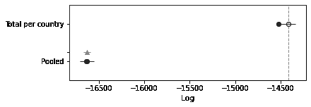

## 每个国家的增长率模型

好，现在让我们建立一个每个国家增长率的模型。

```
growth_per_country_model = pm.Model("Growth per country")
with growth_per_country_model:
    BoundedNormal = pm.Bound(pm.Normal, lower=0.0)
    t = pm.Data("x_data", sorted_data["days_since_100_cases"])
    confirmed_cases = pm.Data("y_data", sorted_data["cumulative_cases"])

    # Intercept - We fixed this at 100.
    C_0 = pm.Normal("C_0", mu=100, sigma=10)

    # Growth rate: 0.2 is approx value reported by others
    r = BoundedNormal("r", mu=0.2, sigma=0.1, shape=n_countries)

    # Total number of cases. Depends on the population, more people, more infections.
    proportion_infected = 5e-05 # This value comes from the rough projection that 80000 will be infected in China
    p = sorted_data.popData2018.mean() # Crude. Can have a mean per country. Not sure how to do this
    K = pm.Normal("K", mu=p * proportion_infected, sigma=p*0.1)

    # Logistic regression
    growth = logistic(K, r[idx_country], t, C_0)

    # Likelihood error
    eps = pm.HalfNormal("eps")

    # Likelihood - Counts here, so poission or negative binomial. Causes issues. Lognormal tends to work better?
    pm.Lognormal("cases", mu=np.log(growth), sigma=eps, observed=confirmed_cases)

pm.model_to_graphviz(growth_per_country_model) 
```


```
with growth_per_country_model:
  growth_per_country_trace = pm.sample()
pm.traceplot(growth_per_country_trace);
pm.forestplot(growth_per_country_trace, var_names=['Growth per country_r']); 
```

```
Auto-assigning NUTS sampler...
Initializing NUTS using jitter+adapt_diag...
Sequential sampling (2 chains in 1 job)
NUTS: [Growth per country_eps, Growth per country_K, Growth per country_r, Growth per country_C_0]
Sampling chain 0, 0 divergences: 100%|██████████| 1000/1000 [00:11<00:00, 84.38it/s]
Sampling chain 1, 0 divergences: 100%|██████████| 1000/1000 [00:11<00:00, 85.54it/s]
The acceptance probability does not match the target. It is 0.9001435860072379, but should be close to 0.8\. Try to increase the number of tuning steps. 
```

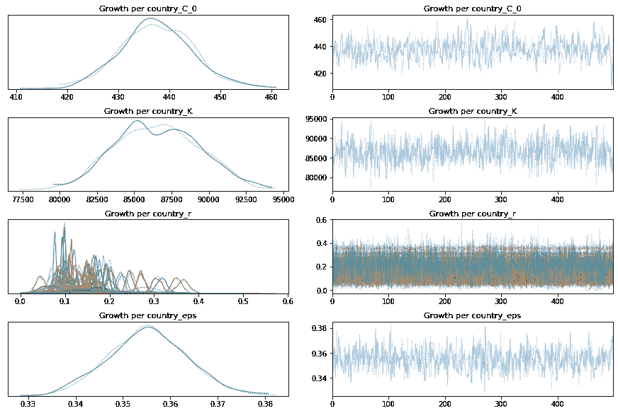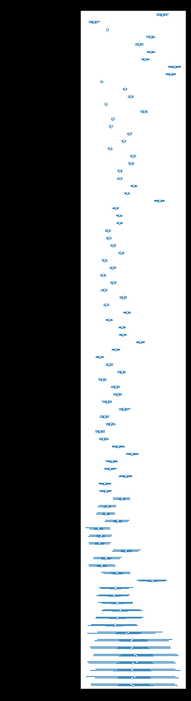

```
comparison = pm.compare({pooled_model.name: pooled_trace, total_per_country_model.name: total_per_country_trace, growth_per_country_model.name: growth_per_country_trace}, ic='LOO')
print(comparison)
pm.compareplot(comparison); 
```

```
/usr/local/lib/python3.6/dist-packages/arviz/stats/stats.py:532: UserWarning: Estimated shape parameter of Pareto distribution is greater than 0.7 for one or more samples. You should consider using a more robust model, this is because importance sampling is less likely to work well if the marginal posterior and LOO posterior are very different. This is more likely to happen with a non-robust model and highly influential observations.
  "Estimated shape parameter of Pareto distribution is greater than 0.7 for "

                   rank      loo    p_loo  ...      dse warning loo_scale
Total per country     0 -14416.5  52.1214  ...        0   False       log
Growth per country    1 -15052.1  54.3001  ...  60.7668    True       log
Pooled                2 -16629.8  4.14689  ...   39.679   False       log

[3 rows x 9 columns] 
```

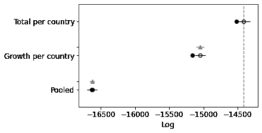

再次比较，您可以看到它也改进了模型，尽管没有另一个改进得那么多。让我们试着把它们结合起来。

## 每个国家的增长和总量模型

```
growth_total_model = pm.Model("Growth-Total Model")
with growth_total_model:
    BoundedNormal = pm.Bound(pm.Normal, lower=0.0)
    t = pm.Data("x_data", sorted_data["days_since_100_cases"])
    confirmed_cases = pm.Data("y_data", sorted_data["cumulative_cases"])

    # Intercept - We fixed this at 100.
    C_0 = pm.Normal("C_0", mu=100, sigma=10)

    # Growth rate: 0.2 is approx value reported by others
    r = BoundedNormal("r", mu=0.2, sigma=0.1, shape=n_countries)

    # Total number of cases. Depends on the population, more people, more infections.
    proportion_infected = 5e-05 # This value comes from the rough projection that 80000 will be infected in China
    p = sorted_data.popData2018.mean() # Crude. Can have a mean per country. Not sure how to do this
    K = pm.Normal("K", mu=p * proportion_infected, sigma=p*0.1, shape=n_countries)

    # Logistic regression
    growth = logistic(K[idx_country], r[idx_country], t, C_0)

    # Likelihood error
    eps = pm.HalfNormal("eps")

    # Likelihood - Counts here, so poission or negative binomial. Causes issues. Lognormal tends to work better?
    pm.Lognormal("cases", mu=np.log(growth), sigma=eps, observed=confirmed_cases)

pm.model_to_graphviz(growth_total_model) 
```


```
with growth_total_model:
  growth_total_trace = pm.sample()
pm.traceplot(growth_total_trace);
pm.forestplot(growth_total_trace, var_names=['Growth-Total Model_r', 'Growth-Total Model_K']); 
```

```
Auto-assigning NUTS sampler...
Initializing NUTS using jitter+adapt_diag...
Sequential sampling (2 chains in 1 job)
NUTS: [Growth-Total Model_eps, Growth-Total Model_K, Growth-Total Model_r, Growth-Total Model_C_0]
Sampling chain 0, 123 divergences: 100%|██████████| 1000/1000 [05:50<00:00,  2.85it/s]
Sampling chain 1, 75 divergences: 100%|██████████| 1000/1000 [06:13<00:00,  2.68it/s]
There were 123 divergences after tuning. Increase `target_accept` or reparameterize.
The chain reached the maximum tree depth. Increase max_treedepth, increase target_accept or reparameterize.
There were 198 divergences after tuning. Increase `target_accept` or reparameterize.
The chain reached the maximum tree depth. Increase max_treedepth, increase target_accept or reparameterize.
The rhat statistic is larger than 1.4 for some parameters. The sampler did not converge.
The estimated number of effective samples is smaller than 200 for some parameters. 
```

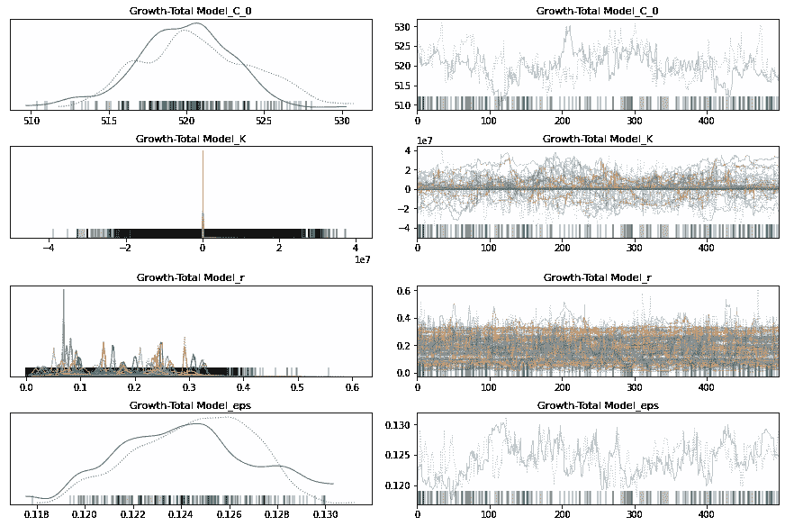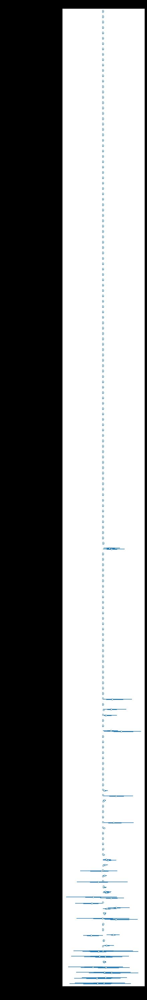

```
comparison = pm.compare(
    {
      pooled_model.name: pooled_trace, 
      total_per_country_model.name: total_per_country_trace, 
      growth_per_country_model.name: growth_per_country_trace,
      growth_total_model.name: growth_total_trace
    }, ic='LOO');
print(comparison)
pm.compareplot(comparison); 
```

```
/usr/local/lib/python3.6/dist-packages/arviz/stats/stats.py:532: UserWarning: Estimated shape parameter of Pareto distribution is greater than 0.7 for one or more samples. You should consider using a more robust model, this is because importance sampling is less likely to work well if the marginal posterior and LOO posterior are very different. This is more likely to happen with a non-robust model and highly influential observations.
  "Estimated shape parameter of Pareto distribution is greater than 0.7 for "
/usr/local/lib/python3.6/dist-packages/arviz/stats/stats.py:532: UserWarning: Estimated shape parameter of Pareto distribution is greater than 0.7 for one or more samples. You should consider using a more robust model, this is because importance sampling is less likely to work well if the marginal posterior and LOO posterior are very different. This is more likely to happen with a non-robust model and highly influential observations.
  "Estimated shape parameter of Pareto distribution is greater than 0.7 for "

                   rank      loo    p_loo  ...      dse warning loo_scale
Growth-Total Model    0 -13219.6  98.6516  ...        0    True       log
Total per country     1 -14416.5  52.1214  ...  44.5365   False       log
Growth per country    2 -15052.1  54.3001  ...  66.2718    True       log
Pooled                3 -16629.8  4.14689  ...   56.487   False       log

[4 rows x 9 columns] 
```

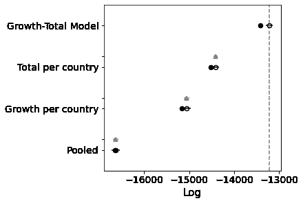

太好了！又好了。

## 每个国家的一切

最后要参数化的是截距。我不相信这里会有很大的改善，因为它们都被削减到 100 箱。但是让我们试试。

```
everything_model = pm.Model("Everything Model")
with everything_model:
    BoundedNormal = pm.Bound(pm.Normal, lower=0.0)
    t = pm.Data("x_data", sorted_data["days_since_100_cases"])
    confirmed_cases = pm.Data("y_data", sorted_data["cumulative_cases"])

    # Intercept - We fixed this at 100.
    C_0 = pm.Normal("C_0", mu=100, sigma=10, shape=n_countries)

    # Growth rate: 0.2 is approx value reported by others
    r = BoundedNormal("r", mu=0.2, sigma=0.1, shape=n_countries)

    # Total number of cases. Depends on the population, more people, more infections.
    proportion_infected = 5e-05 # This value comes from the rough projection that 80000 will be infected in China
    p = sorted_data.popData2018.mean() # Crude. Can have a mean per country. Not sure how to do this
    K = pm.Normal("K", mu=p * proportion_infected, sigma=p*0.1, shape=n_countries)

    # Logistic regression
    growth = logistic(K[idx_country], r[idx_country], t, C_0[idx_country])

    # Likelihood error
    eps = pm.HalfNormal("eps")

    # Likelihood - Counts here, so poission or negative binomial. Causes issues. Lognormal tends to work better?
    pm.Lognormal("cases", mu=np.log(growth), sigma=eps, observed=confirmed_cases)

pm.model_to_graphviz(everything_model) 
```


```
with everything_model:
  everything_trace = pm.sample()
pm.traceplot(everything_trace);
pm.forestplot(everything_trace, var_names=['Everything Model_r', 'Everything Model_K', 'Everything Model_C_0']); 
```

```
Auto-assigning NUTS sampler...
Initializing NUTS using jitter+adapt_diag...
Sequential sampling (2 chains in 1 job)
NUTS: [Everything Model_eps, Everything Model_K, Everything Model_r, Everything Model_C_0]
Sampling chain 0, 110 divergences: 100%|██████████| 1000/1000 [06:08<00:00,  2.71it/s]
Sampling chain 1, 127 divergences: 100%|██████████| 1000/1000 [05:57<00:00,  2.80it/s]
There were 110 divergences after tuning. Increase `target_accept` or reparameterize.
The chain reached the maximum tree depth. Increase max_treedepth, increase target_accept or reparameterize.
There were 237 divergences after tuning. Increase `target_accept` or reparameterize.
The chain reached the maximum tree depth. Increase max_treedepth, increase target_accept or reparameterize.
The rhat statistic is larger than 1.4 for some parameters. The sampler did not converge.
The estimated number of effective samples is smaller than 200 for some parameters. 
```

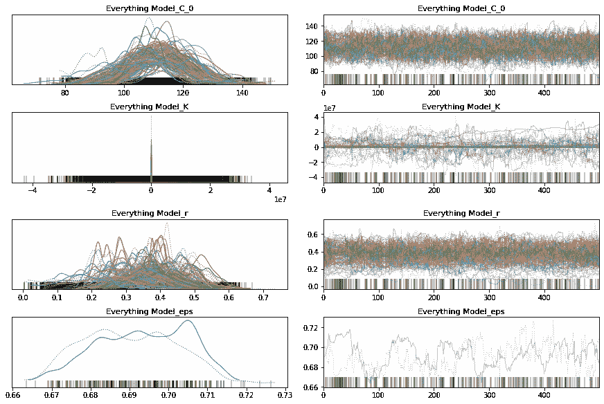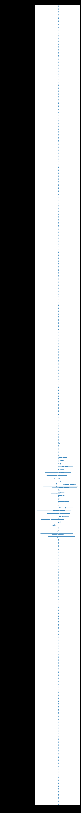

```
comparison = pm.compare(
    {
      pooled_model.name: pooled_trace, 
      total_per_country_model.name: total_per_country_trace, 
      growth_per_country_model.name: growth_per_country_trace,
      growth_total_model.name: growth_total_trace,
      everything_model.name: everything_trace
    }, ic='LOO');
print(comparison)
pm.compareplot(comparison); 
```

```
/usr/local/lib/python3.6/dist-packages/arviz/stats/stats.py:532: UserWarning: Estimated shape parameter of Pareto distribution is greater than 0.7 for one or more samples. You should consider using a more robust model, this is because importance sampling is less likely to work well if the marginal posterior and LOO posterior are very different. This is more likely to happen with a non-robust model and highly influential observations.
  "Estimated shape parameter of Pareto distribution is greater than 0.7 for "
/usr/local/lib/python3.6/dist-packages/arviz/stats/stats.py:532: UserWarning: Estimated shape parameter of Pareto distribution is greater than 0.7 for one or more samples. You should consider using a more robust model, this is because importance sampling is less likely to work well if the marginal posterior and LOO posterior are very different. This is more likely to happen with a non-robust model and highly influential observations.
  "Estimated shape parameter of Pareto distribution is greater than 0.7 for "
/usr/local/lib/python3.6/dist-packages/arviz/stats/stats.py:532: UserWarning: Estimated shape parameter of Pareto distribution is greater than 0.7 for one or more samples. You should consider using a more robust model, this is because importance sampling is less likely to work well if the marginal posterior and LOO posterior are very different. This is more likely to happen with a non-robust model and highly influential observations.
  "Estimated shape parameter of Pareto distribution is greater than 0.7 for "

                   rank      loo    p_loo  ...      dse warning loo_scale
Growth-Total Model    0 -13219.6  98.6516  ...        0    True       log
Total per country     1 -14416.5  52.1214  ...  44.5365   False       log
Growth per country    2 -15052.1  54.3001  ...  66.2718    True       log
Everything Model      3 -16240.9  61.6639  ...  58.6273    True       log
Pooled                4 -16629.8  4.14689  ...   56.487   False       log

[5 rows x 9 columns] 
```

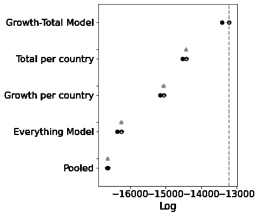

有意思。这个型号比其他型号差得多。如果你看一下轨迹图，对`C_0`的估计几乎是一样的。我的直觉是正确的。不需要单独拦截。

## 无截距模型

事实上，让我用一个固定的截距参数来测试。我敢打赌，这并没有太大的区别，所以我们不妨简化模型。

```
no_intercept_model = pm.Model("No-Intercept Model")
with no_intercept_model:
    BoundedNormal = pm.Bound(pm.Normal, lower=0.0)
    t = pm.Data("x_data", sorted_data["days_since_100_cases"])
    confirmed_cases = pm.Data("y_data", sorted_data["cumulative_cases"])

    # Intercept - We fixed this at 100.
    C_0 = 100

    # Growth rate: 0.2 is approx value reported by others
    r = BoundedNormal("r", mu=0.2, sigma=0.1, shape=n_countries)

    # Total number of cases. Depends on the population, more people, more infections.
    proportion_infected = 5e-05 # This value comes from the rough projection that 80000 will be infected in China
    p = sorted_data.popData2018.mean() # Crude. Can have a mean per country. Not sure how to do this
    K = pm.Normal("K", mu=p * proportion_infected, sigma=p*0.1, shape=n_countries)

    # Logistic regression
    growth = logistic(K[idx_country], r[idx_country], t, C_0)

    # Likelihood error
    eps = pm.HalfNormal("eps")

    # Likelihood - Counts here, so poission or negative binomial. Causes issues. Lognormal tends to work better?
    pm.Lognormal("cases", mu=np.log(growth), sigma=eps, observed=confirmed_cases)

pm.model_to_graphviz(no_intercept_model) 
```


```
with no_intercept_model:
  no_intercept_trace = pm.sample()
pm.traceplot(no_intercept_trace);
pm.forestplot(no_intercept_trace, var_names=[f"{no_intercept_model.name}_r", f"{no_intercept_model.name}_K"]); 
```

```
Auto-assigning NUTS sampler...
Initializing NUTS using jitter+adapt_diag...
Sequential sampling (2 chains in 1 job)
NUTS: [No-Intercept Model_eps, No-Intercept Model_K, No-Intercept Model_r]
Sampling chain 0, 157 divergences: 100%|██████████| 1000/1000 [05:09<00:00,  3.23it/s]
Sampling chain 1, 166 divergences: 100%|██████████| 1000/1000 [05:12<00:00,  3.20it/s]
There were 158 divergences after tuning. Increase `target_accept` or reparameterize.
The chain reached the maximum tree depth. Increase max_treedepth, increase target_accept or reparameterize.
There were 325 divergences after tuning. Increase `target_accept` or reparameterize.
The chain reached the maximum tree depth. Increase max_treedepth, increase target_accept or reparameterize.
The rhat statistic is larger than 1.4 for some parameters. The sampler did not converge.
The estimated number of effective samples is smaller than 200 for some parameters. 
```

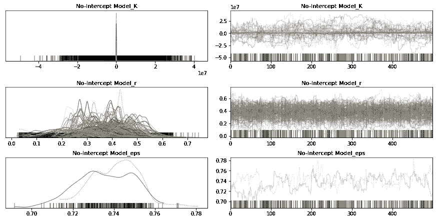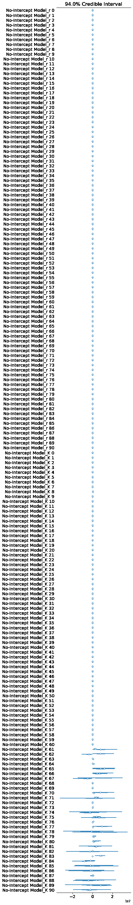

```
comparison = pm.compare(
    {
      pooled_model.name: pooled_trace, 
      total_per_country_model.name: total_per_country_trace, 
      growth_per_country_model.name: growth_per_country_trace,
      growth_total_model.name: growth_total_trace,
      everything_model.name: everything_trace,
      no_intercept_model.name: no_intercept_trace
    }, ic='LOO');
print(comparison)
pm.compareplot(comparison); 
```

```
/usr/local/lib/python3.6/dist-packages/arviz/stats/stats.py:532: UserWarning: Estimated shape parameter of Pareto distribution is greater than 0.7 for one or more samples. You should consider using a more robust model, this is because importance sampling is less likely to work well if the marginal posterior and LOO posterior are very different. This is more likely to happen with a non-robust model and highly influential observations.
  "Estimated shape parameter of Pareto distribution is greater than 0.7 for "
/usr/local/lib/python3.6/dist-packages/arviz/stats/stats.py:532: UserWarning: Estimated shape parameter of Pareto distribution is greater than 0.7 for one or more samples. You should consider using a more robust model, this is because importance sampling is less likely to work well if the marginal posterior and LOO posterior are very different. This is more likely to happen with a non-robust model and highly influential observations.
  "Estimated shape parameter of Pareto distribution is greater than 0.7 for "
/usr/local/lib/python3.6/dist-packages/arviz/stats/stats.py:532: UserWarning: Estimated shape parameter of Pareto distribution is greater than 0.7 for one or more samples. You should consider using a more robust model, this is because importance sampling is less likely to work well if the marginal posterior and LOO posterior are very different. This is more likely to happen with a non-robust model and highly influential observations.
  "Estimated shape parameter of Pareto distribution is greater than 0.7 for "
/usr/local/lib/python3.6/dist-packages/arviz/stats/stats.py:532: UserWarning: Estimated shape parameter of Pareto distribution is greater than 0.7 for one or more samples. You should consider using a more robust model, this is because importance sampling is less likely to work well if the marginal posterior and LOO posterior are very different. This is more likely to happen with a non-robust model and highly influential observations.
  "Estimated shape parameter of Pareto distribution is greater than 0.7 for "

                   rank      loo    p_loo  ...      dse warning loo_scale
Growth-Total Model    0 -13219.6  98.6516  ...        0    True       log
Total per country     1 -14416.5  52.1214  ...  44.5365   False       log
Growth per country    2 -15052.1  54.3001  ...  66.2718    True       log
Everything Model      3 -16240.9  61.6639  ...  58.6273    True       log
No-Intercept Model    4 -16343.4   43.872  ...  58.1615    True       log
Pooled                5 -16629.8  4.14689  ...   56.487   False       log

[6 rows x 9 columns] 
```

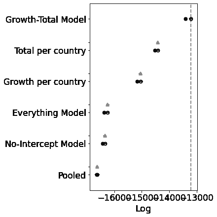

哦！我没想到会这样。看起来这个模型确实需要一些操作空间。好的，让我们继续发展总增长模型，看看我们是否可以用其他的分布来改进它。

## 没有显著差异

我尝试了许多不同的型号，但找不到一个明显更好的版本。最好的改进是通过使$K$的 prior 更通用来提高性能。广泛的正态分布有所帮助。伽玛分布工作得很好，但是宽有界正态分布也同样工作得很好。

```
improved_growth_total_model = pm.Model("Improved GT Model")
with improved_growth_total_model:
    BoundedNormal = pm.Bound(pm.Normal, lower=0.0)
    t = pm.Data("x_data", sorted_data["days_since_100_cases"])
    confirmed_cases = pm.Data("y_data", sorted_data["cumulative_cases"])

    # Intercept - We fixed this at 100.
    C_0 = pm.Normal("C_0", mu=100, sigma=10)

    # Growth rate: 0.2 is approx value reported by others
    r = BoundedNormal("r", mu=0.2, sigma=0.1, shape=n_countries)

    # Total number of cases. Depends on the population, more people, more infections.
    K = pm.Gamma("K", mu=30000, sigma=30000, shape=n_countries)

    # Logistic regression
    growth = logistic(K[idx_country], r[idx_country], t, C_0)

    # Likelihood error
    eps = pm.HalfNormal("eps")

    # Likelihood - Counts here, so poission or negative binomial. Causes issues. Lognormal tends to work better?
    pm.Lognormal("cases", mu=np.log(growth), sigma=eps, observed=confirmed_cases)

pm.model_to_graphviz(improved_growth_total_model) 
```


```
# Check what the negative binomial / K prior looks like
with improved_growth_total_model:
  prior = pm.sample_prior_predictive()
# prior.keys()
plt.hist(prior['Improved GT Model_K'].flatten());
plt.show() 
```

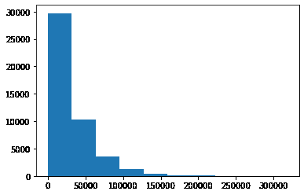

```
for RV in improved_growth_total_model.basic_RVs:
    print(RV.name, RV.logp(improved_growth_total_model.test_point)) 
```

```
Improved GT Model_C_0 -3.2215236261987186
Improved GT Model_r_lowerbound__ -2786.0881630591693
Improved GT Model_K_log__ -91.0
Improved GT Model_eps_log__ -0.7698925914732455
Improved GT Model_cases -20863.226039690697 
```

```
with improved_growth_total_model:
  improved_growth_total_trace = pm.sample()
pm.traceplot(improved_growth_total_trace);
pm.forestplot(improved_growth_total_trace, var_names=[f"{improved_growth_total_model.name}_r", f"{improved_growth_total_model.name}_K"]); 
```

```
Auto-assigning NUTS sampler...
Initializing NUTS using jitter+adapt_diag...
Sequential sampling (2 chains in 1 job)
NUTS: [Improved GT Model_eps, Improved GT Model_K, Improved GT Model_r, Improved GT Model_C_0]
Sampling chain 0, 0 divergences: 100%|██████████| 1000/1000 [01:05<00:00, 15.22it/s]
Sampling chain 1, 0 divergences: 100%|██████████| 1000/1000 [00:53<00:00, 18.70it/s]
The estimated number of effective samples is smaller than 200 for some parameters. 
```

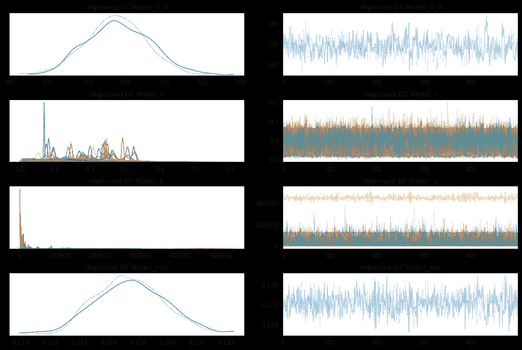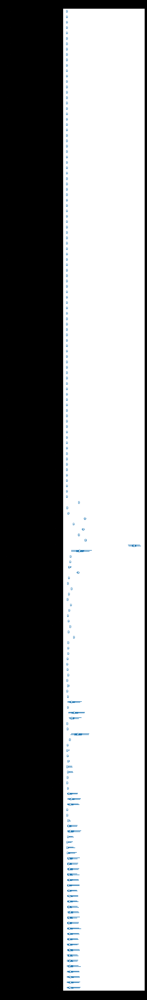

```
comparison = pm.compare(
    {
      pooled_model.name: pooled_trace, 
      total_per_country_model.name: total_per_country_trace, 
      growth_per_country_model.name: growth_per_country_trace,
      growth_total_model.name: growth_total_trace,
      everything_model.name: everything_trace,
      no_intercept_model.name: no_intercept_trace,
      improved_growth_total_model.name: improved_growth_total_trace,
    }, ic='LOO');
print(comparison)
pm.compareplot(comparison); 
```

```
/usr/local/lib/python3.6/dist-packages/arviz/stats/stats.py:532: UserWarning: Estimated shape parameter of Pareto distribution is greater than 0.7 for one or more samples. You should consider using a more robust model, this is because importance sampling is less likely to work well if the marginal posterior and LOO posterior are very different. This is more likely to happen with a non-robust model and highly influential observations.
  "Estimated shape parameter of Pareto distribution is greater than 0.7 for "
/usr/local/lib/python3.6/dist-packages/arviz/stats/stats.py:532: UserWarning: Estimated shape parameter of Pareto distribution is greater than 0.7 for one or more samples. You should consider using a more robust model, this is because importance sampling is less likely to work well if the marginal posterior and LOO posterior are very different. This is more likely to happen with a non-robust model and highly influential observations.
  "Estimated shape parameter of Pareto distribution is greater than 0.7 for "
/usr/local/lib/python3.6/dist-packages/arviz/stats/stats.py:532: UserWarning: Estimated shape parameter of Pareto distribution is greater than 0.7 for one or more samples. You should consider using a more robust model, this is because importance sampling is less likely to work well if the marginal posterior and LOO posterior are very different. This is more likely to happen with a non-robust model and highly influential observations.
  "Estimated shape parameter of Pareto distribution is greater than 0.7 for "
/usr/local/lib/python3.6/dist-packages/arviz/stats/stats.py:532: UserWarning: Estimated shape parameter of Pareto distribution is greater than 0.7 for one or more samples. You should consider using a more robust model, this is because importance sampling is less likely to work well if the marginal posterior and LOO posterior are very different. This is more likely to happen with a non-robust model and highly influential observations.
  "Estimated shape parameter of Pareto distribution is greater than 0.7 for "
/usr/local/lib/python3.6/dist-packages/arviz/stats/stats.py:532: UserWarning: Estimated shape parameter of Pareto distribution is greater than 0.7 for one or more samples. You should consider using a more robust model, this is because importance sampling is less likely to work well if the marginal posterior and LOO posterior are very different. This is more likely to happen with a non-robust model and highly influential observations.
  "Estimated shape parameter of Pareto distribution is greater than 0.7 for "

                   rank      loo    p_loo  ...      dse warning loo_scale
Growth-Total Model    0 -13219.6  98.6516  ...        0    True       log
Improved GT Model     1 -13232.9  101.091  ...  2.77116    True       log
Total per country     2 -14416.5  52.1214  ...  44.5365   False       log
Growth per country    3 -15052.1  54.3001  ...  66.2718    True       log
Everything Model      4 -16240.9  61.6639  ...  58.6273    True       log
No-Intercept Model    5 -16343.4   43.872  ...  58.1615    True       log
Pooled                6 -16629.8  4.14689  ...   56.487   False       log

[7 rows x 9 columns] 
```

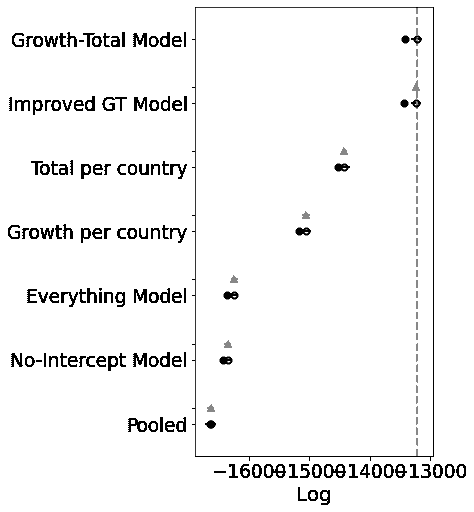

## 分层贝叶斯模型

好吧，你终于来了。如果你能坚持到现在，恭喜你！

以前，我们分别为每个国家生成参数估计值。这可能没有意义，因为这毕竟是同一种病毒。它们在某种程度上都是有联系的。

起初，我只是试图绑定感染率($r$参数),但是我想我也可以绑定 K 参数。在某种程度上，将会有相似水平的感染人群。但是我可以想象一个更复杂的模型，考虑到人口和人口分布。

总之，下面是一个模型，它假设一个国家以前的$r$和$K$估计值的均值和标准差是从一个高层次的抽象中抽取的。$r$和$K$的全球发行。

这将有助于那些没有多少数据的国家对他们的雷亚尔和克瓦查进行更好的初步估算。他们的估计应该被限制在全球分布的某处。

```
hierarchical_model = pm.Model("Hierarchical Model")
with hierarchical_model:
    BoundedNormal = pm.Bound(pm.Normal, lower=0.0)
    t = pm.Data("x_data", sorted_data["days_since_100_cases"])
    confirmed_cases = pm.Data("y_data", sorted_data["cumulative_cases"])

    # Intercept - We fixed this at 100.
    C_0 = pm.Normal("C_0", mu=100, sigma=10)

    # Growth rate: 0.2 is approx value reported by others
    r_mu = pm.Normal("r_mu", mu=0.2, sigma=0.1)
    r_sigma = pm.HalfNormal("r_sigma", 0.5)
    r = BoundedNormal("r", mu=r_mu, sigma=r_sigma, shape=n_countries)

    # Total number of cases. Depends on the population, more people, more infections.
    K_mu = pm.Normal("K_mu", mu=30000, sigma=30000)
    K_sigma = pm.HalfNormal("K_sigma", 1000)
    K = pm.Gamma("K", mu=K_mu, sigma=K_sigma, shape=n_countries)

    # Logistic regression
    growth = logistic(K[idx_country], r[idx_country], t, C_0)

    # Likelihood error
    eps = pm.HalfNormal("eps")

    # Likelihood - Counts here, so poission or negative binomial. Causes issues. Lognormal tends to work better?
    pm.Lognormal("cases", mu=np.log(growth), sigma=eps, observed=confirmed_cases)

pm.model_to_graphviz(hierarchical_model) 
```


```
for RV in hierarchical_model.basic_RVs:
    print(RV.name, RV.logp(hierarchical_model.test_point)) 
```

```
Hierarchical Model_C_0 -3.2215236261987186
Hierarchical Model_r_mu 1.3836465597893728
Hierarchical Model_r_sigma_log__ -0.7698925914732455
Hierarchical Model_r_lowerbound__ -182.96635614506937
Hierarchical Model_K_mu -11.227891193848965
Hierarchical Model_K_sigma_log__ -0.7698925914732451
Hierarchical Model_K_log__ 246.42720418948204
Hierarchical Model_eps_log__ -0.7698925914732455
Hierarchical Model_cases -20863.226039690697 
```

```
with hierarchical_model:
  hierarchical_trace = pm.sample()
pm.traceplot(hierarchical_trace);
pm.forestplot(hierarchical_trace, var_names=[f"{hierarchical_model.name}_r", f"{hierarchical_model.name}_K"]); 
```

```
Auto-assigning NUTS sampler...
Initializing NUTS using jitter+adapt_diag...
Sequential sampling (2 chains in 1 job)
NUTS: [Hierarchical Model_eps, Hierarchical Model_K, Hierarchical Model_K_sigma, Hierarchical Model_K_mu, Hierarchical Model_r, Hierarchical Model_r_sigma, Hierarchical Model_r_mu, Hierarchical Model_C_0]
Sampling chain 0, 0 divergences: 100%|██████████| 1000/1000 [01:03<00:00, 15.87it/s]
Sampling chain 1, 0 divergences: 100%|██████████| 1000/1000 [00:49<00:00, 20.27it/s]
The rhat statistic is larger than 1.05 for some parameters. This indicates slight problems during sampling.
The estimated number of effective samples is smaller than 200 for some parameters. 
```

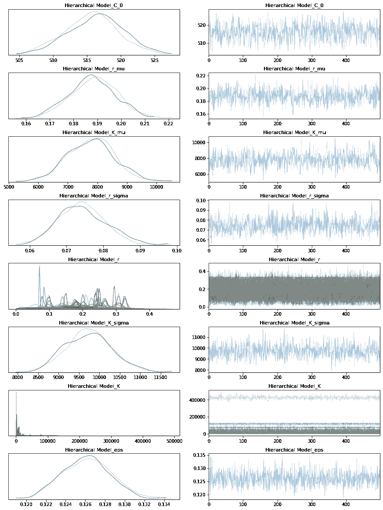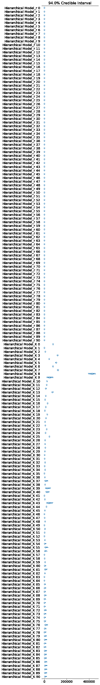

```
comparison = pm.compare(
    {
      pooled_model.name: pooled_trace, 
      total_per_country_model.name: total_per_country_trace, 
      growth_per_country_model.name: growth_per_country_trace,
      growth_total_model.name: growth_total_trace,
      everything_model.name: everything_trace,
      no_intercept_model.name: no_intercept_trace,
      improved_growth_total_model.name: improved_growth_total_trace,
      hierarchical_model.name: hierarchical_trace,
    }, ic='LOO');
print(comparison)
pm.compareplot(comparison); 
```

```
/usr/local/lib/python3.6/dist-packages/arviz/stats/stats.py:532: UserWarning: Estimated shape parameter of Pareto distribution is greater than 0.7 for one or more samples. You should consider using a more robust model, this is because importance sampling is less likely to work well if the marginal posterior and LOO posterior are very different. This is more likely to happen with a non-robust model and highly influential observations.
  "Estimated shape parameter of Pareto distribution is greater than 0.7 for "
/usr/local/lib/python3.6/dist-packages/arviz/stats/stats.py:532: UserWarning: Estimated shape parameter of Pareto distribution is greater than 0.7 for one or more samples. You should consider using a more robust model, this is because importance sampling is less likely to work well if the marginal posterior and LOO posterior are very different. This is more likely to happen with a non-robust model and highly influential observations.
  "Estimated shape parameter of Pareto distribution is greater than 0.7 for "
/usr/local/lib/python3.6/dist-packages/arviz/stats/stats.py:532: UserWarning: Estimated shape parameter of Pareto distribution is greater than 0.7 for one or more samples. You should consider using a more robust model, this is because importance sampling is less likely to work well if the marginal posterior and LOO posterior are very different. This is more likely to happen with a non-robust model and highly influential observations.
  "Estimated shape parameter of Pareto distribution is greater than 0.7 for "
/usr/local/lib/python3.6/dist-packages/arviz/stats/stats.py:532: UserWarning: Estimated shape parameter of Pareto distribution is greater than 0.7 for one or more samples. You should consider using a more robust model, this is because importance sampling is less likely to work well if the marginal posterior and LOO posterior are very different. This is more likely to happen with a non-robust model and highly influential observations.
  "Estimated shape parameter of Pareto distribution is greater than 0.7 for "
/usr/local/lib/python3.6/dist-packages/arviz/stats/stats.py:532: UserWarning: Estimated shape parameter of Pareto distribution is greater than 0.7 for one or more samples. You should consider using a more robust model, this is because importance sampling is less likely to work well if the marginal posterior and LOO posterior are very different. This is more likely to happen with a non-robust model and highly influential observations.
  "Estimated shape parameter of Pareto distribution is greater than 0.7 for "
/usr/local/lib/python3.6/dist-packages/arviz/stats/stats.py:532: UserWarning: Estimated shape parameter of Pareto distribution is greater than 0.7 for one or more samples. You should consider using a more robust model, this is because importance sampling is less likely to work well if the marginal posterior and LOO posterior are very different. This is more likely to happen with a non-robust model and highly influential observations.
  "Estimated shape parameter of Pareto distribution is greater than 0.7 for "

                   rank      loo    p_loo  ...      dse warning loo_scale
Growth-Total Model    0 -13219.6  98.6516  ...        0    True       log
Improved GT Model     1 -13232.9  101.091  ...  2.77116    True       log
Hierarchical Model    2 -13243.7  97.9735  ...  4.41949    True       log
Total per country     3 -14416.5  52.1214  ...  44.5365   False       log
Growth per country    4 -15052.1  54.3001  ...  66.2718    True       log
Everything Model      5 -16240.9  61.6639  ...  58.6273    True       log
No-Intercept Model    6 -16343.4   43.872  ...  58.1615    True       log
Pooled                7 -16629.8  4.14689  ...   56.487   False       log

[8 rows x 9 columns] 
```

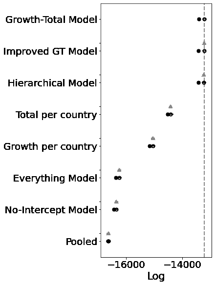

好吧，所以分数看起来也没好多少。酪这是一个很大的但是。看看后面 K 的后验概率。这些国家还没有很多样本。

## 使用分层模型与原始图绘制

以前的估计是非常不准确的，因为我们实际上是试图在少量的观察数据上训练一个模型。但是现在，我们使用汇集的知识来预测新的价值。

让我将 GT 模型的预测与分级模型进行对比。

很抱歉代码重复。

```
country = "Tunisia"
x = range(60)
y = np.zeros(len(x))
x_obs = sorted_data[sorted_data.country == country]["days_since_100_cases"]
y_obs = sorted_data[sorted_data.country == country]["cumulative_cases"]
current_country = np.argmax(countries == country)
test_model = pm.Model("Hierarchical Model")
with test_model:
    BoundedNormal = pm.Bound(pm.Normal, lower=0.0)
    t = pm.Data("x_data", x)
    confirmed_cases = pm.Data("y_data", y)

    # Intercept - We fixed this at 100.
    C_0 = pm.Normal("C_0", mu=100, sigma=10)

    # Growth rate: 0.2 is approx value reported by others
    r_mu = pm.Normal("r_mu", mu=0.2, sigma=0.1)
    r_sigma = pm.HalfNormal("r_sigma", 0.5)
    r = BoundedNormal("r", mu=r_mu, sigma=r_sigma, shape=n_countries)

    # Total number of cases. Depends on the population, more people, more infections.
    K_mu = pm.Normal("K_mu", mu=30000, sigma=30000)
    K_sigma = pm.HalfNormal("K_sigma", 1000)
    K = pm.Gamma("K", mu=K_mu, sigma=K_sigma, shape=n_countries)

    # Logistic regression
    growth = logistic(K[current_country], r[current_country], t, C_0)

    # Likelihood error
    eps = pm.HalfNormal("eps")

    # Likelihood - Counts here, so poission or negative binomial. Causes issues. Lognormal tends to work better?
    pm.Lognormal("cases", mu=np.log(growth), sigma=eps, observed=confirmed_cases)

pm.model_to_graphviz(test_model) 
```


```
# New model with holdout data
with test_model:
  ppc_hierarchical = pm.sample_posterior_predictive(hierarchical_trace) 
```

```
100%|██████████| 1000/1000 [00:11<00:00, 84.37it/s] 
```

```
test_model_poor = pm.Model("Growth-Total Model")
with test_model_poor:
    BoundedNormal = pm.Bound(pm.Normal, lower=0.0)
    t = pm.Data("x_data", x)
    confirmed_cases = pm.Data("y_data", y)

    # Intercept - We fixed this at 100.
    C_0 = pm.Normal("C_0", mu=100, sigma=10)

    # Growth rate: 0.2 is approx value reported by others
    r = BoundedNormal("r", mu=0.2, sigma=0.1, shape=n_countries)

    # Total number of cases. Depends on the population, more people, more infections.
    proportion_infected = 5e-05 # This value comes from the rough projection that 80000 will be infected in China
    p = sorted_data.popData2018.mean() # Crude. Can have a mean per country. Not sure how to do this
    K = pm.Normal("K", mu=p * proportion_infected, sigma=p*0.1, shape=n_countries)

    # Logistic regression
    growth = logistic(K[current_country], r[current_country], t, C_0)

    # Likelihood error
    eps = pm.HalfNormal("eps")

    # Likelihood - Counts here, so poission or negative binomial. Causes issues. Lognormal tends to work better?
    pm.Lognormal("cases", mu=np.log(growth), sigma=eps, observed=confirmed_cases)

pm.model_to_graphviz(test_model_poor) 
```


```
# New model with holdout data
with test_model_poor:
  ppc_gt = pm.sample_posterior_predictive(growth_total_trace) 
```

```
100%|██████████| 1000/1000 [00:11<00:00, 84.95it/s] 
```

```
 fig, ax = plt.subplots(nrows=1, ncols=2, figsize=(15, 7))
  ax[0].plot(x, ppc_gt["Growth-Total Model_cases"].T, ".k", alpha=0.05)
  ax[0].plot(x_obs, y_obs, color="r")
  ax[0].plot(x, np.mean(ppc_gt["Growth-Total Model_cases"], axis=0), "b", alpha=0.5)
  ax[0].set_yscale("log")
  ax[0].set(xlabel="Date", ylabel="Confirmed Cases", title=f"{country} - Standard GT model");
  ax[1].plot(x, ppc_hierarchical["Hierarchical Model_cases"].T, ".k", alpha=0.05)
  ax[1].plot(x_obs, y_obs, color="r")
  ax[1].plot(x, np.mean(ppc_hierarchical["Hierarchical Model_cases"], axis=0), "b", alpha=0.5)
  ax[1].set_yscale("log")
  ax[1].set(xlabel="Date", ylabel="Confirmed Cases", title=f"{country} - Hierarchical GT model");
  plt.show() 
```

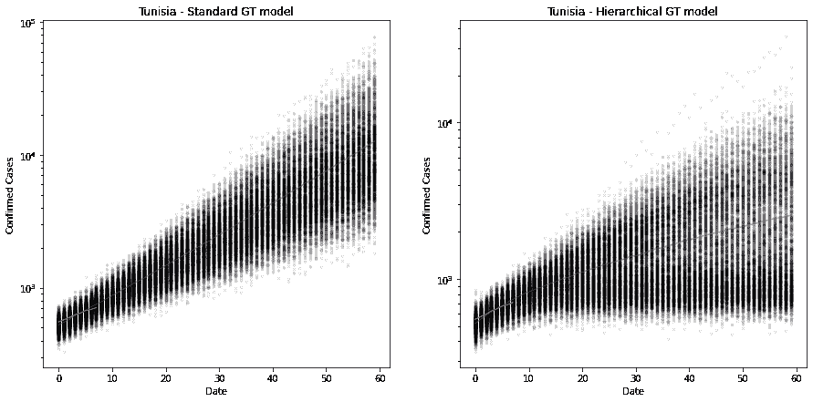

上图显示了前 100 个病例在 60 天内的预测病例数。旧模型仍然是非常指数化的，误差范围很窄，这表明估计中的误差比实际误差要小。看这条红线，它明显是向下突出的。

右边是层次模型。现在的估计要保守得多，但关键是，误差范围要宽得多，这表明缺乏信心(这是应该的，因为这里只有 7 个观察值)。

它表明突尼斯将在第 20 天(大约 2020 年 4 月 27 日)左右出现大约 1000 例病例。但可信区间(95%)大约是 500-2000。非常宽。尤其是考虑到他们已经过了 500 大关！:-)

出于兴趣，突尼斯 K 的感染总数目前约为 4400 人(14/04/20)。

理想情况下，我们希望提高这些置信界限。但是我会留到以后再说。

```
hierarchical_trace["Hierarchical Model_K"][:,current_country].mean() 
```

```
4394.678726322066 
```