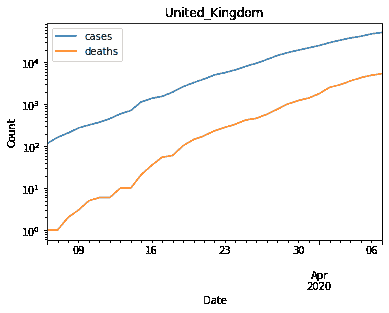
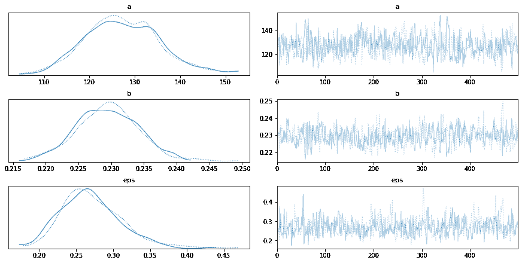

# 新冠肺炎指数贝叶斯模型

> 原文：<https://winder.ai/covid-19-exponential-bayesian-model/>

本笔记本的目的是提供使用`pymc3`库进行建模和预测新冠肺炎病毒摘要统计数据的初步经验。这个模型非常简单，因此不太准确，但是可以很好地介绍这个主题。

这在很大程度上受到了 Thomas Wiecki 的启发，他来自一个关于这个话题的视频。

进一步的分析、问题和模型。

新冠肺炎研究

以下是本系列中其他新冠肺炎文章的链接列表。

*   [新冠肺炎回应:雅典娜项目和贝叶斯分析简介](https://winder.ai/covid-19-response-athena-project-and-an-introduction-bayesian-analysis/)
*   [新冠肺炎指数贝叶斯模型回测](https://winder.ai/covid-19-exponential-bayesian-model-backtesting/)
*   [新冠肺炎逻辑斯谛贝叶斯模型](https://winder.ai/covid-19-logistic-bayesian-model/)
*   [新冠肺炎分层贝叶斯逻辑模型与 pymc3](https://winder.ai/covid-19-hierarchical-bayesian-logistic-model-with-pymc3/)
*   [用于部署机器学习模型的简单的基于 Docker 的工作流](https://winder.ai/a-simple-docker-based-workflow-for-deploying-a-machine-learning-model/)

## 不做

*   迭代国家
*   开始研究更复杂的模型(如 SIR/等)。层次结构)
*   调查并证明不同的前科
*   实施回溯测试
*   实施与其他国家的交叉验证
*   考虑细分国家(参见分析笔记本)

## 初始化

初始安装和导入。

```
!pip install arviz pymc3==3.8
import numpy as np
import pymc3 as pm
import pandas as pd
import matplotlib.pyplot as plt 
```

## 加载数据

这是使用全球 ECDC 数据。请注意，日期采用欧洲格式。为了清晰起见，我重命名了列，并删除了不必要的列。

```
df = pd.read_csv("https://opendata.ecdc.europa.eu/covid19/casedistribution/csv/", parse_dates=["dateRep"], infer_datetime_format=True, dayfirst=True)
df = df.rename(columns={'dateRep': 'date', 'countriesAndTerritories': 'country'}) # Sane column names
df = df.drop(["day", "month", "year", "geoId"], axis=1) # Not required 
```

过滤单个国家，只是为了习惯数据。在更复杂的版本中，我们可以查看所有国家。

```
# Filter for country (probably want separate models per country, even maybe per region)
country = df[df["country"] == "United_Kingdom"].sort_values(by="date")
# Cumulative sum of data
country_cumsum = country[["cases", "deaths"]].cumsum().set_index(country["date"])
# Filter out data with less than 100 cases
country_cumsum = country_cumsum[country_cumsum["cases"] >= 100]
country_cumsum.plot(logy=True)
plt.gca().set(xlabel="Date", ylabel="Count", title="United_Kingdom")
plt.show() 
```



## 第一个模型

这是我们指定模型的地方，一个非常简单的指数模型。

进行贝叶斯分析的一个主要好处是，我们可以包括先前的信念，以帮助适应我们的模型。先验以期望分布的形式出现。为了简单起见，我选择了正态分布。{此处需要更多分析}。

第一个先验是提供一个截距。我们需要它来解释数据开始时的偏移(我将数据限制为等待 100 个确诊病例)。这是正态分布。

接下来，我们加上一个增长率。基于之前的研究，0.2 的值是合适的(见附录 1)。

然后我们定义指数模型并拟合参数。

```
country = "United_Kingdom"
days_since_100 = range(len(country_cumsum))

# Create PyMC3 context manager
with pm.Model() as model:
  t = pm.Data(country + "x_data", days_since_100)
  confirmed_cases = pm.Data(country + "y_data", country_cumsum["cases"].astype('float64').values)

  # Intercept - We fixed this at 100.
  a = pm.Normal("a", mu=100, sigma=10)

  # Slope - Growth rate: 0.2 is approx value reported by others
  b = pm.Normal("b", mu=0.2, sigma=0.5)

  # Exponential regression
  growth = a * (1 + b) ** t

  # Likelihood error
  eps = pm.HalfNormal("eps")

  # Likelihood - Counts here, so poission or negative binomial. Causes issues. Lognormal tends to work better?
  pm.Lognormal(country, mu=np.log(growth), sigma=eps, observed=confirmed_cases)

  trace = pm.sample()
  post_Pred = pm.sample_posterior_predictive(trace) 
```

```
Auto-assigning NUTS sampler...
Initializing NUTS using jitter+adapt_diag...
Sequential sampling (2 chains in 1 job)
NUTS: [eps, b, a]
Sampling chain 0, 0 divergences: 100%|██████████| 1000/1000 [00:03<00:00, 277.16it/s]
Sampling chain 1, 0 divergences: 100%|██████████| 1000/1000 [00:02<00:00, 413.72it/s]
The acceptance probability does not match the target. It is 0.8999537134484051, but should be close to 0.8\. Try to increase the number of tuning steps.
100%|██████████| 1000/1000 [00:10<00:00, 94.66it/s] 
```

现在模型已经训练好了，我们可以看看多次运行的拟合值。

跟踪图显示模型参数随时间的变化。每条线代表 MCMC 采样中的一个采样链。分布应该是相似的，原始轨迹应该是稳定的，并且在重复时收敛到相似的值。

```
pm.traceplot(trace)
plt.show() 
```



### 结果

这是模型的最终结果。在下表中，`mean`表示模型参数的预测值，`sd`是估计的标准偏差，`hpd_x`是参数以某一概率下降的区间的上下限，`mcse`是蒙特卡罗标准误差(后验估计值之间的相似性的度量)，应该很低。`ess`是有效样本大小(沿着轨迹的自相关的度量)并且应该是高的，而`r_hat`是对聚合链变得如何的估计(在不同位置结束的链将具有接近零值)，并且应该接近 1。

```
pm.summary(trace).round(2) 
```

|  | 意思是 | 存储卡 | hpd_3% | hpd_97% | mcse _ 均值 | mcse_sd | ess_mean | ess_sd | ess_bulk | ess_tail | r_hat |
| --- | --- | --- | --- | --- | --- | --- | --- | --- | --- | --- | --- |
| a | One hundred and twenty-seven point one eight | Eight point one two | One hundred and twelve point four four | One hundred and forty-two point eight four | Zero point three eight | Zero point two seven | Four hundred and forty-nine | Four hundred and forty-two | Four hundred and fifty-nine | Four hundred and seventy-two | One |
| b | Zero point two three | Zero | Zero point two two | Zero point two four | Zero | Zero | Four hundred and seventy-two | Four hundred and seventy-two | Four hundred and seventy-three | Five hundred and forty-four | One |
| 蓄电池 | Zero point two seven | Zero point zero four | Zero point two | Zero point three five | Zero | Zero | Four hundred and ninety-six | Four hundred and eighty-five | Five hundred and eighteen | Five hundred and fifty-three | One |

使用参数的值，您可以对新的观察值进行采样，并查看它们与原始值的比较情况。

```
fig, ax = plt.subplots(figsize=(10, 8))
ax.plot(country_cumsum.index, post_Pred[country].T, color="k", alpha=0.05)
ax.plot(country_cumsum.index, country_cumsum["cases"].astype('float64').values, color="r")
ax.set_yscale("log")
ax.set(xlabel="Date", ylabel="Confirmed Cases", title=country)
plt.show() 
```


## 附录 1:指数增长率

文献中出现了各种各样的拟合增长率。可以花一整天去读它。看起来 0.2 的值适合较大的国家。

*   印度(0.18-0.19)，加内什·库马尔等人，[http://arxiv.org/abs/2003.12017](http://arxiv.org/abs/2003.12017)
*   中国(0.24)，吴等，
*   中国(0.22)，巴蒂斯塔，[https://www . medrxiv . org/content/10.1101/2020 . 03 . 11 . 20024901 v2 . full . pdf](https://www.medrxiv.org/content/10.1101/2020.03.11.20024901v2.full.pdf)