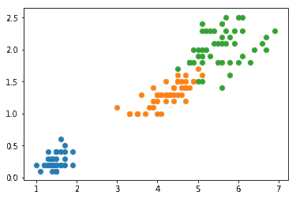
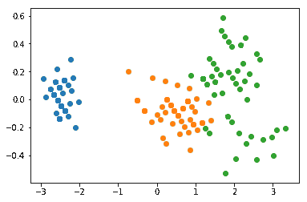
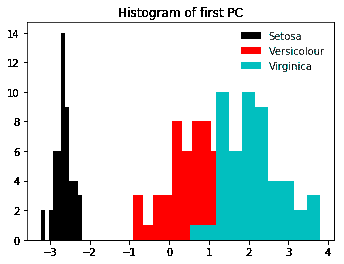
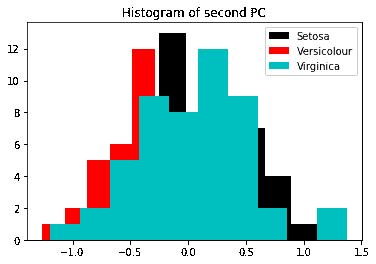
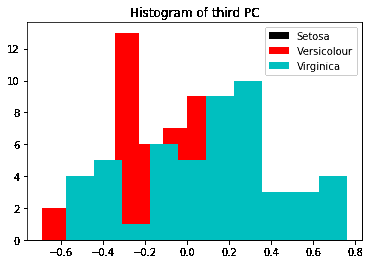
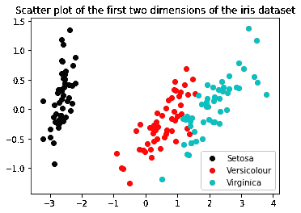

# 主成分分析

> 原文：<https://winder.ai/principal-component-analysis/>

# 降维-主成分分析

欢迎光临！本车间来自 [Winder.ai](https://Winder.ai/?utm_source=winderresearch&utm_medium=notebook&utm_campaign=workshop&utm_term=individual) 。注册以获得更多免费的研讨会、培训和视频。

有时候数据有冗余的维度。例如，当根据身高数据预测体重时，你会认为关于他们眼睛颜色的信息没有预测能力。在这个简单的例子中，我们可以简单地从数据中删除该特征。

对于更复杂的数据，通常会有提供预测能力的特征组合。降维方法试图对数据应用数学变换，以将数据转换成正交维度。换句话说，他们试图将数据从复杂的维度组合(例如 3-D)映射到较低数量的维度(例如 1-D)。

本节介绍了降维的实际应用，并演示了最流行的方法，主成分分析(PCA)。

你会注意到的第一件事是，它允许我们获取一个高维数据集，并在二维空间中可视化。观想是如此重要，这也是进行观想的主要原因之一。

第二，这里你不会注意到太多，但是当你开始使用更大的数据集时，减少维数可以将一个棘手的问题(由于使用太多特征的计算复杂性)变成一个易处理的问题。

我们以前接触过一些概念(如共线性)，它们在这里再次出现。

```
import numpy as np
import matplotlib.pyplot as plt
from mpl_toolkits.mplot3d import Axes3D
from sklearn import decomposition, datasets, linear_model, manifold
from sklearn import datasets 
```

```
iris = datasets.load_iris()
X = iris.data
y = iris.target 
```

## 污染控制局(Pollution Control Agency)

PCA 试图将向量投射到方差最大的方向上。然后，我们可以使用这些向量将数据重定向到标准的 x/y/z 轴上。

虹膜数据集有四个组成部分，这使得它很难绘制。现在，让我们只使用两个组件(选择这两个组件是为了使 PCA 的结果看起来更好)并对其执行 PCA，以获得对正在发生的事情的直观理解。

```
X_2 = X[:,2:4]
X_2.shape 
```

```
(150, 2) 
```

```
fig = plt.figure()
for i in set(y):
    x = X_2[y==i,:]
    plt.scatter(x[:,0], x[:,1])
plt.show() 
```



```
pca = decomposition.PCA(n_components=2)
pca.fit(X_2) 
```

```
PCA(copy=True, iterated_power='auto', n_components=2, random_state=None,
  svd_solver='auto', tol=0.0, whiten=False) 
```

```
X_t = pca.transform(X_2)
fig = plt.figure()
for i in set(y):
    x = X_t[y==i,:]
    plt.scatter(x[:,0], x[:,1])
plt.show() 
```



花点时间看看这两个图中坐标轴的位置和值。请注意数据是如何被“旋转”到 x-y 轴上，而不是对角线上的。请注意，x 轴上的值的范围比 y 轴上的大。

PCA 已经将具有最高方差的向量映射到第一轴上，将第二高的向量映射到第二轴上，等等。

事实上，PCA 产生了一个非常有用的指标，称为*解释的方差比*。或者换句话说，在每个转换的维度中表示了多少数据集的方差。

现在我们了解了 PCA 是如何转换数据的，让我们使用整个数据集。

```
pca = decomposition.PCA(n_components=4)
pca.fit(X)
pca.explained_variance_ratio_ 
```

```
array([ 0.92461621,  0.05301557,  0.01718514,  0.00518309]) 
```

第一个因素解释了高达 92%的方差。大部分的经验法则可能会让你在那里切断它。让我们看看第一台 PC 在将数据转换到新的领域后会是什么样子(`.transform`有效地为我们做了点积投影)

```
X_p = pca.transform(X) 
```

```
fig = plt.figure(figsize=(5.5,4))
plt.title('Histogram of first PC')
plt.hist(X_p[y==0, 0], facecolor='k', label="Setosa")
plt.hist(X_p[y==1, 0], facecolor='r', label="Versicolour")
plt.hist(X_p[y==2, 0], facecolor='c', label="Virginica")
plt.legend()
plt.show() 
```



我们可以看到 Setosa 被很好地分开了。另外两个没有完全分开，但似乎显示出良好的正态分布。

让我们来看看二次元是什么样子的。

```
fig = plt.figure()
plt.title('Histogram of second PC')
plt.hist(X_p[y==0, 1], facecolor='k', label="Setosa")
plt.hist(X_p[y==1, 1], facecolor='r', label="Versicolour")
plt.hist(X_p[y==2, 1], facecolor='c', label="Virginica")
plt.legend()
plt.show() 
```



请注意，与第一个维度相比，第二个维度的差异非常小。(即查看第一个图的最小值/最大值，并与此进行比较)。

一般来说，您会发现方差越大的组件通常具有更好的类分离(因为高方差是由类分离而不是每个类的方差来说明的)

如果你看下面，第三个看起来更糟糕。

```
fig = plt.figure()
plt.title('Histogram of third PC')
plt.hist(X_p[y==0, 2], facecolor='k', label="Setosa")
plt.hist(X_p[y==1, 2], facecolor='r', label="Versicolour")
plt.hist(X_p[y==2, 2], facecolor='c', label="Virginica")
plt.legend()
plt.show() 
```



现在我们来看一下二维的数据。

```
fig = plt.figure(figsize=(5.5,4))
plt.title('Scatter plot of the first two dimensions of the iris dataset')
plt.scatter(X_p[y==0, 0], X_p[y==0, 1], c='k', label="Setosa")
plt.scatter(X_p[y==1, 0], X_p[y==1, 1], c='r', label="Versicolour")
plt.scatter(X_p[y==2, 0], X_p[y==2, 1], c='c', label="Virginica")
plt.legend()
plt.show() 
```



同样，您可以看到在第一个维度(x)上有一个很大的方差，范围为+/- 4，而第二个维度(y)只有+/- 1。

### 带分类的 PCA

现在我们将:

*   使用逻辑分类器对虹膜数据集进行分类
*   计算准确度分数(或您选择的分数)
*   现在执行主成分分析，减少到一个单一的组成部分。重复分类和评分。
*   结果相差多少？意义重大吗？

```
mdl = linear_model.LogisticRegression()
print("No PCA accuracy:", mdl.fit(X, y).score(X, y)) 
```

```
No PCA accuracy: 0.96 
```

```
mdl = linear_model.LogisticRegression()
print("With PCA (first componennt) accuracy:", mdl.fit(X_p[:,0].reshape(150,1), y).score(X_p[:,0].reshape(150,1), y)) 
```

```
With PCA (first componennt) accuracy: 0.9 
```

```
mdl = linear_model.LogisticRegression()
print("With PCA (two components) accuracy:", mdl.fit(X_p[:,0:1], y).score(X_p[:,0:1], y)) 
```

```
With PCA (two components) accuracy: 0.9 
```

你可以看到我们稍微降低了精确度。通常，人们喜欢在绘图时将维数减少到 2 或 3，然后在实际分类时再增加维数。

这成为简单性/性能和准确性之间的折衷。