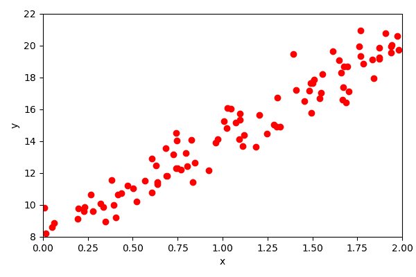
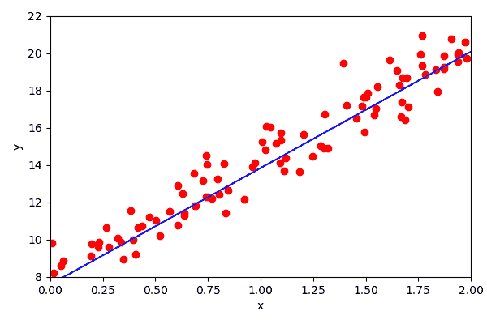
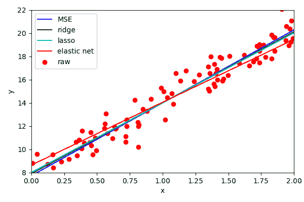
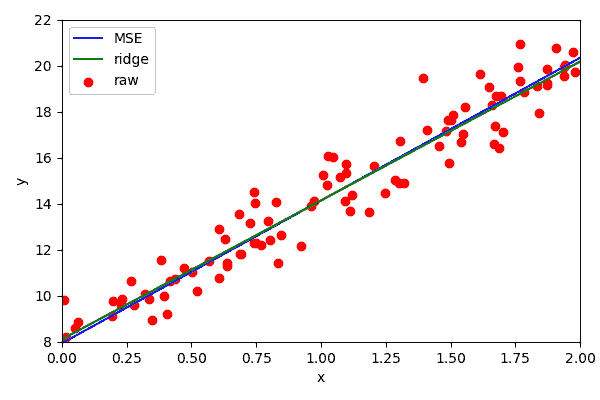
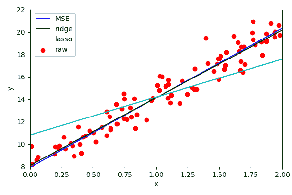
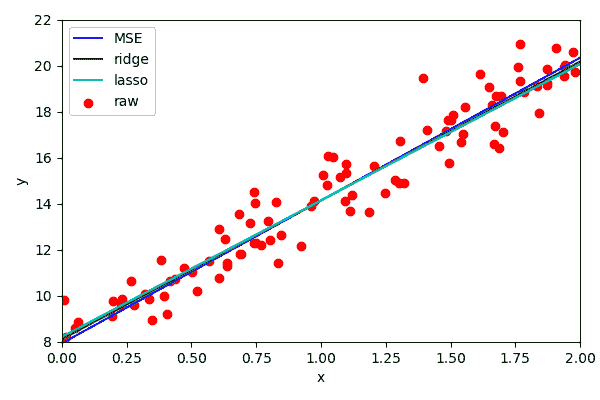

# 401:线性回归

> 原文：<https://winder.ai/401-linear-regression/>

## 回归和线性分类器

传统的线性回归(也称为普通最小二乘法)是最简单、最经典的回归形式。

给定一个线性模型，形式为:

\ begin { align } f(\ mathbf { x })& = w _ 0+w _ 1x _ 1+w _ 2x _ 2+\ dots \ \
&= \ mathbf { w } ^t \ cdot \ mathbf { x } \ end { align }

线性回归找到使*均方误差* (MSE) & mldr 最小的参数\(\mathbf{w}\ );

* * *

MSE 是预测值和实际值的平方和。

\ begin { align } MSE(\ mathbf { w })= \ frac { 1 } { m } \sum_{i=1}^{m}{(\mathbf{w}^t \ cdot \mathbf{x}^{(i)}-\mathbf{y}^{(i)})^2} \ end { align }

其中\(m\)是观察次数。

* * *

## 价值函数

*   MSE 被称为*成本函数*。

我们还可以使用一个适合度的度量标准(*效用*或*适应度函数*)。

*   然后我们可以调整参数以最小化成本函数

？？？

成本函数的典型用途是测量模型对数据的拟合或分类程度。然后调整模型以最小化成本函数。例如，对于线性回归，我们通常使用模型预测和真实数据之间的距离；上例中的 MSE。

* * *

## 正规方程

对于给定的数据，有一个封闭的解决方案来找到最佳的 MSE。这就是所谓的正常方程。

\ begin { align } \hat{w}=\left(\mathbf{x}^t\cdot\mathbf{x}\right)^{-1} \ cdot \mathbf{x}^t \ cdot \ mathbf { y } \ end { align }

让我们生成一些合成数据并手动运行。

* * *

* * *

## 线性回归

大多数时候你会用到一个库，但有时你需要更深入地挖掘。

？？？

大多数标准模型和优化器已经实现。在你的日常工作中，你会用到这些。但是它有助于理解，有时您需要自定义实现。

* * *

### 其他回归

*   岭回归(惩罚平方权重-正则化)
*   套索回归(惩罚权重的绝对大小)
*   弹性网回归(脊和套索的组合)

？？？

### 里脊回归

存在其他线性回归实现。 *Ridge* 回归试图优化相同的参数，但对平方权重不利。

实际上，它试图最大限度地减少功能的使用。这被称为*规范化*。

当存在大量要素时，岭回归最有用。

### 套索回归

另一种回归叫做*套索*。这类似于岭回归，但是惩罚了权重的 L1(绝对)幅度。

我们可以看到，这个判罚太激进了。我们可以改变`alpha`参数来降低惩罚的侵略性(对山脊也一样)。

一般来说，岭回归更容易使用，但假设高斯噪声。Lasso 在有异常值时表现更好(由于 L1 惩罚，而不是 L2)。

### 弹性网

还有最后一种常见的正规化形式，叫做*弹性网*。从本质上讲，它是脊和套索回归的组合，您可以控制每种回归的影响程度。

我们可以看到效果相当明显。

* * *

### 兰萨克

RANSAC 从样本中随机选取一些观察值，然后正常执行回归。

选择最常见的一组参数作为最终结果。

当数据中存在异常值时，这种算法非常有效。

* * *

## 你什么时候用什么？

*   避免简单的线性回归
*   山脊是一个很好的默认
*   如果数据非常不正常，请避免使用岭
*   但是如果只有几个功能是有用的，那么最好选择套索或松紧带
*   避免套索，对大量要素或相关要素使用弹性
*   每当你有不想摆脱的离群值时，RANSAC。

* * *