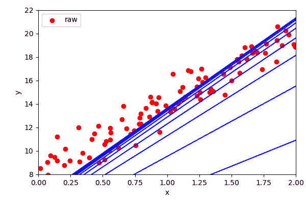
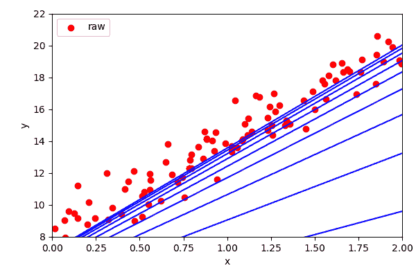

# 402:优化和梯度下降

> 原文：<https://winder.ai/402-optimisation-and-gradient-descent/>

## 最佳化

当讨论回归时，我们发现它们有封闭解。即可以直接求解的解。对于许多其他算法，没有可用的封闭解。

在这些情况下，我们需要使用一个*优化算法*。这些算法的目标是迭代地走向正确的结果。

* * *

### 梯度下降

给定一个成本函数，梯度下降算法计算最后一步的梯度，并向该梯度的方向移动。


*重要:步长，停止。*

？？？

一旦梯度接近零，我们就停下来。步长是一个重要的参数。太低了，用的时间太长。太高，它会超过最小值。

* * *

### 梯度下降的问题

线性回归的梯度产生单一的封闭解。

但一般来说，大多数数据科学算法都有许多最小值(例如，一个二次函数有两个解)。


* * *

### 梯度下降的实现

1.  计算成本函数的偏导数
2.  迭代更新权重值以沿斜坡向下遍历

？？？

我们需要计算成本函数的梯度。即我们需要计算单个参数的步长之间的差异。这就是所谓的偏导数:

$ $ \ frac { \ partial } { \ partial \ mathbf { w } _ j } MSE(\ mathbf { w })= \ frac { 2 } { m } \sum_{i=1}^{m} \left(\mathbf{w}^t \ cdot \mathbf{x}^{(i)}-\mathbf{y}^{(i)} \右)\mathbf{x}^{(i)}_j $$

我们可以用梯度向量一次性计算出这些参数，而不是单独计算它们的导数:

$ $ \ nabla _ { \ mathbf { w } } MSE(\ mathbf { w })= \frac{2}{m}\mathbf{x}^t \ cdot(\ mathbf { x } \ cdot \ mathbf { w }-\ mathbf { y })$ $

注意这是如何使用数据集中的每个元素的*。*

* * *

实施:



？？？

```
eta = 0.1 # learning rate
n_iterations = 1000 # number of iterations
m=100 # number of observations

w = np.random.randn(2,1) # random initialization of parameters
for iteration in range(n_iterations):
    gradients = 2/m * X_b.T.dot(X_b.dot(w) - y)
    w = w - eta * gradients 
```

* * *

### 随机梯度下降

标准梯度下降:

*   每次更新使用所有数据(RAM 有限)
*   陷入高原和局部最小值

随机梯度下降是一个有趣的名字:

*   以较小的批次(迷你批次)更新重量，通常一次一个观察值

*需要随机化数据*

？？？

所以标准梯度下降有几个问题:

*   一次使用所有数据，可能不适合内存
*   陷入局部最小值和高原

我们可以做的一件事是在一个循环中运行数据，而不是作为一个大的矩阵方程运行它。或者数据的子集，以获得矩阵数学库进行的一些优化(这被称为*迷你批次梯度下降*)。

但是结果将是我们将拟合数据的有序版本。所以每次我们要么需要随机化数据，要么简单地随机选取一个观察值。

尽管如此，它实际上非常有用，因为“抖动”导致它跳出局部最小值和平台。但这意味着它永远不会真正停留在最小值。我们可以通过降低学习速度来控制这一点。

```
Foreach iteration
    Foreach observation
        pick a random index
        calculate gradient for single observation
        reduce the step size slightly
        update w 
```

履行

```
n_iterations = 10
m=100 # number of observations
t0, t1 = 5, 50 # learning schedule hyperparameters

def learning_schedule(t):
    return t0/(t+t1)

w = np.random.randn(2,1) # random initialization
for iteration in range(n_iterations):
    for i in range(m):
        random_index = np.random.randint(m)
        xi = X_b[random_index:random_index+1]
        yi = y[random_index:random_index+1]
        gradients = 2 * xi.T.dot(xi.dot(w) - yi)
        eta = learning_schedule(epoch * m + i)
        w = w - eta * gradients 
```

这种类型的学习计划被称为*模拟退火*(来自冶金学，退火是金属慢慢冷却的过程)。

* * *



* * *