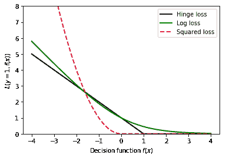
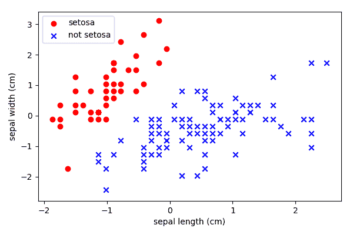
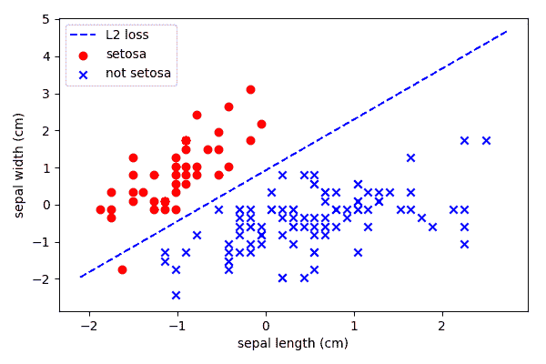
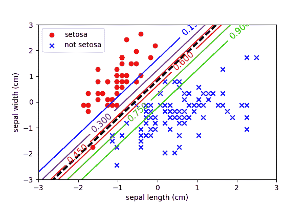
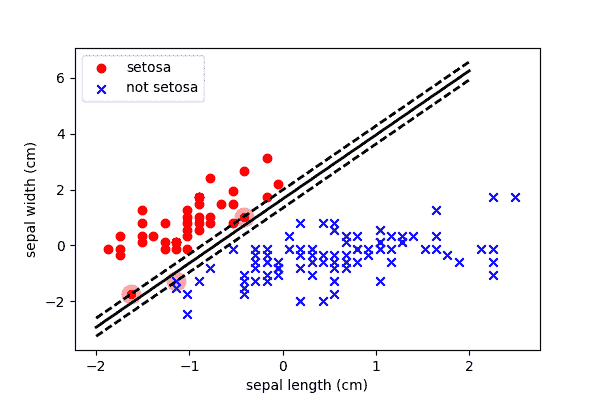
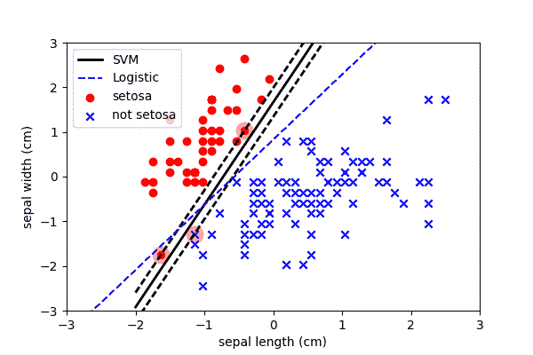

# 403:线性分类

> 原文：<https://winder.ai/403-linear-classification/>

## 通过模型分类

*   决策树创建了一维决策边界
*   我们可以很容易地想象使用线性模型来定义决策边界

？？？

以前，我们使用固定的决策边界来根据分段的信息量对数据进行分段。

决策边界代表分隔数据的一维规则。我们可以很容易地增加用于定义边界的参数的数量或复杂性。

不指定决策边界参数，我们可以允许通过一些理论模型或类似回归的过程来定义参数。

* * *

### 系统模型化

在极端情况下，我们可以使用任意函数来定义决策边界。

但是一些有趣的问题出现了:

*   边界的最佳位置是哪里？
*   我们所说的最优是什么意思？
*   从商业角度来看，我们如何证明边界的合理性？

？？？

许多类型的问题可以用这种方式定义，并且有一系列线性和非线性方法能够定义决策边界。

* * *

### 通过数学函数分类

考虑下图。这些数据有两个特征。

* * *

如果我们使用一维规则，就像在决策树中一样，我们最终会得到这样的决策边界:

* * *

### 线性函数

相反，我们可以创建一个决策边界，它是一个数学函数。像这样:

* * *

这种类型的决策边界被称为**线性分类器**，因为超平面是线性特征的加权组合。例如\(y = mx + c\)

更一般地，线性函数被定义为:

\ begin { align } f(\ mathbf { x })& = w _ 0+w _ 1x _ 1+w _ 2x _ 2+\ dots \ \
&= \ mathbf { w } ^t \ cdot \ mathbf { x } \ end { align }

这和线性回归是一样的！

* * *

然而，目标是不同的。目标是改变参数\(\mathbf{w}\)，以便正确地对数据中的所有类进行分类\(\mathbf{x}\)。

但是这回避了一个问题，决策边界的最佳位置是什么？

* * *

我们可以将决策边界放置在任意数量的位置:

哪个最好？这让我们想到了数据科学中最重要的问题之一，这个问题经常被忽视，但却是高级应用的关键&mldr;

* * *

### 损失函数

*   选择参数时的目标或目标是什么？

一般程序是定义一个目标，然后优化参数以实现该目标(尽可能做到最好)。

注意:前提与成本函数相同，但现在我们讨论的是分类类。

？？？

例如，我们可以选择目标函数来最佳地分离类，或者我们可能对尽可能远离一个类感兴趣(例如，为了避免误报)。

* * *

损失函数的选择通常很难定义，因此出现了一系列“标准”目标函数:

*   线性的
*   支持向量机
*   物流的

这三者都是数据科学的主力，只是目标不同。

* * *

类别:中心，中间

* * *

### 示例:花瓣/萼片

*Iris* 数据集是众多“标准”数据科学数据集之一。

？？？

这是一个数据集，测量鸢尾花的不同部分，并按物种进行标记。

两个物种的两个特征如下图所示。

* * *

### 线性分类

这将测量从边界到错误分类的距离之间的平方误差。

？？？

这将尝试拟合一条线，以最大程度地减少两个或更多类的平方误差。对于这些例子，我们将使用随机梯度下降。

* * *

我们可以看到这种分类存在一些问题。

*   由于一个类别的人数较多而出现偏差
*   对异常值敏感(假设高斯分布)
*   选择的目标是否符合业务需求？例如，这些错误分类代价高吗？

* * *

## 逻辑回归

*   经常使用逻辑回归，因为它也估计类别概率。

逻辑回归拟合两个类别之间的二项式分布。0.5 的概率被用作决策边界。

？？？

*逻辑回归*(又名 *logit 回归*)通常用于估计一个新观察值属于感兴趣类别的概率。例如，如果目标是减少欺诈造成的金钱损失，那么我们不仅需要知道欺诈的发生，还需要知道它发生的概率。

逻辑回归是一个线性模型，它不是直接输出期望值，而是输出这个结果的*逻辑*:

$ $ \ hat { p } = h _ w(\ mathbf { x })= \sigma(\mathbf{w}^t \ cdot \ mathbf { x })$ $

*逻辑*，(又名*逻辑*)是一个 *sigmoid 函数*，输出一个介于 0 和 1 之间的数字。

$ $ \ sigma(t)= \ frac { 1 } { 1+\ exp(-t)} $ $

一旦模型估计了类的概率\(\hat{p}\)，它就可以阈值为 0.5 来执行分类。

### 培养

假设二元分类，我们需要一个成本函数，当回归正确预测一个类时，它产生一个小值，当它出错时，它产生一个大值。通常，这用于:

$ $ c(w)= \ begin { cases }-\ log { \ left(\ hat { p } \ right)}，& \ text { if y = 1 } \ \
\ log { \ left(1-\ hat { p } \ right)}，&\ text { if y = 0 } \ \
\ end { cases } $ $

成本函数则是整个数据集的平均对数误差。这是一个常见的损失函数，因此有一个名字，即*对数损失*:

$ $ j(w)= \ frac { 1 } { m } \sum_{i=1}^{m}{ \left(y^{(i)} \ log { \ left(\hat{p}^{(i)} \右)}+(1-y^{(i)})\ log { \ left(1-\ hat { p } \ right)} $ $

不幸的是，没有封闭的解决方案，所以我们必须使用优化算法来找到解决方案。谢天谢地，虽然它是凸的，所以解决方案保证找到全局最小值。它看起来也非常类似于 MSE 的偏导数。

$ $ \ frac { \ partial } { \ partial \ mathbf { w } _ j(\ mathbf { w })= \ frac { 2 } { m } \sum_{i=1}^{m} \左(\西格玛\left(\mathbf{w}^t \ cdot \mathbf{x}^{(i)}-\mathbf{y}^{(i)} \右)\ \mathbf{x}^{(i)}_j $ $

* * *

这是逻辑回归的结果(也称为拟合二项式分布)。

* * *

## 支持向量机

支持向量机有一个恼人的模糊名字，但它们的性能令人印象深刻。

他们有一个目标:

*   最大化阶级之间的界限

* * *

它试图以最大可能的边距来分隔这些类:

？？？

首先，它使用硬边界进行分类。即任何高于阈值的都没有惩罚，任何低于阈值的都有递增的惩罚。

实现这一点的损失函数在正确分类时损失为 0，在错误分类时损失增加。这与量值损失(L1)非常相似，只是在 0 处存在分类不连续性。

问题是因为它是不连续的，所以它是不可微的。这意味着我们不能使用任何梯度下降法。相反，它求助于一种非常复杂的线性代数形式，称为*二次规划*。

* * *

它通过使用铰链损耗允许一些点进入边距(即，它继续惩罚边距内的元素)

* * *

我们可以看到，它定位了产生正确分类的阈值，但允许观察值进入边缘。

然而，请注意，由于左下方的异常值，它仍然使决策边界稍微高于(在我看来)它应该的值。这就是为什么许多人更喜欢逻辑回归

* * *

这最终是因为成本函数&mldr;

* * *

### 记住:损失函数

请记住，这三种算法之间的唯一区别是用于计算损失的函数。

* * *