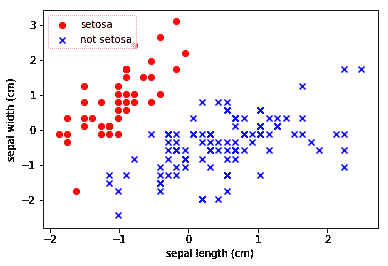
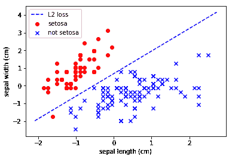

# 线性分类

> 原文：<https://winder.ai/linear-classification/>

# 线性分类

欢迎光临！本车间来自 [Winder.ai](https://Winder.ai/?utm_source=winderresearch&utm_medium=notebook&utm_campaign=workshop&utm_term=individual) 。注册以获得更多免费的研讨会、培训和视频。

我们了解到，我们可以使用[线性模型](https://winder.ai/401-linear-regression/)(可能还有[梯度下降](https://winder.ai/402-optimisation-and-gradient-descent/))来拟合一些数据的直线。为此，我们将预测和数据之间的均方误差(通常称为优化/损失/成本函数)降至最低。

也可以稍微改变优化函数，使其适合不同的类。这就是所谓的线性分类。

```
# Usual imports
import os
import pandas as pd
import matplotlib.pyplot as plt
import numpy as np
from IPython.display import display
from sklearn import datasets
from sklearn import preprocessing 
```

```
# import some data to play with
iris = datasets.load_iris()
feat = iris.feature_names
X = iris.data[:, :2]  # we only take the first two features. We could
                      # avoid this ugly slicing by using a two-dim dataset
y = iris.target
y[y != 0] = 1 # Only use two targets for now
colors = "bry"

# standardize
X = preprocessing.StandardScaler().fit_transform(X)

# plot data
plt.scatter(X[y == 0, 0], X[y == 0, 1],
            color='red', marker='o', label='setosa')
plt.scatter(X[y != 0, 0], X[y != 0, 1],
            color='blue', marker='x', label='not setosa')

plt.xlabel(feat[0])
plt.ylabel(feat[1])
plt.legend(loc='upper left')
plt.show() 
```



我们可以直观地看到，这两个类别之间有明确的界限。

我们的理论是，我们应该能够用一个简单的线性模型制作一个健壮的分类器。

让我们用来自`sklearn.linear_model.SGDClassifier` & mldr 的随机梯度下降算法的分类版本来做这件事；

```
from sklearn.linear_model import SGDClassifier
clf = SGDClassifier(loss="squared_loss", learning_rate="constant", eta0=0.01, max_iter=10, penalty=None).fit(X, y) 
```

```
plt.scatter(X[y == 0, 0], X[y == 0, 1],
            color='red', marker='o', label='setosa')
plt.scatter(X[y != 0, 0], X[y != 0, 1],
            color='blue', marker='x', label='not setosa')

# Plot the three one-against-all classifiers
xmin, xmax = plt.xlim()
ymin, ymax = plt.ylim()
coef = clf.coef_
intercept = clf.intercept_

def plot_hyperplane(c, color, label):
    def line(x0):
        return (-(x0 * coef[c, 0]) - intercept[c]) / coef[c, 1]

    plt.plot([xmin, xmax], [line(xmin), line(xmax)],
             ls="--", color=color, label=label)

plot_hyperplane(0, 'b', "L2 loss")

plt.xlabel(feat[0])
plt.ylabel(feat[1])
plt.legend(loc='upper left')
plt.show() 
```



不算太坏。

### 任务

*   尝试改变 eta 的值和迭代次数

这里我们不使用任何正则化，因为我们只有两个特征。当我们有多种功能时，这将更加重要。