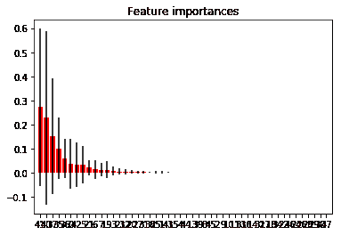
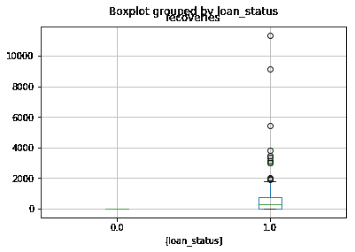
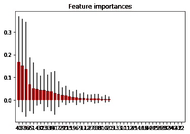

# 数据清理示例-贷款数据

> 原文：<https://winder.ai/data-cleaning-example-loan-data/>

# 数据清理示例-贷款数据

欢迎光临！本车间来自 [Winder.ai](https://Winder.ai/?utm_source=winderresearch&utm_medium=notebook&utm_campaign=workshop&utm_term=individual) 。注册以获得更多免费的研讨会、培训和视频。

大量时间花费在清理、删除和缩放数据上。所有这些都是为了从模型中挤出更多的性能。

我们使用的数据来自 Kaggle，可以从[这里](https://www.kaggle.com/wordsforthewise/lending-club)获得原始数据。如果你想下载全部数据，你需要登录 kaggle。我只包括了一个小样本。

这是一个贷款数据集，显示了遭遇还款问题的贷款。有很多列，很多都没用。更多的列缺少数据。

我设定的目标是试图预测哪些贷款会出现问题，但我们会看到，这将需要更多的时间来纠正。

```
import numpy as np
import pandas as pd
import matplotlib.pyplot as plt

# Load the data
data = pd.read_csv("https://s3.eu-west-2.amazonaws.com/assets.winderresearch.com/data/loan_small.csv") 
```

```
# These are the columns
data.columns 
```

```
Index(['id', 'member_id', 'loan_amnt', 'funded_amnt', 'funded_amnt_inv',
       'term', 'int_rate', 'installment', 'grade', 'sub_grade', 'emp_title',
       'emp_length', 'home_ownership', 'annual_inc', 'verification_status',
       'issue_d', 'loan_status', 'pymnt_plan', 'url', 'desc', 'purpose',
       'title', 'zip_code', 'addr_state', 'dti', 'delinq_2yrs',
       'earliest_cr_line', 'inq_last_6mths', 'mths_since_last_delinq',
       'mths_since_last_record', 'open_acc', 'pub_rec', 'revol_bal',
       'revol_util', 'total_acc', 'initial_list_status', 'out_prncp',
       'out_prncp_inv', 'total_pymnt', 'total_pymnt_inv', 'total_rec_prncp',
       'total_rec_int', 'total_rec_late_fee', 'recoveries',
       'collection_recovery_fee', 'last_pymnt_d', 'last_pymnt_amnt',
       'next_pymnt_d', 'last_credit_pull_d', 'collections_12_mths_ex_med',
       'mths_since_last_major_derog', 'policy_code', 'application_type',
       'annual_inc_joint', 'dti_joint', 'verification_status_joint',
       'acc_now_delinq', 'tot_coll_amt', 'tot_cur_bal', 'open_acc_6m',
       'open_il_6m', 'open_il_12m', 'open_il_24m', 'mths_since_rcnt_il',
       'total_bal_il', 'il_util', 'open_rv_12m', 'open_rv_24m', 'max_bal_bc',
       'all_util', 'total_rev_hi_lim', 'inq_fi', 'total_cu_tl',
       'inq_last_12m'],
      dtype='object') 
```

```
# There are some columns called "id". ID columns don't provide any predictive power
# so let's double check, then remove them.
display(data[["id", "member_id", "emp_title"]].head())
data.drop(['id', 'member_id'], axis=1, inplace=True) 
```

|  | 身份证明（identification） | 成员 id | 员工 _ 职位 |
| --- | --- | --- | --- |
| Zero | One million seventy-seven thousand five hundred and one | One million two hundred and ninety-six thousand five hundred and ninety-nine | 圆盘烤饼 |
| one | One million seventy-seven thousand four hundred and thirty | One million three hundred and fourteen thousand one hundred and sixty-seven | 赖德 |
| Two | One million seventy-seven thousand one hundred and seventy-five | One million three hundred and thirteen thousand five hundred and twenty-four | 圆盘烤饼 |
| three | One million seventy-six thousand eight hundred and sixty-three | One million two hundred and seventy-seven thousand one hundred and seventy-eight | 空气资源委员会 |
| four | One million seventy-five thousand three hundred and fifty-eight | One million three hundred and eleven thousand seven hundred and forty-eight | 大学医疗小组 |

让我们更深入地看看数据。

我看到这里有数字、分类和一些混乱的分类数据的组合。

让我们试着修复一些列作为例子。实际上，您必须做更多的工作来修复这些数据。

```
data.head() 
```

|  | 贷款金额 | 资助 _amnt | 资助 _amnt_inv | 学期 | 利息率 | 部分 | 等级 | 路基 | 员工 _ 职位 | 员工长度 | ... | 总计 _bal_il | il_util | 开 _rv_12m | open_rv_24m | 最大余额 | all_util | 总计 _ 收入 _ 高收入 | inq_fi(消歧义) | 总计 _ 铜 _ 铊 | inq_last_12m |
| --- | --- | --- | --- | --- | --- | --- | --- | --- | --- | --- | --- | --- | --- | --- | --- | --- | --- | --- | --- | --- | --- |
| Zero | Five thousand | Five thousand | Four thousand nine hundred and seventy-five | 36 个月 | Ten point six five | One hundred and sixty-two point eight seven | B | B2 | 圆盘烤饼 | 10 年以上 | ... | 圆盘烤饼 | 圆盘烤饼 | 圆盘烤饼 | 圆盘烤饼 | 圆盘烤饼 | 圆盘烤饼 | 圆盘烤饼 | 圆盘烤饼 | 圆盘烤饼 | 圆盘烤饼 |
| one | Two thousand five hundred | Two thousand five hundred | Two thousand five hundred | 60 个月 | Fifteen point two seven | Fifty-nine point eight three | C | 补体第四成份缺乏 | 赖德 | 不到 1 年 | ... | 圆盘烤饼 | 圆盘烤饼 | 圆盘烤饼 | 圆盘烤饼 | 圆盘烤饼 | 圆盘烤饼 | 圆盘烤饼 | 圆盘烤饼 | 圆盘烤饼 | 圆盘烤饼 |
| Two | Two thousand four hundred | Two thousand four hundred | Two thousand four hundred | 36 个月 | Fifteen point nine six | Eighty-four point three three | C | 溴化五烃季胺 | 圆盘烤饼 | 10 年以上 | ... | 圆盘烤饼 | 圆盘烤饼 | 圆盘烤饼 | 圆盘烤饼 | 圆盘烤饼 | 圆盘烤饼 | 圆盘烤饼 | 圆盘烤饼 | 圆盘烤饼 | 圆盘烤饼 |
| three | Ten thousand | Ten thousand | Ten thousand | 36 个月 | Thirteen point four nine | Three hundred and thirty-nine point three one | C | C1 | 空气资源委员会 | 10 年以上 | ... | 圆盘烤饼 | 圆盘烤饼 | 圆盘烤饼 | 圆盘烤饼 | 圆盘烤饼 | 圆盘烤饼 | 圆盘烤饼 | 圆盘烤饼 | 圆盘烤饼 | 圆盘烤饼 |
| four | Three thousand | Three thousand | Three thousand | 60 个月 | Twelve point six nine | Sixty-seven point seven nine | B | B5 | 大学医疗小组 | 1 年 | ... | 圆盘烤饼 | 圆盘烤饼 | 圆盘烤饼 | 圆盘烤饼 | 圆盘烤饼 | 圆盘烤饼 | 圆盘烤饼 | 圆盘烤饼 | 圆盘烤饼 | 圆盘烤饼 |

5 行× 72 列

```
display(set(data["emp_length"]))
data.replace('n/a', np.nan,inplace=True) 
```

```
{nan,
 '9 years',
 '3 years',
 '< 1 year',
 '1 year',
 '6 years',
 '5 years',
 '4 years',
 '7 years',
 '8 years',
 '10+ years',
 '2 years'} 
```

```
data.emp_length.fillna(value=0,inplace=True)
set(data["emp_length"]) 
```

```
{0,
 '9 years',
 '3 years',
 '< 1 year',
 '1 year',
 '6 years',
 '5 years',
 '4 years',
 '7 years',
 '8 years',
 '10+ years',
 '2 years'} 
```

```
data['emp_length'].replace(to_replace='[^0-9]+', value='', inplace=True, regex=True)
data['emp_length'] = data['emp_length'].astype(int)
set(data["emp_length"]) 
```

```
{0, 1, 2, 3, 4, 5, 6, 7, 8, 9, 10} 
```

我看到另一个领域叫做术语，可以简化为一个更好的标签

```
set(data['term']) 
```

```
{' 36 months', ' 60 months'} 
```

```
data['term'].replace(to_replace='[^0-9]+', value='', inplace=True, regex=True)
data['term'] = data['term'].astype(int)
set(data["term"]) 
```

```
{36, 60} 
```

现在让我们试着定义一下什么是不良贷款

```
set(data["loan_status"]) 
```

```
{'Charged Off', 'Current', 'Default', 'Fully Paid', 'Late (31-120 days)'} 
```

```
# This indicates a bad loan. Something we want to predict
bad_indicator = data["loan_status"].isin(["Charged Off", "Default", "Late (31-120 days)"])
# Remove this from dataset
data.drop(["loan_status"], axis=1, inplace=True)
bad_indicator.value_counts() 
```

```
False    820
True     179
Name: loan_status, dtype: int64 
```

注意未来的自己，我们这里有不平衡的阶级。这影响了一些算法。

```
# Find columns that have all nans and remove
naughty_cols = data.columns[data.isnull().sum() == len(data)]
data.drop(naughty_cols, axis=1, inplace=True) 
```

```
# Any more nans?
data.columns[data.isnull().any()].tolist() 
```

```
['emp_title',
 'desc',
 'mths_since_last_delinq',
 'mths_since_last_record',
 'last_pymnt_d',
 'next_pymnt_d'] 
```

```
# We could write some code to do this, but I'm going to do it manually for now
string_features = ["emp_title", "desc"]
data[string_features] = data[string_features].fillna(value='')
numeric_features = ["mths_since_last_delinq", "mths_since_last_record"]
data[numeric_features] = data[numeric_features].fillna(value=0) 
```

```
# Any more nans, just ditch them?
just_ditch = data.columns[data.isnull().any()].tolist()
just_ditch 
```

```
['last_pymnt_d', 'next_pymnt_d'] 
```

```
data.drop(just_ditch, axis=1, inplace=True) 
```

通常情况下，我们会继续改进功能，直到我们很高兴我们不能做更多的事情。

当您这样做时，请记住，您必须对任何新的传入数据重复相同的步骤。所以记得把前期处理做的干净漂亮。

现在，让我们试着将所有这些字符串值转换成树算法的数字类别&mldr;

```
from sklearn import preprocessing

selected = pd.DataFrame(data)

X = selected.apply(preprocessing.LabelEncoder().fit_transform)
X.head() 
```

|  | 贷款金额 | 资助 _amnt | 资助 _amnt_inv | 学期 | 利息率 | 部分 | 等级 | 路基 | 员工 _ 职位 | 员工长度 | ... | total_rec_int | total_rec_late_fee | 追回款 | 收款 _ 回收 _ 费用 | last_pymnt_amnt | 最后一笔贷款 | 收藏 _ 12 _ 月 _ 月 _ 日 _ 医学 | 策略代码 | 应用程序类型 | acc _ now _ delinq |
| --- | --- | --- | --- | --- | --- | --- | --- | --- | --- | --- | --- | --- | --- | --- | --- | --- | --- | --- | --- | --- | --- |
| Zero | Thirty-two | Thirty-two | Thirty-two | Zero | six | One hundred and nineteen | one | six | Zero | Ten | ... | Two hundred and nine | Zero | Zero | Zero | One hundred and twenty-eight | Nineteen | Zero | Zero | Zero | Zero |
| one | Twelve | Twelve | Twelve | one | Thirteen | nine | Two | Thirteen | Five hundred and eighty-two | one | ... | Seventy-one | Zero | Twenty-seven | four | Seventy-nine | forty-four | Zero | Zero | Zero | Zero |
| Two | Ten | Ten | Ten | Zero | Fourteen | Twenty-eight | Two | Fourteen | Zero | Ten | ... | One hundred and thirty-two | Zero | Zero | Zero | Five hundred and twenty-five | Nineteen | Zero | Zero | Zero | Zero |
| three | Ninety-two | Ninety-nine | One hundred and eleven | Zero | Ten | Three hundred and sixty-one | Two | Ten | Twelve | Ten | ... | Five hundred and eighty-eight | Thirteen | Zero | Zero | Three hundred and twenty-three | Eighteen | Zero | Zero | Zero | Zero |
| four | Fourteen | Fourteen | Fourteen | one | nine | Thirteen | one | nine | Seven hundred and forty-four | one | ... | Two hundred and seventy-one | Zero | Zero | Zero | forty-four | Nineteen | Zero | Zero | Zero | Zero |

5 行× 48 列

只是为了开心，让我们安装一个树分类器，并查看准确性和特征重要性。

这可能会让我们了解哪些特性是重要的，以及基线性能。

```
from sklearn.ensemble import RandomForestClassifier

clf = RandomForestClassifier(max_depth=3)
clf = clf.fit(X, bad_indicator) 
```

```
from sklearn.model_selection import cross_val_score
scores = cross_val_score(clf, X, bad_indicator, cv=5, scoring='accuracy')
print("Accuracy: %0.2f (+/- %0.2f)" % (scores.mean(), scores.std())) 
```

```
Accuracy: 0.95 (+/- 0.02) 
```

啊哦！看看这个准确率有多高！

这应该敲响警钟。

要么是问题超级简单(你可以从情节中看出简单)，要么是某些事情不对劲。

让我们来看看重要性

```
importances = clf.feature_importances_
std = np.std([tree.feature_importances_ for tree in clf.estimators_],
             axis=0)
indices = np.argsort(importances)[::-1]

# Print the feature ranking
print("Feature ranking:")

names = X.columns

for f in range(X.shape[1]):
    print("%d. %s (%f)" % (f + 1, names[indices[f]], importances[indices[f]]))

# Plot the feature importances of the forest
plt.figure()
plt.title("Feature importances")
plt.bar(range(X.shape[1]), importances[indices],
       color="r", yerr=std[indices], align="center")
plt.xticks(range(X.shape[1]), indices)
plt.xlim([-1, X.shape[1]])
plt.show() 
```

```
Feature ranking:
1\. collection_recovery_fee (0.271639)
2\. recoveries (0.227616)
3\. total_rec_prncp (0.151820)
4\. total_pymnt (0.100977)
5\. total_pymnt_inv (0.059508)
6\. loan_amnt (0.037773)
7\. last_pymnt_amnt (0.033616)
8\. installment (0.033328)
9\. dti (0.020536)
10\. grade (0.012934)
11\. sub_grade (0.012478)
12\. zip_code (0.011637)
13\. term (0.006332)
14\. earliest_cr_line (0.004536)
15\. verification_status (0.003681)
16\. addr_state (0.002456)
17\. open_acc (0.001890)
18\. total_acc (0.001872)
19\. total_rec_int (0.001653)
20\. mths_since_last_delinq (0.001494)
21\. funded_amnt (0.001456)
22\. last_credit_pull_d (0.000511)
23\. url (0.000258)
24\. int_rate (0.000000)
25\. collections_12_mths_ex_med (0.000000)
26\. issue_d (0.000000)
27\. total_rec_late_fee (0.000000)
28\. emp_title (0.000000)
29\. policy_code (0.000000)
30\. funded_amnt_inv (0.000000)
31\. emp_length (0.000000)
32\. home_ownership (0.000000)
33\. annual_inc (0.000000)
34\. out_prncp (0.000000)
35\. desc (0.000000)
36\. pymnt_plan (0.000000)
37\. initial_list_status (0.000000)
38\. purpose (0.000000)
39\. title (0.000000)
40\. out_prncp_inv (0.000000)
41\. delinq_2yrs (0.000000)
42\. application_type (0.000000)
43\. inq_last_6mths (0.000000)
44\. mths_since_last_record (0.000000)
45\. pub_rec (0.000000)
46\. revol_bal (0.000000)
47\. revol_util (0.000000)
48\. acc_now_delinq (0.000000) 
```



啊啊啊。看看最上面的两个特性:

1.  收款 _ 回收 _ 费用(0.254455)
2.  回收率(0.219021)

收到的回收费用和回收次数。这些与贷款违约直接相关；你只会得到一个恢复，如果有贷款违约。

显然，除非违约已经发生，否则我们不会有这些功能，在这种情况下，试图预测它肯定没有意义！

这是*数据泄露*的绝佳例子。这是你使用当时不可能获得的数据的地方，通常是因为它是你试图预测的事件的直接结果。

只是为了更多的笑声，让我们绘制一个*箱线图*的回收数据&mldr；

```
loan_amount = pd.DataFrame([selected["recoveries"], bad_indicator]).transpose()
loan_amount.boxplot(by="loan_status")
plt.show() 
```



这是按贷款状态绘制的回收数据。请注意，所有“正常”贷款的回收率都为零。

如果这真的是一个特征，我们可以将阈值设在 0 以上，并说它是“受苦”。

因此，我们获得了 95%的准确率！

然而，这就引出了一个问题，如果这很容易，为什么我们得到了 95%而不是 100%?！？！

让我们移除这些功能，然后再试一次&mldr;

```
X.drop(["collection_recovery_fee", "recoveries"], axis=1, inplace=True) 
```

```
clf = RandomForestClassifier(max_depth=3)
clf = clf.fit(X, bad_indicator)
scores = cross_val_score(clf, X, bad_indicator, cv=5, scoring='accuracy')
print("Accuracy: %0.2f (+/- %0.2f)" % (scores.mean(), scores.std())) 
```

```
Accuracy: 0.89 (+/- 0.01) 
```

好了，这开始看起来更可行了

```
importances = clf.feature_importances_
std = np.std([tree.feature_importances_ for tree in clf.estimators_],
             axis=0)
indices = np.argsort(importances)[::-1]

# Print the feature ranking
print("Feature ranking:")

names = X.columns

for f in range(X.shape[1]):
    print("%d. %s (%f)" % (f + 1, names[indices[f]], importances[indices[f]]))

# Plot the feature importances of the forest
plt.figure()
plt.title("Feature importances")
plt.bar(range(X.shape[1]), importances[indices],
       color="r", yerr=std[indices], align="center")
plt.xticks(range(X.shape[1]), indices)
plt.xlim([-1, X.shape[1]])
# plt.savefig('../img/feature_importances.svg', transparent=True, bbox_inches='tight', pad_inches=0)
plt.show() 
```

```
Feature ranking:
1\. last_pymnt_amnt (0.168353)
2\. total_rec_prncp (0.151796)
3\. total_pymnt_inv (0.135874)
4\. total_pymnt (0.069144)
5\. funded_amnt (0.052595)
6\. int_rate (0.049567)
7\. revol_util (0.045033)
8\. earliest_cr_line (0.044411)
9\. out_prncp (0.039759)
10\. total_rec_late_fee (0.037326)
11\. last_credit_pull_d (0.032130)
12\. sub_grade (0.026536)
13\. revol_bal (0.021711)
14\. dti (0.020970)
15\. url (0.016244)
16\. zip_code (0.013791)
17\. grade (0.011085)
18\. emp_length (0.009951)
19\. purpose (0.008554)
20\. verification_status (0.008065)
21\. open_acc (0.007716)
22\. emp_title (0.007045)
23\. total_rec_int (0.006613)
24\. total_acc (0.005885)
25\. loan_amnt (0.005698)
26\. addr_state (0.004147)
27\. installment (0.000000)
28\. issue_d (0.000000)
29\. term (0.000000)
30\. home_ownership (0.000000)
31\. annual_inc (0.000000)
32\. funded_amnt_inv (0.000000)
33\. acc_now_delinq (0.000000)
34\. pymnt_plan (0.000000)
35\. desc (0.000000)
36\. title (0.000000)
37\. application_type (0.000000)
38\. inq_last_6mths (0.000000)
39\. mths_since_last_delinq (0.000000)
40\. mths_since_last_record (0.000000)
41\. pub_rec (0.000000)
42\. initial_list_status (0.000000)
43\. out_prncp_inv (0.000000)
44\. collections_12_mths_ex_med (0.000000)
45\. policy_code (0.000000)
46\. delinq_2yrs (0.000000) 
```



现在最好的功能是:

1.  total_rec_prncp (0.232828)
2.  last_pymnt_amnt (0.145886)
3.  total_pymnt_inv (0.140592)
4.  total_pymnt (0.129989)

因此，这似乎与还清了多少钱和债务有某种关联。

我们应该更多地研究这些相关性。

因此，我们现在要做的是砍掉除了前 10 个之外的所有数据，看看我们是否可以改进这些数据(通过缩放、编码、缺失数据输入等等)。)

我们还会考虑混合特征，例如偿还贷款的比例等。