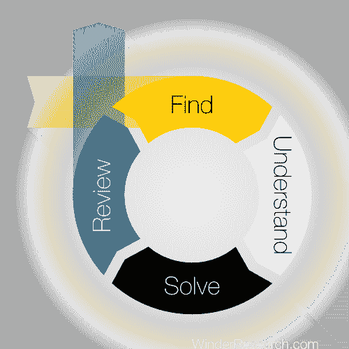
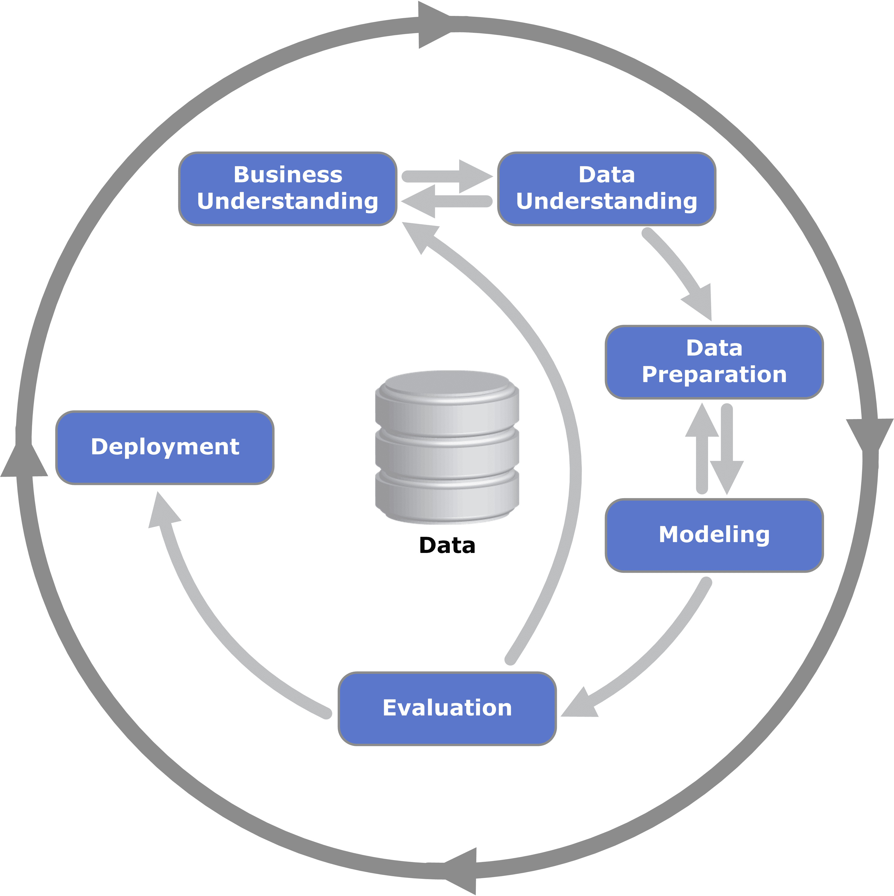

# 102:如何做一个数据科学项目

> 原文：<https://winder.ai/102-how-to-do-a-data-science-project/>

## 数据科学中的问题

*   理解问题

*   “五个为什么”

*   不同的问题会极大地影响用来解决问题的工具和技术。

* * *

## 作为过程的数据科学

*   科学多于工程

* * *

*   高危
*   高额报酬
*   困难的
*   不可预知的

* * *

作者肯尼斯·詹森 [CC BY-SA 3.0](http://creativecommons.org/licenses/by-sa/3.0) ，通过维基共享

* * *

## 数据科学的影响

*   项目的目的是什么？谁受到影响？

*   业务的哪些部分受到影响？我们需要帮助吗？

*   你必须考虑人类的关切。

*   你需要企业的认同；生意会受到影响。

* * *

## 结论

商业目标:赚钱、省钱或节省时间。数据科学产生利润。

项目合理性——您现在知道如何对它们进行评判了:

*   与业务目标保持一致
*   定义明确、可测试的需求
*   稳健的计划
    *   数据理解
    *   数据准备
    *   系统模型化
    *   估价
    *   部署
    *   上述内容的重复
*   买入并与业务的其他部分整合

然而，承担一个项目也有更多慈善的、科学的原因。因此，这些论点可能不会直接适用于慈善事业或学术界。