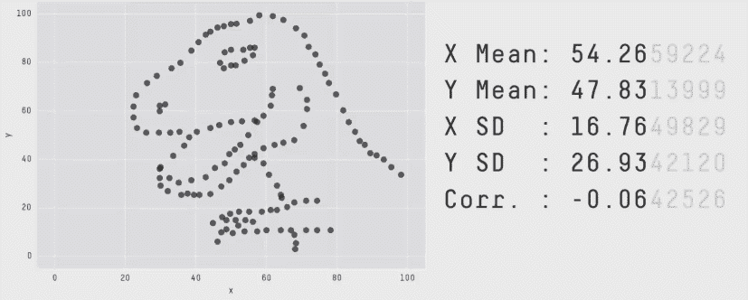
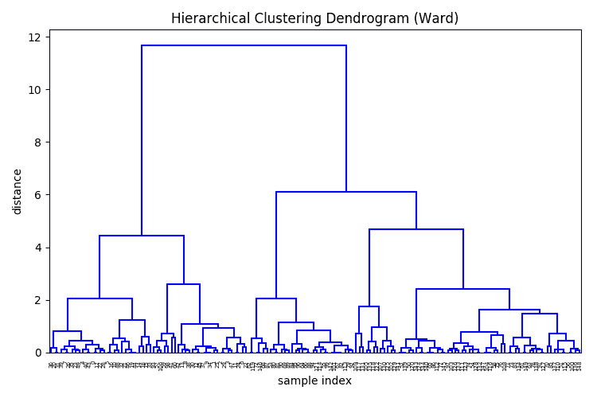

# 302:如何设计特征

> 原文：<https://winder.ai/302-how-to-engineer-features/>

## 工程特征

你想这么做是因为:

*   在不丢失信息的情况下减少特征数量
*   比原来的功能更好
*   让数据更适合训练

？？？

数据争论挑战的另一部分是从现有功能中创造更好的功能。

* * *

### 特定于分布/模型的重新缩放

大多数模型期望正态分布的数据。如果可以的话，把数据转换成正常的。

*   从直方图推断分布(并通过拟合分布来确认)

*   应用逆变换来重新标准化

遵循这些分布的一些示例数据类型:

*   自然日志:在互联网论坛上发表的评论的长度
*   自然日志:修复可维护系统的时间
*   权力法则:暴力的严重性
*   幂定律:CPU 的高速缓存大小和高速缓存未命中次数之间的关系

？？？

我们前面提到过，但是您可以将数据直接转换成正态分布的数据。

在物理问题中非常常见的是，在底层过程受幂律影响的情况下(例如，y 中的指数增长代表 x 中的线性增长)，需要对数标度。

你可能会问“我怎么会知道呢！?"。这就是领域知识发挥作用的地方。但通常这些东西在绘制直方图时最为明显。

其他类型的缩放包括:平方、平方根、自然对数。

遵循这些分布的一些示例数据类型:

*   自然日志:在互联网论坛上发表的评论的长度
*   自然日志:修复可维护系统的时间
*   权力法则:暴力的严重性
*   幂定律:CPU 的高速缓存大小和高速缓存未命中次数之间的关系

* * *

受幂律影响的数据(指数分布):


受自然对数影响的数据(对数正态分布):


* * *

### 组合功能

*   许多领域已经编码了重要的特征组合:
    *   速度、体重指数、市盈率、每秒查询次数等。

寻找新的组合是有利可图的。

？？？

重新缩放已成为数据科学中的标准预处理技术。但是特征组合不太普遍；大概是因为它需要一些领域知识。

但这与世界其他地方不一致，因为在日常生活中有许多许多组合特征的例子:速度、身体质量指数、市盈率、每秒查询次数等。

对于领域专家来说，许多这些类型的特性可能是已知的。然而，寻找新的组合或转换是有利可图的。

* * *

#### 组合类型

*   乘法或除法(比率)
*   随时间变化，或变化率
*   基线相减
*   标准化:将一个变量相对于另一个变量标准化。例如，失败的次数本身可能没有多大用处。然而，以百分比表示的失败率可能非常有用。(即失败次数/请求总数)

？？？

组合功能的方式有很多种，但以下是最常见的几种:

当创建新的变量时，请始终牢记目标。创建新功能的目的是提供新信息，使目标更容易实现。

* * *

#### 示例:多项式特征

`sklearn`为我们提供了一种简单的特征生成方法，叫做`PolynomialFeatures`。

这就产生了每个特征的高阶相互作用项。例如，数据集:

$$ \mathbf{X} = \left[X_a，X_b\right] $$

变成了:

$$ \mathbf{X_p} = \left[X_a，X_b，x _ a \乘以 X_b，X_a^2，X_b^2，\dots \right] $$

？？？

```
>>> import numpy as np
>>> from sklearn.preprocessing import PolynomialFeatures
>>> X = np.arange(6).reshape(3, 2)
>>> X
array([[0, 1],
       [2, 3],
       [4, 5]])
>>> poly = PolynomialFeatures(2)
>>> poly.fit_transform(X)
array([[  1.,   0.,   1.,   0.,   0.,   1.],
       [  1.,   2.,   3.,   4.,   6.,   9.],
       [  1.,   4.,   5.,  16.,  20.,  25.]]) 
```

* * *

## 特征选择

**提示:尽量减少特征数量**

但是我们如何选择使用哪些特性呢？

？？？

生成大量特征的问题是这会增加*过度拟合*的变化(我们将在下一节讨论)。为了减轻这种情况，我们希望减少功能的数量。

假设我们还不是领域专家(或者即使我们是)，我们如何决定将哪些特征包含在我们的训练数据集中？

给定我们的目标，我们如何判断哪些特性是最重要的？

在上一节中，我们看到了一种基于信息增益对数据进行分区的技术。我们将很快再次看到这一点

* * *

### 相互关系

数据集中的相关要素不良。

*   算法认为重复的信息代表重要性
*   关联要素不会添加更多信息

？？？

概述:相关性是两个数量之间的统计相关性的度量。即，如果一个特征改变，另一个特征是否在锁定步骤中改变？

最坏的情况是，这个特性没有增加更多的信息。我们可以单独从一个特征获得相同数量的信息。

实际上，由于我们在缩放部分看到的优化问题，关联特性往往会降低性能。优化功能将花费精力来优化这些冗余变量。

在最好的情况下，只是需要更长的时间才能达到相同的结果(这只适用于“稀疏”优化器——那些惩罚大量特性的优化器)。

在最坏的情况下，由于额外的特征，模型将开始过度拟合(即，因为你有两个特征说同样的事情，这一定非常重要！)

* * *

这是不同 2D 数据集的*皮尔逊相关系数*的曲线图。系数接近 1 或-1 的数据集高度相关，会影响模型的性能。


* * *

当特征相互关联时，它们被称为*共线*。即它们彼此线性相关。

当比较所有特征之间的共线性时(即第一个与第二个，第一个与第三个，等等)。)这被称为测试*多重共线性*。

*   简单:将数据可视化
*   自动:检查相关矩阵的*特征值*。

？？？

### 特征向量分析

我们的目标是挑选不相关的特征。(记住这里的 2D 情节)。

因此，如果我们寻找非常低的特征值，这将准确地告诉我们哪些特征具有高度相关的特征。

一旦我们知道哪些特征是相关的，我们就可以查看该特征值的特征向量，以显示它与哪些特征相关！

这有点复杂，所以我们来看一个具体的例子&mldr;

#### 示例:关联特征

```
X = np.random.randn(100,5)
noise = np.random.randn(100)
X[:,0] = 2*X[:,2] + 3*X[:, 4] + 0.5*noise 
```


让我们计算相关性，然后计算这个相关性矩阵的特征值:

```
corr = np.corrcoef(X, rowvar=0)
w, v = np.linalg.eig(corr)
print('Eigenvalues of features in X')
print(w)

Eigenvalues of features in X
[ 2.13215129  0.00826567  1.20093744  0.97602299  0.68262261] 
```

这里，我们有一个低值特征值。也就是说，在一个特征组合中，几乎没有变化(即几乎没有信息)。

注意，特征值的顺序没有保证；它不代表一个特征。

现在，让我们来看看特征值&mldr;的特征向量

```
print('Eigenvector for eigenvalue 1')
print(v[:, 1])

Eigenvector for eigenvalue 1
[ 0.72545976 -0.00837951 -0.37350552  0.00075081 -0.57804064] 
```

这个数组表明，在第 0、第 2 和第 4 个特征中，我们几乎没有变化的方向。(记住特征向量是在一个方向上倾斜数据的轴)。

因此，我们需要删除其中一个(或多个)功能。

(可能是第一个，因为它似乎与其他两个最相关)&mldr;

```
corr = np.corrcoef(X[:,1:], rowvar=0)
w, v = np.linalg.eig(corr)
print('Eigenvalues of features in X')
print(w)

Eigenvalues of features in X
[ 0.68138777  0.92924905  1.25915791  1.13020527] 
```

没有更多的相关功能！

* * *

#### 示例:关联特征

```
X = np.random.randn(100,5)
noise = np.random.randn(100)
X[:,0] = 2*X[:,2] + 3*X[:, 4] + 0.5*noise 
```


* * *

类别:中心，中间



> *[相同的统计量，不同的图形:通过模拟退火](https://www.autodeskresearch.com/publications/samestats) - [贾斯汀·马特伊卡](https://www.autodeskresearch.com/people/justin-matejka)，[乔治·菲兹莫里斯](https://www.autodeskresearch.com/people/george-fitzmaurice)* 生成外观各异、统计量相同的数据集

* * *

### 特征重要性

推断重要性的两种一般方法:

*   强力:使用不同的特性组合来测试你的模型性能
*   从另一种类型的分数推断重要性

？？？

在我们移除了相关特征之后，我们就可以定义最具信息性的特征了。

然而，我们如何判断哪些特性是最重要的呢？

一种方法是使用单个特征来生成分数。生成最高分数的特征可以说是最有*信息量的*。

`sklearn`有一个使用树的专用方法&mldr；

#### 树的特征重要性

我们刚刚谈到了一种分类/回归算法，决策树。

我们看到树试图通过增加类的纯度来分割数据。

请记住，树凝聚地构建了它们的分段树。即树中的最高层做出最广泛的决策。我们可以说树的最高层是最能提供信息的。



#### 示例:随机森林的特征重要性

最后，我们不能依赖一个决策树。决策树倾向于过度拟合数据。我们能做的是创建大量的树，并将数据随机放入每棵树。这给了我们一些关于特征重要性稳定性的统计估计。

让我们在一些合成数据上尝试一下&mldr;

```
# Build a classification task using 3 informative features
X, y = make_classification(n_samples=1000,
                           n_features=10,
                           ...

# Build a forest and compute the feature importances
forest = ExtraTreesClassifier(n_estimators=250,
                              random_state=0)

forest.fit(X, y)
importances = forest.feature_importances_
std = np.std([tree.feature_importances_ for tree in forest.estimators_],
             axis=0)
indices = np.argsort(importances)[::-1]

# Print the feature ranking
print("Feature ranking:")

for f in range(X.shape[1]):
    print("%d. feature %d (%f)" % (f + 1, indices[f], importances[indices[f]]))

# Plot the feature importances of the forest
... 
```

```
 Feature ranking:
1. feature 1 (0.295902)
2. feature 2 (0.208351)
3. feature 0 (0.177632)
4. feature 3 (0.047121)
5. feature 6 (0.046303)
6. feature 8 (0.046013)
7. feature 7 (0.045575)
8. feature 4 (0.044614)
9. feature 9 (0.044577)
10. feature 5 (0.043912) 
```

* * *


注意，信息增益并不代表每个特征有多“重要”。

我们用简单的规则就能很好地划分等级。

？？？

y 轴可以解释为数据集中分类的重要性比例。

它不代表特征“解释数据”的程度。分数仅仅是单独使用该特征时分类数量的比率。

一个警告与树优化的实现有关。树算法选择下一个最佳特征来分割数据。这意味着，如果存在相关特征，则只使用一个特征来分割数据，因为一旦分割，相同的相关特征将不会产生任何更纯的类。

结果是，在相关的特征中，只有一个将被显示为重要的。其他的将被列为不重要，因为它们没有被使用。

另一个值得一提的警告是树算法中使用的分数的选择。因为我们的目标是推广更多的信息特性，所以我们应该选择一个基于信息量的分数；即`entropy`。

然而，如果目标是产生更好的分离类，那么考虑使用`gini`度量。

* * *

### 顺序特征选择

1.  在测量性能的同时迭代地添加或删除特性。

2.  删除不会提高性能的功能

优点:

*   与您选择的绩效指标相关

缺点:

*   计算成本高

？？？

选择要素的一种类似方法是从数据集中反复添加或移除要素，然后重新计算得分。

例如，如果我们有一个包含三个特征的虹膜数据集，我们将从测试每个特征作为一个分类器开始。我们会选择最佳评分特征，并将其作为我们的“单一特征”评分。

接下来，我们将使用第一个特性，并从剩余的两个特性中连接第二个特性。同样，最佳组合将被保存为最佳“双特征”得分。

诸如此类。

然后，我们可以选择删除不会显著增加分数的特征。

这个算法不难编码，但是在`sklearn`中不可用。

实现这个的下一个最佳推荐库是`mlxtend`库:[https://github.com/rasbt/mlxtend](https://github.com/rasbt/mlxtend)。它也有一些方便的绘图功能。

* * *

### 通过正则化的稀疏模型

*   一些模型可以自动惩罚特征
*   他们通过将特征权重设置为零来实现这一点
*   健壮，因为它在模型的上下文中

*仍然手动移除特征。它提高了理解和计算效率。*

？？？

我想提到的最后一件事是学习算法中的稀疏正则化。

一些算法实现了*正则化*，这是惩罚模型中大量特征使用的行为。

这是一种非常健壮的移除无信息特征的方法，因为它们是在模型的上下文中移除的。

例如，由决策树(一种简单的线性阈值算法)选择的特征可能不会为高度复杂的非线性深度学习算法选择最佳特征，该算法能够进行不同寻常的特征组合。

然而，以我的经验来看，完全为了减少拥有大量特征的计算量，尝试删除非常无用和相关的特征是值得的。

如果你能把它降低到二维或三维，那么这也有助于绘图。

## 获取数据

我要讲的是如何获取数据。但事实是，这完全取决于你工作的领域。

互联网上有大量免费的测试数据集和虚拟数据集，你可以从 twitter 等网站获取流数据。

但现实是，这完全取决于你的问题。

根据我的经验，最有价值的数据是专有的，并且是特定于业务的。这些类型的数据往往会产生最有价值的结果。

其他的，搜索一下。

* * *