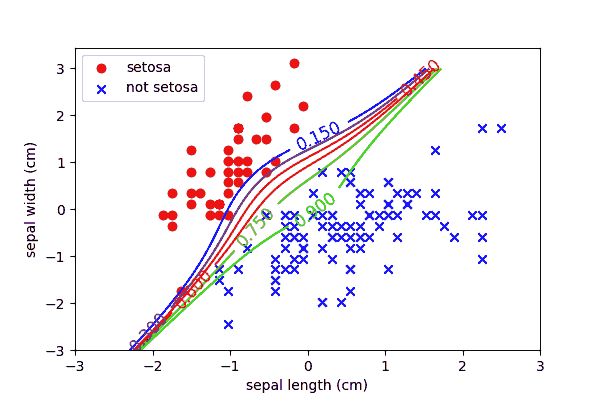
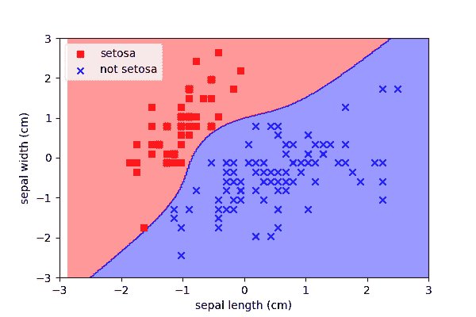
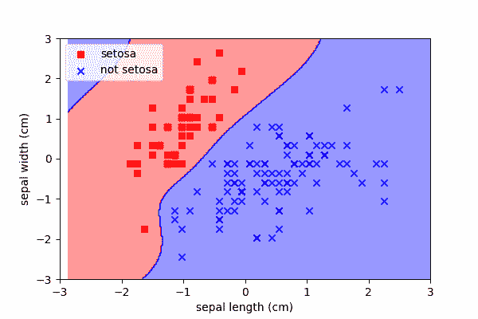
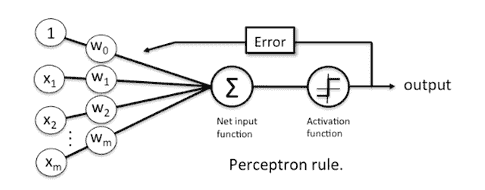

# 404:非线性、线性分类

> 原文：<https://winder.ai/404-nonlinear-linear-classification/>

## 非线性函数

*   有时，数据无法通过简单的阈值或线性边界来分隔。

我们也可以使用非线性函数作为决策边界。

？？？

为了表示更复杂的数据，我们可以引入非线性。在此之前，请记住:

*   特征之间更复杂的相互作用产生了过度拟合数据的解决方案；为了弥补，我们需要更多的数据。
*   更复杂的解决方案需要更多的计算能力
*   反吻

增加非线性的最简单方法是增加原始特征的各种排列。例如，一些特征平方。

* * *

### 非线性逻辑回归的多项式特征

1.  创建新的特征，原始数据的多项式
2.  使用所有新功能执行逻辑回归

仍然是线性分类器，我们只是使用了更复杂的特征。

？？？

这是一个具有 3 次多项式展开的逻辑分类器。比如之前我们只有两个特征，\(x_1\)和\(x_2\)。现在我们有九个:

$ $ x _ 1+x _ 2+x _ 1 x _ 2+x_1^2+x_2^2+x_1^2 x _ 2+x _ 1 x_2^2+x^3+x^3 $ $

美妙的是，这仍然是一个线性问题，因此速度快，并保证优化。

* * *

* * *

### 非线性支持向量机

使用支持向量机可以实现类似的多项式技巧:

* * *

### 内核技巧

简而言之，最后一个需要注意的策略叫做*内核技巧*。本质上，这在数据上卷积了一个核(任何形状的)。这是一个数据转换。我们将数据从一个域映射到另一个域。

* * *

### 线性分类示意图

有时将算法可视化为示意图或图表会更容易。

对于每个线性分类器，我们改变了激活函数。

要点:这实际上是一个感知器的图像，感知器是神经网络中的基本单元。

所有的深度学习都基于大量的线性分类器！！！

？？？

### 神经网络

非线性分类器的最终发展导致了堆叠的神经网络。

神经元是相当简单的非线性分类器。它们基于一系列*激活函数*，这些函数本质上是单个特征组合的成本函数。

功能非常熟悉，类似逻辑、类似铰链和类似一零的激活等价物。

但真正的优势是神经元可以以任何数量的形式堆叠，以提供令人难以置信的非线性功能。

非线性函数，在许多特定领域(例如图像分类)接近人脑的能力。

这是一个非常热门的话题，但是令人困惑。我们在第三次研讨会(高级)中深入研究神经网络。

* * *