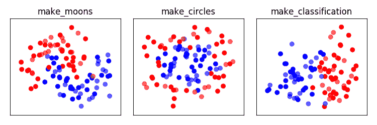
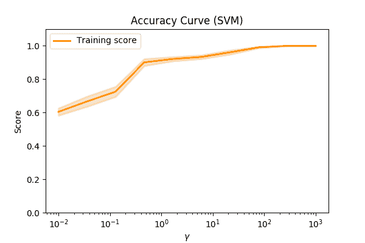
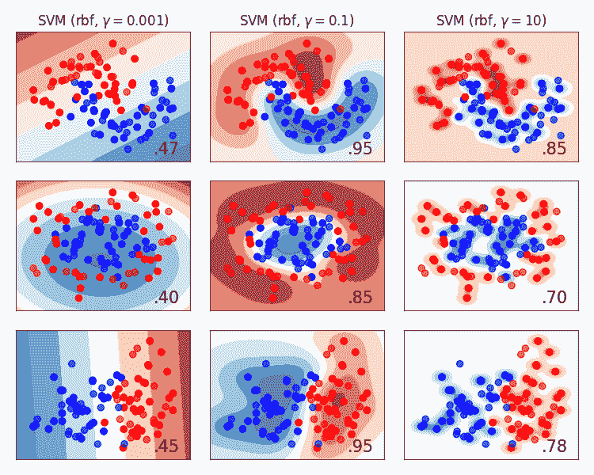

# 501:过拟合和欠拟合

> 原文：<https://winder.ai/501-over-and-underfitting/>

## 一般化和过度拟合

> *“足够上吊的绳子”*

*   我们可以创建具有任意形状的决策边界的分类器。

很容易*过拟合*数据。

这部分是关于什么是*过度拟合*以及为什么它不好。

？？？

一般来说，我们可以创建对应于任何形状的分类器。我们有如此大的灵活性，以至于我们可能会以*过度拟合*数据而告终。

在这种情况下，随机数据，即噪声数据，被视为模型的有效部分。

事实上，我们对能够概括的模型感兴趣；能够对迄今尚未观察到的观察结果进行分类的模型。

* * *

## 归纳

给定一些数据，想一个简单的方法来准确地分类这些数据？

*   建立一个查找表

查找表不能推广到新的例子。

**提示:小心 100%**

？？？

想象一下，我们有一个客户的历史数据集，这些客户点击或不点击一系列基于图像的广告。一位广告客户问我们能否预测客户是否会点击广告。

*   我们离开并报告我们有 100%的准确性。
*   我们告诉他们，我们已经为每个广告的每个用户创建了一个查找表。
*   我们已经成功地对用户是否会点击广告的所有情况进行了分类。

显然这是一个荒谬的例子；我们不能说它预测了什么。

这就是为什么我们需要*概括*我们的模型，以应对新的数据。

* * *

## 过度拟合

*   复杂模型产生查找表

*过度拟合*这个词是用来描述模型过于复杂的时候。

例如，决策树可以为每个观察创建决策规则。

**要点:数据科学就是妥协**

？？？

尽管前面的例子是这样设计的，但是每个 ML 算法都有过拟合的能力。

例如，决策树可以非常容易地创建分割每一个数据的决策规则。

这种情况比你想象的要频繁得多。

最根本的问题是大多数现实生活中的数据是复杂的。我们需要复杂的模型来应对复杂性。

因此，在我们能多好地模拟这个问题和我们过度拟合之间有一个权衡。

* * *

## 为什么过度拟合不好？

*   噪音

你不希望你的决策边界拥抱观察，因为它们可能是嘈杂的。

？？？

所有数据本质上都有噪声。即使是最简单的实验也含有噪音。

具有更多要素的数据具有复合噪声源。

对于更复杂的数据，噪声不按照随机过程分布是很常见的。例如，一些数据丢失或无效。

最好的情况是，我们最终根据噪声而不是感兴趣的信号来训练我们的模型。

最糟糕的是，我们可能最终使用虚假的、事实上不正确的数据来创建我们的模型。

任何到达这些界限内的新观测值都将被错误地分类。

* * *

## 欠拟合

*欠拟合*是缺乏模型复杂度。

这通常发生在有大量固有特征的领域，例如图像。

2D 的例子:

* * *

## 发现过度拟合可能很难

*   我们如何想象过拟合/过拟合？
*   这可能很难。

让我们看一个使用`make_circles`数据& mldr 的例子；

？？？

过度拟合的问题是很难判断你什么时候过度拟合了。尤其是当很难绘制特征/决策面时(例如，许多特征)。

例如，使用`make_circles`数据，让我们尝试并绘制模型相对于参数& mldr 的精确度；

* * *

我们可以看到，当我们改变\(\gamma\)的值时，精度会增加。我们可能会认为我们有一个更好的模型。

但是我们错了。让我们看一个决策边界的图(由于特征的数量，这通常是不可能的！)&mldr;

* * *

如果我们看最右边的图，我们可以看到我们不再一般化了。我们太接近数据了。实际上，我们已经创建了一个非常复杂的查找表！

让我们再看一些数据集&mldr;

* * *

* * *

那么如何才能确保不产生误导性的分数呢？

这大概是数据科学最重要的部分，所以要注意！

* * *