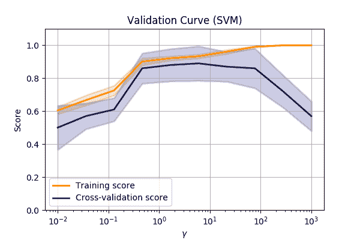
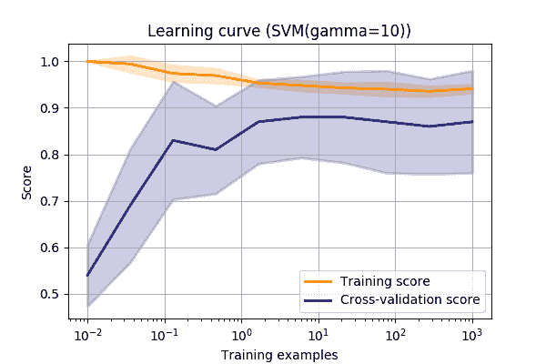
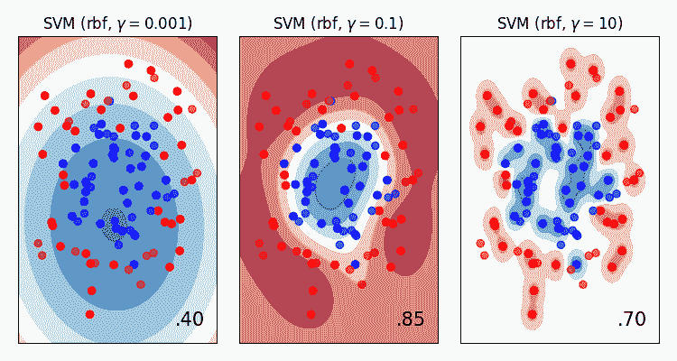
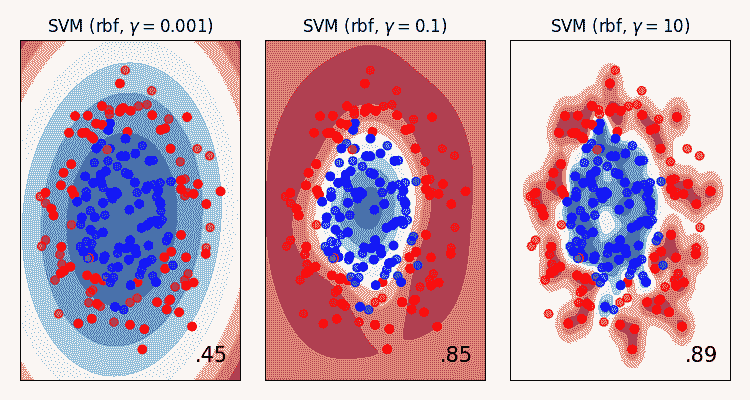
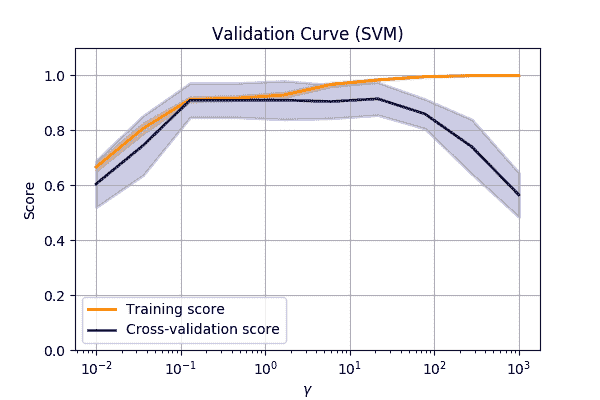
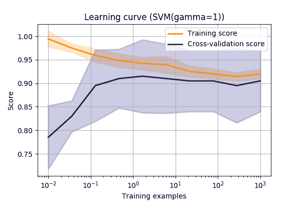

# 503:在高维问题中可视化过度拟合

> 原文：<https://winder.ai/503-visualising-overfitting-in-high-dimensional-problems/>

## 验证曲线

可视化过度拟合的一个简单方法是使用*验证曲线*(也称为拟合曲线)。

这是得分(例如准确性)与模型中某个参数的关系图。

让我们再次比较`make_circles`数据集，并改变 SVM- > RBF- >伽马值。

* * *

？？？

改变 RBF 的参数时 SVM->RBF 算法的性能。

我们可以看到，在较低的\(\gamma\)值下，我们处于欠拟合状态。因此，我们可以通过允许 SVM 拟合越来越小的内核来使模型更加复杂。

但是当我们达到大约`10`的值时，我们可以看到我们的验证集的性能急剧下降。

* * *

## 学习曲线

另一种观察过度拟合的方法是使用*学习曲线*。

学习曲线是分数与模型中使用的数据量的关系图。

(或者偶尔，在像深度学习这样的迭代训练中，分数与迭代次数的关系图具有类似的结果)

同样，让我们再次查看`make_circles`数据集，并改变 SVM- > RBF- >伽马值。

* * *

？？？

这条曲线向我们展示了一些东西。

首先，我们可以看到，最终分数与 gamma 值的验证曲线大致相同(对健全性检查总是有好处的！).

接下来，我们可以看到训练分数不完全是 1.0。

也就是说，它不能完全准确地模拟测试数据。这可能意味着几件事之一。

1.  这可能意味着我们没有使用足够复杂的模型来捕捉数据中的所有复杂性。这叫模型*偏差*。

2.  或者，这可能意味着这个问题是不可分的。有些例子看起来很像另一个类。

    一个人真的值得贷款，但是他们遇到了事故，不能工作了。

3.  这可能只是由于噪音数据。也许你的物联网传感器没有给出完美的读数。

在第一种情况下，我们可以尝试一个更复杂的模型。总是值得一试。

对于第二种和第三种情况，您可能会从更多的数据中受益，或者该结果可能是该领域的典型结果。

最后一个用途是，我们可以使用学习曲线来决定添加更多数据是否可能改善结果。

如果验证分数远低于训练分数，那么我们可以通过添加更多数据来改善结果。

然而，如果验证分数与训练数据相匹配，那么我们知道我们正在尽我们最大的努力。

对于给定的模型，再多的新数据也不会提高分数。

让我们再来看看 SVM 数据与伽马值的关系&mldr;

* * *

从验证和学习曲线中，我们可以得出这些结论:

*   我们在高伽马值下过度拟合
*   我们需要更多的数据来做更好的归纳
*   数据集中有一些噪音

我们可以通过直接绘制数据来确认这些结论(这通常是不可能的！)

* * *

### 更多的数据通常意味着更好的概括

*   一般来说，更多的数据意味着更好的概括。

我们需要更多的数据来“填补空白”。

这补偿了更复杂的模型。

？？？

我们现在拥有可以模拟任意复杂性的模型(例如深度学习、k 近邻)，因此我们需要越来越多的数据来确保我们继续推广到新的观察结果。

例如，让我们增加 circles 数据集中的数据点数，并重新绘制验证和拟合曲线&mldr;

* * *

相同的`make_circle`数据有 200 个观察值(而不是 100 个)。

* * *

*   更多的数据提高了伽马值较高时的验证分数。
*   我们对高伽马值过度拟合的预感是正确的。在值`1`附近，训练和验证分数出现分歧。

* * *

现在，有了新的值`gamma=1`和更多的数据，我们更加接近训练数据(更好的概括),而不会过度拟合。

* * *

## 模型复杂性

关于复杂性的快速说明(我们已经提到过几次)。

不同的模型类型对复杂数据的建模能力不同。例如，多项式分类器比线性分类器更复杂。

这被称为模型的*方差*。(我更喜欢复杂性这个术语)

显然，在一般化和复杂性之间有一个权衡(也称为偏差和方差)。

您可以尝试用更复杂的模型更好地拟合数据，但您可能无法很好地推广到新模型。

这是一个小心的平衡动作。

* * *

## 参数与超参数

参数定义了在训练过程中学习的模型。

*   例如线性系数、决策超平面

超参数是关于模型的更高层次的概念，不能直接从数据中学习

*   例如学习率、树中的叶子数量、RBF-SVM 中的伽马

超参数通常需要重复运行才能获得最佳值。

* * *

## 超参数优化

我们已经看到了如何通过最小化成本函数来学习模型参数。

但是超参数不能直接从数据中学习。

相反，我们经常执行*搜索*来找到最佳参数。

最简单的形式叫做*网格搜索*。这是一种强力方法，我们尝试超参数的所有组合，并挑选(可能通过可视化)最佳组合。

* * *

## 正规化

最后，关于大多数模型如何试图避免过度拟合的一个注意事项。

他们引入了*正规化*。

这是主动惩罚过于复杂的模型的做法。

每种模式的正规化实施方式各不相同，但要点是相同的:

奥卡姆剃刀/节俭定律

**更喜欢最简单的型号**

* * *