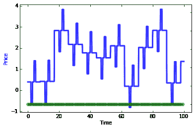

# 强化学习框架的比较:多巴胺、RLLib、Keras-RL、蔻驰、TRFL、Tensorforce、蔻驰等等

> 原文：<https://winder.ai/a-comparison-of-reinforcement-learning-frameworks-dopamine-rllib-keras-rl-coach-trfl-tensorforce-coach-and-more/>

*强化学习* (RL)框架通过创建 RL 算法核心组件的更高级抽象来帮助工程师。这使得代码更容易开发，更容易阅读，并提高效率。

但是选择一个框架会引入一些限制。在学习和使用一个框架上的投资会使它很难脱离。这就像你决定去哪家酒吧一样。不管这个地方有多糟糕，都很难不买啤酒。

 [我关于强化学习的新书](https://rl-book.com/?utm_source=winderresearch&utm_medium=web&utm_campaign=rl) 

你想在现实生活、商业应用中使用 RL 吗？你想知道真相吗？最佳实践？

我们为 O'Reilly 写了一本关于强化学习的书。它侧重于工业 RL，有许多真实生活的例子和深入的分析。

了解更多关于 https://rl-book.com 的信息。

在这篇文章中，我提供了一些关于最流行的 RL 框架的注释。我还展示了 Github 和 Google(你不能相信它们)的一些粗略的统计数据，试图量化它们的受欢迎程度。

This post is now out of date. Please double check that what I discuss here is still relevant and/or correct.

## 本作品的最初目的

我正在为奥赖利写一本关于 RL 的书。作为该书的一部分，我想向我的读者展示如何构建和设计各种 RL 代理。我认为读者会从使用已经建立的框架或库的代码中受益。无论如何，编写这些框架的人可能会比我做得更好。

所以问题是，“哪个框架？”。引导我走上这条路。一开始只有几个框架，但后来我发现了更多。还有更多。事实证明，已经有相当多的框架可用，这就变成了一个 8000 字的庞然大物。提前为篇幅道歉。我不指望有多少人能全部读完！

因为篇幅的原因，这也花了一段时间来写。这意味着评论没有激光焦点。有时我在一个框架中评论一件事，而在另一个框架中根本不评论。为此道歉；它并不是详尽无遗的。

## 方法学

大部分评价都是纯观点。但是我们可以看一些量化的指标。即在 Github 中可以获得的存储库的统计数据。起点大致代表了每个框架的知名度，但并不代表质量。通常情况下，拥有最多明星的框架拥有更强的营销能力。

之后，我一直在寻找模块化、易用性、灵活性和成熟性的结合。简单性也是需要的，但是这通常与模块化和灵活性是相互排斥的。下面提出的意见是基于这些理想。

一个反复出现的主题是 RL 框架中*深度学习* (DL)框架的主导地位。DL 框架通常会突破抽象，而 RL 框架只是前者的扩展。这意味着，如果您已经有了一个特定的 DL 解决方案，那么您还不如坚持下去。

但对我来说，这代表着锁定。我的偏好总是倾向于不强制要求特定的 DL 实现或者根本不使用 DL 的框架(震惊/恐怖！).结果是，所有的 Google 框架都倾向于 Tensorflow，所有的学术框架都使用 PyTorch，然后有一些勇敢的人徘徊在中间，他们的工作量是其他人的两倍。

我还试图查看每个框架的谷歌排名，但结果证明[并不可靠](#google-rankings)。

## 随附笔记本

在可能的情况下，或者有意义的情况下，我尝试了很多这样的框架。他们中的许多人没有工作。他们中的一些人一开始就有很棒的笔记本，所以你可以去看看。

至于其他的，我已经[发表了一个要点，你可以在谷歌实验室](https://colab.research.google.com/gist/philwinder/07cbe7b696745ac25c0f6a2aadbcd3c7/framework-research.ipynb)上运行。这是以非常原始的格式呈现的。它并不意味着是全面的或解释性的。我只是想仔细检查一下，在最简单的情况下，它是否工作。

在每一节中，我还展示了一个“入门”小标题，展示了每个框架的基本示例。这是笔记本上的代码。

## 强化学习框架

以下框架是按照截至 2019 年 6 月其 Github 知识库中的星级数排列的。星号的实际数量和其他指标以徽章的形式显示在每个框架的标题下方。

比较了以下框架:

*   [OpenAI 健身房](#openai-gym-https-github-com-openai-gym)
*   [谷歌多巴胺](#google-dopamine-https-github-com-google-dopamine)
*   [RLLib](#rllib-https-ray-readthedocs-io-en-latest-rllib-html-via-ray-project-https-github-com-ray-project-ray)
*   [Keras-RL](#keras-rl-https-github-com-keras-rl-keras-rl)
*   [TRFL](#trfl-https-github-com-deepmind-trfl)
*   [张量力](#tensorforce-https-github-com-tensorforce-tensorforce)
*   [脸书地平线](#horizon-https-github-com-facebookresearch-horizon)
*   蔻驰神经系统公司
*   [MAgent](#magent-https-github-com-geek-ai-magent)
*   [SLM-Lab](#slm-lab-https-github-com-kengz-slm-lab)
*   [鹿](#deer-https-github-com-vinf-deer)
*   [车库](#garage-https-github-com-rlworkgroup-garage)
*   [超现实](#surreal-https-github-com-surrealai-surreal)
*   [RLgraph](#rlgraph-https-github-com-rlgraph-rlgraph)
*   [简单 RL](#simple-rl-https-github-com-david-abel-simple-rl)

### [OpenAI 健身房](https://github.com/openai/gym)


OpenAI 是一家非营利性的纯研究公司。提供一系列开源的深度和强化学习工具，以提高可重复性、创建基准并改进最先进的技术。我喜欢将它们视为学术界和工业界之间的桥梁。

但我知道你在想什么。“菲尔，健身房不是一个框架。是一个环境。”。我知道，我知道。它提供了一系列的玩具环境，经典控制，机器人，视频游戏和棋盘游戏来测试你的 RL 算法。

但是我把它包括在这里，因为它经常被用作定制工作的基础。人们像使用框架一样使用它。可以把它看作是 RL 实现和环境之间的接口。它非常丰富，下面列出的许多其他框架也与 Gym 接口。此外，它还可以作为比较一切的基准。因为这是 RL 中最流行的库之一。

#### 入门指南

健身房既酷又有问题，因为它的现实 3D 环境。如果你想可视化正在发生的事情，你需要能够渲染这些环境。它几乎可以在你的笔记本电脑上运行，但是当你试图在笔记本电脑上运行它时，由于浏览器的限制，它会很吃力。

为了解决这个问题，你必须使用虚拟显示器。基本上，我们必须模拟视频驱动程序。这意味着大多数“入门”代码是视频包装代码。

如果我们忽略所有无聊的东西，你可以在附带的笔记本中找到，核心健身房代码看起来像:

```py
import gym
from gym.wrappers.monitoring.video_recorder import VideoRecorder # Because we want to record a video

env = gym.make("CartPole-v1") # Create the cartpole environment
rec = VideoRecorder(env)      # Create the video recorder
rec.capture_frame()           # Capture the starting position
while True:
    action = env.action_space.sample()                   # Use a random action
    observation, reward, done, info = env.step(action)   # to take a single step in the environment
    rec.capture_frame()                                  # and record
    if done:
           break                                         # If the pole has fallen, quit.
rec.close()  # Close the recording
env.close()  # Close the environment 
```

如你所见，我们一直在行动，直到杆子倒下。这个简单的 API 可以在所有环境中重复使用。这变得如此流行，以至于人们已经构建了使用相同 API 但具有新环境的扩展。

[https://winder.ai/a-comparison-of-reinforcement-learning-frameworks-dopamine-rllib-keras-rl-coach-trfl-tensorforce-coach-and-more/gym.mp4](https://winder.ai/a-comparison-of-reinforcement-learning-frameworks-dopamine-rllib-keras-rl-coach-trfl-tensorforce-coach-and-more/gym.mp4)

正如你所看到的，它直接下降了，因为此刻我们只是通过随机动作。但是，仍然有一些催眠的东西，一些鼓和低音。

但是现在让我们来看一些仅代理框架选项。

### [谷歌多巴胺](https://github.com/google/dopamine)


谷歌多巴胺:“不是谷歌的官方产品”(NOGP——我现在要创造的首字母缩写词)，但由谷歌员工编写，托管在谷歌 github 上。那就谷歌一下多巴胺。它是 RL 框架领域的一个相对较新的进入者，看起来很受欢迎。它拥有大量的 Github 明星和一些谷歌趋势排名。这尤其令人惊讶，因为自项目启动以来，提交的数量、提交者和时间都是有限的。显然，谷歌的品牌和营销部门对你有帮助。

无论如何，这个框架最酷的一点是，它通过使用 [Google gin-config](https://github.com/google/gin-config) 配置框架，强调了作为代码的配置。这个想法是你有许多可插入的位，你通过一个配置文件连接在一起。好处是这允许人们发布一个单一的配置文件，该文件包含特定于该运行的所有参数。gin-config 让事情变得特别，因为它允许您将对象连接在一起；类和 lambdas 之类的实例。

不利的一面是你增加了配置文件的复杂性，它最终会像另一个充满代码的文件一样，人们无法理解，因为他们不习惯。举例来说，就我个人而言，我总是坚持使用“愚蠢”的配置文件，比如 Kubernetes Manifests 或 JSON(就像许多其他框架一样)。布线应该按照代码进行。

一个主要的好处是它促进了可插拔性和可重用性，这是在开发[数据科学](https://winder.ai/what-is-data-science/)产品时经常被忽略的关键 OOP 和功能概念。

显然，它在很短的时间内获得了很大的吸引力。坦白说，这让我有点担心。有四个贡献者，只有 100 个提交。在这四个人中，三个来自社区(bug-fixes，等等)。).这就剩下一个人了。而这一个人已经犯了，等着吧， [**超过 130 万行代码**](https://github.com/google/dopamine/graphs/contributors) 。

很明显这里有猫腻。从提交历史来看，代码似乎是从另一个 repo 转移过来的[。120 万行提交并不是最佳实践！:-)这是 Apache 许可的，所以没有什么太奇怪的事情发生，但版权已被分配给](https://github.com/google/dopamine/commit/420b147474d455fe39d911432fe579e54db3a1e0)[谷歌公司](https://github.com/google/dopamine)。但是我对[贡献者协议](https://github.com/google/dopamine/blob/master/CONTRIBUTING.md#contributor-license-agreement)感到放心。

就模块化而言，并不多。对于[代理](https://github.com/google/dopamine/tree/master/dopamine/agents)没有任何抽象；它们是直接实现的，并从 gin 配置中进行配置。实现的也不多。也没有任何官方的环境抽象。事实上，看起来它们只是到处传回核心 Tensorflow 对象，并假设使用 Tensorflow 接口。简而言之，非常少的官方 OOP 风格的抽象，这不同于大多数其他框架。

简而言之，小模块化，重用是笨拙的(IMO ),尽管它似乎很受欢迎，但它不是很成熟，也没有社区支持。

#### 入门指南

同样，您可以在随附的笔记本中找到示例，但前提是通过配置文件构建您的 RL 算法。看起来是这样的:

```py
DQN_PATH = os.path.join(BASE_PATH, 'dqn')
# Modified from dopamine/agents/dqn/config/dqn_cartpole.gin
dqn_config = """ # Hyperparameters for a simple DQN-style Cartpole agent. The hyperparameters # chosen achieve reasonable performance. import dopamine.discrete_domains.gym_lib import dopamine.discrete_domains.run_experiment import dopamine.agents.dqn.dqn_agent import dopamine.replay_memory.circular_replay_buffer import gin.tf.external_configurables   DQNAgent.observation_shape = %gym_lib.CARTPOLE_OBSERVATION_SHAPE DQNAgent.observation_dtype = %gym_lib.CARTPOLE_OBSERVATION_DTYPE DQNAgent.stack_size = %gym_lib.CARTPOLE_STACK_SIZE DQNAgent.network = @gym_lib.cartpole_dqn_network DQNAgent.gamma = 0.99 DQNAgent.update_horizon = 1 DQNAgent.min_replay_history = 500 DQNAgent.update_period = 4 DQNAgent.target_update_period = 100 DQNAgent.epsilon_fn = @dqn_agent.identity_epsilon DQNAgent.tf_device = '/gpu:0'  # use '/cpu:*' for non-GPU version DQNAgent.optimizer = @tf.train.AdamOptimizer()   tf.train.AdamOptimizer.learning_rate = 0.001 tf.train.AdamOptimizer.epsilon = 0.0003125   create_gym_environment.environment_name = 'CartPole' create_gym_environment.version = 'v0' create_agent.agent_name = 'dqn' TrainRunner.create_environment_fn = @gym_lib.create_gym_environment Runner.num_iterations = 100 Runner.training_steps = 100 Runner.evaluation_steps = 100 Runner.max_steps_per_episode = 200  # Default max episode length.   WrappedReplayBuffer.replay_capacity = 50000 WrappedReplayBuffer.batch_size = 128 """
gin.parse_config(dqn_config, skip_unknown=False) 
```

那已经很多了。但是它实现了一个更复杂的算法，所以我们可以预料到。我很高兴那里有超参数，但是我不确定我是不是所有动态注入的粉丝(`@`表示一个类的实例)。支持者会说“哇，看，我只要改变这条线就可以把乐观者换出来”。但是我认为我也可以用普通的老 Python 来做这件事。

经过一点训练后:

```py
tf.reset_default_graph()
dqn_runner = run_experiment.create_runner(DQN_PATH, schedule='continuous_train')
dqn_runner.run_experiment() 
```

然后我们可以运行一些与之前类似的代码来生成一个不错的视频:

```py
rec = VideoRecorder(dqn_runner._environment.environment)
action = dqn_runner._initialize_episode()
rec.capture_frame()
while True:
    observation, reward, is_terminal = dqn_runner._run_one_step(action)
    rec.capture_frame()
    if is_terminal:
      break                                         # If the pole has fallen, quit.
    else:
      action = dqn_runner._agent.step(reward, observation)
dqn_runner._end_episode(reward)
rec.close() 
```

[https://winder.ai/a-comparison-of-reinforcement-learning-frameworks-dopamine-rllib-keras-rl-coach-trfl-tensorforce-coach-and-more/dopamine.mp4](https://winder.ai/a-comparison-of-reinforcement-learning-frameworks-dopamine-rllib-keras-rl-coach-trfl-tensorforce-coach-and-more/dopamine.mp4)

### [RLLib](https://ray.readthedocs.io/en/latest/rllib.html) 通过[射线投射](https://github.com/ray-project/ray)


Ray [开始时，life](https://github.com/ray-project/ray/tree/ray-0.3.0) 是一个旨在帮助 Python 用户构建可扩展软件的项目，主要用于 ML 目的。从那时起，它添加了几个模块，专门用于特定的 ML 用例。一个是[分布式超参数调谐](https://ray.readthedocs.io/en/latest/tune.html)，另一个是[分布式 RL](https://ray.readthedocs.io/en/latest/rllib.html) 。

这种一般化的结果是，流行数字可能更多地是由于超参数和通用可伸缩性用例，而不是 RL。此外，库的分布式焦点意味着代理实现往往是固有分布式的(例如 A3C ),或者试图解决如此复杂的问题，以至于它们需要分布，从而不需要几年就可以收敛(例如 Rainbow)。

尽管如此，如果您正在寻求 RL 的生产，或者如果您为了超参数调整或环境改善而多次重复培训，那么使用 ray 来扩大规模并减少反馈时间可能是有意义的。事实上，许多其他框架(具体来说: [SLM-Lab](#slm-lab-https-github-com-kengz-slm-lab) 和 [RLgraph](#rlgraph-https-github-com-rlgraph-rlgraph) )实际上都在幕后使用了 ray。

我相信这里对 RL 有很强的适用性。对分布式计算的明确关注是好的。提交和贡献者的绝对数量也令人放心。但是 C++中有很多底层代码。有些甚至是 Java 语言。只有 60%是 python。

尽管如此，[`Policy`【s】](https://github.com/ray-project/ray/blob/master/python/ray/rllib/policy/policy.py)还是有一个非常清晰的抽象，一个漂亮的，几乎是功能性的代理接口，叫做 [`Trainer` s](https://github.com/ray-project/ray/blob/master/python/ray/rllib/agents/trainer.py) (参见 [DQN 实现](https://github.com/ray-project/ray/blob/master/python/ray/rllib/agents/dqn/dqn.py)的用法示例)，一个 [`Model`](https://github.com/ray-project/ray/blob/master/python/ray/rllib/models/model.py) 抽象，允许使用 PyTorch 或 Tensorflow(耶！)以及更多用于评估和政策优化的工具。

总的来说，文档非常出色，并且展示了清晰的建筑图纸(例如，参见[本例](https://ray.readthedocs.io/en/latest/rllib-models.html))。它是模块化的，可伸缩性好，得到了社区的很好支持和接受。唯一的缺点是它的复杂性。这是您为所有这些功能付出的代价。

#### 入门指南

Google colab 预装的 pyarrow 版本存在一个与 ray 不兼容的问题。你必须卸载预装版本，并重新启动运行时，然后它的工作。

我也不能让视频渲染像我们之前的例子一样工作。我的假设是，因为它们运行在不同的进程中，所以它们无法访问假的`pyvirtualdisplay`设备。

尽管如此，让我们来看一个例子:

```py
!pip uninstall -y pyarrow
!pip install tensorflow ray[rllib] > /dev/null 2>&1 
```

删除 pyarrow 并安装 rllib 后，必须重启笔记本内核。接下来，导入光线:

```py
import ray
from ray import tune

ray.init() 
```

并使用 DQN 为 Cartpole 环境运行超参数调整作业:

```py
tune.run(
    "DQN",
    stop={"episode_reward_mean": 100},
    config={
        "env": "CartPole-v0",
        "num_gpus": 0,
        "num_workers": 1,
        "lr": tune.grid_search([0.01, 0.001, 0.0001]),
        "monitor": False,
    },
) 
```

这里有很多语法上的甜言蜜语，但是定制培训功能([文档](https://ray.readthedocs.io/en/latest/rllib-training.html#custom-training-workflows))看起来[相当简单](https://github.com/ray-project/ray/blob/master/python/ray/rllib/examples/custom_train_fn.py)。

### [Keras-RL](https://github.com/keras-rl/keras-rl)


我爱 Keras。我喜欢抽象，简单，反锁定。当你看下面的代码时，你可以看到 Keras 的魔力。所以你会认为 keras-rl 是一个完美的选择。然而，它似乎没有获得像其他框架那样多的关注。如果你[看文档](https://keras-rl.readthedocs.io/en/latest/)，它是空的。当你看到这些承诺时，只有少数勇敢的人完成了大部分工作。与[主要的 Keras 项目](https://github.com/keras-team/keras)相比。

我想我可能知道原因。Keras 是从头开始构建的，允许用户快速原型化不同的 DL 结构。这依赖于神经网络原语可以被抽象和模块化的事实。但是当你看 keras-rl 的代码时，它的实现方式就像教科书中一样。例如，尽管 SARSA 和 DQN 之间有相似之处，但每个代理都有自己的实现。想想所有可以模块化的“技巧”，就像彩虹中使用的那些技巧，它可以让人们在其他代理中试验使用这些技巧。有一定程度的模块化，但我认为这是在一个太高的水平。

但也许还不算太晚，因为这里有太多的希望。如果有足够多的人感兴趣，或者如果有更多来自核心 Keras 项目的支持，那么这可能是未来的首选 RL 框架。但目前来看，我觉得不是。通过使用我们已经讨论过的其他框架，几乎同样容易获得 Keras 的好处。

#### 入门指南

这里的例子是开箱即用的，我所做的唯一修改是使用模拟显示和添加一些测试视频记录。可以看到这里的大部分代码都是标准的 Keras 代码。Keras-RL 添加的内容与 Keras 完全没有关系。

```py
import numpy as np
import gym

from keras.models import Sequential
from keras.layers import Dense, Activation, Flatten
from keras.optimizers import Adam

from rl.agents.dqn import DQNAgent
from rl.policy import BoltzmannQPolicy
from rl.memory import SequentialMemory

ENV_NAME = 'CartPole-v0'

# Get the environment and extract the number of actions.
env = gym.make(ENV_NAME)
np.random.seed(123)
env.seed(123)
nb_actions = env.action_space.n

# Next, we build a very simple model.
model = Sequential()
model.add(Flatten(input_shape=(1,) + env.observation_space.shape))
model.add(Dense(16))
model.add(Activation('relu'))
model.add(Dense(16))
model.add(Activation('relu'))
model.add(Dense(16))
model.add(Activation('relu'))
model.add(Dense(nb_actions))
model.add(Activation('linear'))
print(model.summary())

# Finally, we configure and compile our agent. You can use every built-in Keras optimizer and
# even the metrics!
memory = SequentialMemory(limit=5000, window_length=1)
policy = BoltzmannQPolicy()
dqn = DQNAgent(model=model, nb_actions=nb_actions, memory=memory, nb_steps_warmup=10,
               target_model_update=1e-2, policy=policy)
dqn.compile(Adam(lr=1e-3), metrics=['mae'])

# Okay, now it's time to learn something! We visualize the training here for show, but this
# slows down training quite a lot. You can always safely abort the training prematurely using
# Ctrl + C.
dqn.fit(env, nb_steps=2500, visualize=True, verbose=2)

# After training is done, we save the final weights.
dqn.save_weights('dqn_{}_weights.h5f'.format(ENV_NAME), overwrite=True)

# Finally, evaluate our algorithm for 5 episodes.
dqn.test(Monitor(env, '.'), nb_episodes=5, visualize=True) 
```

[https://winder.ai/a-comparison-of-reinforcement-learning-frameworks-dopamine-rllib-keras-rl-coach-trfl-tensorforce-coach-and-more/keras-rl.mp4](https://winder.ai/a-comparison-of-reinforcement-learning-frameworks-dopamine-rllib-keras-rl-coach-trfl-tensorforce-coach-and-more/keras-rl.mp4)

### [TRFL](https://github.com/deepmind/trfl)


TRFL 是 Deepmind 对 Tensorflow 的自以为是的扩展(那么 NOGP；-) ).鉴于这些证明，您可能会认为它会很受欢迎，但是您注意到的第一件事是明显缺乏提交。然后鲜明的[缺乏实例和 Tensorflow 2.0 支持](https://github.com/deepmind/trfl/issues/17)。

主要问题是太低级了。和 Keras-RL 完全相反。TRFL 提供的功能是一些辅助函数，例如一个 [q-learning value 函数](https://github.com/deepmind/trfl/blob/master/trfl/action_value_ops.py#L40)，它接受一个带有抽象名称的 Tensorflow 张量的负载。

#### 入门指南

推荐快速看一下[这个笔记本](https://colab.research.google.com/drive/1r_SGbDBzEaKeijJFExgPTOcaglZcD0-S#scrollTo=627LbtjyZmYX)为例。但是注意代码很低级。

### [张量力](https://github.com/tensorforce/tensorforce)


Tensorforce 与 [TRFL](#TRFL) 有着相似的目标。它试图抽象 RL 原语，同时以 Tensorflow 为目标。通过使用 Tensorflow，您可以获得使用 Tensorflow 的所有好处，即图形模型、更简单的跨平台部署。

一个 [`Environment`](https://github.com/tensorforce/tensorforce/blob/master/tensorforce/environments/environment.py) 、 [`Runner`](https://github.com/tensorforce/tensorforce/blob/master/tensorforce/execution/runner.py) 、 [`Agent`](https://github.com/tensorforce/tensorforce/blob/master/tensorforce/agents/agent.py) 、 [`Model`](https://github.com/tensorforce/tensorforce/blob/master/tensorforce/models/model.py) 四个高级抽象。这些基本上完成了您所期望的，但是“模型”抽象不是您通常会看到的。一个`Model`位于一个`Agent`中，定义代理的策略。这很好，因为，例如，标准的[Q-学习模型](https://github.com/tensorforce/tensorforce/blob/master/tensorforce/models/q_model.py)可以被[Q-学习 n 步模型](https://github.com/tensorforce/tensorforce/blob/master/tensorforce/models/q_nstep_model.py)覆盖，只改变一个小函数。这正是我在寻找的 TRFL 和 Keras 之间的中间地带。它是以面向对象的方式实现的，有些人会喜欢，有些人不会。但至少抽象是存在的。

像这样的库，或者任何以 DL 为中心的 RL 库的缺点是，底层的 DL 框架使得很多代码变得复杂。这里也是一样。例如，[随机模型](https://github.com/tensorforce/tensorforce/blob/major-revision/tensorforce/core/models/random_model.py)，也就是选择一个随机动作的模型，它需要一行代码，有 79 行长。我在这里开了一点玩笑(许可证，类样板，换行符，等等。)但希望你能理解我的观点。

这也意味着没有“简单”RL 算法的实现，即那些不使用模型的算法。例如熵、土匪、简单 MDPs、SARSA、一些表格方法等。原因是这些模型不需要 DL 框架。

总之，我认为抽象的层次是正确的。但是将自己局限于 DL 框架的好处/问题依然存在。

请注意，这是基于版本`0.4.3`的，一个主要的重写正在进行中。

#### 入门指南

入门的例子是明智的。我们正在创建一个环境、一个代理和一个跑步者(实际进行训练的东西)。代理的规格有点不同。它让我想起了 [Dopamine](#google-dopamine-https-github-com-google-dopamine) Gin config，只不过它使用的是标准 json。在示例中，我从示例目录中获取这些规范，但是您可以想象使用它们运行超参数搜索是多么容易。

```py
environment = OpenAIGym(
    gym_id="CartPole-v0",
    monitor=".",
    monitor_safe=False,
    monitor_video=10,
    visualize=True
)

with urllib.request.urlopen("https://raw.githubusercontent.com/tensorforce/tensorforce/master/examples/configs/dqn.json") as url:
  agent = json.loads(url.read().decode())
  print(agent)
with urllib.request.urlopen("https://raw.githubusercontent.com/tensorforce/tensorforce/master/examples/configs/mlp2_network.json") as url:
  network = json.loads(url.read().decode())
  print(network)

agent = Agent.from_spec(
  spec=agent,
  kwargs=dict(
    states=environment.states,
    actions=environment.actions,
    network=network
  )
)

runner = Runner(
    agent=agent,
    environment=environment,
    repeat_actions=1
)

runner.run(
    num_timesteps=200,
    num_episodes=200,
    max_episode_timesteps=200,
    deterministic=True,
    testing=False,
    sleep=None
)
runner.close() 
```

[https://winder.ai/a-comparison-of-reinforcement-learning-frameworks-dopamine-rllib-keras-rl-coach-trfl-tensorforce-coach-and-more/tensorforce.mp4](https://winder.ai/a-comparison-of-reinforcement-learning-frameworks-dopamine-rllib-keras-rl-coach-trfl-tensorforce-coach-and-more/tensorforce.mp4)

### [地平线](https://github.com/facebookresearch/Horizon)


Horizon 是一个来自脸书的框架，由 PyTorch 主导。另一个以数字图书馆为中心的图书馆。另外:

> Horizon 的主要用例是在批处理设置中训练 RL 模型。具体来说，我们试图在给定输入数据的情况下学习最佳策略。

因此，像其他框架一样，焦点是与策略无关的、模型驱动的 RL 和模型中的 DL。但是由于 PyTorch 的使用，这是有区别的。您也可以将它与使用 PyTorch 作为 Keras 后端的 Keras-RL 进行比较。

我已经在 [Tensorforce](#tensorforce-https-github-com-tensorforce-tensorforce) 一节中讨论了这种聚焦框架的缺点，所以我不再赘述。

尽管如此，还是有一些有趣的区别。没有紧密的健身房整合。相反，他们通过将健身房数据转储到 JSON 中，然后将 JSON 读回到代理中，有意地将两者分离。这听起来可能有点罗嗦，但实际上对[解耦](https://en.wikipedia.org/wiki/Loose_coupling)很有好处，因此更具可伸缩性，不那么脆弱，也更灵活。不利的一面是，由于复杂性的增加，需要跨越更多的障碍。

然而，听起来不可思议的是，Horizon 没有 pip 安装程序。你要用 conda，安装 onnx，安装 java，设置`JAVA_HOME`指向 conda，安装 Spark，安装 Gym(够公平)，安装 Apache thrift 然后构建 Horizon。哇哦。(如果你数了有多少步，会加分)。

因此，我认为这足以说明我不打算在演示笔记本上安装它。

#### 入门指南

你需要大量的时间和耐心。遵循[建造说明](https://horizonrl.com/installation.html)，然后遵循[训练指南](https://horizonrl.com/usage.html#offline-rl-training-batch-rl)。我不能保证，因为我还有自己的生活。

### [蔻驰](https://github.com/NervanaSystems/coach)


当你查看这个框架时，你会注意到的第一件事是实现算法的数量。这是一个巨大的工程，肯定需要几个人花费数周的时间来完成。你会注意到的第二件事是集成环境的[数量](https://github.com/NervanaSystems/coach#supported-environments)。考虑到这需要多少时间，它给了框架的其余部分很多希望。

它配有一个看起来非常漂亮的专用仪表盘。其他大多数框架都依赖 Tensorboard 项目。

一个我以前没有见过的 wow 特性是 Kubernetes 的内置部署。我认为蔻驰对蔻驰的编排走得太远了，但事实上他们甚至考虑过它，这意味着它可能足够可伸缩，可以用标准工具部署到 Kuberentes 上。

模块化的程度令人震惊。例如，有些类实现了各种各样的[探索策略](https://nervanasystems.github.io/coach/components/exploration_policies/index.html)，并允许你对[各种模型设计](https://nervanasystems.github.io/coach/design/network.html)做出各种各样的改变。

我能想到的唯一有点烦人的是强迫我使用 DL 作为模型的限制。我仍然相信，更简单的应用程序子集不需要像 DL 那样复杂的东西，并且可以从更传统的回归方法中受益。然而，我确信添加一个移除 DL 内容的小存根类应该是相当容易的。

有趣的是，框架[支持 Tensorflow 和 MXNet](https://nervanasystems.github.io/coach/usage.html#switching-between-deep-learning-frameworks) ,因为它使用了 Keras。这意味着不支持 PyTorch，因为 Keras 不支持 PyTorch。

坦白地说，我不能理解为什么这个框架在任何一种衡量方式下都如此不受欢迎。就星星而言。就谷歌页面的数量而言(如果你想知道的话，答案是 7)。相比之下，[谷歌多巴胺](https://www.google.com/search?q=%22google+dopamine%22)有 16500 页。

它当然是最全面的框架，有最好的文档和极好的模块化水平。他们甚至有一本❤️ [入门笔记本](https://github.com/NervanaSystems/coach/blob/v0.12.1/tutorials/0.%20Quick%20Start%20Guide.ipynb) ❤️.

#### 入门指南

我想指出两个重要的注意事项。首先，确保您看到的是文档或演示的标记版本。在 master 分支中有一些新功能不能与安装了 pip 的版本一起使用。第二，依赖于 OpenAI 健身房版本`0.12.5`，colab 里没有安装。您需要运行`!pip install gym==0.12.5`并重启运行时。

```py
import tensorflow as tf
tf.reset_default_graph() # So that we don't get an error for TF when we re-run

from rl_coach.agents.clipped_ppo_agent import ClippedPPOAgentParameters
from rl_coach.environments.gym_environment import GymVectorEnvironment
from rl_coach.graph_managers.basic_rl_graph_manager import BasicRLGraphManager
from rl_coach.graph_managers.graph_manager import ScheduleParameters
from rl_coach.core_types import TrainingSteps, EnvironmentEpisodes, EnvironmentSteps
from rl_coach.base_parameters import VisualizationParameters
global experiment_path; experiment_path = '.' # Because of some bizzare global in the mp4 dumping code

# Custom schedule to speed up training. We don't really care about the results.
schedule_params = ScheduleParameters()
schedule_params.improve_steps = TrainingSteps(200)
schedule_params.steps_between_evaluation_periods = EnvironmentSteps(200)
schedule_params.evaluation_steps = EnvironmentEpisodes(10)
schedule_params.heatup_steps = EnvironmentSteps(0)

graph_manager = BasicRLGraphManager(
    agent_params=ClippedPPOAgentParameters(),
    env_params=GymVectorEnvironment(level='CartPole-v0'),
    schedule_params=schedule_params,
    vis_params=VisualizationParameters(dump_mp4=True) # So we can dump the video
) 
```

[https://winder.ai/a-comparison-of-reinforcement-learning-frameworks-dopamine-rllib-keras-rl-coach-trfl-tensorforce-coach-and-more/rl_coach.mp4](https://winder.ai/a-comparison-of-reinforcement-learning-frameworks-dopamine-rllib-keras-rl-coach-trfl-tensorforce-coach-and-more/rl_coach.mp4)

### [MAgent](https://github.com/geek-ai/MAgent)


MAgent 是一个允许你解决多代理 RL 问题的框架。与所有其他仅使用单个或非常少的代理的“传统”RL 框架相比，这是一个完全不同的目标。他们声称它可以扩展到数百万个代理。

但同样，没有 pip 安装程序。请大家为自己的项目创建 pip 安装程序。这对于易用性和项目吸引力至关重要。我猜是因为整个项目都是用 C 写的，大概是性能原因吧。

它在引擎盖下使用 Tensorflow，并构建自己的 gridworld 式环境。代理的设计考虑了“真实生活”的模拟。例如你可以指定代理的大小，它能看多远；诸如此类的事情。传递给代理的观察结果是网格。他们能采取的行动仅限于移动、攻击和转身。他们根据灵活的规则定义获得奖励。

简而言之，该框架被设置为处理开箱即用的生活方式游戏，并在代理如何行为和奖励方面具有一些额外的模块化。因此，我们可以使用一些更高级的 DL 方法来训练代理执行复杂、协调的任务。比如围住猎物让它不能动。您可以在[入门指南](https://github.com/geek-ai/MAgent/blob/master/doc/get_started.md)中了解更多信息。

这个想法给我留下了深刻的印象。但是你可以从上面的 Github 统计数据中看到，一年 4 次提交基本上意味着它很少被使用。最近一次重大更新是在 2017 年。这是一个遗憾，因为与其他框架相比，它代表了非常不同的东西。如果有人能让它更容易使用，或者用惯用的 Python 复制框架，这样它就变得更容易使用，那就太好了。

#### 入门指南

所以我几乎可以在笔记本上工作了。我试了几个来自[入门指南](https://github.com/geek-ai/MAgent/blob/master/doc/get_started.md)的例子。训练版需要几个小时，所以我很快就放弃了。然而,`examples/api_demo.py`只是在测试学习过的模型，所以速度非常快。

但是，它以某种专有的文本格式呈现环境。您需要运行一个随机的 webserver 二进制文件来解析和托管浏览器中的渲染。因为我们在 colab，它不允许你运行网络服务器。所以我试着下载文件，但我们在 colab 上构建了二进制文件，而不是在 mac 上，所以我无法运行二进制文件。

所以这有点令人沮丧。如果它只是以某种标准格式(如 mp4 格式或 gif 格式)呈现它，事情会简单得多。也令人失望，因为我期待生成一些复杂的行为。

但是为了不让你失望，这里有一些作者的赏心悦目的东西。请原谅音频！

[https://www.youtube.com/embed/HCSm0kVolqI](https://www.youtube.com/embed/HCSm0kVolqI)

以下是仍然有效的代码:

```py
!git clone https://github.com/geek-ai/MAgent.git
!sudo apt-get install cmake libboost-system-dev libjsoncpp-dev libwebsocketpp-dev
%cd MAgent
!bash build.sh

!PYTHONPATH=$(pwd)/python:$PYTHONPATH python examples/api_demo.py 
```

您可以将最后一次调用交换到 examples 文件夹中的任何 python 文件。

### [TF-Agents](https://github.com/tensorflow/agents)


Tensorflow-Agents (TF-Agents)是谷歌的另一个 [NOGP](#google-dopamine-https-github-com-google-dopamine) ，专注于 Tensorflow。所以把这当成是对 [TRFL](#trfl-https-github-com-deepmind-trfl) 、 [Tensorforce](#tensorforce-https-github-com-tensorforce-tensorforce) 和[多巴胺](#google-dopamine-https-github-com-google-dopamine)的直接竞争。

这就引出了一个问题:当 TRFL 和多巴胺已经存在的时候，为什么更多的谷歌员工创造了另一个 Tensorflow-abstraction-for-RL？在讨论 TF-Agents 和多巴胺之间关系的一期[中，撰稿人建议:](https://github.com/tensorflow/agents/issues/15)

> 似乎多巴胺和 TF-Agent 强烈重叠。虽然多巴胺旨在用于快速原型和基准测试，因为再现性已被置于项目的核心，而 TF-Agent 将更多地用于生产级强化学习算法。

说实话，我现在还不确定“生产级”是什么意思。有一些[很棒的 colab 例子](https://github.com/tensorflow/agents/tree/master/tf_agents/colabs)，但是没有文档。你当然不应该在生产中使用笔记本电脑。

一旦你开始深入研究这些例子，你就会发现这些代码是非常张量流的。例如，[简单的 Cartpole 示例](https://github.com/tensorflow/agents/blob/master/tf_agents/colabs/1_dqn_tutorial.ipynb)有很多行代码。主要是因为里面有很多解释和调试代码，但它看起来像是即将到来的事情的迹象。

不过，我必须承认，代码看起来确实非常好。它被很好地分开，模块化看起来很好。你所期望的所有抽象都在那里。我唯一想挑选的是 [`Agent`抽象](https://github.com/tensorflow/agents/blob/master/tf_agents/agents/tf_agent.py)。这是基类，它直接耦合到 Tensorflow。这是一个张量流模块。这增加了大量的复杂性，我希望它被抽象掉，这样我就不必担心它，直到我需要它的时候。对于绝大多数其他抽象来说也是如此；都是 Tensorflow 模块。

也就是说，很明显这是一个比 TRFL 更加严肃和强大的库。

#### 入门指南

他们的资源库中已经有一套[广泛的笔记本可用，所以我不会浪费时间在这里复制和粘贴。你也可以直接在 colab](https://github.com/tensorflow/agents/tree/master/tf_agents/colabs)中运行它们[。](https://colab.research.google.com/github/tensorflow/agents/blob/master/tf_agents/colabs/1_dqn_tutorial.ipynb)

下面的视频显示了三集的翻筋斗。对我来说，它看起来像有一个合适的。不断推动再平衡。

[https://winder.ai/a-comparison-of-reinforcement-learning-frameworks-dopamine-rllib-keras-rl-coach-trfl-tensorforce-coach-and-more/tf-agents.mp4](https://winder.ai/a-comparison-of-reinforcement-learning-frameworks-dopamine-rllib-keras-rl-coach-trfl-tensorforce-coach-and-more/tf-agents.mp4)

### [SLM-Lab](https://github.com/kengz/SLM-Lab)


SLM-Lab 是基于 PyTorch 的模块化 RL 框架。它似乎更面向研究人员。他们强调模块化的重要性，但是[正确地指出](https://github.com/kengz/SLM-Lab#simplicity)简单和模块化可能是不可能的；这是两者之间的妥协。有趣的是，它还使用[的射线项目](#rllib-https-ray-readthedocs-io-en-latest-rllib-html-via-ray-project-https-github-com-ray-project-ray)来使其可扩展。

尽管从 2017 年开始，贡献者数量很少，github 明星相对受欢迎，但活动很多。绝大多数提交都是一行程序，但是作者的承诺是惊人的。

不幸的是，这是另一个非 pip 安装框架，并试图安装与 C 库和 miniconda 构建相关的全部负载。这在 colab 是有问题的。作为一名优秀的工程师，我忽略了所有的文档，并试图通过反复试验让它自己工作。几乎成功了，但是我在初始化 pytorch 时偶然发现了一个问题，我不知道如何解决。

因此，不幸的是，你将不得不满足于作者提供的示例图片。


我在文档方面有点纠结。[架构文档](https://kengz.gitbooks.io/slm-lab/content/usage/aeb-design.html)是有限的，其余的关注于使用。但是我说的使用是指[在当前的实现上运行实验](https://kengz.gitbooks.io/slm-lab/content/usage/spec-file.html)。我努力寻找告诉我如何以不同方式将模块连接在一起的文档。我推测他们打算通过 JSON 规范文件来完成这项工作。事实上，最初的动机是:

> 我们需要一个框架，允许我们比较算法和环境，快速建立实验来测试假设，重用组件，分析和比较结果，记录结果。

所以这里的目标是允许通过配置重用，很像[多巴胺](#google-dopamine-https-github-com-google-dopamine)和 [Tensorforce](#tensorforce-https-github-com-tensorforce-tensorforce) 。这个“RL 作为配置”好像是一个主题！然而，我并不信服。我认为代码更习惯，更灵活。这是人们所习惯的。每次你通过配置做一些事情，这是用户必须学习的另一种*领域特定语言* (DSL)。因为 DSL 通常是静态(Gin 不是)，所以 DSL 的实现设置了限制。它永远不会适合每个人，因为会有 DSL 没有覆盖的边缘情况。

### [鹿](https://github.com/VinF/deer)


鹿最初的印象是好的。它有一个 pip 安装程序。它渲染了模块化的抒情。它只拥有**两条**巨蟒的依赖；`numpy`和`Joblib`。所以没有讨厌的 C make 过程来让它工作，太好了！

文档是清晰的，但是缺少一些整体架构文档。你必须钻研类/代码来找到文档。但是当你这样做的时候是好的。

“模块”主要是按照您所期望的方式进行划分的。模块为[`Environment`](https://deer.readthedocs.io/en/master/modules/environments.html)[`Agent`](https://deer.readthedocs.io/en/master/modules/agents.html)[`Policies`](https://deer.readthedocs.io/en/master/modules/policies.html)。

有个有趣的类叫 [`Controller`](https://deer.readthedocs.io/en/master/modules/controllers.html) 不标准。该类提供了可以附加的生命周期挂钩；事件，如一集的结尾或任何时候采取行动。例如，如果你想在一集的结尾做一些日志记录，那么你可以子类化这个类并覆盖 [`onEpisodeEnd`](https://github.com/VinF/deer/blob/master/deer/experiment/base_controllers.py#L52) 。控制器有几个例子，其中一个是 [`EpsilonController`](https://github.com/VinF/deer/blob/master/deer/experiment/base_controllers.py#L149) 。这允许你动态改变贪婪算法中的`eta`或`epsilon`值。

这是非常强大的，因为它允许你中途改变学习过程。但是从软件工程的角度来看，这是非常危险的。任何函数式程序员都会告诉你不要改变另一个对象的状态，因为“龙在这里”。如果 API 更具功能性，并且可以传递计算代理的 next `eta`的函数，而不是直接改变代理的状态，那就更好了。不过，这可能会让事情稍微复杂一点。

这个框架也包含了一些学习算法，但是它肯定没有像 T2 蔻驰 T3 那样全面。

#### 入门指南

由于 pip 安装和很少的依赖，这可能是最容易启动和运行的框架。

```py
!pip install git+git://github.com/VINF/deer.git@master
!git clone https://github.com/VinF/deer.git 
```

我克隆了 git repo，这样我就可以运行示例了。接下来就是导入所有内容的问题了:

```py
%cd /content/deer/examples/toy_env
import numpy as np
from deer.agent import NeuralAgent
from deer.learning_algos.q_net_keras import MyQNetwork
from Toy_env import MyEnv as Toy_env
import deer.experiment.base_controllers as bc 
```

偷换例子:

```py
rng = np.random.RandomState(123456)

# --- Instantiate environment ---
env = Toy_env(rng)

# --- Instantiate qnetwork ---
qnetwork = MyQNetwork(
    environment=env,
    random_state=rng)

# --- Instantiate agent ---
agent = NeuralAgent(
    env,
    qnetwork,
    random_state=rng)

# --- Bind controllers to the agent ---
# Before every training epoch, we want to print a summary of the agent's epsilon, discount and
# learning rate as well as the training epoch number.
agent.attach(bc.VerboseController())

# During training epochs, we want to train the agent after every action it takes.
# Plus, we also want to display after each training episode (!= than after every training) the average bellman
# residual and the average of the V values obtained during the last episode.
agent.attach(bc.TrainerController())

# All previous controllers control the agent during the epochs it goes through. However, we want to interleave a
# "test epoch" between each training epoch. We do not want these test epoch to interfere with the training of the
# agent. Therefore, we will disable these controllers for the whole duration of the test epochs interleaved this
# way, using the controllersToDisable argument of the InterleavedTestEpochController. The value of this argument
# is a list of the indexes of all controllers to disable, their index reflecting in which order they were added.
agent.attach(bc.InterleavedTestEpochController(
    epoch_length=500,
    controllers_to_disable=[0, 1]))

# --- Run the experiment ---
agent.run(n_epochs=100, epoch_length=1000) 
```

这里我们实例化了一个环境，创建了 Q-Learning 算法，并创建了使用该算法的代理。接下来，我们使用代理上的`.attach()`函数来调用我们一直在讨论的所有这些`Controller`。他们增加了日志记录，并交错了培训期和测试期。

如果我们想编辑这些，我们只需要重新实现我们感兴趣的部分。太好了！



唯一的问题是玩具的例子不工作！🤦我不知道为什么，但这可能是一些愚蠢的事情。训练值看起来有点奇怪，因为测试分数总是 0，训练损失随着时间的推移而增加。可能卡住了。不确定。我敢肯定这是一些愚蠢的事情。

### [车库](https://github.com/rlworkgroup/garage)


Garage 是 rllab 的后续产品，目标相同，但只是社区，而不是个人支持。[文档](https://rlgarage.readthedocs.io/en/latest/index.html)有点稀疏。例如，它没有强调它实现了[大量的算法](https://github.com/rlworkgroup/garage/tree/master/src/garage/tf/algos)。还有[数量庞大的保单](https://github.com/rlworkgroup/garage/tree/master/src/garage/tf/policies)。事实上，在这个[安静的小目录](https://github.com/rlworkgroup/garage/tree/master/src/garage/tf)中有你可能需要的几乎所有东西。

但是它与张量流紧密耦合，如果这对你有问题的话。

这里有如此多的功能，但它是完全隐藏的。代码被合理地很好地记录，但是它没有被公开。你必须挖掘它才能找到它。

同样没有 pip 安装程序。只是一些定制的 conda 安装和一些`apt-get`依赖。

因此，我可以看到算法实现有巨大的价值，但这次我将跳过入门部分。

### [超现实](https://github.com/SurrealAI/surreal)


超现实是一套应用程序。首先，它是一个 RL 框架。但为了确保他们不只是建立另一个框架，他们还提供了一个新的机器人模拟器，一个协调器，一个云基础设施供应器和一个分布式计算协议。它来自斯坦福，因此在方法和用例上是学术性的，因此默认使用 PyTorch。

我完全支持框架和模拟器，但如果他们只是使用 orchestrator (Kubernetes)、infrastructure (Terraform)和 protocol (Kafka/Nats/etc/etc)的标准工业组件，事情会更容易。这些问题已经解决了。(更正哈哈。当我深入了解入门指南时，我发现他们正在使用 Kubernetes 和 Terraform。伟大的选择！😂)

机器人模拟器是一组模拟机器人的集合。所以这是对环境列表的一个很好的补充(尽管有 MuJoCo 的许可条款)。

RL 框架需要大量的哄骗。这是 apt-get 和 conda 安装的另一种组合。

哦哇。我刚刚注意到他们禁用了 Github 问题跟踪器。并且有一个明确的版权声明属于每个作者。好吧，这甚至都不是开源的。

但是机器人是麻省理工许可的？

很奇怪。由于缺少问题和 werid 许可，此处停止。

### [RLgraph](https://github.com/rlgraph/rlgraph)


所以让我们先说 RLgraph 有大量的提交。他们以每年 4000 次提交的速度运行。相比之下，OpenAI 健身房只有 221 英镑。有人需要告诉这五个人去度假。而且才一岁。我只能想象它被全职使用。

但无论如何？像其他框架一样，他们关注可伸缩性。但有趣的是，它们直接映射到 Tensorflow 和 Pytorch。他们没有使用 Keras。所以这本身肯定是一个巨大的挑战。看起来他们使用了[射线项目](#rllib-https-ray-readthedocs-io-en-latest-rllib-html-via-ray-project-https-github-com-ray-project-ray)来分配工作，就像 [SLM-Lab](http://localhost:1313/a-comparison-of-reinforcement-learning-frameworks/#slm-lab-https-github-com-kengz-slm-lab) 一样。

但是万岁！他们有一个 pip 安装程序。代理的配置是通过 JSON 控制的。但仅仅是配置。不是建筑。

我刚刚读到作者[也在 Tensorforce](https://rlgraph.github.io/rlgraph/2019/01/04/introducing-rlgraph.html) 上工作，这解释了我一直感觉到的一些 de ja voux。我喜欢我在 Tensorforce 中的抱怨，关于底层 DL 框架如何经常泄漏到 RL 实现代码中，已经在 RLgraph 中得到解决。我觉得他们一直在听我对我无聊的妻子咆哮。

> 从逻辑组合中分离张量空间使我们能够重用组件，而不必再次手动处理不兼容的形状。请注意，上面的代码不包含任何特定于框架的概念，而只定义了一组空间的输入数据流。

只是想要我一直想要的。这是通过[输入和输出的抽象](https://rlgraph.readthedocs.io/en/latest/spaces.html)实现的。除此之外，API 是熟悉的。一个 [`Environment`](https://rlgraph.readthedocs.io/en/latest/environments.html) 和一个 [`Agent`](https://github.com/rlgraph/rlgraph/blob/master/rlgraph/agents/agent.py#L42) 。有一个非常酷的 [`Component`](https://rlgraph.readthedocs.io/en/latest/components.html) 类，它抽象了 DL 构件。

然而，这里缺少一些抽象。没有政策抽象。没有探索抽象。基本上所有好的抽象都来自蔻驰的 Nervana 系统公司。

但我还是很感动。

#### 入门指南

我稍微修改了一下 cartpole 入门示例，使用 SingleThreadedWorker 并在环境上启用渲染以获得视频输出。除此之外，一切看起来都很熟悉。

```py
import numpy as np
from rlgraph.agents import DQNAgent
from rlgraph.environments import OpenAIGymEnv
from rlgraph.execution import SingleThreadedWorker

environment = OpenAIGymEnv('CartPole-v0', monitor=".", monitor_video=1, visualize=True)

# Create from .json file or dict, see agent API for all
# possible configuration parameters.
agent = DQNAgent.from_file(
  "configs/dqn_cartpole.json",
  state_space=environment.state_space,
  action_space=environment.action_space
)

episode_returns = []

def episode_finished_callback(episode_return, duration, timesteps, **kwargs):
  episode_returns.append(episode_return)
  if len(episode_returns) % 10 == 0:
    print("Episode {} finished: reward={:.2f}, average reward={:.2f}.".format(
      len(episode_returns), episode_return, np.mean(episode_returns[-10:])
    ))

worker = SingleThreadedWorker(env_spec=lambda: environment, agent=agent, render=True, worker_executes_preprocessing=False,
                              episode_finish_callback=episode_finished_callback)
print("Starting workload, this will take some time for the agents to build.")

# Use exploration is true for training, false for evaluation.
worker.execute_timesteps(1000, use_exploration=True) 
```

[https://winder.ai/a-comparison-of-reinforcement-learning-frameworks-dopamine-rllib-keras-rl-coach-trfl-tensorforce-coach-and-more/rlgraph.mp4](https://winder.ai/a-comparison-of-reinforcement-learning-frameworks-dopamine-rllib-keras-rl-coach-trfl-tensorforce-coach-and-more/rlgraph.mp4)

### [简单 RL](https://github.com/david-abel/simple_rl)


最后，简单 _rl。所有其他框架都声明它们的目标是性能/可伸缩性或模块化或可重复性。没有一个是简单的。这就是 simple_rl 介入的地方。从头开始建造，尽可能简单。它只有两个依赖项，`numpy`和`matplotlib`。而且这只是在你想画出结果的时候。基本上它只是`numpy`。它有 [pip 安装程序](https://github.com/david-abel/simple_rl#installation)。[文档是不存在的](https://david-abel.github.io/simple_rl/docs/index.html)但是没关系，谁需要文档？；-)

它呈现了一个熟悉的抽象集合:一个 [`agent`](https://github.com/david-abel/simple_rl/blob/master/simple_rl/agents/AgentClass.py) ，一个 [`experiment`](https://github.com/david-abel/simple_rl/blob/master/simple_rl/experiments/ExperimentClass.py) ，一个被称为 [`mdp`](https://github.com/david-abel/simple_rl/blob/master/simple_rl/mdp/MDPClass.py) 的环境。该框架还抽象了模型的其他部分，如动作、特征、状态。以及实现下一步行动策略的规划类。它仍然是非常模块化的，但是一些命名约定应该被改变以匹配其他框架(标准化)。

所以很明显，“简单”并不一定意味着容易理解。一般来说，越抽象越难理解。简单来说就是“易用性”。我认为那是一种耻辱。我真的希望在理解方面简单一些。但看起来它的目标是与一些更复杂的框架竞争；【PyTorch 的深度 RL 支持正在开发中。

对于非常简单、可理解的 RL 框架，框架市场仍然存在缺口。我也不确定为什么这个框架和其他框架相比星星这么少。大概是因为它不像许多其他框架那样依赖于其他 DL 框架的流行。

#### 入门指南

本来应该很简单。但是在代码深处，有几行代码强制`Matplotlib`使用`TkAgg`后端。我试图让`TkAgg`在笔记本上工作，但是做不到。它是为图形桌面使用而设计的，所以你可以想象它并不简单。我在这里制造了一个[问题](https://github.com/david-abel/simple_rl/issues/40)。这应该是一个简单的修复。

如果/当它起作用时，应该像下面这样简单:

```py
from simple_rl.agents import QLearningAgent, RandomAgent, RMaxAgent
from simple_rl.tasks import GridWorldMDP
from simple_rl.run_experiments import run_agents_on_mdp

# Setup MDP.
mdp = GridWorldMDP(width=4, height=3, init_loc=(1, 1), goal_locs=[(4, 3)], lava_locs=[(4, 2)], gamma=0.95, walls=[(2, 2)], slip_prob=0.05)

# Setup Agents.
ql_agent = QLearningAgent(actions=mdp.get_actions())
rmax_agent = RMaxAgent(actions=mdp.get_actions())
rand_agent = RandomAgent(actions=mdp.get_actions())

# Run experiment and make plot.
run_agents_on_mdp([ql_agent, rmax_agent, rand_agent], mdp, instances=5, episodes=50, steps=10) 
```

这训练了几个不同的代理，并为每个代理制作了一个奖励图。不错吧。我唯一建议的是，在 simple_rl 中不应该有任何环境实现。这超出了范围。把它留给类似健身房的项目吧。例如， [gym-minigrid](https://github.com/maximecb/gym-minigrid) 有一个令人敬畏的 Gridworld 实现。

*   : 652

## 谷歌排名

谷歌的趋势搜索工具可以让你找出什么搜索查询是最受欢迎的。不幸的是，它们只提供相对的度量，并且这些度量会根据您查询的内容而变化。此外，常用词经常会混入其他查询中。比如搜索“脸书地平线”，夹杂着一堆关于“Forza Horizon 4”“Facebook 登录”的不相关查询；显然，这夸大了分数，不可信。

我浏览了所有这些框架，发现只有两个框架脱颖而出，openai gym 和 google dopamine。但即使是谷歌多巴胺，相关的查询也是谷歌文档/学者/翻译等。，所以我也不确定这个能不能信。

对我来说最突出的一点是地理上的受欢迎程度。OpenAI Gym 似乎是最受欢迎的搜索词，因为它有很高的排名分数，并且所有相关查询都与 RL 相关。但是当你看到排名如何因地理位置而变化时，中国是搜索次数最多的国家。

这让我觉得很奇怪，因为谷歌在中国被禁，那么他们是如何产生这些数据的呢？用户使用虚拟专用网然后搜索，谷歌能够识别原始流量来自中国吗？

### 不要相信谷歌趋势

所有这些都让我得出一个结论，那就是我根本不能相信谷歌趋势。OpenAI Gym 确实看起来像是排名最高的 RL 相关框架，这可能是你所期望的，但大部分分数来自中国。但是谷歌在中国被屏蔽了。Sooo &mldr;..🤷