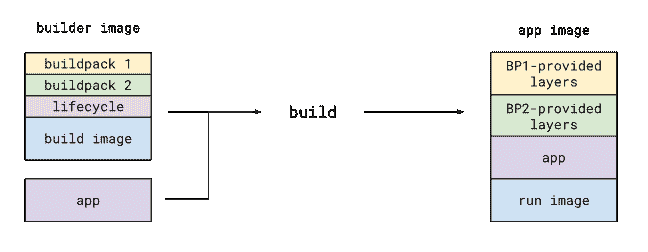
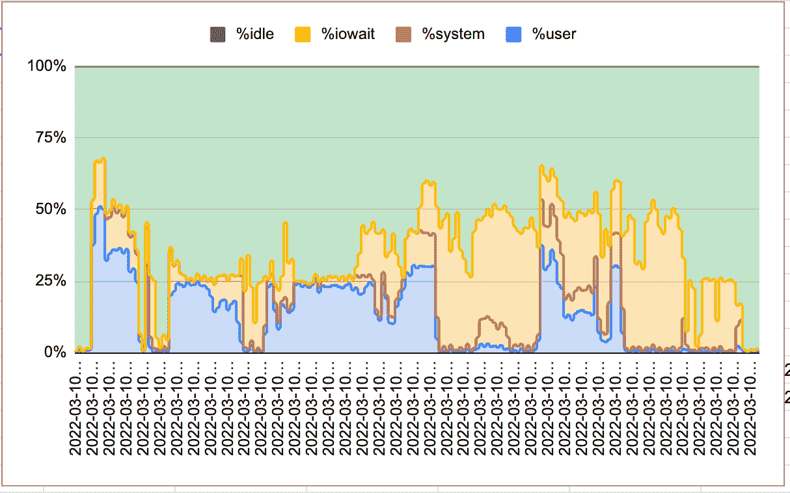
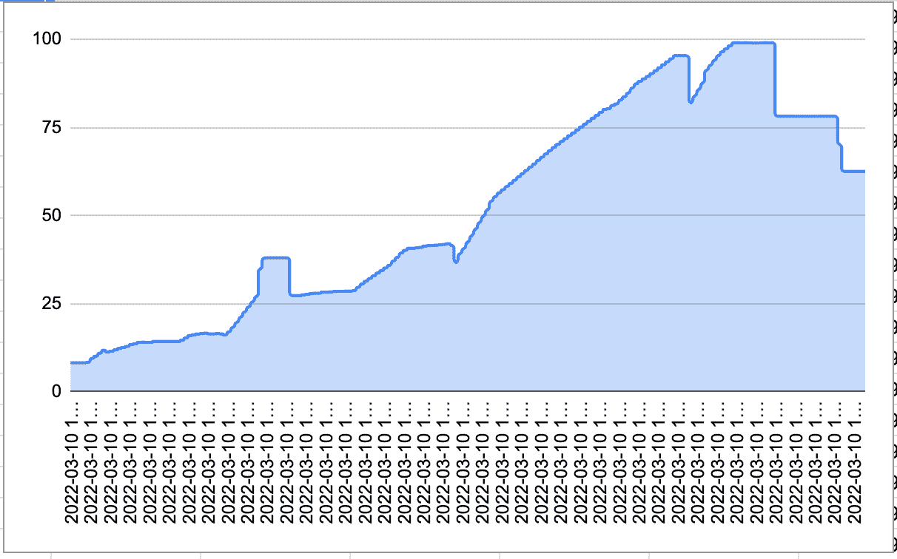

# build packs——终极机器学习容器

> 原文：<https://winder.ai/buildpacks-the-ultimate-machine-learning-container/>

云德。人工智能与网格一起工作。AI(现在的 Lightning.ai)来研究 Buildpacks 如何最小化运行现代平台所需的基本容器的数量。这项工作的总结包括:

*   研究 Buildpack 最佳实践并适应现代机器学习工作负载
*   通过开发可用于生产的构建包，减轻用户负担并降低维护成本
*   关于将来如何利用构建包的报告和培训

下面的视频介绍了这项工作。

[https://s3.eu-west-2.amazonaws.com/assets.winder.ai/blog/2022/220608_Presentation_Buildpacks_ML/220608_Presentation_BuildPacks_For_ML_720p.mp4](https://s3.eu-west-2.amazonaws.com/assets.winder.ai/blog/2022/220608_Presentation_Buildpacks_ML/220608_Presentation_BuildPacks_For_ML_720p.mp4)

## 问题是:如何管理基础容器的爆炸

所有的机器学习(ML)平台都有一个共同的目标:让用户在工作时摆脱不必要的负担。实际上，这意味着让用户专注于他们的 ML 代码，而平台负责可重复的任务。用户通过打包训练代码、依赖文件、配置等将他们的工作提交给远程平台。

打包定制库、系统级捆绑包、硬件和安全规范等项目需求非常复杂。最终结果是 ML 从业者与复杂性作斗争，这降低了效率。

解决这个问题最传统的方法是将 ML 代码和所有依赖项捆绑到一个 tarball 文件中。这种特别的过程很难维护，因为很难定义一个清晰的接口，并且容易出错。

另一种方法是要求用户提供 docker 文件或容器。这样做的问题是，虽然它使过程可重复，但编写一个适当的 Docker 文件需要特定的 Linux 和 Docker 知识，这远远超出了 ML 的范围。因此，MLOps 平台团队试图共享容器，就像当一个平台团队提供其他人可以构建的经批准的机器学习容器一样。

然而，云 ML 环境具有不同的规格(例如，CPU、GPU、TPU 等。).安全团队要求定期修补和更新。高级库可能需要操作系统级的库(例如 PIL ),而您不想将它们包含在其他发行版中。康达 vs 皮普。私人储存库。训练与推理。你甚至可以有不同的“堆栈”，比如 Jupyter 系列的容器。该列表还在不断增长，在大型组织中，这可能会导致数十到数百个单独的 ML Dockerfiles 文件。

这种多样性迫使您编写几十个特别的 docker 文件，不久就很难保持任何级别的可靠性。最近一个值得注意的例子是苹果 M1 硬件的引入，这需要时间来修复 ML 堆栈。如果此时您正在从事 MLOps 平台团队的工作，您将不得不为 M1 架构创建一整套新的 docker 文件，这很有可能会与面向云的 docker 文件相背离。

## 什么是构建包？

Buildpacks 是一个打包引擎，它可以将您的源代码转换成一个图像，而不需要或只需要很少的用户输入。输出是一个标准的开放容器倡议(OCI)映像，这意味着它可以在任何云上运行。简单来说，代码输入，Docker 图像输出。这么简单。答应了！

在我们探讨是什么让这一切成为可能之前，请允许我先澄清一些事情。术语 *Buildpacks* 指的是云原生 Buildpacks 项目(【https://Buildpacks.io/】T2)，而*build packs*指的是负责构建应用的软件组件。稍后我们将详细讨论后者。

构建包只不过是一组随元数据提供的脚本。但是在我描述如何在构建中使用构建包之前，我想花一些时间讨论一下环境。

### 构建和运行映像

一个构建包含两个容器化的环境，对应于两个不同的(但相关的)映像，它们一起工作。**构建映像**是构建脚本(即构建包)有效运行的地方。

这个映像需要预安装所有的包管理器(例如 apt-get、pip、conda ),并且如果需要的话，还需要对任何私有包或数据存储库的适当访问。

**运行映像**提供了运行时启动应用程序的环境。所有构建工件(例如编译过的应用程序)都被 Buildpacks 自动地从构建映像转移到运行映像。这类似于 [Docker 的多阶段构建](https://docs.docker.com/develop/develop-images/multistage-build/)，除了它适用于所有的容器格式。好处是运行时环境可以变得更小、更安全。

### 堆

运行和构建映像对被命名为**堆栈**。栈是一个相对低级的实体，在一般的使用情况下，终端用户不会关心它。然而，知道这是基础图像设置的地方是很好的。想用 Ubuntu Bionic 或者 Alpine Linux 做底座？这是你需要注意的地方。

下面是一个来自官方文件的例子。这只是一个 docker 文件，不比一个`docker build`更复杂，瞧！注意构建映像是如何通过 apt-get 安装`git, wget, jq`来扩展运行映像的。

```py
# 1\. Set a common base
FROM ubuntu:bionic as base

# 2\. Set required CNB information
ENV CNB_USER_ID=1000
ENV CNB_GROUP_ID=1000
ENV CNB_STACK_ID="io.Buildpacks.samples.stacks.bionic"
LABEL io.Buildpacks.stack.id="io.Buildpacks.samples.stacks.bionic"

# 3\. Create the user
RUN groupadd cnb --gid ${CNB_GROUP_ID} && \
  useradd --uid ${CNB_USER_ID} --gid ${CNB_GROUP_ID} -m -s /bin/bash cnb

# 4\. Install common packages
RUN apt-get update && \
  apt-get install -y xz-utils ca-certificates && \
  rm -rf /var/lib/apt/lists/*

# 5\. Start a new run stage
FROM base as run

# 6\. Set user and group (as declared in base image)
USER ${CNB_USER_ID}:${CNB_GROUP_ID}

# 7\. Start a new build stage
FROM base as build

# 8\. Install packages that we want to make available at build time
RUN apt-get update && \
  apt-get install -y git wget jq && \
  rm -rf /var/lib/apt/lists/* && \
  wget https://github.com/sclevine/yj/releases/download/v5.0.0/yj-linux -O /usr/local/bin/yj && \
  chmod +x /usr/local/bin/yj

# 9\. Set user and group (as declared in base image)
USER ${CNB_USER_ID}:${CNB_GROUP_ID} 
```

### 建设者

创建自定义堆栈之后，在深入研究 Buildpacks 的细节之前，我还需要介绍一个组件。这是一个组件，其中一个堆栈和一组构建包一起形成了一个**构建器**，它“允许你控制使用什么构建包以及图像应用基于什么。”

在一个`builder.toml`文件中定义了一个构建器，见下面的例子。首先，它使用`[repository]:[tag]`格式指向一个堆栈 id 和相关的图像名称。其次，它引用任意数量的构建包来包含在构建器中。第三，指定几个构建包组。

这就是事情变得有趣的地方。"构建包组是按照运行顺序定义的构建包条目列表."是的，您可以包含多个组，生命周期(下一节将详细介绍生命周期)将做的是按顺序选择第一个构建包组，该组中的所有构建包都通过检测检查。通过这种机制，您可以高度重用单个构建包，并组合构建器来处理各种场景！

```py
# Stack that will be used by the builder
[stack]
id = "io.Buildpacks.samples.stacks.bionic"
build-image = "cnbs/sample-stack-build:bionic"
run-image = "cnbs/sample-stack-run:bionic"

# Buildpacks to include in builder
[[Buildpacks]]
uri = "samples/Buildpacks/pip"

[[Buildpacks]]
uri = "samples/Buildpacks/conda"

[[Buildpacks]]
uri = "samples/Buildpacks/Poetry"

# Order used for detection
[[order]]
    [[order.group]]
    id = "samples/pip"
    version = "0.0.1"

    [[order.group]]
    id = "samples/conda"
    version = "0.0.1"

# Alternative order, if first one does not pass
[[order]]
    [[order.group]]
    id = "samples/pip"
    version = "0.0.1"

    [[order.group]]
    id = "samples/Poetry"
    version = "0.0.1" 
```

到目前为止，我已经解释了如何定义基本映像，以及如何将它们与构建包结合起来创建有意义的构建序列。在某种程度上，这一切都是前言。

事实上，在绝大多数用例中，您不需要创建自己的构建器，因为已经有现成的构建器可供使用。例如，Paketo 维护了一个记录良好的 [Python builder](https://paketo.io/docs/howto/python/) shopping，Buildpacks 覆盖了主要的包管理器，如 Pip、Pipenv、Miniconda 和 poems。

但是想象一下在你的构建器中包含特定于业务的构建包，比如安全构建包，或者统一标记构建包。在这种情况下，您只需要维护一个构建包，并从其他构建器中引用它。这有点像拥有特定公司的掌舵人图表。

### 构建包

最后，是时候谈谈名为 **Buildpack** 的基础组件了。与 stack 和 builder 相比，您更有可能会遇到 Buildpack 源代码来学习或修改它的功能。

那是什么？“Buildpack 是一组可执行文件，用于检查应用程序源代码，并创建构建和运行应用程序的计划。”这是通过两个脚本和一个元数据文件实现的。

后者充当清单文件，两个脚本实现:1)检测检查(即 bin/detect)，例如，Pip Buildpack 可能寻找一个`requirements.txt`，而 Conda Buildpack 将寻找一个`environment.yml`；2)构建阶段(即 bin/build)实际构建应用程序、设置环境变量或添加应用程序依赖项。例如，一个 Pip 构建包可以通过运行`pip install -r requirements.txt`来实现。

事实上，Buildpack 几乎可以做任何不需要 root 权限的事情。它可以使用配置文件来设置图像的入口点。它可以运行带有定制代码的预构建脚本，等等。

例如，您可以创建一个 Buildpack 来检查一个`business-tags.yaml`文件并在容器上设置标签。或者是一个安装 AWS CUDA 库的`hardware.txt`文件，如果这个文件写着“AWS ”,或者是 Coral TPU 依赖项，如果这个文件写着“Coral”。不再有多个 docker 文件！

### 生命周期

一个**生命周期**是构建包的协调执行，以构成最终的应用映像。在您的主机上启动生命周期的一个非常有用的工具是 [`pack`客户端](https://Buildpacks.io/docs/tools/pack/)；在本节的最后，我列出了更多能够与持续集成系统和 Kubernetes 集成的面向 DevOps 的工具。如前所述，生命周期负责将各个部分组合在一起。这发生在我们启动`pack build sample-app --path samples/apps/java-maven --builder cnbs/sample-builder:bionic`的时候。让我们按顺序看一下每个阶段。

1.  **分析**

验证在构建阶段使用的每个映像的注册表访问。如果注册表访问被拒绝，这将在过程的早期停止构建。为了不陷入冗长的技术细节，我只想提一下，在以前的版本中，这个阶段负责缓存验证，但是最近这个职责已经转移到了下游。

2.  **检测**

这是一个非常重要的阶段。每个 Buildpack 都有一个检测脚本，简单地检查这个 Buildpack 是否适合正在讨论的应用程序。例如，Pip 构建包可能会寻找一个`requirements.txt`文件。如果是这种情况，它只需用`0`代码退出，以便 Buildpacks 将它添加到一个有效的候选集。

根据通过检测的构建包组，构建包计算出满足`builder.toml`配置中指定的顺序组的构建包组。为了清楚起见，我在下面报告我所提到的例子。Buildpacks”寻找第一个通过检测过程的组。如果所有组都失败，检测过程将失败。”

```py
# Order used for detection
[[order]]
    [[order.group]]
    id = "samples/pip"
    version = "0.0.1"

    [[order.group]]
    id = "samples/conda"
    version = "0.0.1"

# Alternative order, if first one does not pass
[[order]]
    [[order.group]]
    id = "samples/pip"
    version = "0.0.1"

    [[order.group]]
    id = "samples/Poetry"
    version = "0.0.1" 
```

3.  **恢复**

此阶段从缓存中恢复图层以优化构建过程。图层是在构建阶段创建的，请继续阅读下一节以了解更多信息。

4.  **建造**

如前所述，每个 Buildpack 都带有一个构建脚本，其中包含将源代码转化为可运行工件的逻辑。当生命周期到达这个阶段时，一些构建包已经被触发，因此构建包可以启动它们各自的构建脚本。

每个构建脚本都写到对应于 Docker 层的专用文件系统位置。这意味着构建过程的结果是一组可以缓存和重用的独立层。

5.  **导出**

最后一个阶段通过将前一阶段创建的源构建包层(BP 提供的层)从构建映像移动到运行映像来组装最终的 OCI 映像(见下图)。在这一阶段，源代码(应用程序)也被移动到最终图像，并设置了一个适当的入口点。



### 集成

为了与构建包交互，我在上面提到了在单个主机上完美工作的`pack`工具。然而，在实际部署中，您希望使用更加复杂的工具包，能够自动构建管道，并将负担转移到远程资源。幸运的是，Buildpacks 项目附带了许多开源集成。

Orb 是 CirceCI 的一个集成，它允许用户在他们的管道中运行 pack 命令。此外， [GitLab Auto DevOps](https://docs.gitlab.com/ee/topics/autodevops/stages.html#auto-build-using-cloud-native-Buildpacks-beta) 附带了对构建包的支持。Jenkins 还可以通过一个叫做 [cnbBuild](https://www.project-piper.io/steps/cnbBuild/) 的步骤来进行构建，这个步骤允许你在 Jenkins 管道中执行构建。

Kubernetes 怎么样？kpack 使用声明性构建器资源非常方便。它可以在应用程序源代码更改或 Buildpack 版本更新时触发自动重建。非常有用！

最后但同样重要的是，Tekton 还有一个[有用的任务来构建并可选地发布一个可运行的映像。](https://github.com/tektoncd/catalog/tree/main/task/buildpacks)

## 用 Docker 进行基准测试

我应该提一下，由于额外的检测开销，Buildpack 的构建时间并不比 pure Docker 快。让我们记住，虽然您必须投入时间和精力手工制作一个优化良好的 Dockerfile 文件，但是 Buildpacks 是完全自动化的，并且增加了极大的灵活性。它知道如何安装几乎任何依赖，并输出一个微小的应用程序图像，没有用户输入！

为了进一步研究这个问题，我在一个示例 Python 项目中比较了 Docker 和 Buildpacks 的构建时间。这不是一个详尽的比较，因为它没有考虑到两个系统之间的灵活性差距。目标仅仅是测量构建性能的差异和资源使用情况。

在依赖性方面，基准测试应用程序通过 apt-get 需要 OpenCV(一个流行的计算机视觉库),通过 Pip 需要它的 Python 包装器。我还通过 Pip 安装 Pandas(一个数据分析包)。

我使用一个有 4 个 vCPUs 和 16GB 内存的虚拟机，从头开始运行一个定时构建和一个重建。下表报告了生成的构建时间。


构建包生成一个新的构建要慢一些，因为运行一个完整的生命周期(见上文)比仅仅构建一个 docker 文件要复杂得多。

Buildpacks 的重建时间要慢得多。这是因为虽然 Docker 可以直接获取之前的构建，但是 Buildpacks 仍然需要运行所有的构建步骤(分析、检测、恢复、构建、导出)。每一步都使用缓存，但这仍然会导致一些额外的运行时间。

很容易最小化由 Buildpacks 构建的容器的大小，因为“工作”是不同的。一个构建包中的优化改进了所有结果容器的大小。您可以通过多阶段 Docker 构建获得相似的图像大小，但是您必须为您负责的每个 Docker 文件手动优化。

最后，记住这是为了**构建**容器。生成的容器以完全相同的方式执行，因此传统容器和 Buildpack 构建的容器没有区别。

### 构建资源使用

让我们快速看一下完整构建过程的资源消耗。构建设置与上一节中使用的相同。下图描述了整个构建过程中的 CPU 使用情况。它强调的是，这项任务相当局限于 IO，至少在下半年是如此。Buildpacks 在此期间所做的主要是合并在“构建”阶段创建的图像层，并将它们导出到最终的运行图像中。



这个过程也非常占用内存。下图显示了构建过程中内存使用的百分比。在构建过程中的某个时候，所有 16GB 的内存都被使用了。



分解构建包的资源使用本身就是一个完整的主题，我们可能会在将来写更多的内容。与本文范围相关的是，虽然您可能希望使用一台具有大量内存的机器来加速构建，但使用大型多核主机不会有太大的不同。

## 摘要

对于负责为公司管理基本容器的团队来说，构建包是一个非常有趣的提议。传统容器通常是独立维护的，这可能会成为维护的噩梦。

构建包通过添加一个额外的逻辑层来定义一个构建如何根据上下文执行，从而简化了这个过程。平台团队可以利用这一点，通过一个简单的基于文件的 API 来公开构建逻辑，该 API 与几乎所有现代工具都兼容。

特别是对于 MLOps 平台团队而言，其结果是更高的灵活性和更低的维护成本。

## 接触

云德。AI 执行这个项目是为了帮助 Grid。AI(现在的 lightning.ai)来改善他们的服务，并最大限度地降低他们的维护成本。然而，我们在温德的工程师。AI 已经准备好并等待通过与您的 MLOps 平台团队集成来帮助您改善服务。

如果您的组织对这项工作感兴趣，我们很乐意与您交谈。请与温德公司的销售团队联系。我们可以聊聊如何帮助你。