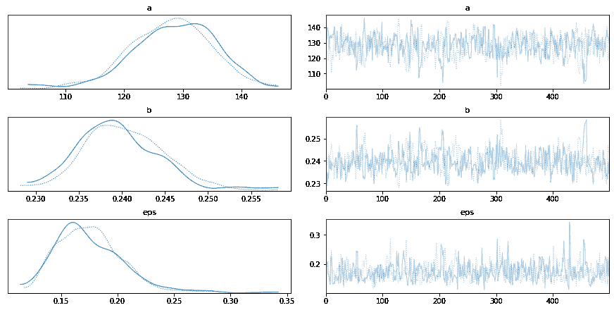
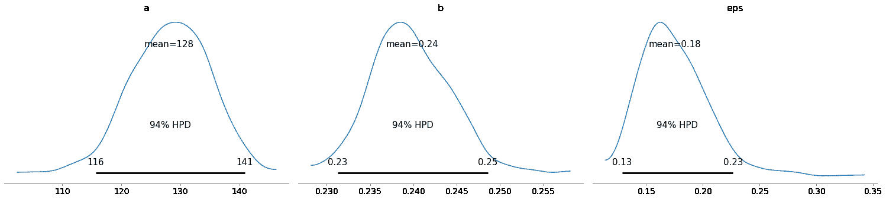
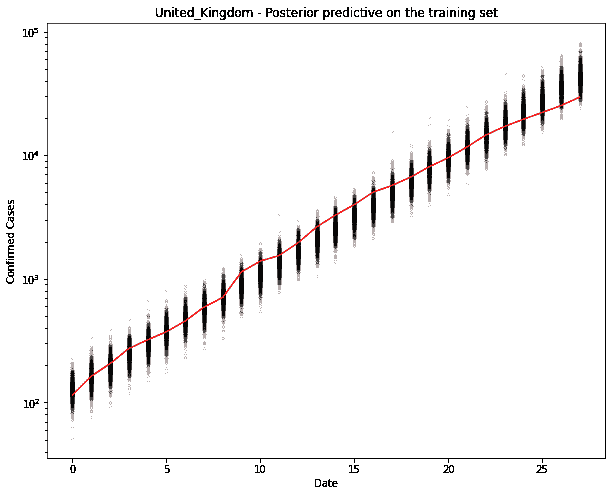
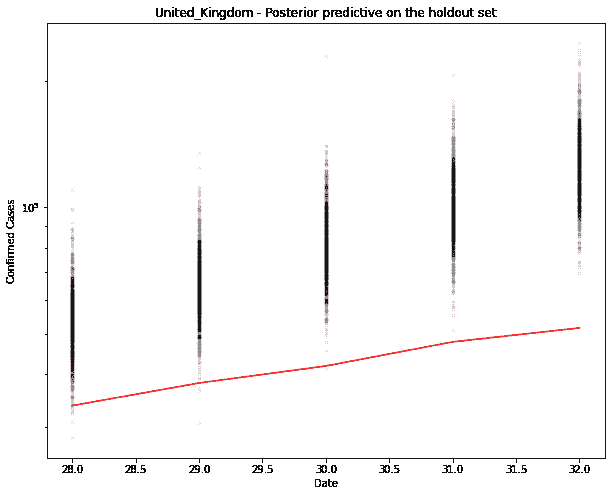

# 新冠肺炎指数贝叶斯模型回测

> 原文：<https://winder.ai/covid-19-exponential-bayesian-model-backtesting/>

这款笔记本建立在[指数贝叶斯模型](https://winder.ai/covid-19-exponential-bayesian-model/)之上，实现简单的回溯测试。这里的想法是保留数据，训练模型，并查看模型能够预测这些结果的程度。

新冠肺炎研究

以下是本系列中其他新冠肺炎文章的链接列表。

*   [新冠肺炎回应:雅典娜项目和贝叶斯分析简介](https://winder.ai/covid-19-response-athena-project-and-an-introduction-bayesian-analysis/)
*   [新冠肺炎指数贝叶斯模型](https://winder.ai/covid-19-exponential-bayesian-model/)
*   [新冠肺炎逻辑斯谛贝叶斯模型](https://winder.ai/covid-19-logistic-bayesian-model/)
*   [新冠肺炎分层贝叶斯逻辑模型与 pymc3](https://winder.ai/covid-19-hierarchical-bayesian-logistic-model-with-pymc3/)
*   [用于部署机器学习模型的简单的基于 Docker 的工作流](https://winder.ai/a-simple-docker-based-workflow-for-deploying-a-machine-learning-model/)

好的模型应该是准确的(产生相同的价值)。

## 初始化和导入

首先，我将快速重新生成在[指数模型](https://winder.ai/covid-19-logistic-bayesian-model/)中描述的模型。

```
!pip install arviz pymc3==3.8
import numpy as np
import pymc3 as pm
import pandas as pd
import matplotlib.pyplot as plt
import theano

# Load data
df = pd.read_csv("https://opendata.ecdc.europa.eu/covid19/casedistribution/csv/", parse_dates=["dateRep"], infer_datetime_format=True, dayfirst=True)
df = df.rename(columns={'dateRep': 'date', 'countriesAndTerritories': 'country'}) # Sane column names
df = df.drop(["day", "month", "year", "geoId"], axis=1) # Not required

# Filter for country (probably want separate models per country, even maybe per region)
country = df[df["country"] == "United_Kingdom"].sort_values(by="date")
# Cumulative sum of data
country_cumsum = country[["cases", "deaths"]].cumsum().set_index(country["date"])
# Filter out data with less than 100 cases
country_cumsum = country_cumsum[country_cumsum["cases"] >= 100]

country = "United_Kingdom"
days_since_100 = range(len(country_cumsum)) 
```

## 创建模型

这就是`pymc3`变得有点不标准的地方。典型的模式是建立一个模型，训练一个模型，然后用不同的数据调用一个预测函数来查看预测。

但是请记住，MCMC 情况下的预测实际上是 MC 样本链。在`pymc3`中，数据是模型的一部分。那么，如何交换模型中的数据呢？像任何其他软件问题一样，您可以用几种方法来解决。

您可以创建一个模型，根据训练数据对其进行训练，然后用维持数据交换原始数据，并生成后验预测。

或者，您可以构建一个工厂(模型生成函数)并用不同的数据调用它两次。我选择了这个选项。下面我在建工厂。

```
def model_factory(country: str, x: np.ndarray, y: np.ndarray):
  with pm.Model() as model:
    t = pm.Data(country + "x_data", x)
    confirmed_cases = pm.Data(country + "y_data", y)

    # Intercept - We fixed this at 100.
    a = pm.Normal("a", mu=100, sigma=10)

    # Slope - Growth rate: 0.2 is approx value reported by others
    b = pm.Normal("b", mu=0.2, sigma=0.5)

    # Exponential regression
    growth = a * (1 + b) ** t

    # Likelihood error
    eps = pm.HalfNormal("eps")

    # Likelihood - Counts here, so poission or negative binomial. Causes issues. Lognormal tends to work better?
    pm.Lognormal(country, mu=np.log(growth), sigma=eps, observed=confirmed_cases)
  return model 
```

现在生成维持数据。一开始很简单。可以使用交叉验证。

```
train_x = days_since_100[:-5]
train_y = country_cumsum["cases"].astype('float64').values[:-5]
hold_out_x = days_since_100[-5:]
hold_out_y = country_cumsum["cases"].astype('float64').values[-5:] 
```

```
# Training
with model_factory(country, train_x, train_y) as model:
    train_trace = pm.sample()
    pm.traceplot(train_trace)
    pm.plot_posterior(train_trace)
    ppc = pm.sample_posterior_predictive(train_trace)
    fig, ax = plt.subplots(figsize=(10, 8))
    ax.plot(train_x, ppc[country].T, ".k", alpha=0.05)
    ax.plot(train_x, train_y, color="r")
    ax.set_yscale("log")
    ax.set(xlabel="Date", ylabel="Confirmed Cases", title=f"{country} - Posterior predictive on the training set") 
```

```
Auto-assigning NUTS sampler...
Initializing NUTS using jitter+adapt_diag...
Sequential sampling (2 chains in 1 job)
NUTS: [eps, b, a]
Sampling chain 0, 0 divergences: 100%|██████████| 1000/1000 [00:03<00:00, 261.26it/s]
Sampling chain 1, 0 divergences: 100%|██████████| 1000/1000 [00:02<00:00, 396.03it/s]
The acceptance probability does not match the target. It is 0.9004074282186247, but should be close to 0.8\. Try to increase the number of tuning steps.
The acceptance probability does not match the target. It is 0.9205165224709694, but should be close to 0.8\. Try to increase the number of tuning steps.
100%|██████████| 1000/1000 [00:10<00:00, 95.17it/s] 
```



```
# New model with holdout data
with model_factory(country, hold_out_x, hold_out_y) as test_model:
    ppc = pm.sample_posterior_predictive(train_trace)
    fig, ax = plt.subplots(figsize=(10, 8))
    ax.plot(hold_out_x, ppc[country].T, ".k", alpha=0.05)
    ax.plot(hold_out_x, hold_out_y, color="r")
    ax.set_yscale("log")
    ax.set(xlabel="Date", ylabel="Confirmed Cases", title=f"{country} - Posterior predictive on the holdout set") 
```

```
100%|██████████| 1000/1000 [00:10<00:00, 93.44it/s] 
```



你可以在上面看到预测超过了观察。有道理。这是一个指数模型。它不能永远继续下去。

记住，在贝叶斯模型中，输出是一个概率分布。MCMC 程序已经多次从该分布中采样(每个点)。

一个预测，如果你真的想要的话，就是这个分布的最大可能性。现在，让我只使用平均值。我们也可以用同样的方法得到置信界限。

```
# Generate the predicted number of cases (assuming normally distributed on the output)
predicted_cases = ppc[country].mean(axis=0).round()
print(predicted_cases) 
```

```
[ 54159\.  66867\.  82414\. 102269\. 126764.] 
```

## 预测误差

从简单开始。误差是预测值(MC 估计值的平均值——注:假设为高斯型)和 1 天和 5 天的实际数据之间的差异。

误差应为 0 例和 0%。正值/百分比意味着我们高估了。

```
def error(actual, predicted):
  return predicted - actual

def print_errors(actuals, predictions):
  for n in [1, 5]:
    act, pred = actuals[n-1], predictions[n-1]
    err = error(act, pred)
    print(f"{n}-day cumulative prediction error: {err} cases ({100 * err / act:.1f} %)")

print_errors(hold_out_y, predicted_cases) 
```

```
1-day cumulative prediction error: 20441.0 cases (60.6 %)
5-day cumulative prediction error: 75156.0 cases (145.6 %) 
```

## 讨论

太好了。因此，现在我们有了一种方法，可以基于保留的数据产生一个简单的误差度量。

有很多方法可以让事情变得更复杂:

*   使用随机维持(在本例中会使结果看起来更好)
*   不同时间段的回溯测试(即不仅仅是过去 5 天，还有中间的 5 天)
*   交叉验证(在不同的随机抵制上训练许多模型，并查看这些误差的平均值和标准偏差)
*   使用更多国家

但是很明显指数模型不太管用。因此，接下来我将使用几个国家，尝试一种新的模式。

## 预言；预测；预告

顺便说一下，您可以使用相同的方法来生成未来的案例。只需传入一个新的 x 值(形状相同)

```
new_x = [hold_out_x[-1] + 1, hold_out_x[-1] + 5]
new_y = [0, 0]
# Predictive model
with model_factory(country, new_x, new_y) as test_model:
    ppc = pm.sample_posterior_predictive(train_trace)
predicted_cases = ppc[country].mean(axis=0).round()
print("\n")
print(f"Based upon this model, tomorrow's number of cases will be {predicted_cases[0]}. In 5 days time there will be {predicted_cases[1]} cases.")
print("NOTE: These numbers are based upon a bad model. Don't use them!") 
```

```
100%|██████████| 1000/1000 [00:10<00:00, 96.04it/s]

Based upon this model, tomorrow's number of cases will be 157520.0\. In 5 days time there will be 375400.0 cases.
NOTE: These numbers are based upon a bad model. Don't use them! 
```