# 新冠肺炎逻辑斯谛贝叶斯模型

> 原文：<https://winder.ai/covid-19-logistic-bayesian-model/>

这篇文章建立在前一篇文章中创建的指数模型的基础上。主要的问题是指数模型不包括一个限制。逻辑模型引入了这一限制。我还执行一些非常基本的回溯测试和未来预测。

新冠肺炎研究

以下是本系列中其他新冠肺炎文章的链接列表。

*   [新冠肺炎回应:雅典娜项目和贝叶斯分析简介](https://winder.ai/covid-19-response-athena-project-and-an-introduction-bayesian-analysis/)
*   [新冠肺炎指数贝叶斯模型](https://winder.ai/covid-19-exponential-bayesian-model/)
*   [新冠肺炎指数贝叶斯模型回测](https://winder.ai/covid-19-exponential-bayesian-model-backtesting/)
*   [新冠肺炎分层贝叶斯逻辑模型与 pymc3](https://winder.ai/covid-19-hierarchical-bayesian-logistic-model-with-pymc3/)
*   [用于部署机器学习模型的简单的基于 Docker 的工作流](https://winder.ai/a-simple-docker-based-workflow-for-deploying-a-machine-learning-model/)

## 什么是逻辑模型？

逻辑模型有一个等式:

$ $ \ frac { dC } { dt } = rC \ bigg(1-\ frac { C } { K } \ bigg)$ $

其中$C$是累计病例数，$r > 0$是感染率，$K > 0$是最终流行规模。这个方程的解是:

$$ C = \frac{K}{1 + Ae^{-rt}} $$

其中:$A = \frac{K - C_0}{C_0}$和$C_0$是零时刻的初始事例数。

当我试图理解一个模型时，我发现用不同的参数绘制模型的几个版本来了解它的行为是很有用的。

```py
import numpy as np
import matplotlib.pyplot as plt

def C(K, r, t, C_0):
  A = (K-C_0)/C_0
  return K / (1 + A * np.exp(-r * t))

def d_C(K, r, t, C_0):
  c = C(K, r, t, C_0)
  return r * c * (1 - c / K)

r = 0.2
K = 1000
C_0 = 100

t = np.linspace(1,60)

fig, ax = plt.subplots(1, 2, figsize=(12,5))
for r in np.linspace(0.1, 0.5, 5):
  ax[0].plot(t, C(K, r, t, C_0), label=f"r = {r:0.2f}")
ax[0].legend(loc="best")
ax[0].set(xlabel="Days since...", ylabel="Cases")
for K in np.linspace(100, 10000, 10):
  ax[1].plot(t, C(K, r, t, C_0), label=f"K = {K:0.1f}")
ax[1].legend(loc="best")
ax[1].set(xlabel="Days since...", ylabel="Cases")

fig, ax = plt.subplots(1, 2, figsize=(12,5))
for r in np.linspace(0.1, 0.5, 5):
  ax[0].plot(t, d_C(K, r, t, C_0), label=f"r = {r:0.2f}")
ax[0].legend(loc="best")
ax[0].set(xlabel="Days since...", ylabel="Cases")
for K in np.linspace(100, 10000, 10):
  ax[1].plot(t, d_C(K, r, t, C_0), label=f"r = {r:0.2f}")
ax[1].legend(loc="best")
ax[1].set(xlabel="Days since...", ylabel="Cases") 
```

```py
[Text(0, 0.5, 'Cases'), Text(0.5, 0, 'Days since...')] 
```

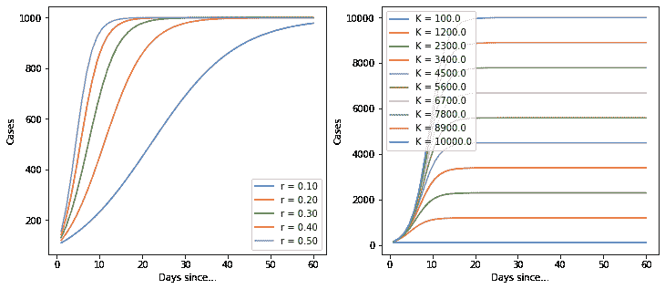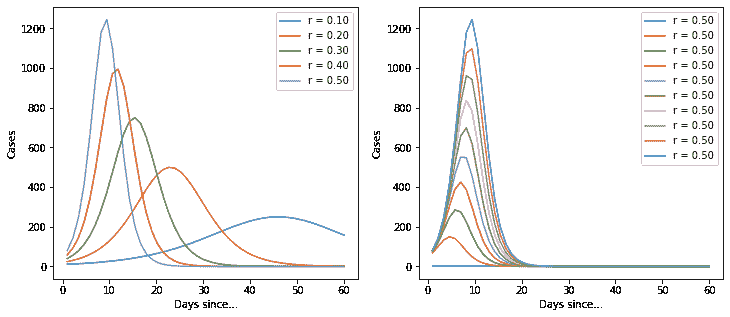

好，这是一个基本的逻辑功能。但是它非常有用，因为它隐含地提供了对案例总数的估计。让我们再次导入数据，建立一个模型。

## 初始化和导入

```py
!pip install arviz pymc3==3.8
import numpy as np
import pymc3 as pm
import pandas as pd
import matplotlib.pyplot as plt
import theano

# Load data
df = pd.read_csv("https://opendata.ecdc.europa.eu/covid19/casedistribution/csv/", parse_dates=["dateRep"], infer_datetime_format=True, dayfirst=True)
df = df.rename(columns={'dateRep': 'date', 'countriesAndTerritories': 'country'}) # Sane column names
df = df.drop(["day", "month", "year", "geoId"], axis=1) # Not required

country = "China"
# Filter for country (probably want separate models per country, even maybe per region)
sorted_country = df[df["country"] == country].sort_values(by="date")
# Cumulative sum of data
country_cumsum = sorted_country[["cases", "deaths"]].cumsum().set_index(sorted_country["date"])
# Filter out data with less than 100 cases
country_cumsum = country_cumsum[country_cumsum["cases"] >= 100]
days_since_100 = range(len(country_cumsum))

# Pull out population size per country
populations = {key: df[df["country"] == key].iloc[0]["popData2018"] for key in df["country"].unique()} 
```

## 逻辑模型

```py
def model_factory(country: str, x: np.ndarray, y: np.ndarray):
  with pm.Model() as model:
    t = pm.Data(country + "x_data", x)
    confirmed_cases = pm.Data(country + "y_data", y)

    # Intercept - We fixed this at 100.
    C_0 = pm.Normal("C_0", mu=100, sigma=10)

    # Growth rate: 0.2 is approx value reported by others
    r = pm.Normal("r", mu=0.2, sigma=0.5)

    # Total number of cases. Depends on the population, more people, more infections.
    # It also depends on the total number of people infected.
    # Start with a prior based upon a guess of the initial population, very weak
    proportion_infected = 5e-05 # This value comes from the rough projection that 80000 will be infected in China
    p = populations[country]
    K = pm.Normal("K", mu=p * proportion_infected, sigma=p*0.1)

    # Logistic regression
    growth = C(K, r, t, C_0)

    # Likelihood error
    eps = pm.HalfNormal("eps")

    # Likelihood - Counts here, so poission or negative binomial. Causes issues. Lognormal tends to work better?
    pm.Lognormal(country, mu=np.log(growth), sigma=eps, observed=confirmed_cases)
  return model 
```

## 模型检验

首先，让我们用一些合成数据来训练它，以确保模型能够真正适合它。更有经验的人不需要这么做！

```py
r = 0.2
K = 80000 # This should look something a bit like China
C_0 = 100
t = np.linspace(1,60)
y_synthetic = C(K, r, t, C_0)
plt.plot(t, y_synthetic)
plt.gca().set_yscale("log") 
```

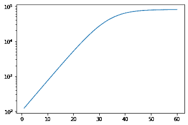

```py
# Training
with model_factory(country, t, y_synthetic) as model:
    train_trace = pm.sample()
    pm.traceplot(train_trace)
    pm.plot_posterior(train_trace)
    ppc = pm.sample_posterior_predictive(train_trace)
    fig, ax = plt.subplots(figsize=(10, 8))
    ax.plot(t, ppc[country].T, ".k", alpha=0.05)
    ax.plot(t, y_synthetic, color="r")
    ax.set_yscale("log")
    ax.set(xlabel="Days since 100 cases", ylabel="Confirmed Cases", title=f"{country} - Posterior predictive on the training set") 
```

```py
Auto-assigning NUTS sampler...
Initializing NUTS using jitter+adapt_diag...
Sequential sampling (2 chains in 1 job)
NUTS: [eps, K, r, C_0]
Sampling chain 0, 89 divergences: 100%|██████████| 1000/1000 [00:06<00:00, 149.55it/s]
Sampling chain 1, 62 divergences: 100%|██████████| 1000/1000 [00:11<00:00, 90.78it/s]
There were 89 divergences after tuning. Increase `target_accept` or reparameterize.
The acceptance probability does not match the target. It is 0.18427594891059368, but should be close to 0.8\. Try to increase the number of tuning steps.
There were 151 divergences after tuning. Increase `target_accept` or reparameterize.
The acceptance probability does not match the target. It is 0.2022248971431065, but should be close to 0.8\. Try to increase the number of tuning steps.
The rhat statistic is larger than 1.4 for some parameters. The sampler did not converge.
The estimated number of effective samples is smaller than 200 for some parameters.
100%|██████████| 1000/1000 [00:10<00:00, 92.99it/s] 
```

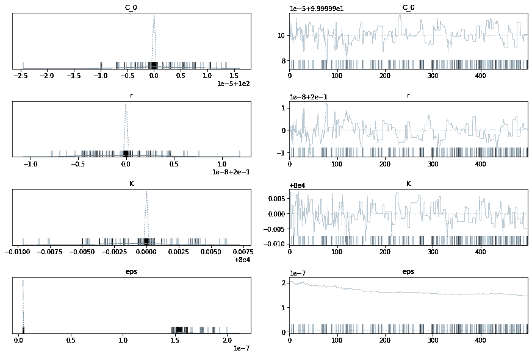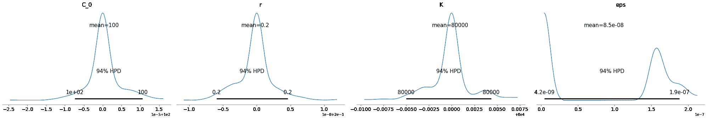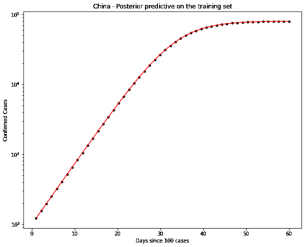

## 中国数据

好了，上面的好像还行。K 参数在这里非常重要。相对于人口而言，明显缺乏确诊病例。

让我们用真实数据试一试。

```py
train_x = days_since_100[:-5]
train_y = country_cumsum["cases"].astype('float64').values[:-5]
hold_out_x = days_since_100[-5:]
hold_out_y = country_cumsum["cases"].astype('float64').values[-5:] 
```

```py
# Training
with model_factory(country, train_x, train_y) as model:
    train_trace = pm.sample()
    pm.traceplot(train_trace)
    pm.plot_posterior(train_trace)
    ppc = pm.sample_posterior_predictive(train_trace)
    fig, ax = plt.subplots(figsize=(10, 8))
    ax.plot(train_x, ppc[country].T, ".k", alpha=0.05)
    ax.plot(train_x, train_y, color="r")
    ax.set_yscale("log")
    ax.set(xlabel="Date", ylabel="Confirmed Cases", title=f"{country} - Posterior predictive on the training set") 
```

```py
Auto-assigning NUTS sampler...
Initializing NUTS using jitter+adapt_diag...
Sequential sampling (2 chains in 1 job)
NUTS: [eps, K, r, C_0]
Sampling chain 0, 0 divergences: 100%|██████████| 1000/1000 [00:03<00:00, 295.79it/s]
Sampling chain 1, 0 divergences: 100%|██████████| 1000/1000 [00:01<00:00, 838.63it/s]
100%|██████████| 1000/1000 [00:10<00:00, 98.26it/s] 
```

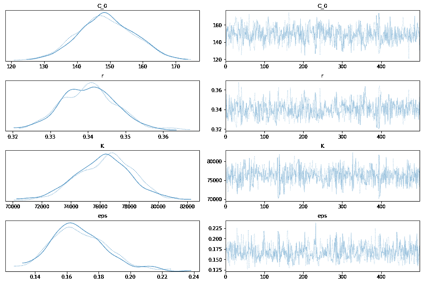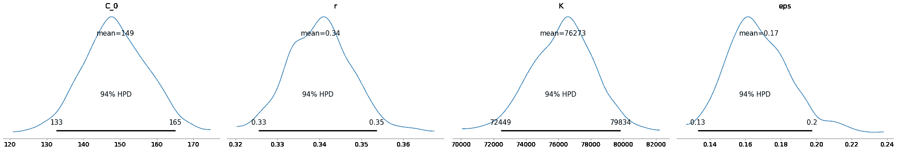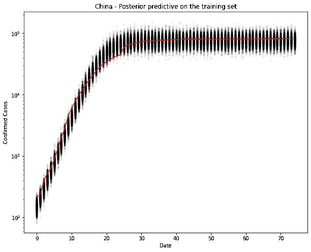

是的，看起来不错。我们来测试一下。我不能想象它会错得太多，因为它现在实际上是一条直线。

```py
# New model with holdout data
with model_factory(country, hold_out_x, hold_out_y) as test_model:
    ppc = pm.sample_posterior_predictive(train_trace)
    fig, ax = plt.subplots(figsize=(10, 8))
    ax.plot(hold_out_x, ppc[country].T, ".k", alpha=0.05)
    ax.plot(hold_out_x, hold_out_y, color="r")
    ax.set_yscale("log")
    ax.set(xlabel="Date", ylabel="Confirmed Cases", title=f"{country} - Posterior predictive on the holdout set") 
```

```py
100%|██████████| 1000/1000 [00:10<00:00, 93.52it/s] 
```

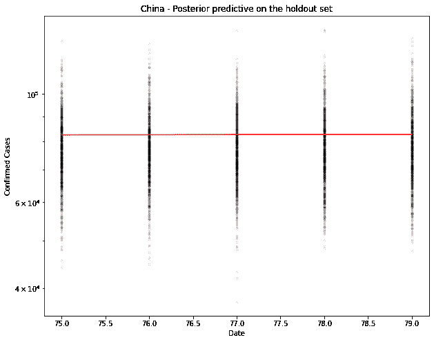

```py
# Generate the predicted number of cases (assuming normally distributed on the output)
predicted_cases = ppc[country].mean(axis=0).round()
print(predicted_cases)
def error(actual, predicted):
  return predicted - actual

def print_errors(actuals, predictions):
  for n in [1, 5]:
    act, pred = actuals[n-1], predictions[n-1]
    err = error(act, pred)
    print(f"{n}-day cumulative prediction error: {err} cases ({100 * err / act:.1f} %)")

print_errors(hold_out_y, predicted_cases) 
```

```py
[76862\. 77142\. 77070\. 77337\. 77369.]
1-day cumulative prediction error: -5603.0 cases (-6.8 %)
5-day cumulative prediction error: -5329.0 cases (-6.4 %) 
```

```py
new_x = [hold_out_x[-1] + 1, hold_out_x[-1] + 5]
new_y = [0, 0]
# Predictive model
with model_factory(country, new_x, new_y) as test_model:
    ppc = pm.sample_posterior_predictive(train_trace)
predicted_cases = ppc[country].mean(axis=0).round()
print("\n")
print(f"Based upon this model, tomorrow's number of cases will be {predicted_cases[0]}. In 5 days time there will be {predicted_cases[1]} cases.") 
```

```py
100%|██████████| 1000/1000 [00:10<00:00, 91.94it/s]

Based upon this model, tomorrow's number of cases will be 76879.0\. In 5 days time there will be 78040.0 cases.
NOTE: These numbers are based upon a bad model. Don't use them! 
```

## 英国数据

让我们用英国的数据再试一次。

```py
country = "United_Kingdom"
# Filter for country (probably want separate models per country, even maybe per region)
sorted_country = df[df["country"] == country].sort_values(by="date")
# Cumulative sum of data
country_cumsum = sorted_country[["cases", "deaths"]].cumsum().set_index(sorted_country["date"])
# Filter out data with less than 100 cases
country_cumsum = country_cumsum[country_cumsum["cases"] >= 100]
days_since_100 = range(len(country_cumsum))

# Pull out population size per country
populations = {key: df[df["country"] == key].iloc[0]["popData2018"] for key in df["country"].unique()} 
```

```py
train_x = days_since_100[:-5]
train_y = country_cumsum["cases"].astype('float64').values[:-5]
hold_out_x = days_since_100[-5:]
hold_out_y = country_cumsum["cases"].astype('float64').values[-5:] 
```

```py
# Training
with model_factory(country, train_x, train_y) as model:
    train_trace = pm.sample()
    pm.traceplot(train_trace)
    pm.plot_posterior(train_trace)
    ppc = pm.sample_posterior_predictive(train_trace)
    fig, ax = plt.subplots(figsize=(10, 8))
    ax.plot(train_x, ppc[country].T, ".k", alpha=0.05)
    ax.plot(train_x, train_y, color="r")
    ax.set_yscale("log")
    ax.set(xlabel="Date", ylabel="Confirmed Cases", title=f"{country} - Posterior predictive on the training set") 
```

```py
Auto-assigning NUTS sampler...
Initializing NUTS using jitter+adapt_diag...
Sequential sampling (2 chains in 1 job)
NUTS: [eps, K, r, C_0]
Sampling chain 0, 0 divergences: 100%|██████████| 1000/1000 [00:03<00:00, 262.76it/s]
Sampling chain 1, 0 divergences: 100%|██████████| 1000/1000 [00:03<00:00, 311.88it/s]
The acceptance probability does not match the target. It is 0.901537203821684, but should be close to 0.8\. Try to increase the number of tuning steps.
100%|██████████| 1000/1000 [00:10<00:00, 93.39it/s] 
```


是的，看起来不错。我们来测试一下。我不能想象它会错得太多，因为它现在实际上是一条直线。

```py
# New model with holdout data
with model_factory(country, hold_out_x, hold_out_y) as test_model:
    ppc = pm.sample_posterior_predictive(train_trace)
    fig, ax = plt.subplots(figsize=(10, 8))
    ax.plot(hold_out_x, ppc[country].T, ".k", alpha=0.05)
    ax.plot(hold_out_x, hold_out_y, color="r")
    ax.set_yscale("log")
    ax.set(xlabel="Date", ylabel="Confirmed Cases", title=f"{country} - Posterior predictive on the holdout set") 
```

```py
100%|██████████| 1000/1000 [00:10<00:00, 92.85it/s] 
```

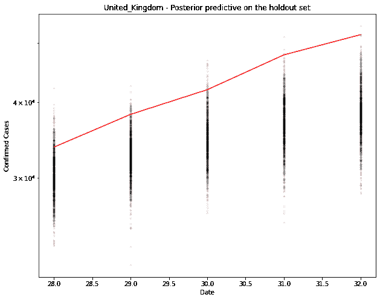

```py
# Generate the predicted number of cases (assuming normally distributed on the output)
predicted_cases = ppc[country].mean(axis=0).round()
print(predicted_cases)
def error(actual, predicted):
  return predicted - actual

def print_errors(actuals, predictions):
  for n in [1, 5]:
    act, pred = actuals[n-1], predictions[n-1]
    err = error(act, pred)
    print(f"{n}-day cumulative prediction error: {err} cases ({100 * err / act:.1f} %)")

print_errors(hold_out_y, predicted_cases) 
```

```py
[30386\. 32655\. 34929\. 36882\. 38485.]
1-day cumulative prediction error: -3332.0 cases (-9.9 %)
5-day cumulative prediction error: -13123.0 cases (-25.4 %) 
```

```py
new_x = [hold_out_x[-1] + 1, hold_out_x[-1] + 5]
new_y = [0, 0]
# Predictive model
with model_factory(country, new_x, new_y) as test_model:
    ppc = pm.sample_posterior_predictive(train_trace)
predicted_cases = ppc[country].mean(axis=0).round()
print("\n")
print(f"Based upon this model, tomorrow's number of cases will be {predicted_cases[0]}. In 5 days time there will be {predicted_cases[1]} cases.") 
```

```py
100%|██████████| 1000/1000 [00:10<00:00, 92.23it/s]

Based upon this model, tomorrow's number of cases will be 40037.0\. In 5 days time there will be 43740.0 cases. 
```

英国略低于。它似乎比模型预测的要慢一点。