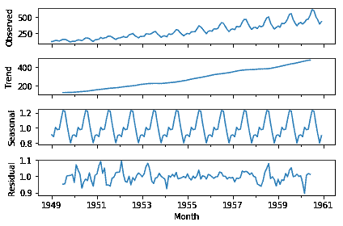

# 去除季节性数据趋势

> 原文：<https://winder.ai/detrending-seasonal-data/>

# 去除季节性数据趋势

欢迎光临！本车间来自 [Winder.ai](https://Winder.ai/?utm_source=winderresearch&utm_medium=notebook&utm_campaign=workshop&utm_term=individual) 。注册以获得更多免费的研讨会、培训和视频。

`statsmodels`是一个时间序列数据分析的综合库。它有一套非常简洁的函数来还原数据。因此，如果您发现您的要素有任何与时间相关的趋势，那么请尝试一下。

它本质上符合乘法模型:

y(t) =水平*趋势*季节性*噪声美元

下面我们有一些 20 世纪 50 年代的数据，显示了乘坐一家航空公司航班的人数(每月，以千计)。你可以看到明显有一些季节性变化。

```
from pandas import Series
import matplotlib.pyplot as plt

series = Series.from_csv('https://s3.eu-west-2.amazonaws.com/assets.winderresearch.com/data/international-airline-passengers.csv', header=0)
series.plot()
plt.show() 
```

```
/opt/conda/lib/python3.6/site-packages/pandas/core/series.py:2849: FutureWarning: from_csv is deprecated. Please use read_csv(...) instead. Note that some of the default arguments are different, so please refer to the documentation for from_csv when changing your function calls
  infer_datetime_format=infer_datetime_format) 
```


```
from statsmodels.tsa.seasonal import seasonal_decompose
result = seasonal_decompose(series, model='multiplicative')
result.plot()
plt.show() 
```

```
/opt/conda/lib/python3.6/site-packages/statsmodels/compat/pandas.py:56: FutureWarning: The pandas.core.datetools module is deprecated and will be removed in a future version. Please use the pandas.tseries module instead.
  from pandas.core import datetools 
```



请注意它如何很好地消除了数据的季节性差异。剔除季节变化后，趋势相当一致。