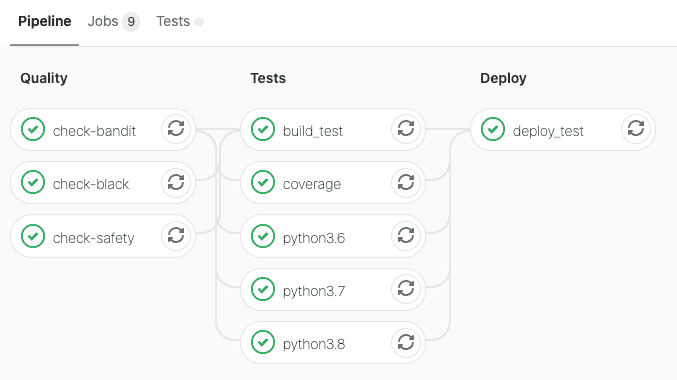

# 开发现实生活中的项目

> 原文：<https://winder.ai/developing-a-real-life-project/>

我经常被问及一些徒劳的问题，比如“你是怎么得出这个结论的？”。其他时候，我不太喜欢这些，我会被问到类似“你估计了 X，为什么用了 2*X？”对此，我给出了“估计”一词的定义。这两类问题都与研发过程有关。非开发人员，尤其是非工程师，通常从未接触过研发过程。它是高度非线性的。当进展顺利时，进展很快，但其他时候你会陷入困境。

在我的一个[强化学习](https://rl-book.com)项目中，我需要一个库来与一些新的伺服系统通信。我认为发布一个最初开发的日志来演示从头开始构建一个项目是很有趣的。

这是一个 Python 库，所以我希望你有一些这方面的经验，像往常一样，我不想打印大量的代码，所以我在全文中链接了这个库。我建议您看看我在文本中展示的提交，以了解我的想法。主要有五个阶段:[让它工作](#phase-1---get-it-working)，[不要重复自己](#phase-2---dont-repeat-yourself-dry)，[创建抽象](#phase-3---creating-abstractions)，[分离类](#phase-4---separating-classes)和[发布](#phase-5---release)。

## 阶段 1 -让它工作

你的首要关注点应该是让事情运转起来。不要把时间浪费在漂亮或幻想上。你的时间很昂贵，你和你的利益相关者(如妻子)都需要快速的反馈。没有这一点，他们和你都会对你正在做的事情失去信心。

### 存储库设置

首先，我喜欢创建一个带有自述文件的[空白回购](https://gitlab.com/WinderAI/robotics/lx16a/-/tree/c0a564f9525cd17a58977a558630b1bf554593c3/)(如果它还不存在的话)。这提醒我要保持清醒，这是我最基本但非常有用的灾难恢复策略。

接下来，我需要设置我的构建链。有很多意见，工具每周都在变化/改进。我使用 [pyenv](https://github.com/pyenv/pyenv) 进行 Python 版本管理。将 Python 版本设置为最新版本(`pyenv local 3.8.2`)是定义我的构建的第一步。

一个常见的 Python 抱怨是依赖性管理是地狱。我喜欢使用一个叫做[诗歌](https://github.com/python-poetry/poetry/)的工具，它是基于`pyproject.toml`提议的( [PEP-518](https://www.python.org/dev/peps/pep-0518/) )。所以在做了一个`poetry init`并添加了一些我知道我会需要的依赖项(比如用于串行通信的`pyserial`和用于开发的`pytest`和`black`)之后，我就准备好了。此时，我将启动开发环境，并确保它使用的是`poetry install`创建的虚拟环境。

### 第一代码

在我这篇文章的第一个假设中，我提出项目失败的概率与从一无所有到你可以展示给你的孩子看的时间成正比。

尽可能快地让某样东西工作是至关重要的。最好的方法是写一个快速脚本，这也是 Python 如此伟大的原因。定义你想做什么，写一个脚本，完全程序化，没有函数，没有类，什么都没有(震惊！).

所以我在我的库的根目录下创建了一个`main.py`,并开始破解。首先我想读取伺服的位置(我的是一个带位置反馈的数字串行伺服-耶！)然后让伺服动起来。我相信这会打动我 5 岁的孩子(和我)。

这是我找出通信协议数据表的地方(在给 Hiwonder support 发电子邮件后——这应该没有必要！)是在 dropbox 文件夹中提供给我的🤷。我知道对吗？并不能激发信心。PDF 文件[包含在存储库](https://gitlab.com/WinderAI/robotics/lx16a/-/tree/0.0.1/documentation)中。

不幸的是，该协议没有终止序列，这使得它很难阅读，因为如果不解析数据包，你就不知道数据包会有多长。我只是读一下，然后暂时依靠超时。也许我们以后可以做些更聪明的事。

在按正确的顺序得到这些字节后，我就可以读取位置了！干得好。来自[的响应代码](https://gitlab.com/WinderAI/robotics/lx16a/-/blob/a87f4ce79d86fe50eb9c2d0fb8a7e67b52ed1e92/main.py)是:

```py
2020-06-12 09:23:19.714 | DEBUG    | __main__:<module>:9 - b'UU\x01\x03\x1c\xdf'
2020-06-12 09:23:19.715 | DEBUG    | __main__:<module>:10 - 6
2020-06-12 09:23:20.719 | DEBUG    | __main__:<module>:14 - b'UU\x01\x05\x1c\xec\x01\xf0'
2020-06-12 09:23:20.719 | INFO     | __main__:<module>:18 - The current position of servo 1 is: (496,) 
```

现在我们需要写一个位置。应该不会太难吧？复制/粘贴？不完全是。API 有点混乱，但结果是你必须在特定时间发出移动命令，其中时间是 0。移动伺服需要一秒钟。所以我们也需要一点延迟。[这个代码](https://gitlab.com/WinderAI/robotics/lx16a/-/blob/56d3b4c176f1bf6d2a31811cffe4ceb2e0c2d44b/main.py)的结果如下。


```py
2020-06-12 10:40:55.210 | DEBUG    | __main__:<module>:11 - b'UU\x01\x03\x1c\xdf'
2020-06-12 10:40:55.212 | DEBUG    | __main__:<module>:12 - 6
2020-06-12 10:40:56.216 | DEBUG    | __main__:<module>:16 - b'UU\x01\x05\x1c.\x03\xac'
2020-06-12 10:40:56.216 | INFO     | __main__:<module>:20 - The current position of servo 1 is: (940,)
2020-06-12 10:40:56.217 | DEBUG    | __main__:<module>:24 - b'UU\x01\x03\x01\xfa'
2020-06-12 10:40:56.217 | DEBUG    | __main__:<module>:25 - 6
2020-06-12 10:40:57.218 | DEBUG    | __main__:<module>:32 - b'UU\x01\x03\x1c\xdf'
2020-06-12 10:40:57.219 | DEBUG    | __main__:<module>:33 - 6
2020-06-12 10:40:58.224 | DEBUG    | __main__:<module>:37 - b'UU\x01\x05\x1c\xfd\x00\xe0'
2020-06-12 10:40:58.225 | INFO     | __main__:<module>:41 - The current position of servo 1 is: (224,) 
```

太棒了。第一阶段到此为止。

## 阶段 2 -不要重复自己(干)

我花了相当多的时间设计那些十六进制命令字符串。那是痛苦的。所以我的第一项工作是想出一个方法来自动为我创建那些字符串。起初我开始编写自己的方法，但后来我想，“将字节转换成已知的包格式一定是一件事吧？”所以我搜索了一下，找到了[构建库](https://github.com/construct/construct)。这是一个允许你定义二进制命令结构的库。

### 定义命令结构

我定义了一个命令结构来匹配数据表。现在更加容易理解了，但是我仍然需要手动计算十六进制值。我已经太老了，所以接下来我将创建一个函数来填充我的信息，给定一个 id、命令和数据。

这样做的好处立竿见影。我现在可以通过任何我喜欢的位置，让它摆动。

在这一点上，我意识到我解析读取值是不正确的。我花了几分钟才弄明白。第一个问题是我使用了错误的字节位置，第二个问题是数字是用 c 风格的二进制补码表示的。Python 有一个名为`ctypes`的库，允许我进行转换。之后我很快写了一个函数并添加了一个简单的内嵌测试！

为了防止这些与字节位置相关的问题，最后要做的是使用构造结构来解析数据包。在那之后，它相当健壮，但是开始看起来有点混乱。

```py
2020-06-12 11:53:59.391 | DEBUG    | __main__:<module>:56 - b'UU\x01\x03\x1c\xdf'
2020-06-12 11:53:59.391 | DEBUG    | __main__:<module>:57 - 6
2020-06-12 11:54:00.396 | INFO     | __main__:<module>:62 - Read: Container: 
    header = b'UU' (total 2)
    id = 1
    length = 5
    command = 28
    data = b'\xbf\x02' (total 2)
    checksum = 28
2020-06-12 11:54:00.396 | INFO     | __main__:<module>:63 - The current position of servo 1 is: 703
2020-06-12 11:54:00.396 | DEBUG    | __main__:<module>:67 - b'UU\x01\x05\x01\xbc\x02:'
2020-06-12 11:54:00.397 | DEBUG    | __main__:<module>:68 - 8
2020-06-12 11:54:01.402 | DEBUG    | __main__:<module>:75 - b'UU\x01\x03\x1c\xdf'
2020-06-12 11:54:01.403 | DEBUG    | __main__:<module>:76 - 6
2020-06-12 11:54:02.407 | INFO     | __main__:<module>:81 - Read: Container: 
    header = b'UU' (total 2)
    id = 1
    length = 5
    command = 28
    data = b'\xbf\x02' (total 2)
    checksum = 28
2020-06-12 11:54:02.408 | INFO     | __main__:<module>:82 - The current position of servo 1 is: 703 
```

### 重构为助手方法

当你看到或感觉代码变得“混乱”时，这是重构助手函数的时候了。但是请注意，在您实际看到代码重复之前，您并不想这样做。很容易陷入过早优化的陷阱，在实际需要之前就开始创建助手方法/类。这只是让代码更难理解。我听到的另一种说法是，如果你不能在不滚动的情况下在一个屏幕上显示一个逻辑块，那么就该使用方法了。总行数可能会增加，但是正在工作的代码块将更容易被人类解析。

一个明显的重复是用来获得伺服位置的代码。于是我[从那个](https://gitlab.com/WinderAI/robotics/lx16a/-/blob/931b1cb26b95525e53cccb1b49904c7a23e0ddb1/main.py)开始。接下来，对移动请求做同样的[是有意义的，因为这是一个类似于获取位置请求的命令。最后我](https://gitlab.com/WinderAI/robotics/lx16a/-/blob/b04bf2ca58b3492439e5f4deb384ee908577eb9a/main.py)[添加了一个获取伺服 ID 的方法](https://gitlab.com/WinderAI/robotics/lx16a/-/blob/d0063ca9e2b36929b3d19c737091e7edc23d2cce/main.py)来找出我不知道的连接伺服的 ID。

## 阶段 3 -创建抽象

现在我们在 helper 方法中有了一切，我们不再重复太多代码。但是现在这个文件超过了 100 行，感觉我们开始失去结构了。正是在这一点上，我开始考虑创造一些抽象。然后，如果抽象足够解耦，我可以将它们转移到另一个文件中。

这不是一项容易的任务。你只能通过实践来学习如何设计好的抽象，并且需要数年才能掌握。很难设计出既能隐藏足够细节又能保持简单易懂的抽象概念。许多初学者倾向于过度抽象，过早地创建太多，这使得他们的代码更难理解，而不是更容易。试着在代码中平衡抽象的需求和结构的数量。将数字抽象最小化到你开始失去结构的程度。

我很难描述。其他专业人士可以更好地阐述这个问题。但这是我的判断；我正在平衡被代码的重量压垮的感觉和试图理解它的压力。但是因为我是写代码的人，所以我很难把自己分离出来，去回忆第一次看这些代码的感觉。

### 第一次抽象

查看代码的最新版本[，我可以总结出有两种类型的代码:一种是与伺服系统通信的低级类型，另一种是帮助我执行动作的高级类型。我决定把这两种类型称为协议代码和控制器代码。](https://gitlab.com/WinderAI/robotics/lx16a/-/blob/d0063ca9e2b36929b3d19c737091e7edc23d2cce/main.py)

我还可以考虑参与伺服操作的实体。有些是物理的，像伺服本身。其他的是虚拟的，如串行通信。这就是领域驱动设计和其他公认范例发挥作用的地方。但是我发现这些倾向于产生过多的抽象。

前面两个描述代表了解决同一个问题的两种方法。我发现正是这两种方法的结合产生了最好的抽象。第一个确保我们只设计代码需要的抽象。第二种是理论方法，有助于设计更好的边界和促进凝聚力。

抽象还有一个技术原因。如果你看看代码，你会发现串行通信基本上是全局的。这是不可测试的。我们需要找到一种注射的方法，这样我们就可以在测试中模拟出来。

经过一点修补，我认为抽象是必要的。它不仅封装了高级控制器代码，还反映了现实生活中的实体。这通过了有用和真实的测试。我们可以把它进一步分解，有一个纯粹的伺服实体，并分离出 CQS 风格的命令。但我认为在现阶段这有点过了。这个我以后再考虑。

但是我有点纠结于决定`Servo`如何交流。它应该直接使用序列吗？或者它不应该关心底层协议吗？在这一点上，我并不完全信服。我的经验告诉我，我需要把串口抽象掉(比如，如果我们想通过 TCP 控制它呢？)但现在我让它自由飞翔。这意味着我要把串行对象传递给伺服系统。

### 第二次尝试

在我第一次[尝试](https://gitlab.com/WinderAI/robotics/lx16a/-/blob/fc83c8e9da0fbbfbc13835c0efd7da652514a4d5/main.py)创建`Servo`抽象之后，我对一个伺服实例不能真正代表一个真正的伺服系统的方式并不完全满意，因为它总是有一个存在危机。每当我们想执行一个命令时，它必须查询 ID。我觉得伺服的 ID 是实体的一个具体元素，所以我想修复它。相比之下，这就像一个位置，这是不固定的。如果我们不知道 ID，我们应该有另一种方法来构造它。这是一个[的小变化](https://gitlab.com/WinderAI/robotics/lx16a/-/blob/c867df956cafd24c22060bfcdc6023e0834efa05/main.py)，但在后来会有很大的影响。

### 抽象出协议

好了，现在文件顶部的位变得烦人了。它阻碍了我们新的抽象概念的酷性。所以现在我要思考如何改善这一点。首先，让我们将这些常量移到另一个文件中。但是等等，在此之前，我们需要一个更好的文件结构，否则 python 不会喜欢导入。所以现在我[花时间](https://gitlab.com/WinderAI/robotics/lx16a/-/blob/b81c7db2547f31ee339256d4f179c2955d439d87/main.py)添加一个合适的 Python 应用程序结构。

这样一来，我可以创建一个新的`protocol.py`文件，隐藏所有的包构建和解析。这比听起来更棘手，因为目前没有协议代码涉及串行通信。这在某种程度上很好，因为它将协议从串行机制中分离出来。但是又一次感觉到`Servo`类做得太多了；建筑，写作，阅读，解析。怎样才能减轻负担？如何将协议从伺服中分离出来？

再次查看代码，我可以看到有两种基本的通信模式。一个命令，比如当我设置位置时，一个查询——一个命令和一个响应——比如当我得到位置时。我可以将它隐藏在一个`Protocol`类中，并在那里传递串行通信。[这包括](https://gitlab.com/WinderAI/robotics/lx16a/-/blob/529947ba0aabd66f0faf1e29f1a59b7fe3847daf/main.py#L43)命令函数中的一点花哨，但这样做允许我传递可选数据。然后我可以在查询函数中重用命令函数。

接下来，我将包创建功能[隐藏在协议](https://gitlab.com/WinderAI/robotics/lx16a/-/blob/1fccd4eeed880028bfa51d5235c81701e36aaf8a/main.py)类中。

## 第 4 阶段-分类

现在我有了两个清晰的抽象，`Servo`和`Protocol`，我准备将代码移动到单独的文件中。我们想这样做有三个原因。

1.  有了清晰的分界线，你就不需要看协议代码来理解伺服代码，反之亦然。
2.  通过分割成单独的文件，这使得文件中的行数很少。
3.  使得单元测试更容易。

移动之后，你可以看到主文件[现在几乎是空的](https://gitlab.com/WinderAI/robotics/lx16a/-/blob/a70947d3734a83038de63d3d812f3eff1a76fce7/main.py)。在我对这个库做任何事情之前，现在是添加单元测试的时候了。

### 添加测试

人们可能会说我疯了，因为我等到现在才添加测试。我不认为我是，因为建筑一直在快速变化。在这之前进行测试会增加我的工作量，因为每次我做出改变，我都必须修正测试。我在我的作品中也发现了这一点；大部分时间我都在学习和解决问题。只有当设计完成并发布到生产/公开时，你才应该添加测试。在此之前，在我看来，是浪费击键。

现在我已经添加了测试，由于抽象和注入控制类，使用模拟相当简单，我准备开始向`Servo`类添加更多的功能。这只是浏览数据手册并添加更多细节的过程。我不会用这些变化来烦你的。

## 第 5 阶段-发布

现在它已经处于某种工作状态，是时候向全世界发布了。注意，不一定要完美。你不需要完美的文档，100%的测试，完整的功能。随着时间的推移，那会到来的。如果你或者其他人使用你的库，更新的请求将会到来，你可以在那时更新它们。

接下来最重要的事情是让您的构建管道启动并运行，这样您就可以推进到 pypi。这已经超出了本文的范围，所以我在这里不再赘述。在我重新梳理了 Python 测试、构建和 Gitlab 的 CI/CD 的错综复杂之后，我终于有了一个工作管道。本次推送版本 [0.0.1 到 pypi](https://pypi.org/project/lx16a/) 。



## 结论

这篇文章的目标是提供 Python 库的端到端开发的第一手资料，以及一路上的所有调试。太多时候，人们认为开发人员从零开始到超级流行的库根本不是一蹴而就的。但在现实中，有大量的调试，头发拉和咖啡前进的道路上。

注意我花了多长时间才开始分离代码。就像微服务一样，在适当的时候将代码分割开来要比将它们重新合并在一起容易得多。总是推迟拆分代码，直到领域明显不同。

这花了我一整天的时间。考虑到我在同一时间写这篇文章，我不认为这太糟糕了。如果我在没有这篇博文的情况下做这件事，我可能会跳过一些章节，直接进入抽象部分。但是我不能保证它们是相同的抽象，这个过程让我确信我现在拥有的是好的。