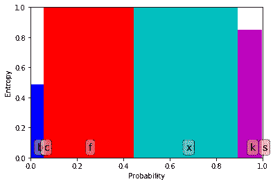
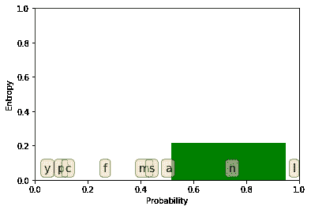

# 基于熵的特征选择

> 原文：<https://winder.ai/entropy-based-feature-selection/>

# 基于熵的特征选择

欢迎光临！本车间来自 [Winder.ai](https://Winder.ai/?utm_source=winderresearch&utm_medium=notebook&utm_campaign=workshop&utm_term=individual) 。注册以获得更多免费的研讨会、培训和视频。

评估特征重要性的一个简单方法(我们将在后面讨论)是计算预期分裂的熵。

在本例中，我们将查看一个名为[“蘑菇数据集”](https://archive.ics.uci.edu/ml/datasets/mushroom)的真实数据集。这是一个关于有毒和可食用蘑菇的大量数据集合。

属性信息:(类:食用=e，有毒=p) 1。帽形:钟形=b，圆锥形=c，凸形=x，扁平形=f，圆球形=k，凹形=s 2。帽状表面:纤维状=f，凹槽=g，鳞状=y，光滑=s 3。帽色:棕色=n，浅黄色=b，肉桂色=c，灰色=g，绿色=r，粉色=p，紫色=u，红色=e，白色=w，黄色=y 4。淤青？:淤青=t，no=f 5。气味:杏仁=a，茴香=l，杂酚油=c，鱼腥味=y，恶臭=f，霉味=m，无=n，刺鼻=p，辛辣=s

```
# Load the data with a library called pandas. Pandas is very cool, and we will be using it a lot.
import pandas as pd
import numpy as np

# We're going to use the display module to embed some outputs
from IPython.display import display

# Read data using Pandas from the UCI data repository.
feature_names = ["poisonous", "cap-shape", "cap-surface", "cap-color", "bruises?", "odor", "gill-attachment", "gill-spacing", "gill-size", "gill-color", "stalk-shape", "stalk-root", "stalk-surface-above-ring", "stalk-surface-below-ring", "stalk-color-above-ring", "stalk-color-below-ring", "veil-type", "veil-color", "ring-number", "ring-type", "spore-print-color", "population", "habitat"]
X = pd.read_csv("https://archive.ics.uci.edu/ml/machine-learning-databases/mushroom/agaricus-lepiota.data", header=0, names=feature_names)
y = X["poisonous"]                      # Select target label
X.drop(['poisonous'], axis=1, inplace=True)   # Remove target label from dataset
display(X.head())                       # Show some data

y = y.map({"e": 0, "p": 1})             # Mapping the classes to zeros and ones, not strictly necessary.
display(y.head()) 
```

|  | 帽状 | 帽状表面 | 瓶盖颜色 | 淤青？ | 气味 | 鳃附着 | 鳃间距 | 鳃大小 | 鳃色 | 茎状的 | ... | 环下茎面 | 环上茎色 | 茎色低于环 | 面纱型 | 面纱颜色 | 响铃次数 | 环形 | 孢子印色 | 人口 | 栖息地 |
| --- | --- | --- | --- | --- | --- | --- | --- | --- | --- | --- | --- | --- | --- | --- | --- | --- | --- | --- | --- | --- | --- |
| Zero | x | s | y | t | a | f | c | b | k | e | ... | s | w | w | p | w | o | p | n | n | g |
| one | b | s | w | t | l | f | c | b | n | e | ... | s | w | w | p | w | o | p | n | n | m |
| Two | x | y | w | t | p | f | c | n | n | e | ... | s | w | w | p | w | o | p | k | s | u |
| three | x | s | g | f | n | f | w | b | k | t | ... | s | w | w | p | w | o | e | n | a | g |
| four | x | y | y | t | a | f | c | b | n | e | ... | s | w | w | p | w | o | p | k | n | g |

5 行× 22 列

```
0    0
1    0
2    1
3    0
4    0
Name: poisonous, dtype: int64 
```

```
# This is the entropy method we defined in the Entropy workshop
def entropy(y):
    probs = [] # Probabilities of each class label
    for c in set(y): # Set gets a unique set of values. We're iterating over each value
        num_same_class = sum(y == c)  # Remember that true == 1, so we can sum.
        p = num_same_class / len(y) # Probability of this class label
        probs.append(p)
    return np.sum(-p * np.log2(p) for p in probs)

# What is the entropy of the entire set?
print("Entire set entropy = %.2f" % entropy(y)) 
```

```
Entire set entropy = 1.00 
```

```
# Let's write some functions that calculates the entropy after splitting on a particular value

def class_probability(feature, y):
    """Calculates the proportional length of each value in the set of instances"""
    # This is doc string, used for documentation
    probs = []
    for value in set(feature):
        select = feature == value # Split by feature value into two classes
        y_new = y[select]         # Those that exist in this class are now in y_new
        probs.append(float(len(y_new))/len(X))  # Convert to float, because ints don't divide well
    return probs

def class_entropy(feature, y):
    """Calculates the entropy for each value in the set of instances"""
    ents = []
    for value in set(feature):
        select = feature == value # Split by feature value into two classes
        y_new = y[select]         # Those that exist in this class are now in y_new
        ents.append(entropy(y_new))
    return ents

def proportionate_class_entropy(feature, y):
    """Calculatates the weighted proportional entropy for a feature when splitting on all values"""
    probs = class_probability(feature, y)
    ents = class_entropy(feature, y)
    return np.sum(np.multiply(probs, ents)) # Information gain equation 
```

```
# Let's try calculating the entropy after splitting by all the values in "cap-shape"
new_entropy = proportionate_class_entropy(X["cap-shape"], y)
print("Information gain of %.2f" % (entropy(y) - new_entropy))
# Should be an information gain of 0.05 
```

```
Information gain of 0.05 
```

```
# Now let's try doing the same when splitting based upon all values of "odor"
new_entropy = proportionate_class_entropy(X["odor"], y)
print("Information gain of %.2f" % (entropy(y) - new_entropy))
# Should be an information gain of 0.91 
```

```
Information gain of 0.91 
```

很明显，如果我们考虑的是单个的特性，那么`odor`将会是比`cap-shape`更好的前景。

这太酷了。您已经手动实现了决策树！干得好！稍后我们将使用一个库来做这类事情。

### 哪个特征产生最佳分割？

我们可以对所有特征重复这一过程。最佳分割是具有最高信息增益的分割。

```
for c in X.columns:
    new_entropy = proportionate_class_entropy(X[c], y)
    print("%s  %.2f" % (c, entropy(y) - new_entropy)) 
```

```
cap-shape 0.05
cap-surface 0.03
cap-color 0.04
bruises? 0.19
odor 0.91
gill-attachment 0.01
gill-spacing 0.10
gill-size 0.23
gill-color 0.42
stalk-shape 0.01
stalk-root 0.13
stalk-surface-above-ring 0.28
stalk-surface-below-ring 0.27
stalk-color-above-ring 0.25
stalk-color-below-ring 0.24
veil-type 0.00
veil-color 0.02
ring-number 0.04
ring-type 0.32
spore-print-color 0.48
population 0.20
habitat 0.16 
```

## 测绘

在整个数据科学中，如果你用不同的媒介呈现数据或结果，结果对推理更有指导意义。

绘图用于一切；从调查数据到展示结果。

您应该熟悉绘图数据；下面我们来看一个相当全面的例子。

```
# Matplotlib is _the_ plotting library for python. Most other tools are based
# upon matplot lib. We will use others as appropriate in the future (mainly
# pandas's helpers)
import matplotlib.pyplot as plt

colours = 'bgrcmk'  # An array of colours used during plotting later on.

def plot_entropy(probability, entropy, labels):
    """Graphical representation of entropy when splitting on each value"""

    # Some complex calculations to get the centre of the bars
    positions = np.array([0])
    positions = np.concatenate((positions, np.cumsum(probability)[:-1]))
    positions += np.divide(probability, 2)

    # Plot bars with colours
    plt.bar(positions, entropy, width=probability, color=colours[:len(probability)])

    # Set limits
    plt.ylim([0, 1])
    plt.xlim([0, 1])

    # Labels
    plt.ylabel("Entropy")
    plt.xlabel("Probability")

    # If labels are provided, plot some text
    if labels:
        props = dict(boxstyle='round', facecolor='wheat', alpha=0.5)
        for i, lab in enumerate(labels):
            # Plot text
            plt.text(positions[i], 0.1, lab, fontsize=14, verticalalignment='top', bbox=props) 
```

```
# Plot for "cap-shape" feature
feature = X["cap-shape"]
# Calculate probabilities and entropies
probs = class_probability(feature, y)
ents = class_entropy(feature, y)
labels = set(feature)
plot_entropy(probs, ents, labels)
plt.show() # You must run `plt.show()` at the end to show your plot. 
```



我们在 y 轴上绘制熵，在 x 轴上绘制执行分割时包含的数据集比例。

该图适用于分类特征。

这个分裂的总熵是所有条块覆盖的面积。

我们可以看到没有太多的空白；即没有多少信息增益。

```
# Plot for "odor" feature
feature = X["odor"]
probs = class_probability(feature, y)
ents = class_entropy(feature, y)
labels = set(feature)
plot_entropy(probs, ents, labels)
plt.show() 
```



这次有很多空白。总面积很小。

熵的比例明显更小。