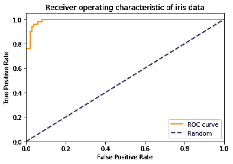

# 证据、概率和朴素贝叶斯

> 原文：<https://winder.ai/evidence-probabilities-and-naive-bayes/>

# 证据、概率和朴素贝叶斯

欢迎光临！本车间来自 [Winder.ai](https://Winder.ai/?utm_source=winderresearch&utm_medium=notebook&utm_campaign=workshop&utm_term=individual) 。注册以获得更多免费的研讨会、培训和视频。

贝叶斯规则是统计学中最有用的部分之一。它让我们能够估计原本不可能的概率。

在这张工作表中，我们从基本的角度来看贝叶斯，然后尝试一个简单的分类器。

## 贝叶斯规则

为了更直观地了解贝叶斯规则，请务必查看培训。

根据前面的营销示例，考虑以下情况。你已经开发了一个模型，可以决定向一组客户展示或不展示广告。

你的老板带着一些结果回来说:

> “我们将要求您开发一个新模型，但首先我们需要一个基准来进行比较。你能告诉我，如果客户看过你的广告，他们购买我们产品的可能性有多大吗？”。

我们注意到句子中的单词“given ”,并发布我们可以使用贝叶斯规则:

$ p(b \ green a)= \ frac { p(b)\ times p(a \ green b } } { p(a)} = \ frac { p(b)\ times p(a \ green b } } { p(b)\ times p(a \ green b)+p(notb)\ times p(a \ green notb)} $ s

其中$A$显示广告,$B$显示购买我们的产品。

接下来，她提供了之前实验的以下统计数据:

*   10 个人在看到广告后购买了产品。(TP)

*   1000 人没有看到广告，也没有购买。(总氮)

*   50 个人看了广告，但没有购买。(FP)

*   5 个人在没有看到任何广告的情况下购买了我们的产品。(FN)

*   10 个真阳性。10 个人购买了产品。

*   1000 真阴性。未显示广告。

*   50 次误报。他们没有购买，但看到了广告。

*   5 个错误的否定，即使没有看到广告，人们还是会购买。

|  | p | n |
| --- | --- | --- |
| Y | Ten | Fifty |
| 普通 | five | One thousand |

```py
TP = 10
TN = 1000
FP = 50
FN = 5
total = TP+TN+FP+FN
p_buy = (TP+FN)/total
p_ad_buy = TP/(TP+FN)
p_notbuy = (TN+FP)/total
p_ad_notbuy = FP/(TN+FP)
p_buy_ad = p_buy * p_ad_buy / (p_buy * p_ad_buy + p_notbuy * p_ad_notbuy)

print("p(buy|ad) = %0.1f%%" % (p_buy_ad*100)) 
```

```py
p(buy|ad) = 16.7% 
```

## 朴素贝叶斯分类器

现在让我们尝试一个朴素贝叶斯分类器。我们将在这里使用 sklearn 实现，但请记住，这只是一个算法，在给定一个类的情况下，估计每个特性的概率。当提供了新的观察结果时，我们查看这些概率，并预测该实例属于该类的概率。

请注意，此实现假设要素呈正态分布，拟合方法执行分布参数(平均值和标准偏差)的拟合。

```py
from matplotlib import pyplot as plt
from sklearn import metrics
from sklearn import datasets
from sklearn.naive_bayes import GaussianNB
iris = datasets.load_iris()
iris.data.shape 
```

```py
(150, 4) 
```

```py
gnb = GaussianNB()
mdl = gnb.fit(iris.data, iris.target) # Tut, tut. We should really be splitting the training/test set.
y_pred = mdl.predict(iris.data)
cm = metrics.confusion_matrix(iris.target, y_pred)
print(cm) 
```

```py
[[50  0  0]
 [ 0 47  3]
 [ 0  3 47]] 
```

```py
y_proba = gnb.fit(iris.data, iris.target).predict_proba(iris.data)
print("These are the misclassified instances:\n", y_proba[iris.target != y_pred])
print("They were classified as:\n", y_pred[iris.target != y_pred])
print("But should have been:\n", iris.target[iris.target != y_pred]) 
```

```py
These are the misclassified instances:
 [[  1.52821825e-122   4.56151317e-001   5.43848683e-001]
 [  7.43572418e-129   1.54494085e-001   8.45505915e-001]
 [  2.12531216e-137   7.52691316e-002   9.24730868e-001]
 [  4.59552511e-108   9.73514345e-001   2.64856553e-002]
 [  5.69697725e-125   9.58135362e-001   4.18646381e-002]
 [  2.19798649e-130   7.12645144e-001   2.87354856e-001]]
They were classified as:
 [2 2 2 1 1 1]
But should have been:
 [1 1 1 2 2 2] 
```

```py
# Ideally, generate a curve for each target. Do it in a loop.
fpr, tpr, _ = metrics.roc_curve(iris.target, y_proba[:,1], pos_label=1)

plt.figure()
lw = 2
plt.plot(fpr, tpr, color='darkorange',
         lw=lw, label='ROC curve')
plt.plot([0, 1], [0, 1], color='navy', lw=lw, linestyle='--', label='Random')
plt.xlim([0.0, 1.0])
plt.ylim([0.0, 1.05])
plt.xlabel('False Positive Rate')
plt.ylabel('True Positive Rate')
plt.title('Receiver operating characteristic of iris data')
plt.legend(loc="lower right")
plt.show() 
```



## 任务

|  | 真正的癌症 | 实际上没有癌症 |
| --- | --- | --- |
| 确诊癌症 | eight | Ninety |
| 未确诊的癌症 | Two | Nine hundred |

*   以上是乳腺癌诊断的(模拟)混淆矩阵。
    *   假设一个人被诊断患有癌症，那么这个人患癌症的概率有多大？(查找 p(癌症|诊断))

## 奖金

*   加载前一个研讨会的数字数据集，使用朴素贝叶斯分类器进行分类，并绘制 ROC 曲线。
*   将其与另一个分类器进行比较