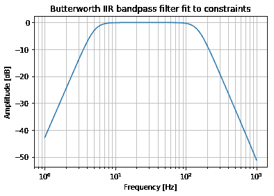
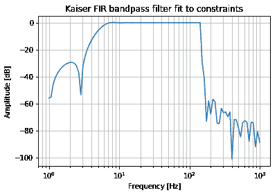
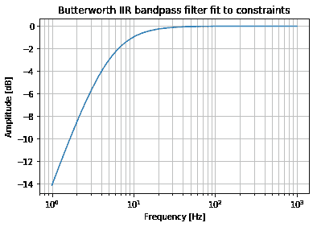
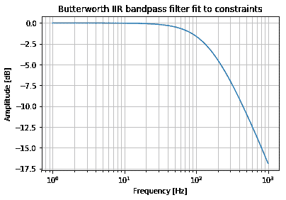
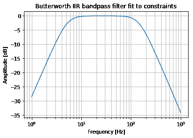

# Python 中的快速时序滤波器

> 原文：<https://winder.ai/fast-time-series-filters-in-python/>

*时序* (TS)滤波器常用于*数字信号处理*用于*分布式声学传感* (DAS)。目标是从数字化的 TS 信号中去除频率子集。要过滤一个信号，你必须接触所有的数据并进行卷积。当您拥有大量数据时，这是一个缓慢的过程。这篇文章的目的是调查哪些过滤器在 Python 中速度最快。

## 并行处理

数据必须通过过滤器传输，因为过滤器包含状态。下一个过滤步骤取决于先前的结果和过滤器的当前状态。这是一个*马尔可夫*过程。

这使得并行化变得困难。如果你有一个一维的 TS，你不能把它分成两个线程来运行，因为马尔科夫属性。在二维 TS 信号中，例如立体声音频，您可以分离通道，并在单独的线程上运行滤波器。注意，也有提供多线程`numpy`和`scipy`安装的包，比如[英特尔的 Python 发行版](https://software.intel.com/en-us/distribution-for-python)。

## 过滤方式

数字 TS 滤波器有两种类型:有限脉冲响应(FIR)和无限脉冲响应(IIR)。如果对含有尖峰(脉冲)的信号进行滤波，IIR 滤波器将无限振荡，而 fir 将短暂振荡。IIR 滤波器是递归的。

FIR 和 IIR 滤波器由它们卷积的观测值数量定义，通常称为*阶*或*抽头数量*。由于 IIR 滤波器是递归的，因此其性能与 FIR 滤波器一样好，只需少得多的抽头。这意味着在相同的滤波要求下，IIR 滤波器速度更快。缺点是它们可能不稳定(由于反馈环路)，并且以非线性方式改变信号的相位(例如，当高频和低频通过滤波器时，它们可能会在时间上分离)。

## 我的天啊

`scipy`有一系列方法来帮助设计过滤器参数和执行过滤。它在底层使用了`numpy`,因此底层卷积应该是高性能的。让我们从定义一些公共参数开始。

```py
import numpy as np
import scipy as sp
import scipy.signal as signal
import matplotlib.pyplot as plt
import timeit 
```

```py
sampling_frequency = 10000.0        # Sampling frequency in Hz
nyq = sampling_frequency * 0.5  # Nyquist frequency
passband_frequencies = (5.0, 150.0)  # Filter cutoff in Hz
stopband_frequencies = (1.0, 1000.0)
max_loss_passband = 3 # The maximum loss allowed in the passband
min_loss_stopband = 30 # The minimum loss allowed in the stopband
x = np.random.random(size=(5000, 12500)) # Random data to be filtered 
```

### 设计 IIR 滤波器

现在我们需要设计过滤器。`scipy`有几个帮助方法，允许我们采用我们的规格并推荐滤波器的顺序。在下面的代码中，我们设计了一个带通巴特沃兹 IIR 滤波器。结果是阶数为 3 的滤波器。

```py
order, normal_cutoff = signal.buttord(passband_frequencies, stopband_frequencies, max_loss_passband, min_loss_stopband, fs=sampling_frequency)
iir_b, iir_a = signal.butter(order, normal_cutoff, btype="bandpass", fs=sampling_frequency)
w, h = signal.freqz(iir_b, iir_a, worN=np.logspace(0, 3, 100), fs=sampling_frequency)
plt.semilogx(w, 20 * np.log10(abs(h)))
plt.title('Butterworth IIR bandpass filter fit to constraints')
plt.xlabel('Frequency [Hz]')
plt.ylabel('Amplitude [dB]')
plt.grid(which='both', axis='both')
plt.show() 
```



### 设计远红外滤波器

现在让我们使用相同的参数来设计一个 FIR 滤波器。这是一个带通凯泽 FIR 滤波器。5Hz 是采样速率为 10 kHz 的信号的低截止频率。所得到的滤波器设计具有大约 2200 的阶数。

这是有意义的，因为过滤器不是递归的。它必须直接观察 5Hz 信号，以便将其滤除。换句话说，我们至少需要 10000 / 5 = 2000 次观察才能看到 5 Hz 信号。

与巴特沃兹相比，滤波器衰减性能也很差。但至少不会有什么非线性相变。

```py
nyq_cutoff = (passband_frequencies[0] - stopband_frequencies[0]) / nyq
N, beta = signal.kaiserord(min_loss_stopband, nyq_cutoff)
fir_b = signal.firwin(N, passband_frequencies, window=('kaiser', beta), fs=sampling_frequency, pass_zero=False, scale=False)
fir_a = 1.0
w, h = signal.freqz(fir_b, fir_a, worN=np.logspace(0, 3, 100), fs=sampling_frequency)
plt.semilogx(w, 20 * np.log10(abs(h)))
plt.title('Kaiser FIR bandpass filter fit to constraints')
plt.xlabel('Frequency [Hz]')
plt.ylabel('Amplitude [dB]')
plt.grid(which='both', axis='both')
plt.show() 
```



## `scipy.signal.lfilter`性能

现在我将在这两个过滤器上测试`scipy.signal.lfilter`函数的性能。我预计 FIR 会很慢，因为它必须执行更多的计算。即，对于每个通道，将有`2000 x len(signal)`个乘法，而对于 IIR，将只有`3 x len(signal)`。`numpy`也许可以优化计算，但我仍然希望有两个数量级的差异。

```py
print("IIR time = {}".format(timeit.timeit(lambda: signal.lfilter(iir_b, iir_a, x, axis=1), number=1)))
print("FIR time = {}".format(timeit.timeit(lambda: signal.lfilter(fir_b, fir_a, x, axis=1), number=1))) 
```

```py
IIR time = 0.8159449380000297
FIR time = 57.0915518339998 
```

这些结果显示了我所期望。当您需要过滤低频时，IIR 的效率会显著提高。

## 改善 IIR 滤波器性能

`scipy` `lfilter`函数使用了大量编译过的 c。我不太可能提高`lfilter`底层代码的性能。但是，如果我们尝试使用两个更小的过滤器呢？

让我首先再次运行基线，以获得更好的平均值。

```py
print("Average baseline IIR time = {}".format(timeit.timeit(lambda: signal.lfilter(iir_b, iir_a, x, axis=1), number=10) / 10)) 
```

```py
Average baseline IIR time = 0.6693926614000703 
```

现在让我设计两个新的一阶滤波器。

```py
b_hp, a_hp = signal.butter(1, normal_cutoff[0], btype="highpass", fs=sampling_frequency)
w, h = signal.freqz(b_hp, a_hp, worN=np.logspace(0, 3, 100), fs=sampling_frequency)
plt.semilogx(w, 20 * np.log10(abs(h)))
plt.title('Butterworth IIR bandpass filter fit to constraints')
plt.xlabel('Frequency [Hz]')
plt.ylabel('Amplitude [dB]')
plt.grid(which='both', axis='both')
plt.show() 
```



```py
b_lp, a_lp = signal.butter(1, normal_cutoff[1], btype="lowpass", fs=sampling_frequency)
w, h = signal.freqz(b_lp, a_lp, worN=np.logspace(0, 3, 100), fs=sampling_frequency)
plt.semilogx(w, 20 * np.log10(abs(h)))
plt.title('Butterworth IIR bandpass filter fit to constraints')
plt.xlabel('Frequency [Hz]')
plt.ylabel('Amplitude [dB]')
plt.grid(which='both', axis='both')
plt.show() 
```



```py
def two_filters(x):
  y = signal.lfilter(b_hp, a_hp, x, axis=1)
  z = signal.lfilter(b_lp, a_lp, y, axis=1)
  return z

print("Average two filter time = {}".format(timeit.timeit(lambda: two_filters(x), number=10) / 10)) 
```

```py
Average two filter time = 0.8258036216999244 
```

Doh。那有点慢。我们可以用卷积运算来组合这些滤波器。让我们试试那个。

### 组合单独的过滤器

记住滤波是一种卷积运算。卷积是结合的。即想象两个滤波器 a 和 b，一个信号 x 和一个卷积 C，通过滤波器 a 对信号 x 进行滤波就是 C(x，a)。使用两个滤波器:C( C(x，a)，b)。这与:C(x，C(a，b))相同。因此，首先将滤波器卷积在一起，最终得到一个滤波器。

```py
a = sp.convolve(a_lp, a_hp)
b = sp.convolve(b_lp, b_hp)
print("Average combined filter time = {}".format(timeit.timeit(lambda: signal.lfilter(b, a, x, axis=1), number=10) / 10)) 
```

```py
Average combined filter time = 0.42798648080006385 
```

酷，这样更快。但我怀疑这与在滤波器设计中只使用 2 阶是一样的。

```py
b, a = signal.butter(2, normal_cutoff, btype="bandpass", fs=sampling_frequency)
w, h = signal.freqz(b, a, worN=np.logspace(0, 3, 100), fs=sampling_frequency)
plt.semilogx(w, 20 * np.log10(abs(h)))
plt.title('Butterworth IIR bandpass filter fit to constraints')
plt.xlabel('Frequency [Hz]')
plt.ylabel('Amplitude [dB]')
plt.grid(which='both', axis='both')
plt.show() 
```



```py
print("Average order 2 IIR filter time = {}".format(timeit.timeit(lambda: signal.lfilter(b, a, x, axis=1), number=10) / 10)) 
```

```py
Average order 2 IIR filter time = 0.44366712920000284 
```

没错。我们走吧。单个高通/低通滤波器设计具有与同阶带通相同的性能(本例中为 1 + 1)。如果您有不同的需求，个性化设计可能会很有用。

### 组合 iir 和 f.i.r 滤波器

对 HP 使用 IIR 滤波器，然后对 LP 使用 FIR 滤波器，怎么样？我将选择一个在 1000 Hz 时产生与 IIR 滤波器相同结果的阶数(约-35 dB)。

```py
b_fir_lp = signal.firwin(20, passband_frequencies[1], fs=sampling_frequency, pass_zero=True, scale=True)
w, h = signal.freqz(fir_b, fir_a, worN=np.logspace(0, 3, 100), fs=sampling_frequency)
plt.semilogx(w, 20 * np.log10(abs(h)))
plt.title('Kaiser FIR bandpass filter fit to constraints')
plt.xlabel('Frequency [Hz]')
plt.ylabel('Amplitude [dB]')
plt.grid(which='both', axis='both')
plt.show() 
```


```py
def iir_fir(x):
  y = signal.lfilter(b_hp, a_hp, x, axis=1)
  z = signal.lfilter(b_fir_lp, 1.0, y, axis=1)
  return z

print("Average two filter time = {}".format(timeit.timeit(lambda: iir_fir(x), number=10) / 10)) 
```

```py
Average two filter time = 1.9922046989999216 
```

没有，还是很穷。

## 结论

`scipy`和`numpy`已经被优化到你不太可能通过编写自己的过滤方法来提高性能的程度。这意味着滤波器的性能完全由滤波器的定义和阶数决定。更高的阶数意味着更多的乘法。

因此，如果您主要对性能感兴趣，请使用 IIR 滤波器，并使阶数尽可能低。如果您对高或低截止频率有不同的要求，那么可以独立设计并组合使用。

在提高`scipy`性能方面，使用多线程来过滤单独的通道，或者使用 Python 或`scipy`的不同实现来利用多线程支持。