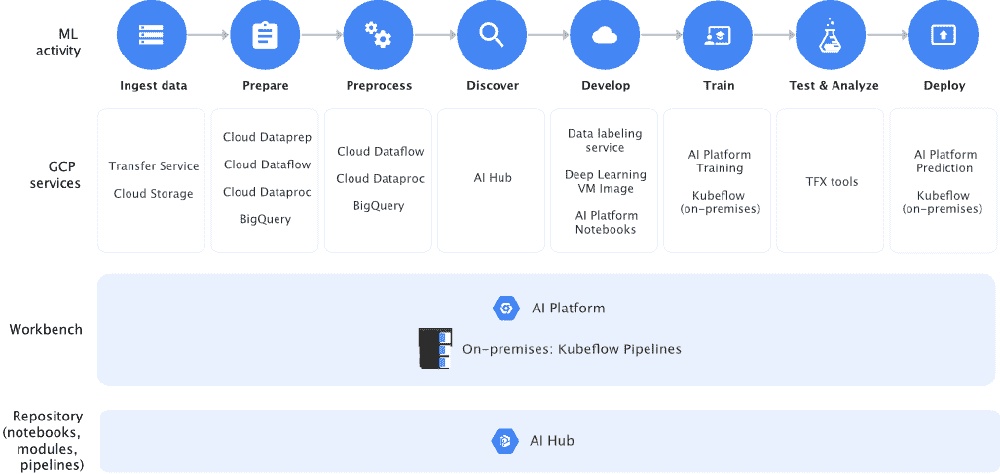

# 谷歌在 Winder 的帮助下发布 AI 平台。人工智能

> 原文：<https://winder.ai/google-releases-ai-platform-with-help-from-winder.ai/>

在他们的云 Next 19 大会上，谷歌宣布推出一个扩展的人工智能平台。多年来，谷歌一直在扩大其产品组合，以与 Azure 和 AWS 的人工智能产品竞争。但这是第一次可以认为平台是“端到端”的。

人工智能平台由一系列产品组成，每个产品都根据自己的任务量身定制。有些现在已经非常成熟了，比如 BigQuery，从 2010 年就有了。但两个大的补充是托管的 Kubeflow 服务和我们帮助开发的 T2 人工智能中心的紧密集成。

The Google AI Platform’s end-to-end tooling

## 库伯流和库伯流管道

Kubeflow 正在获得很大的吸引力，因为到目前为止，开发数据科学管道一直是一件定制的事情。对于每个项目，你将从 Python 中的基本管道开始，将每个阶段分解成 Docker 容器，然后尝试用一些复杂的 Docker Compose 或 Kubernetes 设置将它们连接在一起。

谢天谢地，我现在可以用过去式来谈论这件事了。像 Pachyderm 这样的项目正在帮助我们控制数据流。Kubeflow 试图抽象出模型的开发、训练和服务。它提供了这些抽象，因此您每次都可以用相同的方式执行这些任务。对于正在开发内部数据科学平台的公司来说，这是一个好消息，因为它标准化了数据科学家的开发方式。最棒的是，这都是库伯内特土产的。

Kubeflow pipelines 是一个配套项目，为数据科学作业提供调度运行时。换句话说，它是一个分布式流水线工具。这是与厚皮直接竞争，目前厚皮有更多的功能。但是与 Kubeflow 的紧密集成是一个优势。事实上，现在我的客户正在同时使用这两种产品。

## 敬赫伯

在另一项与其竞争对手相左的战略中，谷歌发布了一个通用人工智能组件库。它们由一系列特定于任务的管道、托管服务和通用的开箱即用算法组成。我发现这很有趣，因为它确实使数据科学民主化了。他们没有囤积算法，而是提倡共享和重用。

云德。AI 在一个项目中帮助开发了一些文本组件(NLP ),该项目使用 BERT 单词级嵌入来进行分类。

## 结论

凭借 Kubernetes 和 T1，谷歌正在主导本地(内部平台)和云中的集群计算。美妙之处在于可以很容易地从一个地方迁移到另一个地方。

谷歌的人工智能平台旨在做同样的事情。他们在开源模式下发布他们的组件，允许人们从 minikube 迁移到本地云。我并不嫉妒这一点，我认为这对开发者和谷歌来说是双赢的。我们得到更好的开源工具，他们让人们使用他们的服务。

如果你在谷歌的人工智能平台或内部开发数据科学项目方面需要任何帮助，请[联系](https://winder.ai/about/contact/)。