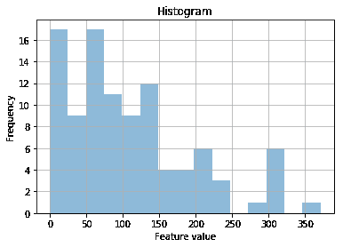
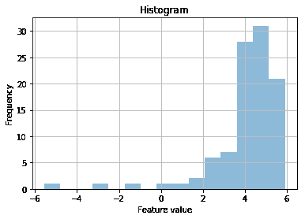
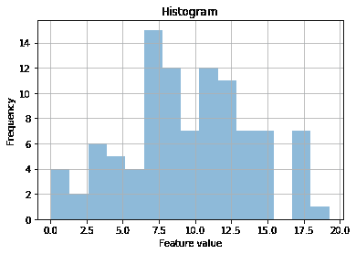
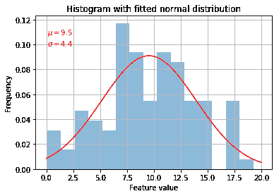
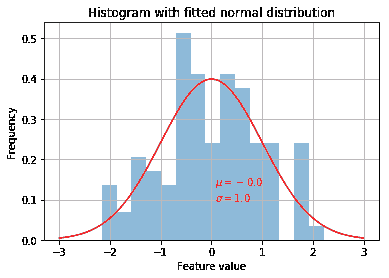

# 直方图和倾斜数据

> 原文：<https://winder.ai/histograms-and-skewed-data/>

# 直方图和反转倾斜数据

欢迎光临！本车间来自 [Winder.ai](https://Winder.ai/?utm_source=winderresearch&utm_medium=notebook&utm_campaign=workshop&utm_term=individual) 。注册以获得更多免费的研讨会、培训和视频。

当我们第一次收到一些数据时，它可能是一片混乱。如果我们试图将这些数据强加到一个模型中，结果很可能是无用的。

所以我们需要花大量的时间*清理*数据。这个研讨会都是关于坏数据的。

```py
# These are the standard imports that we will use all the time.
import os                             # Library to do things on the filesystem
import pandas as pd                   # Super cool general purpose data handling library
import matplotlib.pyplot as plt       # Standard plotting library
import numpy as np                    # General purpose math library
from IPython.display import display   # A notebook function to display more complex data (like tables)
import scipy.stats as stats           # Scipy again 
```

## 虚拟数据调查

在研讨会的这一部分，我们将创建一些“虚拟”数据。虚拟数据非常适合用来摆弄新工具和新技术。它们作为人们竞争的参考数据集。

然而，正如您将看到的，虚拟数据永远不会像真实世界那样复杂&mldr;

```py
# Generate some data
np.random.seed(42)  # To ensure we get the same data every time.
X = (np.random.randn(100,1) * 5 + 10)**2
print(X[:10]) 
```

```py
[[ 155.83953905]
 [  86.65149531]
 [ 175.25636487]
 [ 310.29348423]
 [  77.9553576 ]
 [  77.95680717]
 [ 320.26910947]
 [ 191.4673745 ]
 [  58.56271638]
 [ 161.61528938]] 
```

让我们打印出这些数据的平均值和标准偏差。

```py
# Print the mean and standard deviation
print("Raw: %0.3f +/- %0.3f" % (np.mean(X), np.std(X))) 
```

```py
Raw: 110.298 +/- 86.573 
```

这告诉我们，我们应该期望看到大约三分之二的值出现在 110 +/- 87 的范围内。然而，这个数据并不完全像它看起来那样。

### 直方图

直方图是最基本但最有用的图表之一，可用于显示要素中包含的数据。

如果我们想象一个范围的箱子，在这个例子中，让我们想象箱子是 25 宽，从 0 延伸到 350 左右。我们能做的是计算我们看到一个观察值落在每个箱中的次数。这就是所谓的直方图(通常我们也会对原始计数进行一些缩放，但我们现在忽略它)。

让我们绘制上述数据的直方图，看看发生了什么。

```py
df = pd.DataFrame(X) # Create a pandas DataFrame out of the numpy array
df.plot.hist(alpha=0.5, bins=15, grid=True, legend=None)  # Pandas helper function to plot a hist. Uses matplotlib under the hood.
plt.xlabel("Feature value")
plt.title("Histogram")
plt.show() 
```



我们可以看到数据看起来很嘈杂。它扭曲得很奇怪。

凭经验，你会注意到所有的数据都是正的，这很奇怪。您还会注意到，从特征值 0 到 350，似乎有一个向下弯曲的斜率。

这表明某种幂律，或指数。

我们可以转换数据，方法是尝试反转我们测量数据时发生的数学运算。这很好，我们没有改变数据，我们只是改变了数据的表示方式。

```py
df_exp = df.apply(np.log)   # pd.DataFrame.apply accepts a function to apply to each column of the data
df_exp.plot.hist(alpha=0.5, bins=15, grid=True, legend=None)
plt.xlabel("Feature value")
plt.title("Histogram")
plt.show() 
```



好吧，这看起来还是有点奇怪。不知道是不是幂律？

```py
df_pow = df.apply(np.sqrt)
df_pow.plot.hist(alpha=0.5, bins=15, grid=True, legend=None)
plt.xlabel("Feature value")
plt.title("Histogram")
plt.show() 
```



那看起来好多了！所以看起来这是一个幂律(2 的幂)。但是为了保险起见，让我们在顶部拟合一条正态曲线&mldr;

```py
param = stats.norm.fit(df_pow)   # Fit a normal distribution to the data

x = np.linspace(0, 20, 100)      # Linear spacing of 100 elements between 0 and 20.
pdf_fitted = stats.norm.pdf(x, *param)    # Use the fitted paramters to create the y datapoints

# Plot the histogram again
df_pow.plot.hist(alpha=0.5, bins=15, grid=True, normed=True, legend=None)

# Plot some fancy text to show us what the paramters of the distribution are (mean and standard deviation)
plt.text(x=np.min(df_pow), y=0.1, s=r"$\mu=%0.1f$" % param[0] + "\n" + r"$\sigma=%0.1f$" % param[1], color='r')

# Plot a line of the fitted distribution over the top
plt.plot(x, pdf_fitted, color='r')

# Standard plot stuff
plt.xlabel("Feature value")
plt.title("Histogram with fitted normal distribution")
plt.show() 
```



是啊，看起来确实不错。**总是尝试可视化你的数据，以确保它符合你的期望**

请记住，一些算法不喜欢不是以 0 为中心的数据，当标准差不是 1 时，它们也不喜欢。

因此，我们通过使用`StandardScaler` & mldr 进行缩放来转换数据；

```py
from sklearn import preprocessing

X_s = preprocessing.StandardScaler().fit_transform(df_pow)
X_s = pd.DataFrame(X_s)   # Put the np array back into a pandas DataFrame for later
print("StandardScaler: %0.3f +/- %0.3f" % (np.mean(X_s), np.std(X_s)))

# Nice! This should be 0.000 +/- 1.000 
```

```py
StandardScaler: -0.000 +/- 1.000 
```

```py
param = stats.norm.fit(X_s)
x = np.linspace(-3, 3, 100)
pdf_fitted = stats.norm.pdf(x, *param)
X_s.plot.hist(alpha=0.5, bins=15, grid=True, normed=True, legend=None)
plt.text(x=np.min(df_pow), y=0.1, s=r"$\mu=%0.1f$" % param[0] + "\n" + r"$\sigma=%0.1f$" % param[1], color='r')
plt.xlabel("Feature value")
plt.title("Histogram with fitted normal distribution")
plt.plot(x, pdf_fitted, color='r')
plt.show() 
```



漂亮！