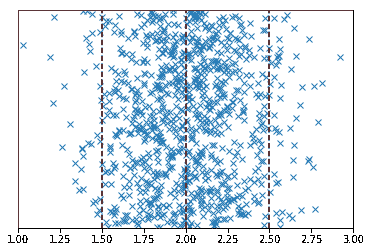
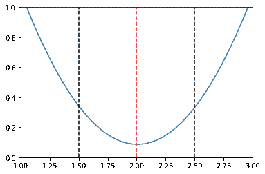
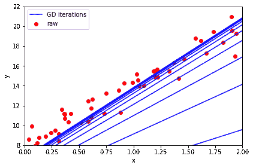

# 梯度下降简介

> 原文：<https://winder.ai/introduction-to-gradient-descent/>

# 梯度下降简介

欢迎光临！本车间来自 [Winder.ai](https://Winder.ai/?utm_source=winderresearch&utm_medium=notebook&utm_campaign=workshop&utm_term=individual) 。注册以获得更多免费的研讨会、培训和视频。

只有少数算法存在解析解。例如，我们可以使用 [*正规方程*](https://winder.ai/401-linear-regression/) 直接求解一个线性回归问题。

然而，我们所依赖的大多数算法都不能解析地解决这个问题；通常是因为无法解方程。所以我们不得不尝试其他的方法。

*梯度下降*是我们可以“滚下”误差曲线的想法。让我们为一个简单的模型绘制一条误差曲线，使之更加具体。

```
# Usual imports
import os
import pandas as pd
import matplotlib.pyplot as plt
import numpy as np
from IPython.display import display 
```

```
np.random.seed(42)  # To ensure we get the same data every time.
X = np.random.normal(loc=2, scale=0.3, size=(1000,1))
def plot_grid():
    for m in [1.5, 2.5]:
        plt.plot([m,m], [0, 1], 'k--')
    plt.plot([2,2], [0, 1], 'r--')
plt.plot(X, np.random.rand(len(X),1), 'x')
plot_grid()
plt.xlim([1,3])
plt.ylim([0,1])
plt.yticks([])
plt.show()

def mse(X, m):
    return np.sum(np.square((m - X)))/len(X)

m_values = np.linspace(1, 3, 40)
err = [mse(X, m) for m in m_values]
plt.plot(m_values, err)
plot_grid()
plt.xlim([1,3])
plt.ylim([0,1])
plt.show() 
```





上面的图显示了一些 2.0 左右的一维正态分布数据。我们可以用平均值来估计代表最可能值的线的位置。但是假设我们因为某种原因无法计算平均值。

我们能做的是在数据中滑动一系列预期的均值估计，并计算每个点的均方误差。每个预期平均值的均方误差值显示在第二个图中。

红线代表误差最低的点。在这一点周围有一个凸起的斜坡。

梯度下降的工作原理是计算特定点的误差斜率。然后它会移动参数，让我们沿着那个斜率向下移动。最终我们会在底部结束。

那么我们如何计算梯度呢？用微分学。

## 使用梯度下降

下面是均方误差偏导数的矩阵形式。

我们可以使用这个等式来更新我们的预期参数，称为权重，并朝着误差面的底部迭代。(我说的是曲面，而不是曲线，因为通常我们在不止一个维度上工作)。

$ $ \ nabla _ { \ mathbf { w } } MSE(\ mathbf { w })= \frac{2}{m}\mathbf{x}^t \ cdot(\ mathbf { x } \ cdot \ mathbf { w }-\ mathbf { y })$ $

其中\(m\)是观察次数。

如果我们使用上面的等式直接更新我们的权重，那么我们实际上会直接跳到底部。然而，我们通常不想一步到位。我们想慢慢来，以确保我们真的还在下坡。

因此，取而代之的是，我们用一个小分数来衡量更新的速度。

因此，一旦使用上面的公式计算出梯度，就可以通过以下方式更新\(\mathbf{w}\)的当前值

$ $ \ mathbf { w } = \ mathbf { w }-\ eta \纳布卢斯 _ { \ mathbf { w } } { mathbf } $ $ $ }。

```
np.random.seed(42)  # To ensure we get the same data every time.
X = 2 * np.random.rand(50, 1)
X_b = np.c_[np.ones((50, 1)), X] # add x0 = 1 to each instance (the intercept term, c, in y = mx + c)
y = 8 + 6 * X + np.random.randn(50, 1)

eta = 0.1 # learning rate
n_iterations = 10 # number of iterations
m=len(X) # number of samples

w = np.random.randn(2,1) # random initialization of parameters
w_old = []
for iteration in range(n_iterations):
    gradients = 2/m * X_b.T.dot(X_b.dot(w) - y)
    w = w - eta * gradients
    w_old.append(w) 
```

```
X_new = np.array([[0], [2]])  # Create two x points to be able to draw the line
plt.scatter(X, y,
            color='red', marker='o', label='raw')
for w_i in w_old:
    y_predict = np.array([w_i[0], X_new[1]*w_i[1] + w_i[0]])
    plt.plot(X_new, y_predict, "b-")
plt.plot(X_new, y_predict, "b-", label='GD iterations')
plt.xlabel('x')
plt.ylabel('y')
plt.legend(loc='upper left')
plt.tight_layout()
plt.axis([0, 2, 8, 22])
plt.show() 
```



###任务:

*   当你改变学习速度时会发生什么？
*   当你改变迭代次数时会发生什么？

当然，这已经在`SGDRegressor`下的 sklearn 中实现了。如果您愿意，可以随意检查这是否会产生相同的结果。