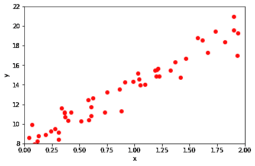
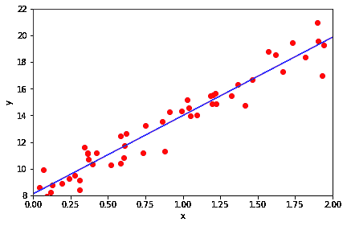

# 线性回归

> 原文：<https://winder.ai/linear-regression/>

# 线性回归

欢迎光临！本车间来自 [Winder.ai](https://Winder.ai/?utm_source=winderresearch&utm_medium=notebook&utm_campaign=workshop&utm_term=individual) 。注册以获得更多免费的研讨会、培训和视频。

回归是统计学中的一项传统任务，它试图将模型拟合到一些输入数据，以预测输出的数值。假设数据是连续的。

目标是能够进行新的观察并以最小的误差预测输出。一些例子可能是“下一季度的利润会是多少？”以及“为了满足需求，我们需要储备多少配件？”。

对于这些问题，我们需要真实的、数字的答案。但是我们也可以使用类似回归的模型作为分类的基础，事实上有许多算法都是基于此。

```py
# Usual imports
import os
import pandas as pd
import matplotlib.pyplot as plt
import numpy as np
from IPython.display import display 
```

```py
np.random.seed(42)  # To ensure we get the same data every time.
X = 2 * np.random.rand(50, 1)
y = 8 + 6 * X + np.random.randn(50, 1) 
```

因为我们只有一维输入(这并不经常发生！)让我们绘制数据图(输入对输出)。

当我们在 x-y 坐标上绘制观察结果时，这被称为*散点图*。

### 任务

*   尝试改变绘图的颜色、标记和标签(您可能需要查看相关文档)

```py
plt.scatter(X, y, color='red', marker='o')
plt.xlabel('x')
plt.ylabel('y')
plt.tight_layout()
plt.axis([0, 2, 8, 22])
plt.show() 
```



这里我们可以看到 x 和 y 值明显相关。让我们估计一下这种相关性..

```py
cc = np.corrcoef(X, y, rowvar=0)
print("Correlation coefficient: %.2f" % cc[0,1]) 
```

```py
Correlation coefficient: 0.97 
```

0.97 是一个巨大的相关性。

现在，请记住，对于给定的数据，有一个封闭的解决方案可以找到最佳的 MSE。这就是所谓的正常方程。

$ $ \ begin { align } \hat{w}=\left(\mathbf{x}^t\cdot\mathbf{x}\right)^{-1} \ cdot \mathbf{x}^t \ cdot \ mathbf { y } \ end { align } $ $

让我们用 numpy 写这个方程，然后画出结果&mldr;

```py
X_b = np.c_[np.ones((50, 1)), X] # add x0 = 1 to each instance (the intercept term, c, in y = mx + c)
w = np.linalg.inv(X_b.T.dot(X_b)).dot(X_b.T).dot(y) # Implementation of the closed form solution.
print(w) # Print the final values of the weights (intercept and slope, in this case) 
```

```py
[[ 8.09668927]
 [ 5.888283  ]] 
```

```py
X_new = np.array([[0], [2]])  # Create two x points to be able to draw the line
y_predict = np.array([w[0], X_new[1]*w[1] + w[0]]) # Predict the y values for these two points.

# Plot the scatter plot
plt.scatter(X, y, color='red', marker='o')
plt.plot(X_new, y_predict, "b-")
plt.xlabel('x')
plt.ylabel('y')
plt.tight_layout()
plt.axis([0, 2, 8, 22])
plt.show() 
```



## sklearn 中的回归

现在手动做这些数学工作是很重要的，但是 95%的时候，使用库会更有效率，尤其是在数据科学项目的早期阶段。

所以让我们在 sklearn &mldr;中重现之前的回归

```py
from sklearn.linear_model import LinearRegression
lin_reg = LinearRegression()
lin_reg.fit(X, y)
lin_reg.intercept_, lin_reg.coef_
# Results should be the same as before... 
```

```py
(array([ 8.09668927]), array([[ 5.888283]])) 
```