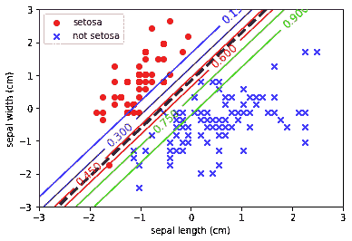

# 逻辑回归

> 原文：<https://winder.ai/logistic-regression/>

# 逻辑回归

欢迎光临！本车间来自 [Winder.ai](https://Winder.ai/?utm_source=winderresearch&utm_medium=notebook&utm_campaign=workshop&utm_term=individual) 。注册以获得更多免费的研讨会、培训和视频。

我觉得逻辑回归这个名字很讨厌。除了分类，我们通常不使用逻辑回归；但是统计学很久以前就创造了这个名字。

尽管有这个名字，逻辑回归还是非常有用的。我们可以用概率的方式来框定问题，而不是像我们在标准的[线性回归](https://winder.ai/403-linear-classification/)中那样优化距离的误差。逻辑回归试图根据观察值属于某个类别的概率来分离类别。

```py
# Usual imports
import os
import pandas as pd
import matplotlib.pyplot as plt
import numpy as np
from IPython.display import display
from sklearn import datasets
from sklearn import preprocessing 
```

```py
# import some data to play with
iris = datasets.load_iris()
feat = iris.feature_names
X = iris.data[:, :2]  # we only take the first two features. We could
                      # avoid this ugly slicing by using a two-dim dataset
y = iris.target
y[y != 0] = 1 # Only use two targets for now
colors = "bry"

# standardize
X = preprocessing.StandardScaler().fit_transform(X) 
```

当然，SKLearn 有一个逻辑回归的实现，它使用常用的`fit` API。

```py
from sklearn.linear_model import LogisticRegression
log_reg = LogisticRegression().fit(X, y) 
```

因为我想显示概率等值线，所以绘图代码比通常要复杂一些。

```py
# Create a grid of points then calculate the probability at each point. This creates a "mesh" of points.
x0, x1 = np.meshgrid(
        np.linspace(-3, 3, 500).reshape(-1, 1),
        np.linspace(-3, 3, 200).reshape(-1, 1),
    )
X_new = np.c_[x0.ravel(), x1.ravel()]

y_proba = log_reg.predict_proba(X_new)

plt.scatter(X[y == 0, 0], X[y == 0, 1],
            color='red', marker='o', label='setosa')
plt.scatter(X[y != 0, 0], X[y != 0, 1],
            color='blue', marker='x', label='not setosa')

zz = y_proba[:, 1].reshape(x0.shape)
contour = plt.contour(x0, x1, zz, cmap=plt.cm.brg)

left_right = np.array([-3, 3])
boundary = -(log_reg.coef_[0][0] * left_right + log_reg.intercept_[0]) / log_reg.coef_[0][1]

plt.clabel(contour, inline=1, fontsize=12)
plt.plot(left_right, boundary, "k--", linewidth=3)
plt.xlabel(feat[0])
plt.ylabel(feat[1])
plt.legend(loc='upper left')
plt.axis([-3,3,-3,3])
plt.show() 
```



注意等高线中的概率估计。这是一个非常有用的特性。为类估计提供一个估计值，以显示该观察值成为该类的一部分的可能性。

但是请记住，这些估计是基于数据的高斯拟合。如果数据不具有代表性或者不是正态分布的，那么这些估计在某种程度上会是错误的。