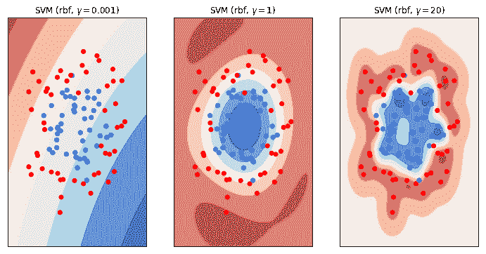

# 过度拟合和欠拟合

> 原文：<https://winder.ai/overfitting-and-underfitting/>

# 欠拟合和过拟合

欢迎光临！本车间来自 [Winder.ai](https://Winder.ai/?utm_source=winderresearch&utm_medium=notebook&utm_campaign=workshop&utm_term=individual) 。注册以获得更多免费的研讨会、培训和视频。

假设你开发了一个模型，可以预测一些输出。任何模型的目标都是生成正确的预测并避免不正确的预测。但是我们怎么能确定预测尽可能的好呢？

现在把你的想象限制在一个分类任务上(其他任务有相似的属性，但是我发现分类是最容易推理的)。我们使用一些数据来训练模型。训练过程的结果将是一个决策边界。即一边是 A 类，另一边是 B 类。

我们已经从我们的[数据处理研讨会](https://winder.ai/histograms-and-skewed-data/)中看到，数据是有噪声的。如果我们不小心，我们将最终拟合噪声，而不是潜在的过程。换句话说，我们的模型将被训练为基于噪声的存在而不是潜在的信号进行分类。这是不好的，被称为过度拟合。通常你会看到好的培训结果和差的现实生活/生产结果。

相反的问题是信号，底层过程的表示，是相当复杂的。例如，也许你的数据不能用线性模型分离。如果你尝试使用这样一个简单的模型，你可能会在培训和现实生活中看到类似的糟糕表现。这被称为欠拟合。

实际上，欠拟合可能比过拟合要好，因为至少你的模型是按照某种预期的标准运行的。最糟糕的情况是，当你告诉你的老板你有一个将改变世界的惊人的新模型时，结果却是它在生产中崩溃了！

这个工作坊是对欠适和过适的介绍。

```py
# Usual imports
import os
import pandas as pd
import matplotlib.pyplot as plt
import numpy as np
from IPython.display import display 
```

## 欠拟合和过拟合的可视化

首先我们要生成一些复杂的二维数据。这使我们能够轻松地绘制数据，同时使数据足够复杂，以显示欠拟合和过拟合的影响。这些数据是两个同心圆；即一个圆圈在另一个圆圈内。

```py
from sklearn.datasets import make_circles

# Synthetic data
X, y = make_circles(noise=0.2, factor=0.5, random_state=1) 
```

首先，我想向你们展示由欠拟合和过拟合模型产生的决策边界。对于我所说的“复杂决策边界”的含义，这应该会给你一些直观的印象。

为此，我将使用径向基函数的 SVM。如果您以前没有遇到过，请查看关于支持向量机的[研讨会。关于 SVM 的 RBF 版本，我们可以使用 RBF 的大小来模拟简单和复杂的决策边界。](https://winder.ai/403-linear-classification/)

```py
from sklearn.svm import SVC

classifiers = [        # Three different SVM classifiers with difference values of gamma.
    SVC(gamma=0.001),
    SVC(gamma=1),
    SVC(gamma=20)]
names = ["SVM (rbf, $\gamma = 0.001$)", "SVM (rbf, $\gamma = 1$)", "SVM (rbf, $\gamma = 20$)"] 
```

```py
from matplotlib.colors import ListedColormap

figure = plt.figure(figsize=(12, 6))
i = 1
h = .02  # step size in the mesh
x_min, x_max = X[:, 0].min() - .5, X[:, 0].max() + .5
y_min, y_max = X[:, 1].min() - .5, X[:, 1].max() + .5
xx, yy = np.meshgrid(np.arange(x_min, x_max, h),
                     np.arange(y_min, y_max, h))
cm = plt.cm.RdBu
cm_bright = ListedColormap(['#FF0000', '#0000FF'])

# iterate over classifiers
for name, clf in zip(names, classifiers):
    ax = plt.subplot(1, len(classifiers), i)
    clf.fit(X, y)

    # Plot the decision boundary. For that, we will assign a color to each
    # point in the mesh [x_min, x_max]x[y_min, y_max].
    if hasattr(clf, "decision_function"):
        Z = clf.decision_function(np.c_[xx.ravel(), yy.ravel()])
    else:
        Z = clf.predict_proba(np.c_[xx.ravel(), yy.ravel()])[:, 1]

    # Put the result into a color plot
    Z = Z.reshape(xx.shape)
    ax.contourf(xx, yy, Z, cmap=cm, alpha=.8)

    ax.scatter(X[:, 0], X[:, 1], c=y, cmap=cm_bright)

    ax.set_xlim(xx.min(), xx.max())
    ax.set_ylim(yy.min(), yy.max())
    ax.set_xticks(())
    ax.set_yticks(())
    ax.set_title(name)
    i += 1
plt.show() 
```



我来解释一下上面的情节。这些数据包括两类，蓝色和红色。在散点图的顶部显示了等高线图，其显示了我们训练的 SVM 模型的决策边界。轮廓是红色的地方，我们将预测红色。轮廓为蓝色的地方，预测蓝色。白色表示任一类别都有 50/50 的机会(即这是最终的决策界限)。

现在详细研究这三个情节。这一点非常重要。你看到了什么？区别在哪里？有哪些相似之处？每个模型对最终预测有什么影响？

你能看到的是让决策边界变得或多或少“复杂”的效果。在左边，我们有一个非常简单的模型；接近线性分类器的人。我们可以看到，这个模型不够复杂，不足以对底层数据进行建模。我们不能指望这种模式在培训或生产阶段都做得很好。这款*欠配*。

右手边是相反的情况。决策边界几乎包围了每个单独的观察。实际上，我们已经创建了一个查找表！更何况看右手剧情中间。在数据的中心有一点差距，我们预测这两类人各有 50%的机会(取决于随机生成的数据),尽管我们从来没有想到在蓝色中间会出现红色的观察结果！这是一个复杂的决策边界。这很糟糕，因为我们在回避问题的噪音。我们应该预料到培训绩效会很好，但生产绩效会很差。这款是*过拟合*。

## 使用维持数据避免过度拟合

我们不想让自己尴尬，那么如何避免过度拟合呢？

实现这一点的最简单的方法之一是将数据分成单独的训练和测试数据集。我们使用训练数据来训练模型，并使用测试数据集来生成训练后模型的最终得分。

实际上，我们正在创建一些“虚假”的生产数据。我们想象我们以前从未见过这些数据，就像在生产环境中一样，我们会问这种性能会是什么样的？

这被称为列车测试分离。

首先，让我们看看如果不使用训练测试分割，我们的准确度会是多少

```py
overfit = SVC(kernel='rbf', gamma=0.7, C=float('inf')).fit(X,y)
o_score = overfit.score(X, y)
print("Before holdout, the score is %.2f" % o_score) 
```

```py
Before holdout, the score is 1.00 
```

不错！完美的结果。但是等等，我们是不是太适合了？让我们创建一个训练测试分割，根据训练数据进行训练，然后根据测试数据进行评分。这是对生产环境中得分的估计(我们以前从未见过新数据)。

```py
from sklearn.model_selection import train_test_split

# This is how we split our data, using the `train_test_split` method
X_train, X_test, y_train, y_test = \
    train_test_split(X, y, test_size=.4, random_state=42) 
```

```py
overfit = SVC(gamma=20).fit(X_train,y_train)  # Training data
score = overfit.score(X_train, y_train)       # First view the training score, this is still important to measure.
print("The training score is %.2f" % score)
score = overfit.score(X_test, y_test)         # Test data, the model has never seen this data
print("With holdout, the score is %.2f" % score) 
```

```py
The training score is 0.98
With holdout, the score is 0.85 
```

那是相当不同的！

我们可以看出我们过度拟合了，因为训练分数和测试分数之间的差异相当大。我们可能会尝试降低模型的复杂性，使这些分数更接近。