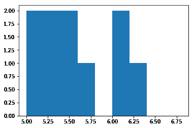
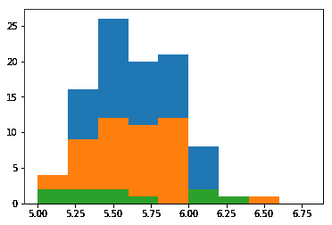
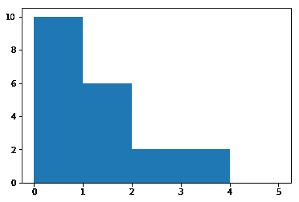
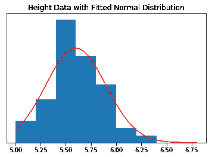
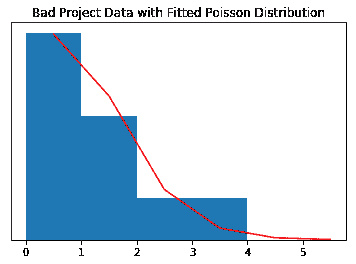

# 概率分布

> 原文：<https://winder.ai/probability-distributions/>

# 概率分布

欢迎光临！本车间来自 [Winder.ai](https://Winder.ai) 。注册以获得更多免费的研讨会、培训和视频。

这个研讨会是关于另一种呈现数据的方式。我们可以画出观察的频率，以便更好地描述数据的特征。

假设你有一些数据。举例来说，想象这是一个测量人身高的标准。如果你测量 10 个人，你会看到 10 个不同的高度。高度被认为是沿着高度轴分布的。

```py
import numpy as np
heights = [ 5.36, 5.50, 5.04, 5.00, 6.00,  6.27, 5.56, 6.10, 5.78, 5.27] 
```

我们可以像以前一样计算平均值和标准差的值:

```py
print("μ =", np.mean(heights), ", σ =", np.std(heights)) 
```

```py
μ = 5.588 , σ = 0.417320021087 
```

这很好地总结了数据，但不能解释所有的数据。谢天谢地，我们的大脑包含一个非常复杂的*卷积神经网络*，称为*视觉皮层*。它能够接受数据的图像，并生成非常复杂的心智模型来了解实际情况。

我们可以生成的最有用的图像之一叫做*直方图*。这来自希腊语 *Histos* ，意思是网络，英语 *-gram* ，意思是编码。

## 柱状图

直方图是对观察值落在上限和下限内的次数的计数。上限和下限之间的空间称为面元。换句话说，我们在绘制一组特定值的频率。

假设我们选择了一个宽度为 0.2 的箱，我们得到了上面的$heights$数据。

```py
import matplotlib.pyplot as plt
plt.hist(heights, bins=[5, 5.2, 5.4, 5.6, 5.8, 6, 6.2, 6.4, 6.6, 6.8])
plt.show() 
```



`matplotlib`是一个著名的 Python 绘图库，但是它的 API 比较烦人。我在这里使用它，因为它是最多产的；不是最好的。

我们已经使用了`matplotlib.pyplot.hist`函数来创建我们的数据图。当然，我们可以自己编写代码来生成直方图，但是我们不想浪费时间重新编写比我们优秀得多的开发人员花了多年时间创建的代码！

最后，我提供了一个 bin 边界数组(列表)。通常我们会通过编程来生成这些文件，或者让图书馆为我们挑选文件。

## 分析

我们能从这幅图像中得到什么样的数据呢？好了，我们马上就可以说数据的*范围*了，就是最大值和最小值之差。我们还可以看到，平均值 5.6 看起来不太典型。那个箱子里只有一个观察值，旁边的箱子是空的！

但是要注意的主要事情是数据的*包络*的形状。如果我们在波峰上画一条线，这通常会看起来像一个非常具体的形状。

原始数据是从这些形状中的一个生成的，但是我只生成了 10 个样本。我们来生成 50 和 100。

```py
plt.hist(0.3*np.random.randn(100) + 5.6, bins=[5, 5.2, 5.4, 5.6, 5.8, 6, 6.2, 6.4, 6.6, 6.8])
plt.hist(0.3*np.random.randn(50) + 5.6, bins=[5, 5.2, 5.4, 5.6, 5.8, 6, 6.2, 6.4, 6.6, 6.8])
plt.hist(heights, bins=[5, 5.2, 5.4, 5.6, 5.8, 6, 6.2, 6.4, 6.6, 6.8])
plt.show() 
```



在这里，我在两个新的数据集上绘制了高度数据，这两个数据集分别由 50 个和 100 个样本生成。请注意，随着随机样本数量的增加，我们开始看到一个峰值。

现在我们很高兴地说，这种趋势确实集中在 5.6 左右。

还要注意在我们开始看到直方图中的峰值之前需要多少样本，即使平均值的计算非常好，即使有 10 个样本。

现在，让我们对不同类型的数据重复相同的过程。

## 不同的数据

假设我们公司处理软件工程项目。我们是一家大公司，所以我们每年都有很多项目，但其中一些项目会出问题。这些年来，我们记录了每年有多少糟糕的项目。明年，我们会有多少糟糕的项目？

首先，这里有一些数据。这个数据是通过计算我们每年有多少坏项目(我假设有一致的潜在特征，如项目总数、静态经济环境等)产生的。).

```py
bad = [0,1,0,0,0,0,1,1,0,0,1,2,0,3,1,3,0,2,0,1]
print("μ =", np.mean(bad), ", σ =", np.std(bad)) 
```

```py
μ = 0.8 , σ = 0.979795897113 
```

```py
plt.hist(bad, bins=[0, 1, 2, 3, 4, 5])
plt.show() 
```



平均值约为 0.8。记住，平均值是特定分布形状的期望值(我还没有告诉你这些是什么)。

但是我们可以从上面的直方图中清楚地看到，最有可能的值是 0，随着问题数量的增加，机会也在减少。

更糟糕的是，标准差，衡量利差的指标，是说很有可能会蔓延到超出均值减去标准差，也就是$-0.2$。我们的数据没有显示任何负面的迹象。事实上，从我们的问题陈述中我们知道，我们不能有负面的问题项目。那是不可能的！

这是怎么回事？

### 分布

原因是因为底层数据没有以与前一个例子相同的方式分布。其实差别太大了，不能用均值和标准差做汇总统计！

```py
print(",".join(np.random.poisson(0.7, 20).astype(str))) 
```

```py
0,0,1,0,1,1,1,1,0,1,2,1,1,0,1,1,0,1,0,1 
```

```py
import scipy.stats as stats

# Height data (50 samples)
heights = 0.3*np.random.randn(50) + 5.6
bins = [5, 5.2, 5.4, 5.6, 5.8, 6, 6.2, 6.4, 6.6, 6.8]
plt.hist(heights, bins=bins, normed=True)
x = np.linspace(5, 6.8, 100)
pdf_fitted = stats.norm.pdf(x, 5.6, 0.3)
plt.plot(x, pdf_fitted, color='r')
plt.title("Height Data with Fitted Normal Distribution")
plt.yticks([])
plt.show()

# Bad project data
bins = np.array([0, 1, 2, 3, 4, 5])
plt.hist(bad, bins=bins, normed=True)
pdf_fitted = stats.poisson.pmf(bins, 0.7)
plt.plot(bins + 0.5, pdf_fitted, color='r')
plt.title("Bad Project Data with Fitted Poisson Distribution")
plt.yticks([])
plt.show() 
```





上面我们绘制了两个直方图，并用两个概率分布进行了拟合。第一种是*正态*或*高斯*分布，第二种是*泊松*分布。

正态分布由平均值和标准差来描述。泊松分布由一个参数定义，在我们的例子中，可以解释为一年内有问题的项目的平均数量。

## 有什么大不了的？

我大胆猜测一下，你处理的数据中大约有一半是正态分布的。另一半被几十种不同的分布所占据。

问题在于，几乎所有日常使用的数据科学算法都假设数据呈正态分布。例如，每当算法使用均值或标准差时，它就假设数据可以用这些汇总统计数据来描述。

因此，当您在更高级的技术中得到非常差的结果时，您首先应该检查您的数据是如何分布的。正常吗？你能让它正常吗？