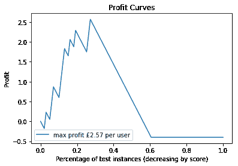
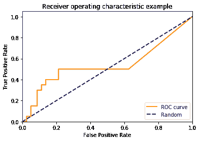
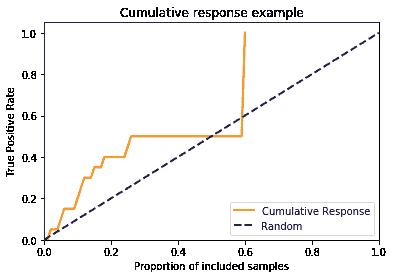
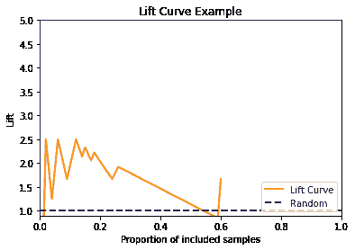

# 定性模型评估-可视化性能

> 原文：<https://winder.ai/qualitative-model-evaluation-visualising-performance/>

# 定性模型评估-可视化性能

欢迎光临！本车间来自 [Winder.ai](https://Winder.ai/?utm_source=winderresearch&utm_medium=notebook&utm_campaign=workshop&utm_term=individual) 。注册以获得更多免费的研讨会、培训和视频。

能够对模型进行数值评估对于优化任务来说非常重要。然而，执行目视评估有两个主要好处:

*   更容易发现错误
*   更容易向其他人解释

单独查看汇总统计数据时，很容易忽略一个重大错误。始终可视化您的数据/结果！

在本次研讨会中，我们将开发所需的代码，以便:

*   利润曲线
*   ROC 曲线
*   罗马纪元
*   累积响应曲线
*   升力曲线

```
from sklearn import metrics
import numpy as np
from matplotlib import pyplot as plt 
```

## 生成数据

首先，我们将生成一些数据来处理。

该数据模拟了培训中的营销示例，但是您可以很容易地想象这是任何类型的数据。

关键是，为了生成这些线索，我们需要分类器的原始分数(例如属于每个类别的概率或错误的某种表示)。而不是预测的类。

然后，我们可以扫描所有可能的值(例如，对于二进制逻辑分类，从 1 分一直到 0 分)，并为所有值生成混淆矩阵。

```
np.random.seed(42)

y_proba = [0] * 100
y_proba[:20] = [1] * 10 - np.abs(np.random.randn(10)*0.3)
y_proba[20:60] = np.abs(np.random.randn(10)*0.1)
y_proba[60:] = [0] * 40 + np.random.uniform(0,1,40)

y_test = [1] * 20 + [0] * 80
print("Example data:\n", y_proba[:10], "...")
profit = 50
cost   = -9
cost_benefit = np.array([[profit+cost, cost],[0   , 0]])
print("Cost Benefit:\n", cost_benefit) 
```

```
Example data:
 [0.85098575409663024, 0.95852070964864455, 0.80569343856979225, 0.54309104307759237, 0.92975398758299921, 0.92975891291524582, 0.52623615534778256, 0.76976958125412742, 0.85915768421951433, 0.83723198692421064] ...
Cost Benefit:
 [[41 -9]
 [ 0  0]] 
```

记住 sklearn 混淆矩阵对输出进行排序。因此，让我们花一些时间来研究排序，并将输出映射到我们期望的结果。

```
tmp_y_pred = [0, 0, 0, 0, 1, 1, 1, 0, 0, 1]
tmp_y_test = [0, 0, 0, 0, 1, 1, 1, 1, 1, 0]
metrics.confusion_matrix(tmp_y_test, tmp_y_pred) 
```

```
array([[4, 1],
       [2, 3]]) 
```

结果应该是三个 TP，四个 TN，两个 FP 和一个 FN:

|  | P | 普通 |
| --- | --- | --- |
| y | three | one |
| n | Two | four |

我们可以看到，与我们习惯的方式相比，这是错误的方式。所以让我们写一个映射到这个的方法。

```
def lit_confusion_matrix(y_true, y_pred):
    '''
 Reformat confusion matrix output from sklearn for plotting profit curve. '''
    [[tn, fp], [fn, tp]] = metrics.confusion_matrix(y_true, y_pred)
    return np.array([[tp, fp], [fn, tn]])

print(lit_confusion_matrix(tmp_y_test, tmp_y_pred)) 
```

```
[[3 1]
 [2 4]] 
```

## 等级

下一步是根据阈值对结果进行排序。程序是:

*   生成阈值
*   分数的临界值
*   把分数变成一个混乱矩阵
*   计算利润

在下面的代码中，我作弊了一点，并在每个输出分数处创建了一个阈值。还可以创建简单的线性间隔的阈值阵列。

```
profits = []
for T in sorted(y_proba, reverse=True):
    y_pred = (y_proba > np.array(T)).astype(int)
    confusion_mat = lit_confusion_matrix(y_test, y_pred)
    # Calculate total profit for this threshold
    profit = sum(sum(confusion_mat * cost_benefit)) / len(y_test)
    profits.append(profit) 
```

## 利润曲线

让我们绘制这些数据！

```
# Profit curve plot
max_profit = max(profits)
plt.figure();
plt.plot(np.linspace(0, 1, len(y_test)), profits, label = 'max profit £{} per user'.format(max_profit))

# Plot labels
plt.xlabel('Percentage of test instances (decreasing by score)')
plt.ylabel('Profit')
plt.title('Profit Curves')
plt.legend(loc='lower left')
plt.show() 
```



干得好！

所以，参差不齐是因为我们使用了虚拟数据，而不是很多数据点。但是，使用一点艺术许可证，你就可以开始看到一个真正的利润曲线。我们可以在这个数据中看到，我们通过包含大约 25%的数据获得了最大的利润。

请注意，这里我们使用的是“按分类 scode 排序时包含的客户比例”，而不是某种技术指标。这是因为我们试图创作出对非科学家来说有意义的情节。

换句话说，我们可以说“如果我们向我们的前 25%的客户营销，那将产生最高的投资回报”。这就好理解多了。

## 受试者工作特征曲线

但是，通常您无法直接测量利润，或者您只是想使用这些图向其他数据科学家证明模型性能。

接收器操作曲线绘制了假阳性率对真阳性率，同时再次迭代阈值。

这类似于利润曲线，除了它不考虑利润。这纯粹是衡量分类器性能的一个标准。这很好，因为它考虑了混淆矩阵的所有元素。即，它考虑了假阳性和假阴性以及准确性。

```
fpr, tpr, _ = metrics.roc_curve(y_test, y_proba)

plt.figure();
lw = 2
plt.plot(fpr, tpr, color='darkorange',
         lw=lw, label='ROC curve')
plt.plot([0, 1], [0, 1], color='navy', lw=lw, linestyle='--', label='Random')
plt.xlim([0.0, 1.0])
plt.ylim([0.0, 1.05])
plt.xlabel('False Positive Rate')
plt.ylabel('True Positive Rate')
plt.title('Receiver operating characteristic example')
plt.legend(loc="lower right")
plt.show() 
```



蓝线代表简单地选择一个随机类的性能。显然这一行只对二元分类问题是正确的。此外，绘制以前的模型或基本费率，而不是随机选择类别，也是有益的。

在这个例子中，我们的分类器并不比随机选择一个类好多少！不太好！

## 罗马纪元

曲线下面积是 ROC 曲线下面积的量度。这是一个相对较好的汇总统计，因为它考虑了 FP 和 FN。但是要注意，你还是会被不稳定的分类器忽悠。例如，我们可以创建一个分类器，它错误地对所有观察值进行分类，直到我们达到 0.3 的假阳性率，然后突然将所有内容分类为正确。这将有 0.7 的 AUC，但可能不是一个非常稳定的模型！

```
print("AUC: ", metrics.auc(fpr, tpr)) 
```

```
AUC:  0.540625 
```

## 累积响应

请记住，ROC 曲线尽管描述了分类器性能的全貌，但并不十分直观。

我们可以改变 x 轴来表示包含样本的比例，就像我们对利润曲线所做的那样。

```
_, tpr, thresholds = metrics.roc_curve(y_test, y_proba)

prop_included = []
for T in thresholds:
    y_pred = (y_proba > np.array(T)).astype(int)
    prop_included.append(sum(y_pred)/ len(y_test))

plt.figure()
lw = 2
plt.plot(prop_included, tpr, color='darkorange',
         lw=lw, label='Cumulative Response')
plt.plot([0, 1], [0, 1], color='navy', lw=lw, linestyle='--', label='Random')
plt.xlim([0.0, 1.0])
plt.ylim([0.0, 1.05])
plt.xlabel('Proportion of included samples')
plt.ylabel('True Positive Rate')
plt.title('Cumulative response example')
plt.legend(loc="lower right")
plt.show() 
```



然而，这条曲线在现实生活中用得不多，因为它在 y 轴上仍然有真实的正比率。这很难向非数据科学家解释。还要记住，这条曲线没有考虑假阳性率，所以它也不是一个好的技术图。

## 升力曲线

为了去除 y 轴上的复杂的真实正比率，如果我们将累积响应除以基本比率，那么我们产生一个提升曲线。

提升曲线更简单，因为我们可以说“如果我们将营销发送给我们的前 25%的客户，我的模型比旧模型好 4 倍”。这个比较好理解。

```
fig = plt.figure()
lw = 2
# Add a bit of funky-ness to avoid divide by zero errors.
plt.plot(prop_included, np.divide(tpr, prop_included, out=np.zeros_like(tpr), where=np.array(prop_included)!=0),
         color='darkorange', lw=lw, label='Lift Curve')
plt.plot([0, 1], [1, 1], color='navy', lw=lw, linestyle='--', label='Random')
plt.xlim([0.0, 1.0])
plt.ylim([0.9, 5])
plt.xlabel('Proportion of included samples')
plt.ylabel('Lift')
plt.title('Lift Curve Example')
plt.legend(loc="lower right")
plt.show() 
```



```
np.random.seed(42)

y_proba = [0] * 1000
y_proba[:200] = [1] * 100 - np.abs(np.random.randn(100)*0.3)
y_proba[200:600] = np.abs(np.random.randn(100)*0.1)
y_proba[600:] = [0] * 400 + np.random.uniform(0,1,400)

y_test = [1] * 400 + [0] * 600 
```

## 任务

*   绘制上述数据的 ROC 曲线
*   绘制上述数据的累积响应曲线