# 在 Kubernetes 上节省 80%的机器学习培训费用

> 原文：<https://winder.ai/save-80-of-your-machine-learning-training-bill-on-kubernetes/>

云德。人工智能与网格一起工作。人工智能压力测试管理 Kubernetes 服务，目的是减少培训时间和成本。这项工作的总结包括:

*   对三大托管 Kubernetes 服务的伸缩性能进行压力测试
*   将 1000 节点模型的培训成本降低 80%
*   发现一些云供应商比其他供应商更好(更便宜)

## 问题是:如何最小化训练机器学习模型的时间和成本

人工智能(AI)工作负载是资源消耗大户。它们因需要昂贵的 GPU 和大量机器在合理的时间内在大型数据集上训练复杂模型而臭名昭著。

为了减少训练大型模型(就模型复杂性或数据量而言很大)所需的时间，您必须跨许多节点水平扩展工作负载。但是放大和缩小通常需要很多时间。云机器学习框架提供的内置可扩展性往往昂贵且不灵活。

然而，Kubernetes 具有简单、快速和有效的缩放机制。OpenAI 已经演示了如何将集群扩展到 7500 个节点，但是他们使用了一个带有 Azure 虚拟机的定制集群。

对于我们合作的大多数公司，我们建议利用托管的 Kubernetes 服务，如 GKE (GCP)、EKS (AWS)或 AKS (Azure)，以减轻运营负担。每个云在处理导致集群规模快速变化的机器学习工作负载方面表现如何？

## 解决办法:绕线器。AI 独有的云原生 AI 体验

云德。人工智能是独一无二的，因为我们在开发和运营人工智能应用程序以及开发云原生解决方案方面都有经验。这使我们处于一个完美的位置，可以在考虑机器学习应用的情况下试验托管云 Kubernetes 服务。

### 方法学

我们开发了 Terraform 代码，用于在 GKE、EKS 和阿拉斯加部署等效的 Kubernetes 集群。使用基础设施作为代码，我们可以部署一致的集群并编写自定义设置。

为了测试每个服务，我们使用了一个小型的模拟 ML Kubernetes 作业，将 affinity 设置为强制每个 pod 进入一个新节点。这使得运行在每个云供应商主节点上的集群自动缩放器请求将新节点添加到自动缩放节点池中。这项工作包括 10 分钟的睡眠。

当集群扩展时，我们通过基于 Prometheus 的监控解决方案监控进度。我们使用这些跟踪来评估每个云的性能。

### 背景

Kubernetes 集群自动缩放器负责向自动缩放组添加节点。尽管所有云中使用相同的集群自动缩放器代码库，但是它们使用特定于云的后端实现。这就导致了性能上的差异。

此外，它们的部署方式略有不同。这导致访问和更改集群自动缩放器的方式不同。

一般来说，我们担心突然向集群添加数千个节点会导致主节点超负荷工作，这可能会导致故障。

## 结果

在整个实验过程中，我们遇到了一系列问题。有些问题可以通过更好的设置来避免，但有些问题是云供应商实施所固有的。这产生了一个令人震惊的结果，如果你在 Kubernetes 上使用某些云进行 ML 培训工作负载，你最终将支付更多的钱。稍后在本案例研究中找出哪种云是最好的。

### 一般问题

但是首先，这里有一些知识可以帮助您满足大规模扩展的需求。

#### *码头集线器费率限制*

当您申请一个大的扩展工作时，会导致并行添加许多新节点。当许多节点都同时启动时，它们都需要在大致相同的时间拉容器，因为容器还没有驻留在节点上。

如果您使用驻留在 Docker Hub 中的容器，如果您没有商业许可证，您将受到费率限制。这具有节点为工作负载做好准备的效果，但是 pod 将不再拉动容器。

下图显示了一个实验，在这个实验中，我提出了一个请求，结果产生了 50 个新节点。(注意那是在我标准化开始时间之前，所以不要拿这个和其他图比较)。

你可以看到，尽管节点已经准备好，吊舱经历了一个稳定发射的阶段，直到大约 35 个节点时，它们突然停止。这是因为我使用的是 docker hub 映像，并且速率限制开始生效。在所有后续测试中，我使用了来自[码头](https://quay.io)的图像。

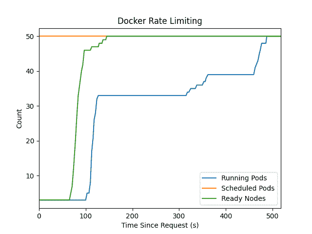

#### *子网中没有足够的空间*

我用完了 IP 地址，因为子网太小了。大多数示例默认使用 256 个可用地址的子网(`10.0.0.0/24`)。大多数供应商也将这些虚拟子网用于 pod，因此您将很快用完空间。添加了大约 100 个节点后，我就没有空间了。

#### *节点就绪时间*

下图显示了节点随着时间的推移变得“就绪”的过程。您可以看到，在初始请求之后，节点准备就绪大约需要 3 分钟。这个时间是由节点的资源调配和启动时间决定的。

> 注意，这个时间不保证。具有不同附件的不同节点类型具有不同的开始时间。此外，随着您添加更多节点，一个节点无法启动的可能性也会增加。

对于 50 和 100 个节点的扩展测试，您可以看到节点数量呈指数级增长。对于 150+测试，存在不连续性。

**关键理解**:当你请求一个云中的很多节点时，你期望得到它们。但在现实中，有一个小的，但意义重大的机会，一些不会开始或会大大推迟。集群自动缩放器设置公开控件，以决定发生故障时要做什么。在我们的例子中，默认设置过于保守，无法快速放大/缩小。

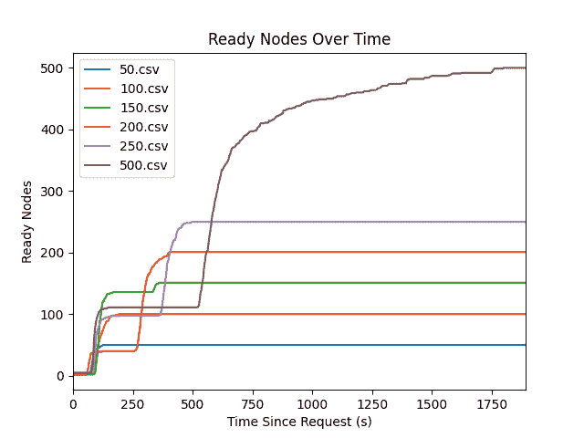

#### *键簇自动缩放设置*

这样做的结果是，您需要了解集群自动缩放器中的一些关键设置。

*   `max-total-unready-percentage`:一次允许多少台机器未准备好，百分比。如果大于此值，则缩放停止。由于所有节点都经历了未就绪阶段，这导致了规模扩大的不连续性。当您请求大量节点时，很可能有很大一部分节点同时没有准备好。
*   `ok-total-unready-count`:未就绪节点的最大数量。这通常设置得很低。您肯定会有许多节点没有同时准备好。
*   `max-empty-bulk-delete`:一次删除的最大机器数量。这通常默认为一个较低的数字，以防删除过程中出现故障。您需要增加该值以提高缩小速度。

### 特定于云的调查结果

每个云供应商都以类似的方式工作，但提供不同的体验。本节讨论每种云的特性。

### 前情提要

*   **每个集群的节点数** : 30 x 450 = 13500
*   **每个节点池的节点数** : 450
*   **每个节点的荚数** : 110
*   **K8s API 速率限制**:？？？

EKS 直接公开集群自动缩放器，因为您必须自己安装它。这是一个好处，因为这是标准的体验，你可以通过 GitOps 代码直接编辑设置。缺点是它不能开箱自动扩展，而且设置起来有点麻烦。

在这些测试中，记住与 Kubernetes API 通信也需要时间。例如，安排 1000 pod 作业大约需要 1 分钟。

#### 结果

性能通常很好，但是您必须调整设置以获得最佳性能。一旦你做到了，你可以在大约 45 分钟内扩展到 1000 个节点，如下图所示。

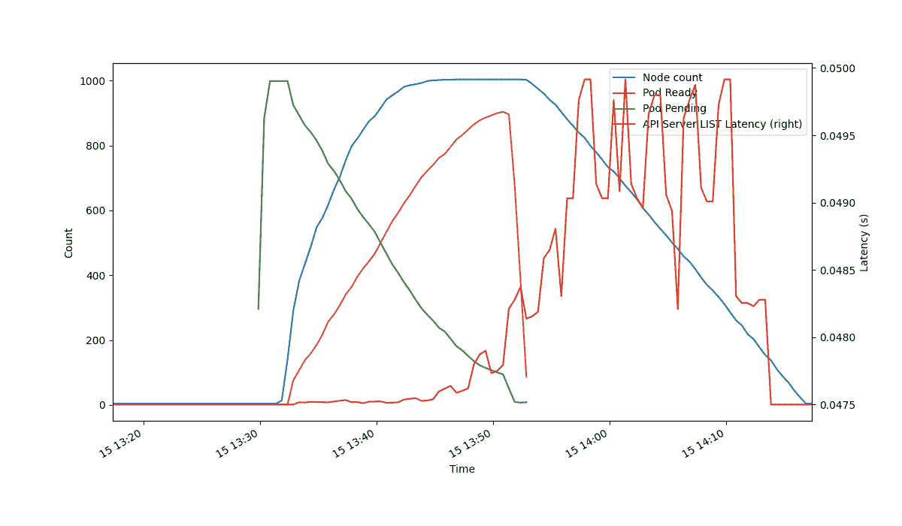

这个实验最大的阻力是启动 pod 的延迟。请注意节点的启动速度相对较快，但是 pod 的启动速度不同。与此相关，节点删除真的很慢。

在大多数(所有？)后端实现，这是因为自动缩放器告诉云 API 逐个节点地删除节点。它不会批量处理。这意味着自动缩放器运行一次完整过程所需的时间和供应商的 API 速率限制相结合，使删除速度慢如蜗牛。

使用多个节点池会有所帮助，因为不同的节点池可以并行运行。

为了获得最佳性能，请考虑使用以下设置:

```py
scale-down-unneeded-time: 1m0s # Scale down when unneeded for this amount of time
scale-down-delay-after-failure: 0s # Delay after scale-down failure
scale-down-delay-after-delete: 0s # Amount of time to delay after delete event.
new-pod-scale-up-delay: 1m0s # Wait for pod creation before creating nodes 
```

### GCP·GKE

*   **每个集群的节点数** : 15000
*   **每簇吊舱** : 150000
*   **每个节点池的节点数** : 1000
*   **每个节点的荚数** : 110
*   **K8s API 速率限制**:每分钟 3000 个请求，每 100 秒执行一次

GKE 没有直接暴露自动缩放设置。相反，他们选择了更高的层次[“自动缩放配置文件”](https://cloud.google.com/kubernetes-engine/docs/concepts/cluster-autoscaler#autoscaling_profiles)，这是一个描述集群自动缩放设置的一些标准混合物的枚举。名为`optimize-utilization`的概要文件谈到了更快地删除节点，并且是为批量工作负载而设计的，因此在这里使用这个概要文件是有意义的。

集群自动缩放器日志被保存到 [GCP 堆栈驱动](https://cloud.google.com/kubernetes-engine/docs/how-to/cluster-autoscaler-visibility#viewing_events)。注意，这里的日志类似于 AKS 的集群自动缩放器状态配置图。它报告自动缩放器的状态，而不是完整的日志。

#### *小心*

首先达到 CPU 限制(默认为 600 个 CPU)。此后，GKE 将陷入`Repairing the cluster`模式，因为它不断试图扩大规模。那么您可能会达到所有这些节点的永久磁盘存储限制。

#### *启用“优化利用”模式*

该模式仅在测试版中可用，这意味着您必须使用 google-beta terraform provider 版本。

#### 结果

启用默认的非测试版集群后，性能会有所下降。放大和缩小规模都有各种各样的延迟。完成 1000 个节点的批处理作业大约需要 1 小时 30 分钟。下面显示了一个运行示例:

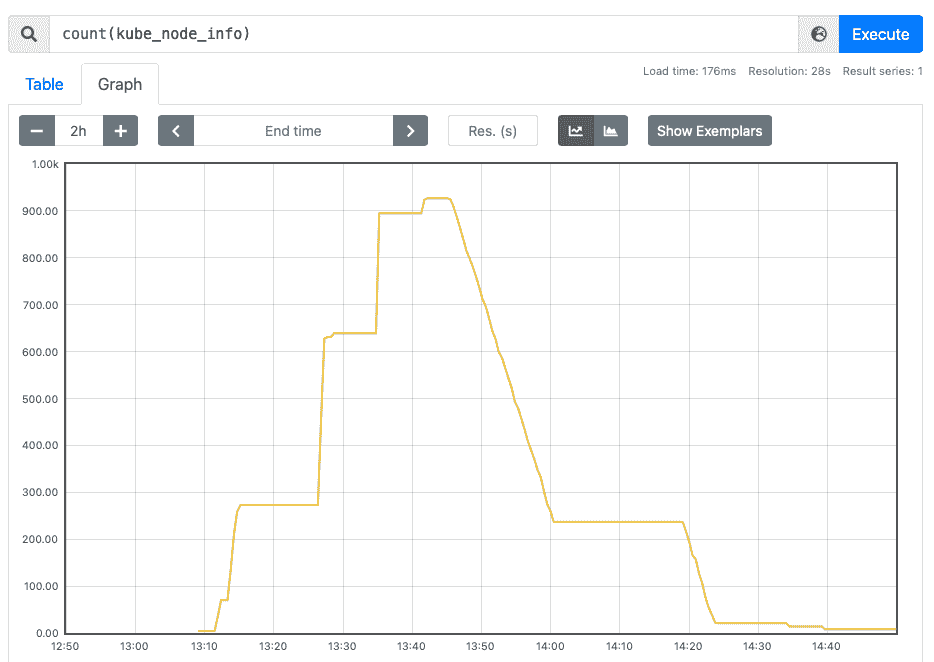

这些结果与使用默认集群自动缩放设置的其他云提供商一致。

下面的两幅图是 1000 节点批处理作业的结果，该作业使用启用了 beta 群集自动缩放选项的群集，并使用了“优化利用率”配置文件。上面和下面的图有相同的 x 刻度。

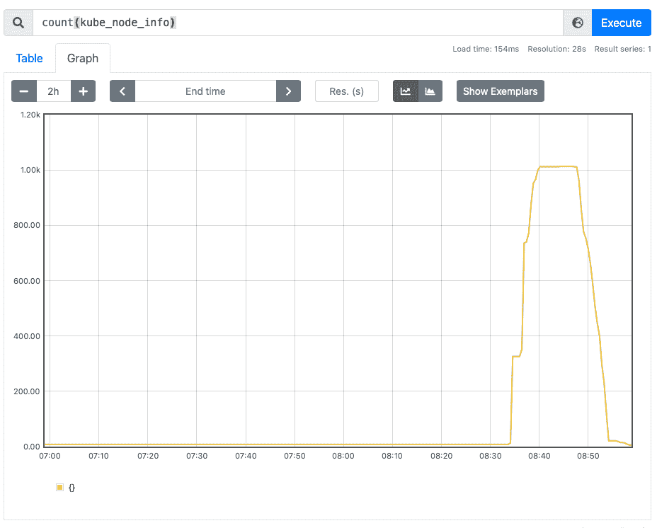 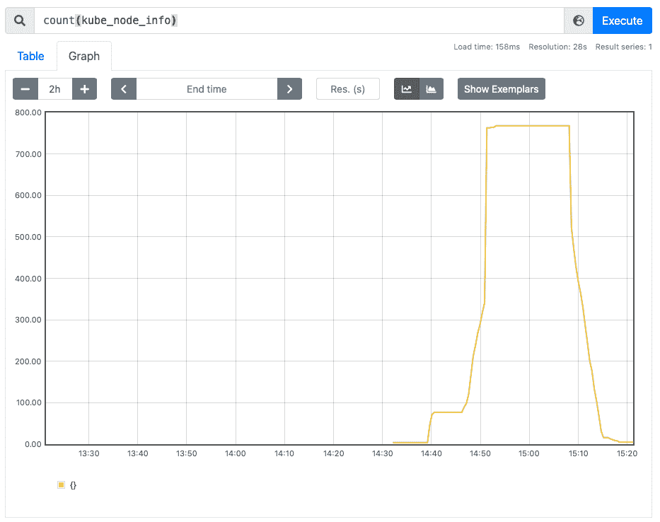

你可以看到做一个实验所需的时间大大减少了。大约 30-40 分钟。这至少是所有其他云供应商的两倍。

虽然文档没有详细介绍，但我怀疑这是同一个集群自动缩放器的高度优化版本。例如，超时减少，批量删除大小增加。但谷歌特有的调整可能会在这里发挥作用。

这个结果引出了一个明显的建议:

*   使用允许您指定`OPTIMIZE_UTILIZATION`自动缩放器配置文件的测试版 GKE 集群。

#### *GKE API 延迟*

在这些实验中，kubectl API 的延迟增加了。谷歌明确表示他们限制 API 请求的速率(3000 /分钟)，我相信我在这里受到了速率限制。

下图显示了大量 pod 试图启动时的 API 延迟峰值。一旦大部分豆荚完成，它就恢复正常。

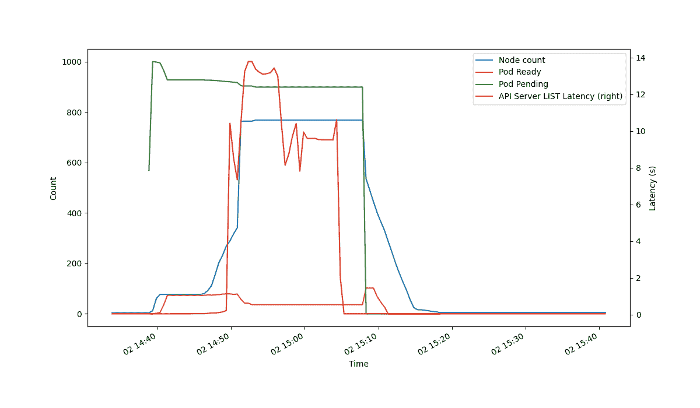

在其他云中也观察到了 Kubectl 滞后，但没有达到这种程度。

> 请注意，这不会妨碍作业本身的操作或及时性。它只影响对 Kubernetes API 的访问。

#### *修复 GKE API 延迟*

其他云受益于使用多个节点池。在下面的实验中，我使用了 5 个 200 节点的池。

这成功地将 API 延迟降低到比以前低得多的水平，因此我相信来自主服务器的 google cloud API 请求分布在各个节点池中，这最终有助于最终的 API 延迟。

下图显示了这个实验的结果。

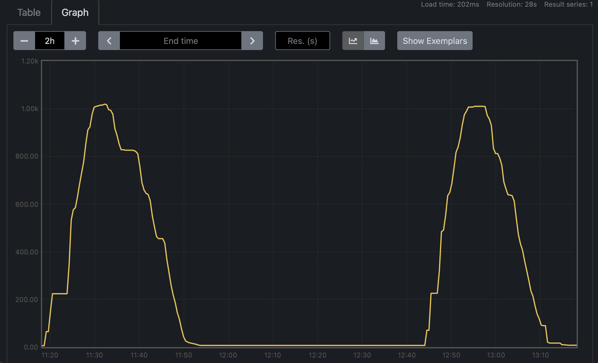

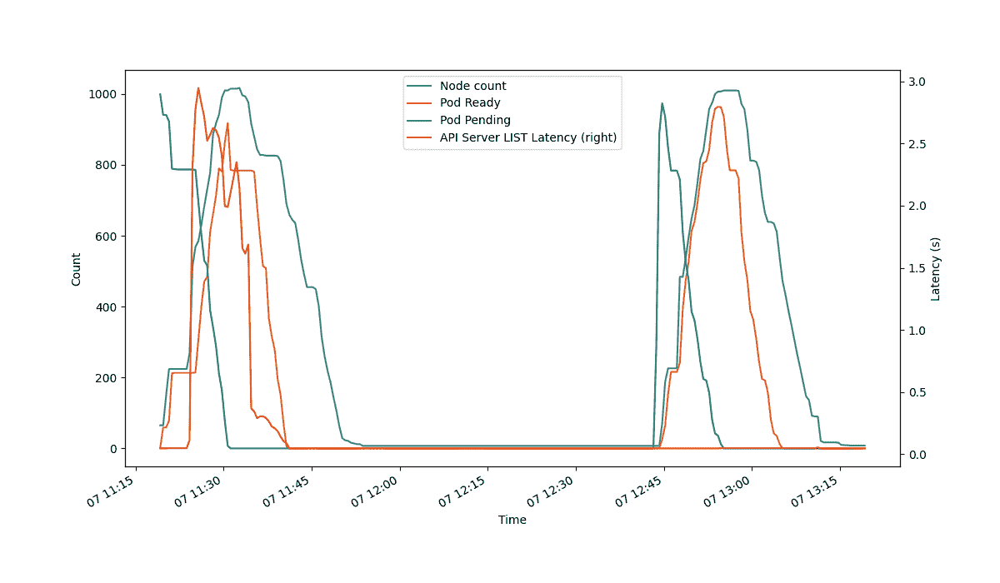

多个池的使用允许针对其他池中的故障的冗余。所以你会看到更平滑的上升和下降。这可能是迄今为止最快的测试，只需 30 分钟。这非常接近理论上的最小值，即大约 5 分钟的启动、10 分钟的测试、10 分钟的冷却和 5 分钟的停止，总共 30 分钟，尽管设置是不可见的，因此冷却可以设置得更低。

因此，**建议您使用多个池。**

这使得 **GKE 成为自动扩展能力最强的云**。

### 天蓝色 AKS

当我们第一次开始测试时，AKS[完全无法将](https://github.com/Azure/AKS/issues/2345)扩展到任何有意义的节点数量。

总的来说，我对微软的支持没什么好说的。但在这种情况下，我联系到了来自 AKS 团队的一位知识渊博、工作高效的工程师，他很快就能诊断出他们的问题，比如集群中节点数量报告不一致的问题。

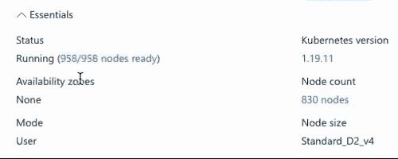

在 AKS 的几个新版本发布后，它能够很好地扩展以继续测试。然而，有一些你必须小心的陷阱。

#### *启用“正常运行时间 SLA”模式*

我觉得这个有点不清楚。GKE 有不同“等级”的节点来运行 Kubernetes master。但是 AKS 被称为“正常运行时间 SLA”层。如果不启用它，那么默认(免费)的 master 实现就无法处理数百个节点。

#### *使用 Azure CNI 提供商*

默认的网络实现(kubenet)只能处理 400 个节点的集群。为了支持更大的集群，最简单的解决方案是使用 Azure CNI 网络提供商，该提供商使用 Azure 网络硬件。

#### *使用多个节点池*

Azure 标准负载平衡器被限制为最多 1000 个节点。这包括用于 Kubernetes 系统单元的任何工作节点，因此您必须确保您请求的节点少于 1000 个。

#### 结果

最终，我能够获得 50 分钟的 1000 个节点的放大和缩小，如下图所示。

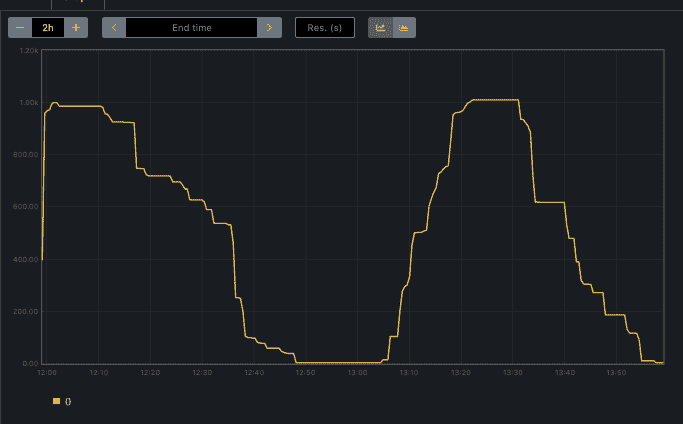

这里的主要瓶颈是扩大/缩小规模的平稳期。我们发现这是由于后端内部 API 问题造成的。例如，一些删除电话花了 20 分钟才完成。这个反馈被传递给了后端 API 团队，所以从那时起它可能已经得到了改进。

我必须更改的一个关键设置是提高删除性能:

```py
empty_bulk_delete_max = 200 
```

## 结论

本报告中的一个关键结论是，通过一点点试验就可以实现潜在的节约。

模拟 ML 培训工作需要 10 分钟才能完成。在许多云中使用默认设置会导致扩展作业花费 1 小时 30 到 2 小时。缩放轨迹看起来有点像三角形，所以我会友好地说，你支付的是一半，即 45 分钟。

换句话说，你为一项 10 分钟的工作支付了 45 分钟到 1 小时的计算时间。这比你应该的大约多了 5 倍。

使用 GKE，在最佳设置下，追踪是矩形的，大约需要 20 分钟，或者比你应该的多 2 倍。这意味着计算成本至少节省了 2 倍。

当扩展到使用 1000 个昂贵的 GPU 节点时(大约 30 美元/小时)，这 2 倍的节省相当于大约 15k 美元。**是的，每份培训工作节省 15，000 美元。**

我同意扩展到 1000 个节点有些例外，但这是有代表性的。训练具有 100 个节点的较大模型是经常发生的事情，尤其是在较大的公司。只需要少量的工作就可以扩展到 1000 个节点。

## 这项工作的价值

利用温德。AI 的经验，网格。人工智能能够快速原型新产品的想法。他们发现，不同的云提供商在培训大规模 ML 模型方面的成本大相径庭。我们还为产品的未来方向奠定了基础，无论是技术上还是战略上，都比他们必须等待内部工程时间才能做到的要快得多，也便宜得多。

这种关系发展成了我们将在另一个案例研究中讨论的其他后续工作，展示了我们与客户建立的信任。

## 接触

如果您的组织对这项工作感兴趣，我们很乐意与您交谈。请与温德公司的销售团队联系。我们可以聊聊如何帮助你。