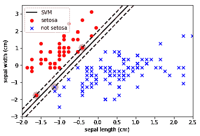
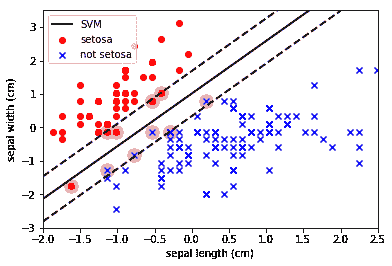
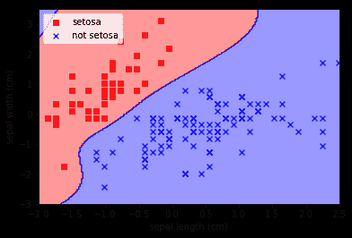

# 支持向量机

> 原文：<https://winder.ai/support-vector-machines/>

# 支持向量机

欢迎光临！本车间来自 [Winder.ai](https://Winder.ai/?utm_source=winderresearch&utm_medium=notebook&utm_campaign=workshop&utm_term=individual) 。注册以获得更多免费的研讨会、培训和视频。

如果你还记得视频训练，支持向量机是分类器，无论数据的分布如何，都试图最大化类别之间的分离。这意味着它们有时更适合噪声，而不是数据。

但是因为他们的目标是分开类，所以他们在优化准确性方面做得非常好。下面我们来对此进行调查。

```py
# Usual imports
import os
import pandas as pd
import matplotlib.pyplot as plt
import numpy as np
from IPython.display import display
from sklearn import datasets
from sklearn import preprocessing 
```

```py
# import some data to play with
iris = datasets.load_iris()
feat = iris.feature_names
X = iris.data[:, :2]  # we only take the first two features. We could
                      # avoid this ugly slicing by using a two-dim dataset
y = iris.target
y[y != 0] = 1 # Only use two targets for now
colors = "bry"

# standardize
X = preprocessing.StandardScaler().fit_transform(X) 
```

```py
from sklearn.svm import SVC
# Create a linear SVM
svm_clf = SVC(kernel='linear', C=float("inf")).fit(X, y) 
```

```py
# A fairly complicated function to plot the decision boundary and separation found by a liner SVM.
def plot_svc_decision_boundary(svm_clf, xmin, xmax):
    w = svm_clf.coef_[0]
    b = svm_clf.intercept_[0]

    # At the decision boundary, w0*x0 + w1*x1 + b = 0
    # => x1 = -w0/w1 * x0 - b/w1
    x0 = np.linspace(xmin, xmax, 200)
    decision_boundary = -w[0]/w[1] * x0 - b/w[1]

    margin = 1/w[1]
    gutter_up = decision_boundary + margin
    gutter_down = decision_boundary - margin

    svs = svm_clf.support_vectors_
    plt.scatter(svs[:, 0], svs[:, 1], s=180, facecolors='#FFAAAA')
    plt.plot(x0, decision_boundary, "k-", linewidth=2, label="SVM")
    plt.plot(x0, gutter_up, "k--", linewidth=2)
    plt.plot(x0, gutter_down, "k--", linewidth=2)

# Usual plotting related stuff.
plot_svc_decision_boundary(svm_clf, -2, 2)
plt.scatter(X[y == 0, 0], X[y == 0, 1],
            color='red', marker='o', label='setosa')
plt.scatter(X[y != 0, 0], X[y != 0, 1],
            color='blue', marker='x', label='not setosa')
plt.axis([-2, 2.5, -3, 3.5])
plt.xlabel(feat[0])
plt.ylabel(feat[1])
plt.legend(loc='upper left')
plt.show() 
```



请注意 SVM 是如何最大化类别之间的间隔，并允许一些数据点进入边界内的。SVM 参数`C`是一个惩罚参数，它指定是否应该强制分离类(`C=inf`)或者允许一些点被错误分类以获得更好的拟合(`C=small`)。

让我们允许一定程度的错误分类，以获得更好的(IMO)决策边界:

```py
svm_clf = SVC(kernel='linear', C=1.0).fit(X, y)
plot_svc_decision_boundary(svm_clf, -2, 2)
plt.scatter(X[y == 0, 0], X[y == 0, 1],
            color='red', marker='o', label='setosa')
plt.scatter(X[y != 0, 0], X[y != 0, 1],
            color='blue', marker='x', label='not setosa')
plt.axis([-2, 2.5, -3, 3.5])
plt.xlabel(feat[0])
plt.ylabel(feat[1])
plt.legend(loc='upper left')
plt.show() 
```



## 内核技巧

请记住，在不损害数据完整性的情况下，转换输入数据是可能的。这种变换只需要是可逆的。“核技巧”是一种通过复杂(可逆)函数转换数据的方法，以允许更复杂的决策边界。

当我们用支持向量机执行这个技巧时，结果是一个内核 SVM。在下一个例子中，我们为我们的内核选择一个*径向基函数*。这基本上是一个多维高斯。我们用参数`gamma`指定这个内核的宽度。较小的`gamma`值将产生更复杂的边界(更不平滑)。

```py
from sklearn.svm import SVC
# This is a Support vector machine with a "radial basis function" kernel.
# One issue with SVMs is that they are quite complex to tune, because of all the different parameters.
rbf_svc = SVC(kernel='rbf', gamma=0.7, C=float('inf')).fit(X, y) 
```

```py
from matplotlib.colors import ListedColormap

# A fancy method to plot the decision regions of complex decision boundaries
def plot_decision_regions(X, y, classifier, test_idx=None, resolution=0.02, labels=['setosa', 'not setosa'], X_plot=None):

    if X_plot is None:
        X_plot = X

    # setup marker generator and color map
    markers = ('s', 'x', 'o', '^', 'v')
    colors = ('red', 'blue', 'lightgreen', 'gray', 'cyan')
    cmap = ListedColormap(colors[:len(np.unique(y))])

    # plot the decision surface
    x1_min, x1_max = X[:, 0].min() - 1, X[:, 0].max() + 1
    x2_min, x2_max = X[:, 1].min() - 1, X[:, 1].max() + 1
    xx1, xx2 = np.meshgrid(np.arange(x1_min, x1_max, resolution),
                         np.arange(x2_min, x2_max, resolution))
    Z = classifier.predict(np.array([xx1.ravel(), xx2.ravel()]).T)
    Z = Z.reshape(xx1.shape)
    plt.contourf(xx1, xx2, Z, alpha=0.4, cmap=cmap)
    plt.xlim(xx1.min(), xx1.max())
    plt.ylim(xx2.min(), xx2.max())

    # plot all samples
    X_test, y_test = X[test_idx, :], y[test_idx]
    for idx, cl in enumerate(np.unique(y)):
        plt.scatter(x=X[y == cl, 0], y=X[y == cl, 1],
                    alpha=0.8, c=cmap(idx),
                    marker=markers[idx], label=labels[cl])

    # highlight test samples
    if test_idx:
        X_test, y_test = X[test_idx, :], y[test_idx]
        plt.scatter(X_test[:, 0], X_test[:, 1], c='',
                alpha=1.0, linewidth=1, marker='o',
                s=55, label='test set') 
```

```py
plot_decision_regions(X=X, y=y, classifier=rbf_svc)
plt.xlabel(feat[0])
plt.ylabel(feat[1])
plt.legend(loc='upper left')

plt.axis([-2, 2.5, -3, 3.5])
plt.show() 
```



请注意，决策界限是多么疯狂。在某种程度上，该算法在左上方“发明”了一个蓝色决策区域，在那里绝对没有证据表明它应该在那里。这就是选择这种任意决策边界的风险；武断的结果。