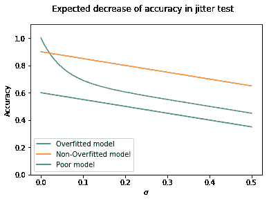
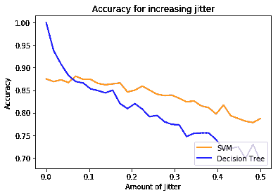

# 用抖动测试模型鲁棒性

> 原文：<https://winder.ai/testing-model-robustness-with-jitter/>

# 用抖动测试模型鲁棒性

欢迎光临！本车间来自 [Winder.ai](https://Winder.ai/?utm_source=winderresearch&utm_medium=notebook&utm_campaign=workshop&utm_term=individual) 。注册以获得更多免费的研讨会、培训和视频。

要测试您的模型是否对变化具有鲁棒性，一个简单的测试是向测试数据添加一些噪声。当我们改变噪声的幅度时，我们可以推断出模型在新数据和不同噪声源下的表现。

在这个例子中，我们将添加一些随机的，正态分布的噪声，但它不一定是正态分布的！也许你可以添加一些偏见，或者添加一些其他类型的趋势！

```py
from sklearn import metrics, datasets, naive_bayes, svm, tree
import numpy as np
from matplotlib import pyplot as plt
from sklearn.model_selection import train_test_split
from pandas import Series
from matplotlib import pyplot 
```

我们所期望的是类似下面这样的东西。如果我们有一个严重过度拟合数据的模型，它很可能从高开始(例如查找表)。因为它没有做出任何概括，一旦我们开始添加噪声，性能就会迅速下降。

```py
x = np.linspace(0, 0.5, 100)

plt.plot( x, 0.7 - 0.5*x + 0.3*np.exp(-x*20), label = "Overfitted model")
plt.plot( x, 0.9 - 0.5*x, label = "Non-Overfitted model")
plt.plot( x, 0.6 - 0.5*x, label = "Poor model")

axes = plt.gca()
axes.set_ylim([0, 1.1])

plt.legend(loc=3)
plt.suptitle("Expected decrease of accuracy in jitter test")

axes.set_xlabel('$\sigma$')
axes.set_ylabel('Accuracy')

plt.show() 
```



## 抖动方法

“抖动”只是原始信号中的一些噪声。

下面的 a `jitter_test`通过几个不同的抖动标度(标准偏差)对新的抖动数据进行预测。为了使结果曲线更加平滑，我们进行了几次实验并取平均值。

```py
def jitter(X, scale=0.1):
    return X + np.random.normal(0, scale, X.shape)

def jitter_test(classifier, X, y, scales = np.linspace(0, 0.5, 30), N = 5):
    out = []
    for s in scales:
        avg = 0.0
        for r in range(N):
            avg += metrics.accuracy_score(y, classifier.predict(jitter(X, s)))
        out.append(avg / N)
    return out, scales 
```

下面我们正在生成测试数据。我们使用卫星数据集使它变得相当困难。

```py
np.random.seed(1234)
X, y = datasets.make_moons(n_samples=200, noise=.3) 
```

```py
mdl1 = svm.SVC()
mdl1.fit(X, y)

mdl2 = tree.DecisionTreeClassifier()
mdl2.fit(X,y); 
```

```py
mdl1_scores, jitters = jitter_test(mdl1, X, y)
mdl2_scores, jitters = jitter_test(mdl2, X, y) 
```

```py
plt.figure()
lw = 2
plt.plot(jitters, mdl1_scores, color='darkorange',
         lw=lw, label='SVM')
plt.plot(jitters, mdl2_scores, color='blue',
         lw=lw, label='Decision Tree')
plt.xlabel('Amount of Jitter')
plt.ylabel('Accuracy')
plt.title('Accuracy for increasing jitter')
plt.legend(loc="lower right")
plt.show() 
```



请注意决策树结果是如何快速下降的。这是因为即使我们只是将原始数据移动了一点点，因为它太过拟合，很快就开始对数据进行错误分类。

你认为哪个型号更好？

## 奖金

*   编写一些代码来绘制分类器的决策边界。要做到这一点，最简单的方法就是生成一个随机的 x，y 坐标，并使用这个模型来生成这个类。将它与上面的图进行比较。

提示:看看其他一些研讨会。