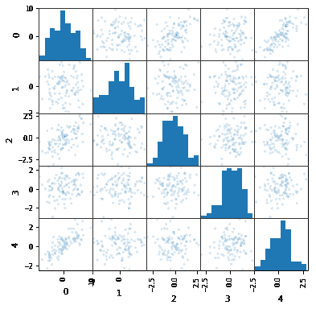
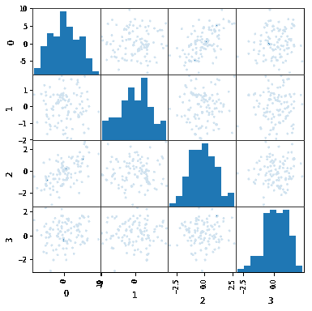

# 为什么关联数据不好，该怎么办

> 原文：<https://winder.ai/why-correlating-data-is-bad-and-what-to-do-about-it/>

# 关联数据

欢迎光临！本车间来自 [Winder.ai](https://Winder.ai/?utm_source=winderresearch&utm_medium=notebook&utm_campaign=workshop&utm_term=individual) 。注册以获得更多免费的研讨会、培训和视频。

特征之间的相关性不好，因为你实际上是在告诉模型，这个信息比其他任何东西都重要两倍。你给模型输入了两次相同的数据。

从技术上来说，它被称为*多重共线性*，这是对可能相关的任何数量的特征的概括。

通常关联特征会降低模型的性能，因此我们需要找到并移除它们。

同样，为了简单起见，让我们生成一些虚拟数据&mldr;

```
import numpy as np
import pandas as pd
import matplotlib.pyplot as plt

X = np.random.randn(100,5)
noise = np.random.randn(100)
X[:,0] = 2*X[:,2] + 3*X[:, 4] + 0.5*noise 
```

找出相关特征的最简单方法是生成一个*散布矩阵*。这是一幅将每个特征与其他特征相对照的图像。

```
# Here, we're plotting a "scatter matrix". I.e. a matrix of scatter plots of each feature.
# Its really useful for spotting dodgy data.

from pandas.plotting import scatter_matrix
df = pd.DataFrame(X)
scatter_matrix(df, alpha=0.2, figsize=(6, 6), diagonal='hist')
plt.show() 
```



我们可以看到这些图中有一些线性关系。绝对在右上方。

同样，在这个阶段最简单的事情就是手动删除该特性。

```
del df[4]
scatter_matrix(df, alpha=0.2, figsize=(6, 6), diagonal='hist')
plt.show() 
```



在第二个特征中仍然有一点点相关性，但不是很大。尝试使用和不使用此功能对您的模型进行评分。

我们可以使用特征向量和特征值以更定量的方式来执行这个过程，以找出相关性，但这在这一点上考虑起来有点太复杂了。